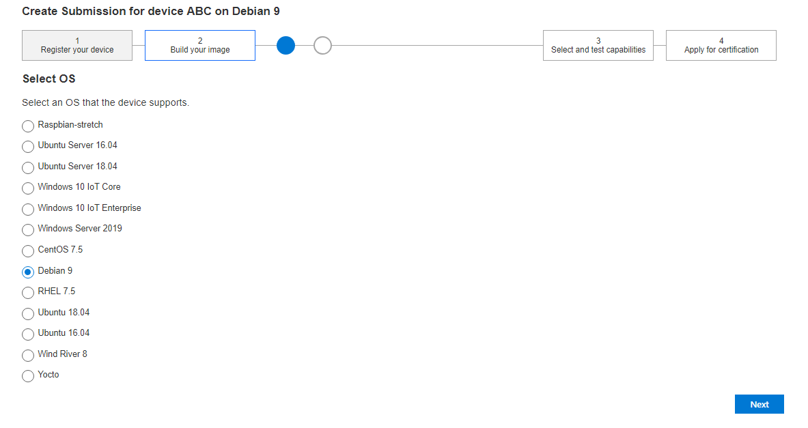
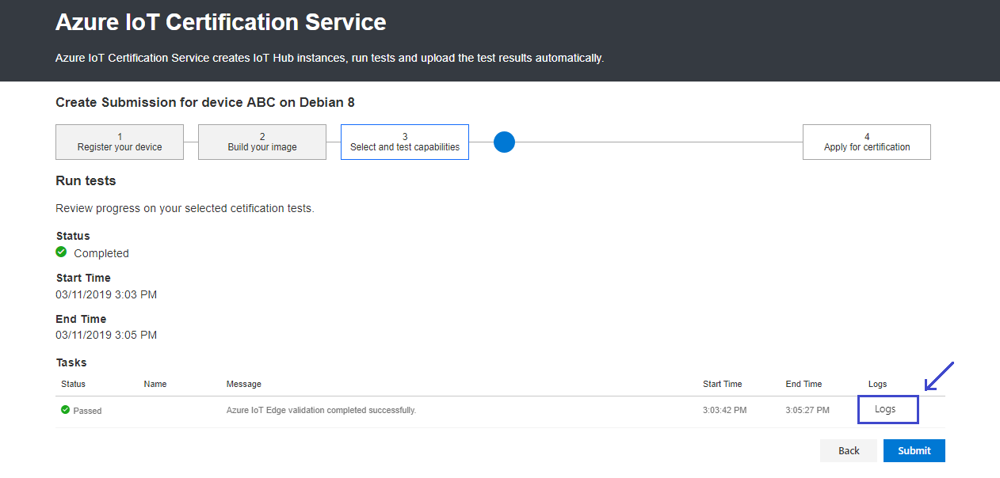

Azure IoT Edge Certification Services
===
---

This document describes IoT Edge Certification process through AICS. 

You can submit your device on <https://catalog.azureiotsolutions.com/devices>. Make sure to check the **Edge Certified** checkbox to enable Edge testing. Once the device details are submitted you will be directed to AICS.

AICS Edge Certification consists of the following steps:

1.  Select the device's platform (OS).
2.  Prepare your device.
3.  Run automated tests.
4.  Final manual testing.

## 1. Select Platform (OS):

-   Select the platform (OS) which your device supports.
-   Click [here](https://docs.microsoft.com/en-us/azure/iot-edge/support) for a list of supported Edge operating systems.
-   Click **Next**.

 

## 2. Prepare your device:

-   This page contains instructions for preparing your device for automated testing.
-   The page contains links to instructions for installing the Edge runtime for
**[Linux x64](https://docs.microsoft.com/en-us/azure/iot-edge/how-to-install-iot-edge-linux), 
[Linux ARM32](https://docs.microsoft.com/en-us/azure/iot-edge/how-to-install-iot-edge-linux-arm) and 
[Windows x64](https://docs.microsoft.com/en-us/azure/iot-edge/how-to-install-iot-edge-windows).**
-   Once the Edge runtime is installed on the device, configure it to use the provided connection string using the available instructions.
-   Click **Next** to start the automated tests.

 

## 3. Automated tests:
### What tests are run : 

-   Confirming that the device has the **edgeAgent** module and that its status is **running** on device.
-   Confirming that the edgeAgent module is an official one by comparing the hash digest values to the official images via the Microsoft Container Registry API.
-   Checking the ability to deploy a module to the device (the **temperature sensor simulator module** ). 
-   Confirming the new module’s status is **running**.
-   Confirming that AICS receives messages from the module.

## 4. Final manual testing:

-   After the tests complete successfully, the device can be submitted for final certification by clicking the **Submit** button.
-   Once you applied for certification, you will receive an email from [iotcert@microsoft.com](mailto:iotcert@microsoft.com) with instructions for completing final testing.

### Viewing logs:
-   You can review the log messages and raw data in AICS by clicking on **Logs**.

 

If you require more information regarding the program or have any other questions, please [contact us](mailto:iotcert@microsoft.com).
