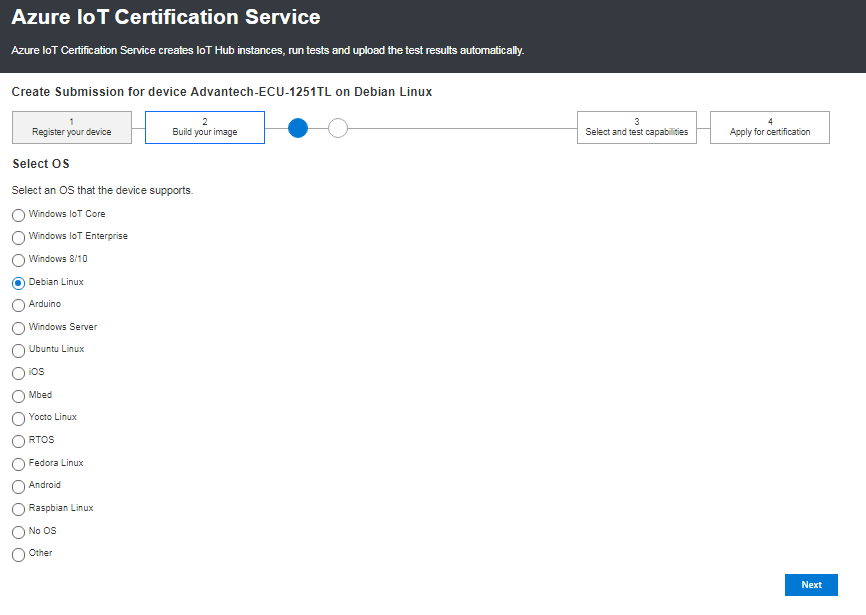
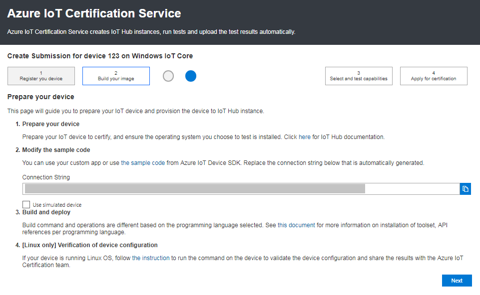
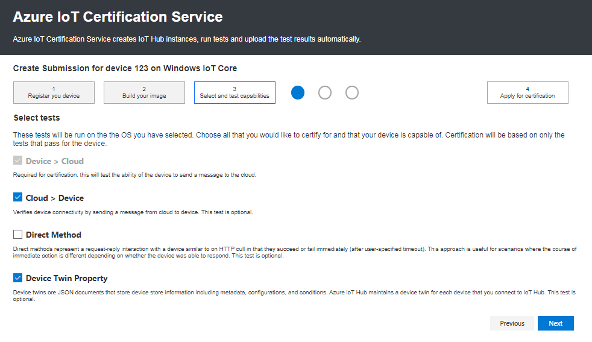
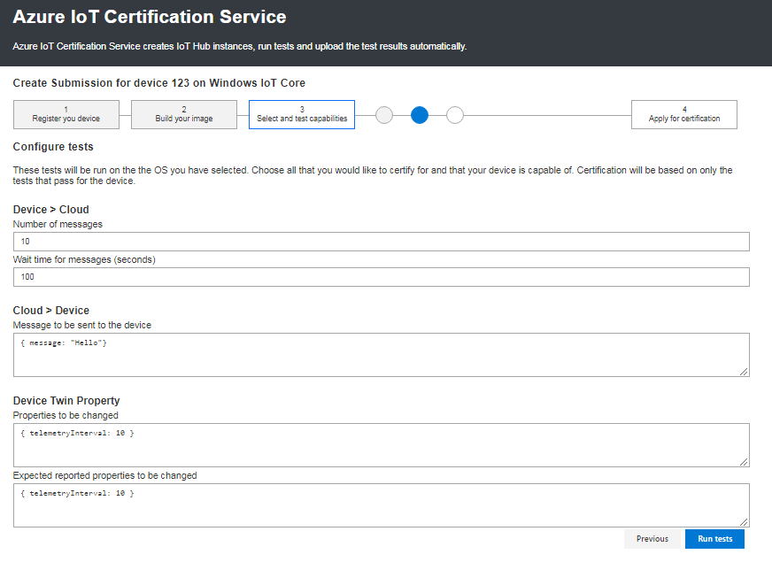

Azure IoT Certification Services
===
---

This document describes how to connect your device running with Azure IoT SDK to the Azure cloud. 

You can submit your device on <https://catalog.azureiotsolutions.com/> devices. We are streamlining the process from device registration to automatic validation.

AICS is followed by the following steps:

1.  Select the Platform (OS).
2.  Prepare your device.
3.  Select the tests.
4.  Configure Tests.
5.  Run Tests.

## 1. Select Platform (OS):

-   Select the platform (OS) which supports your device.
 
-   Click next.

 

## 2. Prepare your device:

-   In this page you can find how to Prepare your device with IoTHub.
-   Select the SDK which supports your device, Build and Run the sample as per the instructions stated in certification guidelines(<https://github.com/Azure/azure-iot-device-ecosystem/tree/master/iotcertification>)

    **Note:** Follow the step 3(Build and Validate the sample) onwards only (ignore steps 1 and 2)

-   Copy the auto generated connection string received from AICS and provide in the SDK as per the instruction stated in the SDK guidelines document.
-   Verification of Device Configuration: Save the screen shots of the output and share it to the [iotcert@microsoft.com](mailto:iotcert@microsoft.com).
-   Click next.
 
 

## 3. Select the Tests:

-   Select the tests which you would like to certify on your device.
-   Click next.

 

## 4. Configure Tests:

-   Here you can see the auto Inputs/Messages given to the Cloud/Device. You can change the inputs if you are like to give your own inputs.
 
 

-   Run the samples on the device.

## 5. Run Tests:

-   Click on Run tests on AICS.
-   If all test get passed then Submit the test results and apply for the certification.
-   Once you applied for certification, you will receive a confirmation email from [iotcert@microsoft.com](mailto:iotcert@microsoft.com) for further steps to be followed.

If you require more information regarding the program or have any specific query, please [contact us](mailto:iotcert@microsoft.com) with your query and concerns.
