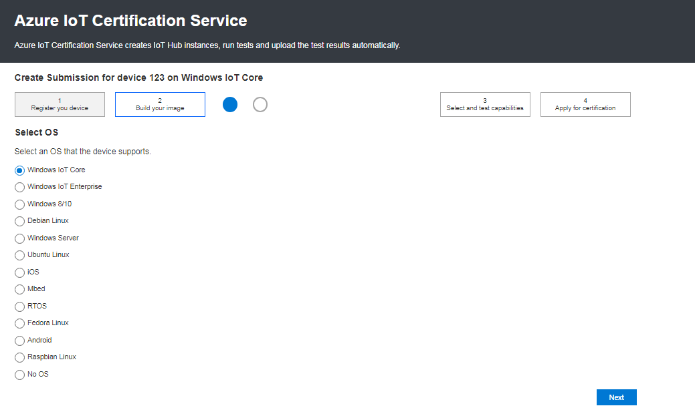
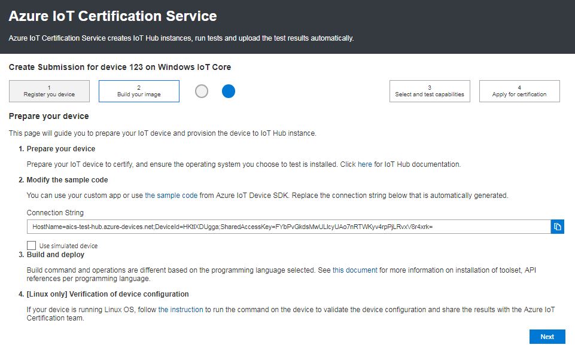
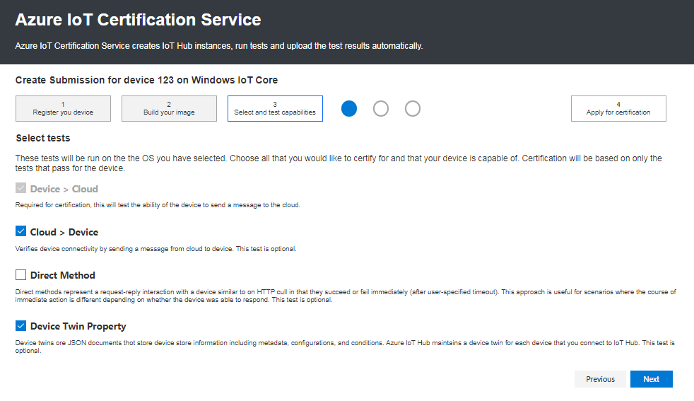
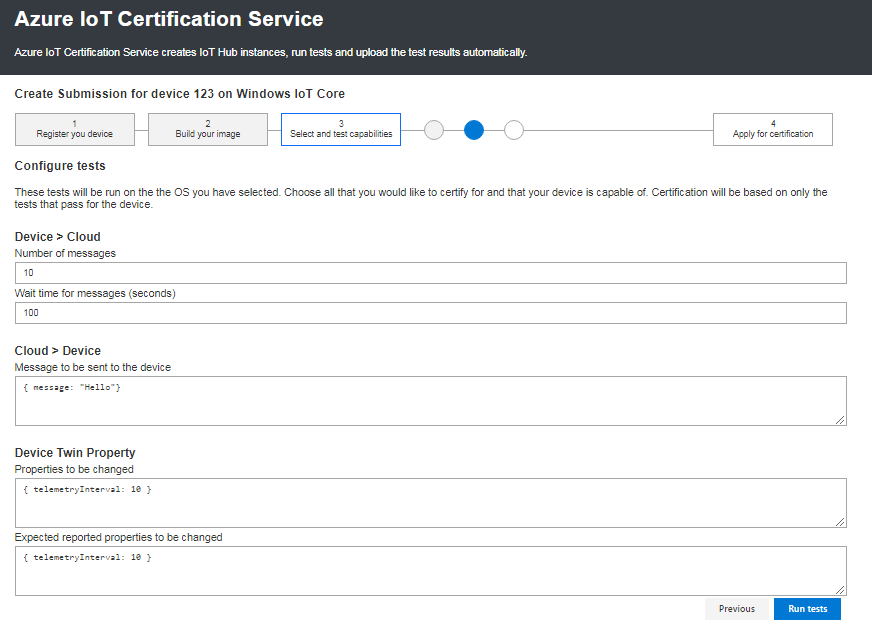
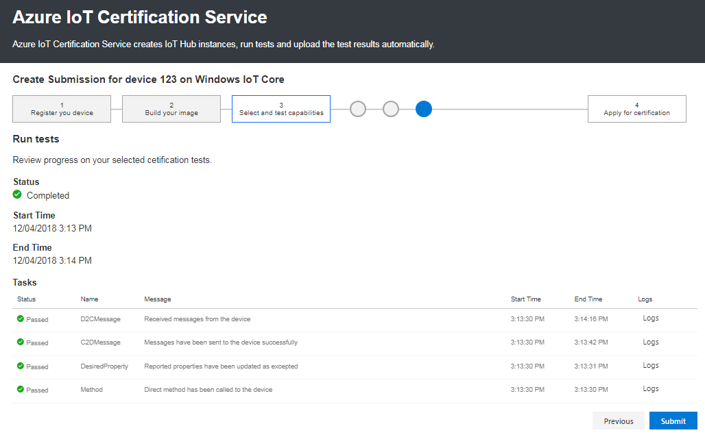
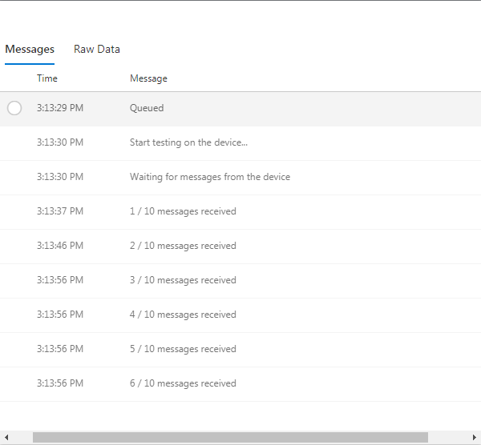
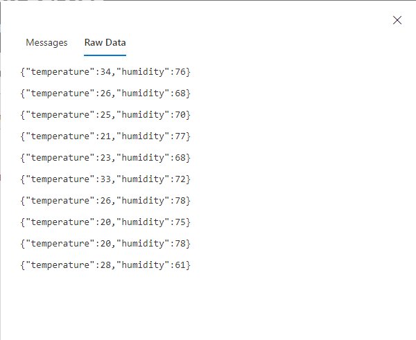
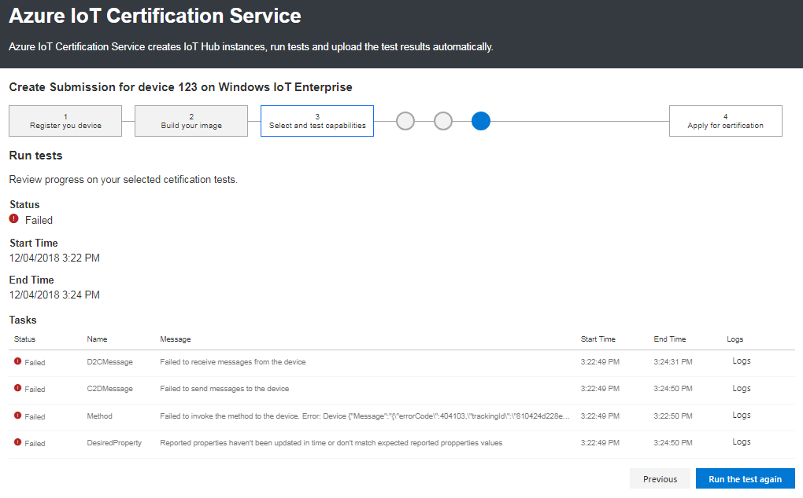

Azure IoT Certification Services
===
---

This document describes how to connect your device running with Azure IoT SDK to the Azure cloud. 

You can submit your device on <https://catalog.azureiotsolutions.com/> devices. Once the device is submitted, you will redirect to the Azure IoT Certification Services portal.

AICS is followed by the following steps:

1.  Select the Platform (OS).
2.  Prepare your device.
3.  Select the tests.
4.  Configure Tests.
5.  Run Tests.
6.  Apply for the Certification.

**Select Platform (OS):**

-   Select the platform (OS) which supports your device.
 
-   Click next.

 

**Prepare your device:**

-   In this page you can find how to Prepare you device with IoTHub.
-   Select the SDK which supports your device, Build and Run the sample as per the instructions stated in SDK (<https://github.com/Azure/azure-iot-device-ecosystem/tree/master/iotcertification>)
-   Copy the auto generated connection string received from AICS and provide in the SDK as per the instruction stated in the SDK guidelines document.
-   Verification of device Configuration: Save the screen shots of the output and share it to the <mailto:iotcert@microsoft.com>
-   Click next
 
 

**Select the Tests:**

-   Select the tests which you like to certify on your device.
-   Click next

 

**Configure Tests:**

-   Here you can see the auto inputs/messages given to the cloud/Device. You can change the inputs if you are like to give your own inputs
 
 
-   Keep your SDK ready in the device with the samples which you selected in the above step.
-   Run the command to fire the test results on device 
-   Click on perform the test tab on AICS

**Run Tests:**

-   Once you redirected to this page, here you can get the results of the device which you selected to perform for certification 

 

-   If you  passed in this test, you can see the messages and raw data in the Logs. Please take screenshots of the Logs and save them for the certification validation.

 

  

-   Once you save the screenshots of AICS tool and output in your device, Click Submit.
-   Then you will receive an email from <mailto:iotcert@microsoft.com> for the futher steps to be followed.

-   If you fail any of the tests you selected, you have to perform the test from the beginning.
 
 

If you require further information regarding the program more generally, please contact us at [contact us](mailto:iotcert@microsoft.com) with your questions or concerns.
