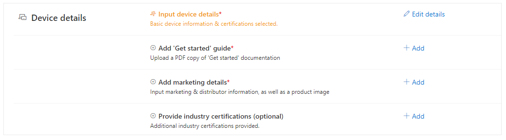

### Welcome and services document
# Azure Certified Device program:
# Getting started with the preview portal
Updated: 20 Aug 2020
  

### Hello!

Welcome to the new Azure Certified Device portal. This is an **early preview experience** to get you jumpstarted with certifying your device, highlighting our new IoT Plug and Play program. 

Currently, you can get started by (1) **creating** your project, (2) **testing** your device, and (3) **setting** the device details that will showcase your product to your customers.

In the coming weeks as we reach General Availability, you’ll notice key new features being added, like additional certification programs and the ability to publish your device to the Azure IoT Device Catalog. 

In addition, **we will share more information with our partners** about our transition plans from our older portal to this newer portal, including how device builders can manage their previously created submissions.

For now, if you’d like to engage with Microsoft to do a device pre-review or to **provide us any feedback** on your experience, please email us at [iotcert@microsoft.com](mailto:iotcert@microsoft.com). Thanks!

-The Azure Certified Device team

### Purpose of certification

We’ve defined our mission with our new Azure Certified Device program to deliver on the following:

-   Connect a community of builders to create innovative customer solutions that work great on Azure
-   Give confidence to buyers and sellers by highlighting both compatibility and differentiation
-   Reduce time-to-market for those building E2E IOT solutions
-   Increase promotion on Device Catalog, Central, and through other marketing opportunities

*This preview portal—and the version that will soon be Generally Available—is one piece to deliver on those goals. Most specifically, it will fuel the set of devices that our ecosystem of builders can use to build great solutions.* 

### Overview of certification process

Certifying a device in our Azure Certified Device program consists of four activities, which are:

1)   Providing device details

2)   Validating through testing

3)   Submitting and completing the review

4)   Publishing to the Azure IoT Device Catalog (optional)

***For our Preview release, Step #3 & #4 has been temporarily disabled. These features will be enabled as we reach General Availability in a few weeks.***

### Activity 1 - Providing device details (aka hardware capability information)

One of the core purposes of providing device hardware information is to improve customer confidence as they make purchasing decisions. Your device—including hardware features and other distinct details—can be distinguishable, discoverable and searchable on our Azure IoT Device Catalog.

The product information provided during the certification process falls into four distinct categories:

1)   Device information

2)   **Get started** guide

3)   Marketing details

4)   Additional industry certifications (optional)

 

**Device information:**

For our previous portal users, most of the input fields collected will be familiar (such as device name, description, processor, operating system, connectivity options, etc.), however, we have continued to evolve these based on feedback with our partners and customers, to best represent device capabilities.

**Certifications:**

The device details section in your project is also where you will have the ability to select which Certification programs you want your device to be certified for. For our preview release, this feature has been disabled as we are focusing specifically at devices that will be eligible for our IoT Plug and Play program; however, once we hit General Availability we will provide the following three options:

1)   Azure Certified Device (**required**; our base-level program)

2)   IoT Plug and Play (**optional** program for those devices meeting the IoT Plug and Play promise to simplify creation customer solution with custom device code)

3)   Edge Managed (**optional** program for those devices meeting a customer promise of easy manageability of device apps through the IoT Edge runtime)

*Further details of each program—including requirements and individual program logos—will be available on the Microsoft doc center once we reach General Availability.*

**Components:**

There is an important **new concept** that we have introduced with our new preview portal: *we have added the ability to denote multiple, separate hardware products (“components”) that make up your device.* We have added this functionality to enable the device builder to better promote devices that come with additional hardware, and to better enable customers and solution developers to find the right product to integrate into their solution. *Every project submitted for Certification will require at least one component (which could be the full product itself)*. Further suggestions on how to use this new functionality are covered in the next section of this document.

The “Add a component” feature is available on the Product details tab:

This action enables new form fields for the component:

After completing the relevant fields for the component, the component can be saved using the “Save Product Details” button at the bottom of the page:

For each component you add to your project, you can further tailor the hardware capabilities it supports. To further configure your component with these properties, click the **Edit** link by the component name. Each component can contain the following types of information:

-   General hardware details like processors and secure hardware
-   Connectivity options and interfaces
-   Hardware accelerators (if relevant for your device)
-   Sensors (if relevant for your device)
-   Physical and configuration properties like XYZ dimensions and storage/battery

**Component use recommendations:**

Below are examples of a few scenarios, and how the new Component feature may (or may not) apply:

-   If you are certifying a Finished Product that is one complete device, then your device information should include a single component, which is itself the **Customer Ready Product**
-   If you are certifying a Finished Product that includes a detachable peripheral*, then your device information should include the **Customer Ready Product** and then, optionally, a **Peripheral** component that is identified as **detachable**
-   If you are certifying a Finished Product that includes an integrated component you want to highlight to your customers – such as a System on Module (SoM) you may be using – your device information should include the Customer Ready Product and then, optionally, a **SOM** component that is identified as **integrated**
-   ***(Coming soon)*** If you are certifying a **Solution-Ready Dev Kit**, you likewise have the ability to denote components that range from **SOM**, **Development Board**, and **Peripheral**.

*An important note is that it is primarily at your discretion how to use—or not use—this new feature.*

**Final bits and pieces:**

Our preview portal includes two additional fields worth noting that were not present on our previous certification portal. On the “Product details” page, you can find Additional product details and Internal comments:

-   **Additional product details** can include further specifications to distinguish your device, e.g., decibel range, ruggedization features, thermals, etc.
-   **Internal comments** is a quick way to pass a note to our Azure Certified Device team once your device is ready for review. You can use this to flag a question to our team, to denote that the device might be related to a specific partner engagement effort, etc.

**Get Started guide for your customers:**

The second category of information we request from our device builders is a PDF document to simplify setup/configuration and management of your product—a ‘Get started’ guide. This furthers our mutual goal of making it simple for customers to connect and support devices on Azure.

The template required for the PDF document is available here: <http://aka.ms/GSTemplate>

**Marketing details:**

In this area, you will need to provide customer-ready marketing information for your device. These fields in particular will be showcased on the Azure IoT Device Catalog if you choose to publish your device after it is certified.

A new addition to our preview portal is the ability for our device builders to list multiple distributors in which your device can be purchases. This is found in the “Add a distributor” section on the Marketing details page.

**Industry Certifications your device has achieved (Optional):**

If you so choose, you can promote additional Industry Certifications you may have received for your device. By default, we provide a list of many of the most common Industry Certifications, though if your product has achieved a certification not in our list, you can specify a custom string value once you select “Other (please specify)”.

**Validating customer promises (“Connect & test”):**

The second major phase of the certification process (though it can be done in any order) involves testing your device for adherence to our Certification program requirements.

**For our preview release, this is limited to validating IoT Plug and Play compliance requirements.** For our General Availability release, the testing in this section will be specifically based on the Certification programs you have selected for your project. Details on Certification program requirements—including validation—will be made available on the Microsoft document site.

For IoT Plug and Play validation, you are required to connect a device to IoT Hub using the Device Provisioning Service (DPS) with the instructions given on the page. DPS supports connectivity options of Symmetric keys, X.509 certification, and a Trusted Platform Module (TPM).

Once your device is connected and your IoT Plug and Play interfaces are verified on the model repository, you will be given the opportunity to review the commands, properties, and telemetry associated to the device, and to run validation that each of these can receive a response from IoT Hub.

**Submitting and completing the device review process:**

More information on submitting a device for review, details of the review process itself (including communications), and the ability to publish to the Azure IoT Device Catalog will be coming shortly. **If you would like to complete a *pre-review* of your device project with the Azure Certified Device team, please email us at [iotcert@microsoft.com](mailto:iotcert@microsoft.com) with your project name.**