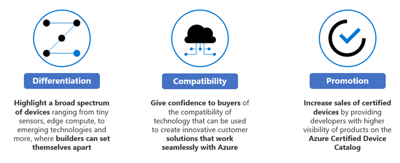

# Azure Certified Device FAQ
### Azure Certified Device, IoT Plug and Play, and Edge Managed Certifications
September 18th 2020

### Table of Contents:

[Q. What is the Certified for Azure IoT Device catalog?](https://aka.ms/certlearnmore)

[Q. What do I need to start the device certification process?](https://docs.microsoft.com/azure/certification/tutorial-00-selecting-your-certification)

[Q. What is the Azure Certified Device submission portal?](https://docs.microsoft.com/azure/certification/tutorial-01-creating-your-project)

[Q. Can I use SDK samples to go through the certification process?](#q.-can-i-use-sdk-samples-to-go-through-the-certification-process)

[Q. Are there pricing/licensing implications of the Azure Certified Device certification program? ](https://aka.ms/certlearnmore)

[Q. Can I opt out from publishing to the catalog site?](https://docs.microsoft.com/en-us/azure/certification/tutorial-04-publishing-your-device)

[Q. What happens to my existing submissions that used the older submission portal?](#q.-what-happens-to-my-existing-submissions-that-used-the-older-submission-portal)

[Q. How long does the certification process take? Are there SLAs?](#q.-how-long-does-the-certification-process-take-are-there-slas)

[Q. What are the benefits of getting certified with Azure Certified Device?](#q.-what-are-the-benefits-of-getting-certified-with-azure-certified-device)

[Q. What are the different certification programs offered through Azure Certified Device?](#q.-what-are-the-different-certification-programs-offered-through-azure-certified-device)

[Q. How long does the certification process take?](#q.-how-long-does-the-certification-process-take)

[Q. What is IoT Plug and Play?](#q.-what-is-iot-plug-and-play)

[Q. What is IoT Plug and Play device certification?](#q.-what-is-iot-plug-and-play-device-certification)

[Q. What are the benefits of getting an IoT Plug and Play device certification?](#q.-what-are-the-benefits-of-getting-an-iot-plug-and-play-device-certification)

[Q. Where can I find resources on IoT Plug and Play Certification?](#q.-where-can-i-find-resources-on-iot-plug-and-play-certification)

[Q. Can I certify devices running IoT Plug and Play bridge?](#q.-can-i-certify-devices-running-iot-plug-and-play-bridge)

[Q. What are the requirements for IoT Plug and Play device certification?](#q.-what-are-the-requirements-for-iot-plug-and-play-device-certification)

[Q. What is the migration path from the previous public preview?](#q.-what-is-the-migration-path-from-the-previous-public-preview)

[Q. What happens to my IoT Plug and Play pre-certified devices?](#q.-what-happens-to-my-iot-plug-and-play-pre-certified-devices)

[Q. How do I certify a gateway and sensors bundle?](#q.-how-do-i-certify-a-gateway-and-sensors-bundle)

# Azure Certified Device FAQ #

## Q. Can I use SDK samples to go through the certification process?

C-SDK samples can be used for evaluation only.

**Resources**

[Azure IoT C-SDK Samples](https://github.com/Azure/azure-iot-sdk-c/tree/master/iothub_client/samples/pnp)

[Return to top](#Azure-Certified-Device-FAQ)

## Q. What happens to my existing submissions that used the older submission portal? 

We are planning to release migration guidance during the 4th quarter of 2020. Please contact your Microsoft representative with any questions.

[Return to top](#Azure-Certified-Device-FAQ)

## Q. How long does the certification process take? Are there SLAs? 

We do not have any SLAs per our [program agreement](https://catalogstorageprod.blob.core.windows.net/devicecatalogimageserver/Program%20Agreement.pdf).
However, we do our best to respond to any inquiries as soon as possible.
Any questions can be directed to <iotcert@microsoft.com>.

**Resources**

-   [Microsoft Azure Certified for IoT Program Agreement](https://catalogstorageprod.blob.core.windows.net/devicecatalogimageserver/Program%20Agreement.pdf)

-   Email: <iotcert@microsoft.com>

[Return to top](#Azure-Certified-Device-FAQ)

## Q. What are the benefits of getting certified with Azure Certified Device? 

**For device builders:**

-   Promotion of Azure Certified Devices through a device catalog with assured quality and visibility to solution builders

-   Expansion of broad partnerships with solution developers

**For solution builders:**

-   Easy integration of Azure IoT solutions

-   Secure provisioning via the Device Provisioning Service

-   Devices certified for IoT Plug and Play work without having to write device-specific code

-   Devices certified for Edge Managed promise app management and device management standards for Azure connected devices.

[Return to top](#Azure-Certified-Device-FAQ)

## Q. What are the different certification programs offered through Azure Certified Device? 

**Azure Certified Device (Required)**

The Azure Certified Device is our baseline certification program and represents the minimum requirements to gain access to the Azure Certified Device logo and have your device published in the Azure Certified Device catalog.

**IoT Plug and Play (Optional)**

The incremental IoT Plug and Play certification program enables solution builders to integrate smart devices with their solutions without manual configuration. At the core of IoT Plug and Play is a model that a device uses to advertise its capabilities to an IoT Plug and Play-enabled application. This model is tructured as a set of elements: Telemetry, properties and commands.

1.  Devices certified as IoT Plug and Play provide confidence that:Defined device models and interfaces are compliant with the [Digital Twin Definition Language](https://github.com/Azure/opendigitaltwins-dtdl)

2.  Secure provisioning and easy transfer of ID scope ownership in Device Provisioning Services

3.  Easy integration with Azure IoT-based solutions using the [Digital Twin    APIs](https://docs.microsoft.com/en-us/azure/iot-pnp/concepts-digital-twin): Azure IoT Hub and Azure IoT Central

4.  Validated product truth on certified devices

**Edge Managed (Optional)**

The incremental Edge Managed certification program is an evolution of the legacy IoT Edge device program and will provide a certification for those looking to raise viability to devices capable of device management standards. Requirements for being certified as an Edge Managed device include pre-installing [Azure IoT Edge](https://github.com/Azure/iot-edge/blob/master/README.md) runtime.
Pre-installing IoT Edge runtime in your device can occur at various stages in the value chain:

-   Pre-install IoT Edge runtime at the OEM or ODM manufacturing facility.

-   Pre-install IoT Edge runtime that is supplied by OEM at the point of distribution. This is the scenario where channels such as distributors, value-added resellers etc. install OEM-supplied IoT Edge runtime.

-   If the channel takes OEM Edge device, and installs the channel specific IoT Edge runtime, the program accepts the submission as a different submission entity. In this case, the channel and OEM need to agree on specifics regarding branding, device names, etc. that are shown in the [device catalog](https://catalog.azureiotsolutions.com/).

IoT devices like Raspberry Pi3, etc. can continue to run IoT Edge runtime. The Azure Certified for IoT program is certifying against the pre-installed Edge runtime in the device controlled by either OEMs or channels to provide the best out-of-the-box experience on IoT Edge devices.

[Return to top](#Azure-Certified-Device-FAQ)

## Q. How long does the certification process take?

We do not have any SLAs per our [program agreement](https://catalogstorageprod.blob.core.windows.net/devicecatalogimageserver/Program%20Agreement.pdf).
However, we do our best to respond to any inquiries as soon as possible.
Any questions can be directed to <iotcert@microsoft.com>.

**Resources**

-   [Microsoft Azure Certified for IoT Program Agreement](https://catalogstorageprod.blob.core.windows.net/devicecatalogimageserver/Program%20Agreement.pdf)

-   Email: <iotcert@microsoft.com>

[Return to top](#Azure-Certified-Device-FAQ)

# IoT Plug and Play Device Certification #

## Q. What is IoT Plug and Play?

IoT Plug and Play is an open approach based on an open language to simplify IoT solution development. It enables seamless device-to-cloud solution integration experience, without needing to write embedded device code. IoT Plug and Play allows IoT devices to describe their capabilities in a "device capability model" and present it when connecting to cloud solutions like Azure IoT Central and third-party solutions from partners, which can then automatically understand and
interact with the device.

**Resources**

-   [IoT Plug and Play](https://aka.ms/iotpnp)

[Return to top](#Azure-Certified-Device-FAQ)

## Q. What is IoT Plug and Play device certification?

The IoT Plug and Play device certification program makes it easy for solutions builders and end users to pick the right device and cloud assets for any IoT project.

**Resource**

-   [Prepare and certify your devices for IoT Plug and Play blog](https://aka.ms/pnpcertblog)

-   [IoT Plug and Play Certification IoT show](https://aka.ms/iotshow/231/youtube)

[Return to top](#Azure-Certified-Device-FAQ)

## Q. What are the benefits of getting an IoT Plug and Play device certification? 

**For device builders:**

-   Promotion of Azure Certified Devices through the device catalog with assured quality and visibility to solution builders

-   Expansion of broad partnerships with solution developers

**For solution builders:**

-   Confidence of easy integration of Azure IoT solutions

-   Certified Plug and Play-enabled devices work without writing device-specific code

[Return to top](#Azure-Certified-Device-FAQ)

## Q. Where can I find resources on IoT Plug and Play Certification? 

Please check the updated documentation.

**Resources**

-   [Prepare and certify your devices for IoT Plug and Play](https://aka.ms/pnpcertblog)

-   [IoT Plug and Play Certification IoT Show](https://aka.ms/iotshow/231/youtube)

-   [How to certify IoT Plug and Play devices](http://aka.ms/pnpcertdoc)

-   [IoT Plug and Play certification tutorial](https://aka.ms/pnpcerttutorial)

[Return to top](#Azure-Certified-Device-FAQ)

## Q. Can I certify devices running IoT Plug and Play bridge?

Guidance for certifying gateways, including those that run the bridge, is coming soon.

[Return to top](#Azure-Certified-Device-FAQ)

## Q. What are the requirements for IoT Plug and Play device certification? 

Requirements for IoT Plug and Play device certification include:

-   Certification through the Azure Certified Device baseline program

-   Device model(s) describing the device and peripheral(s) following the DTDL version 2

-   Model ID announcement during provisioning

-   Device-to-Cloud (D2C) message support

Resources

-   [IoT Plug and Play device certification program requirements](https://aka.ms/IoTPnPCert).

[Return to top](#Azure-Certified-Device-FAQ)

## Q. What is the migration path from the previous public preview? 

The IoT Plug and Play public preview includes several key changes, including Digital Twin Definition Language v1 changing to v2. We do not have a migration plan or documentation. If you need assistance, please contact your Microsoft technical contact.

[Return to top](#Azure-Certified-Device-FAQ)

## Q. What happens to my IoT Plug and Play pre-certified devices? 

We are planning to remove pre-certified devices from the device catalog
during the 4th quarter of 2020.

[Return to top](#Azure-Certified-Device-FAQ)

## Q. How do I certify a gateway and sensors bundle?

Please add details to the device information section of the certification request. One of the goals is to ensure the device is ready to use when delivered, so we encourage you to add as much information as possible to ensure the best user experience.

We are also planning to release Microsoft's guidance in detail this fall. Please contact your Microsoft representative with any questions.

[Return to top](#Azure-Certified-Device-FAQ)
