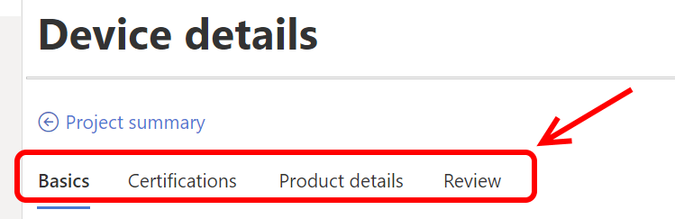

# Azure Certified Device program: Getting started with the portal

Updated: 21 Jan 2021
  
**Hello!**

Welcome to the new Azure Certified Device portal. Here, you will be able to certify your devices for one or more of our certifications:

- [Azure Certified Device](https://aka.ms/acdrequirements "Azure Certified Device requirements") (baseline program)
- [IoT Plug and Play](https://aka.ms/acdiotpnprequirements "IoT Plug and Play requirements") (incremental program)
- [Edge Managed](https://aka.ms/acdedgemanagedrequirements "Edge Managed requirements") (incremental program)

*While the [Azure Certified Device portal](https://certify.azure.com "Azure Certified Device portal") will continue to evolve with new features, these certifications are Generally Available, so you can confidently certify your devices now.*

If you have previously certified devices with the Azure IoT Device Certification program, you can find more information about the differences between programs and how this affects you [here](https://aka.ms/certifiedlegacydevices).

For more information on the Azure Certified Device program, please see [Getting Started with the Azure Certified Device program](https://aka.ms/certlearnmore "Getting Started with the Azure Certified Device program").

If you have additional questions or feedback, please contact us at [The Azure Certified Device team](mailto:iotcert@microsoft.com).

## Concepts and terminologies

### Device Type

- Finished Product  
    A device that is solution-ready and capable of production deployment, typically in a finished form factor with firmware and an operating system. These may be general-purpose devices that require additional customization or specialized devices that require no modifications for usage.
- Solution-Ready Dev Kit  
    A development kit containing hardware and software ideal for easy prototyping, typically not in a finished form factor. Usually includes sample code and tutorials to enable quick prototyping. 

### Component Type

- Customer Ready Product   
    A component representation of the overall or primary device.
- Development Board     
    Either an integrated or detachable board with microprocessor for easy customization.
- Peripheral  
    Either an integrated or detachable addition to the product (such as an accessory).
- System-On-Module  
    A board-level circuit that integrates a system function in a single module.

### Device Class

The form factor or classification that best represents your device from one of 3 options.

- Gateway
- Sensor
- Other  

    If you select Other, you can add a description of your device class in your own terms. Over time, we may continue to add new values to this list, particularly as we continue to monitor feedback from our partners.

### Attachment Method

- Integrated  
    A component or peripheral is a part of main chassis of the product.  
    E.g. An integrated temperature sensor inside a gateway chassis.

- Discrete  
    A component or peripheral is **NOT** a part of main chassis of the product.  
    E.g. An external temperature sensor that can be connected via USB or Bluetooth.

## Overview of the certification process

Certifying a device involves four major steps:

1. Creating your project
1. Providing hardware capability information

    > [!TIP]  
    > After completing Activity 1, we recommend skipping to Activity 3 to validate your device. If you want to re-do the testing phase, you will have to create a new project and re-enter the information from Activity 2.

1. Validating device functionality
1. Submitting and completing the review
1. Publishing to the Azure Certified Device Catalog (optional)
1. Updating your project after it has been approved/published (optional)

## Activity 1 - Creating your project

1. Sign into the [certification portal](https://certify.azure.com) with your company MPN account.

    > [!IMPORTANT]  
    > For publishing your device on Device Catalog your company must have a work/school Azure Active Directory account and [valid MPN (Microsoft Partner Network) account](https://partner.microsoft.com/en-US/).

1. On the home screen, click `Create new project`  

    

1. Fill in the information in `Basics` tab  

    This information can be changed later within the device details areas.

    The following fields are **required**: 

    | Fields                  | Description                                                                                                                         |
    |------------------------|-------------------------------------------------------------------------------------------------------------------------------------|
    | Project name           | Internal name that will not be visible on the Azure Certified Device Catalog                                                        |
    | Device name            | Customer-facing name for your device                                                                                                |
    | Device type            | Specification of Finished Product or Solution-Ready Dev Kit                                                                         |
    | Device class           | Gateway, Sensor, or other.  See [above](#device-class) for more explanation.                                                                    |
    | Device source code URL | Required if you are certifying a Solution-Ready Dev Kit, optional otherwise. URL must be to a GitHub location for your device code. |

1. Click the `Next` button to continue to the `Certifications` tab.

    

1. Specify which certification(s) you wish to achieve for your device.

    > [!NOTE]  
    > As Azure Certified Device is a required baseline, the toggle button is not editable. Currently, IoT Plug and Play and Edge Managed are mutually exclusive. As we evolve our existing programs and add new programs, the selections and functionality in this area will likewise change.

1. Click `Create` and the new project will be saved and visible in the home page of the portal.
    
    

    To edit the project, click on the Project name in the table. This will launch the project summary page where you can begin entering more details about your device:

    

## Activity 2 - Providing hardware capability information: `Device details`

Providing device hardware information improves customer confidence in your product as they make purchasing decisions. The information you provide for your device—defined by hardware features and other distinct details—makes it distinguishable, discoverable and searchable on the Azure Certified Device catalog.

The product information provided during the certification process falls into four distinct categories:

- Device details
- Get started guide
- Marketing details
- Additional industry certifications (optional)

### 2.1: Device Details

The first section of your project page `Input device details` allows you to provide information on the core hardware capabilities of your device, such as device name, description, processor, operating system, connectivity options, hardware interfaces, industry protocols, physical dimensions, and more. While many of the fields are optional, most of this information will be made available to potential customers on the Azure Certified Device catalog if you choose to publish your device after it has been certified.

- Basics

    This area shows the same fields that were initially requested when creating the project: Project name, Device name, Device type, Device class.

- Certifications

    Similarly, this area shows the selected certifications when the project was first created. We currently have three certifications generally available: Azure Certified Device (required), IoT Plug and Play (optional), and Edge Managed (optional). More information on these programs can be found in the links at the top of this document.

- Product details

    Here you specify generally-applicable information for your device, including supported Operating system(s), Additional product details, component information and optional Internal Comments for the Azure Certified Device team to review.

    For fields where you feel that none of the supplied options are not suitable for your device, select `Other` and leave a note in the `Internal comments`. A reviewer will go over your information and provide assistance if necessary.

- Review

    This area provides a read-only overview of the full set of device details that been entered.

#### How to use component properties to define your device in `Product Details`

With the updated Azure Certified Device program, we have added the ability for the user to denote multiple, separate hardware products (referred to as components) that make up your device. This enables the device builder to better promote devices that come with additional hardware, and allows customers and solution developers to find the right product to integrate into their solution.

> [!IMPORTANT]  
> Every project submitted for certification will require at least one `Customer Ready Product` component (which in many cases will be the full product itself).  
> Further guidance on how to use this new functionality are covered in the next section of this document.

1. Click `Add a component` on the Product details tab:

    

1. Complete relevant form fields for the component:

    

    > [!NOTE]  
    > A **Customer Ready Product** component type refers to the entire device. This is different from a **Finished Product**, which is a classification of the device as being ready for customer use without further development. A **Finished Product** will contain a **Customer Ready Product** component.

1. Save your information using the `Save Product Details` button at the bottom of the page:  

    

1. Once you have saved your component, you can further tailor the hardware capabilities it supports. Click the `Edit` link by the component name:  

    

1. Provide relevant hardware capability information where appropriate:  

      

    The editable component fields (shown as tabs) include:

    - General  
        Hardware details such as processors and secure hardware

    - Connectivity  
        Connectivity options, protocols, and interfaces such as radio(s) and GPIO

    - Accelerators  
        Specify hardware acceleration such as GPU and VPU

    - Sensors  
        Specify available sensors such as GPS and vibration 

    - Additional Specs  
        Additional information about the device such as physical dimensions and storage/battery information

#### Component use requirements and recommendations

Below are examples of a few scenarios, and how the new Component feature may (or may not) apply:

| Product Type                                       | components | Component 1 / Attached Type      | Components 2+ / Attached Type                    |
|----------------------------------------------------|------------|----------------------------------|--------------------------------------------------|
| Finished Product                                   | 1          | Customer Ready Product, Discrete | N/A                                              |
| Finished Product with **detachable peripheral(s)** | 2 or more  | Customer Ready Product, Discrete | Peripheral / Discrete or Integrated              |
| Finished Product with **integrated component(s)**  | 2 or more  | Customer Ready Product, Discrete | Select appropriate type / Discrete or integrated |
| Solution-Ready Dev Kit                             | 2 or more  | Customer Ready Product, Discrete | Select appropriate type / Discrete or integrated |

#### Additional notes

- A project can contain **at most** one Customer Ready Product component. If you are certifying a project with two independent devices, those devices should be certified separately. If you have any questions in this scenario, please contact our team at [iotcert@microsoft.com](mailto:iotcert@microsoft.com).
- It is primarily at *your discretion* on how to use—or not use—this new feature to promote your device's capabilities to potential customers.
- During the submission review phase, the Azure Certified Device team may request edits to the component information if the details are not clear or appear to be lacking (e.g. Component manufacturer is not supplied for a Customer Ready Product type).

#### Examples

- Customer Ready Product

    Contoso is an OEM that creates a customer ready product called Falcon. Since the device is a complete finished product and the product is not integrated into a larger product, Contoso submits Falcon for certification with only one component with type "Customer Ready Product" and specifies the attachment method as  “discrete.”  

    

- Customer Ready Product with peripheral component Type

    Contoso is an OEM that creates a customer ready product called Falcon. Contoso wants to bring visibility to the integrated peripheral camera module from ABC Inc interfaced via USB with their Falcon product.

    > [!NOTE]  
    > Peripherals are devices that connect to the main device, but does not contribute to device primary functions. Instead, it provides additional functions. Memory, RAM, Storage, Hard disk, CPU are not peripheral devices.

    

    In this example, Contoso would submit two components in the device details. The peripheral attachment method is "Integrated" since the Camera Module is not removable. There are additional options to describe the Peripheral device specifications by adding information to the Connectivity, Sensors, Accelerators, and Additional Specs tabs.

    This Peripheral component would be added to Contoso's project in addition to the base Customer Ready Product component described in [the Customer Ready Product example](#examples-of-component-scenarios).

- Customer Ready Product with System on Module (SOM)

    Contoso is an OEM that creates a customer ready product called Falcon. Contoso wants to bring visibility to the integrated SoM SoM123 from INC Electronics. SoM123 has a built-in processor Apollo52 from Foo and has an ARM64 processor Architecture. 

    

    In this example, Contosowould submit two components in the device details. The System on Module component will have attachment Method set as "Integrated" as SoM123 is not removable from the product. Additionally, Contoso would use the additional fields to describe the SOM module in detail by adding information in the tabs Connectivity, Accelerators, Sensors, etc.

    This integrated System on Module would be added to project in addition to the Customer Ready Product component.

### 2.2: Add 'Get started' guide for your customers

The Get Started guide is a PDF document to simplify setup/configuration and management of your product. Its purpose is to make it simple for customers to connect and support devices on Azure using your device.

We provide a number of Get Started templates from which to begin, depending on both the certifications sought and your preferred language to provide customer-ready samples. Once completed, you can upload your PDF under the second section of `Device Details` (`Add Get started guide`).Please provide as much detail as possible within the Get Started guide, as the PDF will be directly available on the catalog for customers to view.

The templates are available at our [Get started templates](https://aka.ms/GSTemplate "Get started templates") GitHub location:

- If you are certifying for the Azure Certified Device certification only, use [ACD_Get-Started-Template.md](https://github.com/Azure/azure-iot-device-ecosystem/blob/master/Azure_Certified_Device/Get_Started_Templates/Azure-Certified-Device/ACD_Get-Started-Template.md) in the "Azure-Certified-Device" folder.
- If you are certifying for IoT Plug and Play, use [template-plug-and-play-getstarted.md](https://github.com/Azure/azure-iot-device-ecosystem/blob/master/Azure_Certified_Device/Get_Started_Templates/IoT-Plug-and-Play/template-plug-and-play-getstarted.md) in the "IoT-Plug-and-Play" folder.
- If you are certifying for Edge Managed, use choose between templates for [Linux](https://github.com/Azure/azure-iot-device-ecosystem/blob/master/Azure_Certified_Device/Get_Started_Templates/Edge-Managed/template-linux-for-edge.md) or [Windows](https://github.com/Azure/azure-iot-device-ecosystem/blob/master/Azure_Certified_Device/Get_Started_Templates/Edge-Managed/template-windows-for-edge.md) in the "Edge-Managed" folder.

> [!IMPORTANT]  
> You may only submit **one** Get Started guide for your device.

### 2.3: Add marketing details

In this area, you will need to provide customer-ready marketing information for your device. These fields will be showcased on the Azure Certified Device catalog if you choose to publish your certified device.

These fields include:

- A product photo (JPEG or PNG, 200px x 200px)
- Product description that will appear on the Azure Certified Device catalog  

    > [!NOTE]
    > Not the same as `Additional product details` in the `Input device details` section

    

- GEO availability
- Manufacturing URL to point to additional device information  
    Available on the catalog as 'Manufacturer's page' link
- Up to 3 target industries for your device
- Distributor information for customers to be able to purchase the device using the `Shop` button on the catalog (Up to 5 distributors)

    > [!NOTE]
    > If your product is sold through your own website, then you can use that as one of your distributor links.

#### Additional notes on URLs

- Please ensure all supplied URLs are valid or will be active at the time of publication following approval
- If no distributor product page URL is supplied, then the `Shop` option will default to the link supplied for `Distributor page` which may not be specific to the device.

### 2.4: Provide industry certifications (optional)

You can also promote additional Industry Certifications you may have received for your device. We provide a list of the most common Industry Certifications to select from, though if your product has achieved a certification not in our list, you can specify a custom string value by selecting `Other (please specify)`.

## Activity 3 - Validating device functionality: `Connect & test`

### Automated testing

The next major phase of the certification process (though it can be completed before Activity 1) involves testing your device for compliance to our certification requirements.

1. To begin the testing phase, click the `Connect & test` link on the project summary page:  

    

1. Depending on the certification(s) selected, you will see the required tests to validate your device functionality on the Connect & test page.  

    

1. Connect your device to IoT Hub using the Device Provisioning Service (DPS). DPS supports connectivity options of Symmetric keys, X.509 certification, and a Trusted Platform Module (TPM). This is required for all certifications.

    - *For information on connecting your device to Azure IoT Hub with Device Provisioning Service (DPS) visit [provisioning devices overview](https://aka.ms/acddpsinfo "Device Provisioning Service overview").*
    - *At this time, we do not currently support group enrollment.*

1. If using symmetric keys, you will then be asked to configure the DPS with the supplied DPS ID scope, Device ID, authentication key, and DPS endpoint. Otherwise, you will be asked to provide either X.509 certificate or endorsement key.

1. After configuring your device with DPS, confirm the connection by clicking the `Connect` button at the bottom of the page. Upon successful connection, you can proceed to the testing phase by clicking the `Next` button  

    

1. The next step depends on the certifications you are testing for. For Azure Certified Device, select the device tests you wish to run for certification. For IoT Plug and Play, carefully review the parameters that will be checked during the test that you declared in your device model.

1. Testing specifics on the next few pages will vary by program. Please refer to the certification requirement documents linked at the top of this page for more information on what is being validated, plus refer to other resources in our [Getting Started with Azure Certified Device program](https://certlearnmore "Getting Started with the Azure Certified Device program") for more information.

Upon completion of automated testing, you will see the Testing status, as well as access to Log files. All automated tests must pass before you will be able to proceed on to the next stage.

### Important note about manual validation

While you will be able to complete the online certification process for IoT Plug and Play and Edge Managed without having to submit your device for manual review, you may be contacted by a Azure Certified Device team member for further device validation beyond what is tested through our automation service.

### Troubleshooting tips

- While running the tests, if you receive a result of `Passed with warnings`, this means that some telemetry was not received during the testing period. This may be due to a dependency of the telemetry on longer time intervals or external triggers that were not available. You can proceed with submitting your device for review, during which the review team will determine if **manual validation** is necessary in the future.

- For tests that are not passing, you can view the telemetry logs from previous test runs by pressing the `View Logs` button to identify what is causing the test to fail. Both the test messaging and raw data are available for review.  

    

- If the automated tests continue to fail, then you can `request a manual review` of the results to substitute. This will trigger a request for **manual validation** with the Azure Certified Device team.  

    

- For IoT Plug and Play issues related to the model repository, refer to [Device model repository](https://docs.microsoft.com/azure/iot-pnp/concepts-model-repository).

- In some instances where the logs indicate `Failed to get Digital Twin Model ID of device xx due to DeviceNotConnected`, try rebooting the device and re-starting the device provisioning process.

## Activity 4 - Submitting and completing the review: `Review & certify`

Once you have completed all of the mandatory fields in the `Device details` section and successfully passed the automated testing in the `Connect & test` process, you can now notify the Azure Certified Device team that you are ready for certification review.

1. Click `Submit for review` on the project page:  

    

1. Confirm your submission  

    You will have to confirm your submission in the pop-up window before the Azure Certified Device team is notified to complete the review. Once a device has been submitted, all device details will be read-only until editing is requested (See [Activity 5](#activity-5-optional---publishing-to-the-azure-certified-device-catalog-publish-to-catalog)).  

    

1. Once the project is submitted, the project summary page will indicate the project is `Under Certification Review` by the Azure Certification team:  

    

1. Response from Microsoft  

    - Approved submission  
        Once your project has been reviewed and approved, you will receive a notification to the email address under the Company profile. The email will include a set of files including the Azure Certified Device badge, badge usage guidelines, and other information on how to amplify the message that your device is certified. Congratulations!

    - Rejected submission  
        In the case your project is not approved, you will be able to make changes to the project details and then re-submit the device for certification once ready. An email will be sent to the email address in the Company profile with information on why the project was not approved and steps to qualify for certification.

## Activity 5 (optional) - Publishing to the Azure Certified Device Catalog: `Publish to catalog`

After your device has been certified, you can optionally publish your device details to the [Azure Certified Device catalog](devicecatalog.azure.com) for a world of customers to see.

1. To publish your device, return to the project summary page and click `Publish to Device Catalog`  

    

1. You will received a confirmation dialog before the device is published:*

    

You will receive notification to the email address in the Company profile once the device is on the Azure Certified Device Catalog.

## Activity 6 (optional) - Editing your submission after publishing

After your device has been certified and published to the Azure Certified Device catalog, you may need to update your device details or URLs due to unforeseen circumstances or changes to the product.

### Updating your information

1. Return to the project summary page and click the `Request Metadata Edit` button on the top of the page  

    

1. Acknowledge the notification on the page that you will be required to submit your product for review after editing.

1. Once acknowledging this warning, you can edit your device details. Prior to re-submitting through the `Review & certify` tab, make sure to leave a note in the `Internal comments` section of `Device Details` of what has been changed.

1. Click `Submit for review` to have your changes approved by the Azure Certification team

After your changes have been reviewed and approved, you can then re-publish your changes to the catalog through the portal (See [Activity 4](#activity-4---submitting-and-completing-the-review-review--certify)).
