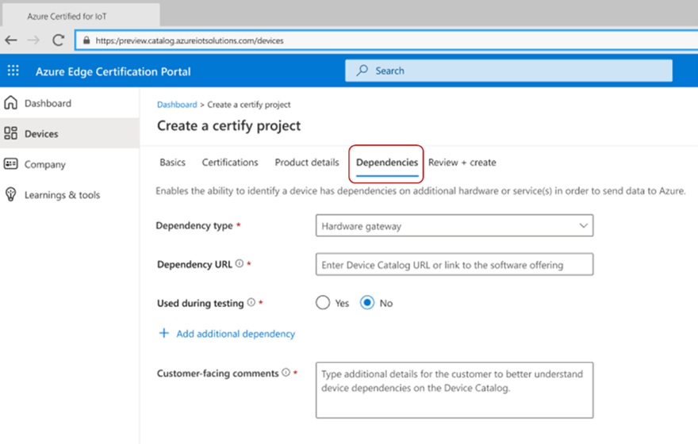
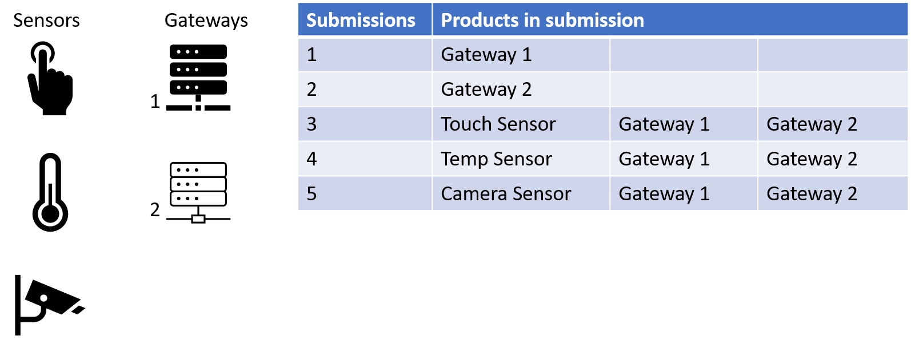
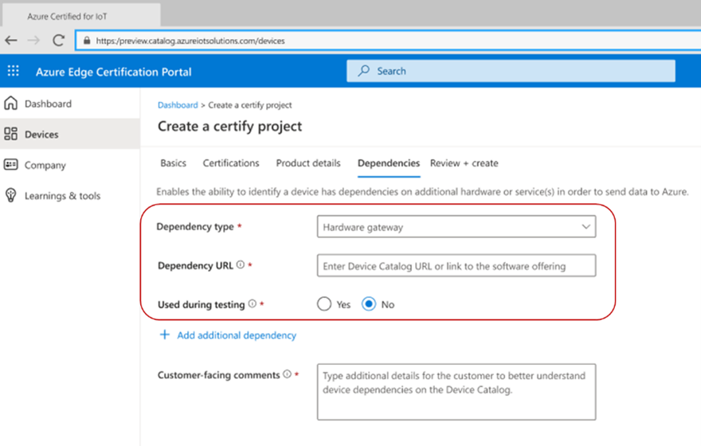
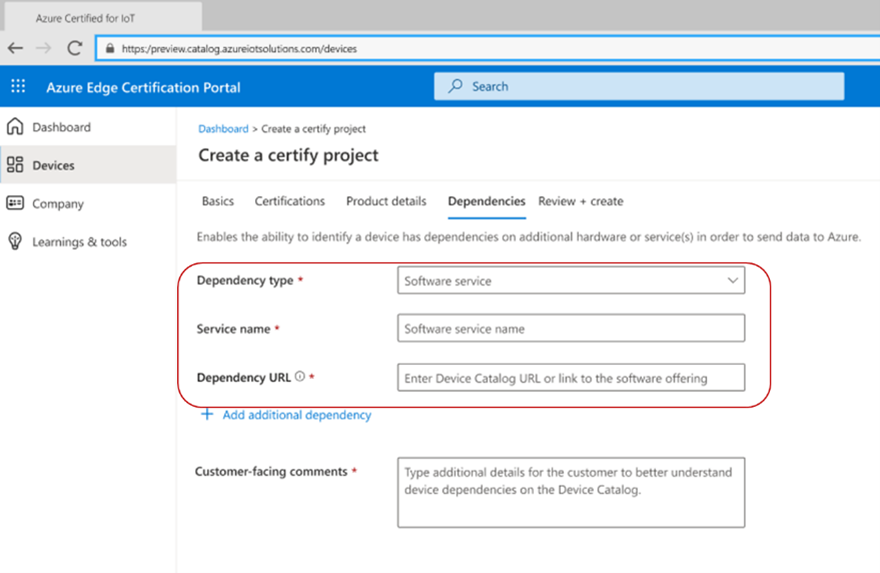
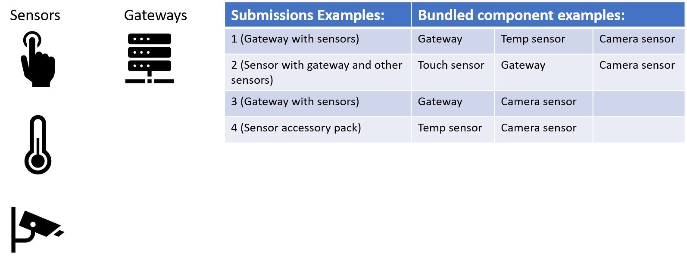
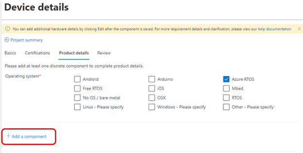
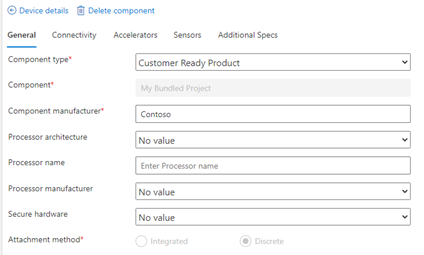
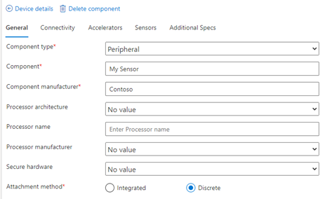
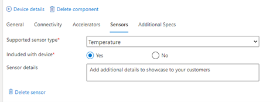

---
# Mandatory fields.
title: Certifing device bundles and indirectly connected devices
titleSuffix: Azure Certified
description: See how to submit a indirectly connected device for certification.
author: cbroad
ms.author: cbroad # Microsoft employees only
ms.date: 02/23/2021
ms.topic: how-to
ms.service: Azure Certification

# Optional fields. Don't forget to remove # if you need a field.
# ms.custom: can-be-multiple-comma-separated
# ms.reviewer: MSFT-alias-of-reviewer
# manager: MSFT-alias-of-manager-or-PM-counterpart
---

# Device Bundles and Indirectly connected devices

To support devices that interact with Azure through a device, SaaS or PaaS offerings, our submission portal (https://www.certify.azure.com) and device catalog (https://devicecatalog.azure.com) enable concepts of bundling and dependencies to help promote and enable these device combinations access to our Azure Certified Device program.

Depending on your product line and services offered, your situation may require a combination of these steps:

## Sensors and Indirect devices
Many sensors require a device to connect to Azure. In addition, you may have multiple compatible devices that will work with the sensor device. **To accommodate these scenarios, you must first certify the device(s) prior to certifying the sensor that will pass information through them.**

Example matrix of submission combinations

To certify your sensor which requires a separate device:
1.	First, [certify the device](https://certify.azure.com) and publish to the Azure Certified Device Catalog
    - If you have multiple, compatible passthrough devices (as in the example above), Submit them separately for certification and publish to the catalog as well
2.	With the sensor connected through the device, submit the sensor for certification
    * In the “Dependencies” tab of the “Device details” section, set the following values
        * Dependency type = “Hardware gateway”
        * Dependency URL = “URL link to the device on the device catalog”
        * Used during testing = “Yes”
        * Add any Customer-facing comments that should be provided to a user who sees the product description in the device catalog. (example: “Series 100 devices are required for sensors to connect to Azure”)

3.	If you have additional devices you would like added as optional for this device, you can click on “+ Add additional dependency” and follow the same guidance except note that it was not used during testing. In the Customer-facing comments, please ensure your customers are aware that additional devices associated to this sensor are optional (as an alternative to the device that was used during testing).

## PaaS and SaaS offerings
As part of your product portfolio, you may have devices that you certify, but your device also require additional services from your company or other 3rd party companies. To add this additional dependency, follow these steps:
1. Start the submission process for your device
2. In the “Dependencies” tab, set the following values
    - Dependency type = “Software service”
    - Service name = “[your product name]”
    - Dependency URL = “URL link to a product page that describe this service”
    - Add any customer facing comments that should be provided to a user who sees the product description in the Azure Certified Device Catalog
3. If you have additional software, services or hardware dependencies you would like added as optional for this device, you can click on “+ Add additional dependency” and follow the same guidance.

## Bundled products
Bundled product listings are simply the successful certification of a device with additional components that will be sold as part of the bundle in one product listing. You have the ability to submit a device that includes additional components such as a temperature sensor and a camera sensor (#1) or you could submit a touch sensor that includes a passthrough device (#2). Through the “Component” feature, you have the ability to add multiple components to your listing.

It is highly suggested that if you intend to do this, you format the product listing image to indicate this product comes with other components.  In addition, if your bundle requires additional services to certify, you will need to identify those through the services dependency.
Example matrix of bundled products

For a more detailed description on how to use the component functionality in the Azure Certified Device portal, please see our help documentation at [https://aka.ms/acdhelp](https://aka.ms/acdhelp), particular section 2 on adding Device Details. 

In the case of a passthrough device with a separate sensor in the same product, create one component to reflect the passthrough device, and another component to reflect the sensor. Components can be added to your project in the Product details tab of the Device details section:

For the passthrough device, set the Component type as a Customer Ready Product, and fill in the other fields as relevant for your product. Example:

For the sensor, add a second component, setting the Component type as Peripheral and Attachment method as Discrete. Example:

Once the Sensor component has been created, Edit the details, navigate to the Sensors tab, and then add the sensor details. Example:

Complete your projects details and Submit your device for certification as normal.

