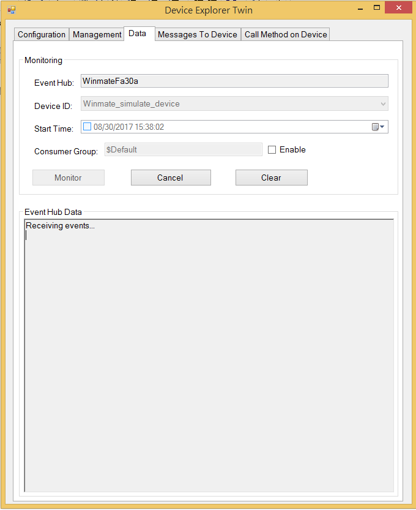
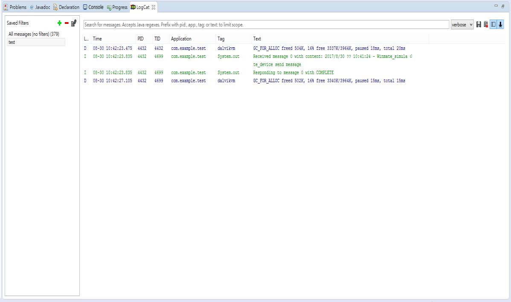

Run a simple java sample on Winmate-R12FA3S-GSM2(HB) device running Android 4.4.2
===
---

# Table of Contents

-   [Introduction](#Introduction)
-   [Step 1: Register Device](#Prerequisites)
-   [Step 2: Prepare your Device](#PrepareDevice)
-   [Step 3: Build and Run the Sample](#Build)
  -   [Step 3.1: Send Device Events to IoT Hub](#Build)
  -   [Step 3.2: Receive messages from IoT Hub](#Build)
-   [Next Steps](#NextSteps)

# Introduction

**About this document**

This document describes how to connect Winmate-R12FA3S-GSM2(HB) device running Android 4.4.2 with Azure IoT SDK. This multi-step process includes: 

-   Configuring Azure IoT Hub
-   Registering your IoT device
-   Build and deploy Azure IoT SDK on device

# Prepare
Before executing any of the steps below, read through each process, step by step to ensure end to end understanding.You should have the following items ready before beginning the process:

- Computer wh GitHub installed and access to the azure-iot-sdk-java GitHub
public repository.
- Required hardware to certify.

# Step 1: Register Device

Follow the instructions [here](https://github.com/Azure/azure-iot-device-ecosystem/blob/master/manage_iot_hub.md) on how to provision your device and get its
credentials.

# Step 2: Prepare your Device

Follow the instructions from [device website](http://www.winmate.com/Rugged/RuggedSpec.asp?Prod=03_1392&typeid=B0104071201).

# Step 3:  Build and Run the sample on Winmate-R12FA3S-GSM2(HB) device

- Download and install latest JDK from [here](http://www.oracle.com/technetwork/java/javase/downloads/index.html).
- Download [Eclipse OXYGEN](https://www.eclipse.org/downloads/) on
your Windows machine and follow the installation instructions.
- Download the [sample programs](https://github.com/Azure/azure-iot-sdk-java/tree/master/device/iot-device-samples/android-sample/app) and save them to your local repository.
- Go to MainActivity.java, replace the [device connection string]
placeholder with connection string of the device you have created in Step 2
and save the file.
- Build your project by going to Project menu > Build Project.
-  Select one of your project¡¯s files and right click Run As ->Andorid
Application.
-  In the Choose Device window that appears, select the Choose a running
Android device radio button, select your device, and click OK .
-  Eclipse OXYGEN will install the app on your connected device and starts it.

## 3.1 Send Device Events to IoT Hub

1.	Launch the DeviceExplorer as explained in Step 2 and navigate to Data tab.Select the device name you created from the drop-down list of device IDs and click Monitor button.

2. DeviceExplorer is now monitoring data sent from the selected device to the IoTHub.
3. As soon as you run the app on Winmate-R12FA3S-GSM2(HB) device, it will start sending messages to IoTHub.
4. Check the LogCat window. Verify that the confirmation messages show an OK.If not, then you may have incorrectly copied the device hub connection information.

5. DeviceExplorer should show that IoT Hub has successfully received data sent by sample test.

## 3.2 Receive messages from IoT Hub
  1. To verify that you can send messages from the IoT Hub to Winmate-R12FA3S-GSM2(HB) device, go to the Messages To Device tab in DeviceExplorer.
  2. Select the device you created using Device ID drop down.
  3. Add some text to the Message field, then click Send.DeviceExplorer_message_send
  
  4. Click the Receive Messages button from the sample App UI loaded on your device or in the emulator.
  5. Check the LogCat window. You should be able to see the command received. HTTP protocol:

# Next Steps

You have now learned how to run a sample application that collects sensor data and sends it to your IoT hub. To explore how to store, analyze and visualize the data from this application in Azure using a variety of different services, please click on the following lessons:

-   [Manage cloud device messaging with iothub-explorer]
-   [Save IoT Hub messages to Azure data storage]
-   [Use Power BI to visualize real-time sensor data from Azure IoT Hub]
-   [Use Azure Web Apps to visualize real-time sensor data from Azure IoT Hub]
-   [Weather forecast using the sensor data from your IoT hub in Azure Machine Learning]
-   [Remote monitoring and notifications with Logic Apps]   

[Manage cloud device messaging with iothub-explorer]: https://docs.microsoft.com/en-us/azure/iot-hub/iot-hub-explorer-cloud-device-messaging
[Save IoT Hub messages to Azure data storage]: https://docs.microsoft.com/en-us/azure/iot-hub/iot-hub-store-data-in-azure-table-storage
[Use Power BI to visualize real-time sensor data from Azure IoT Hub]: https://docs.microsoft.com/en-us/azure/iot-hub/iot-hub-live-data-visualization-in-power-bi
[Use Azure Web Apps to visualize real-time sensor data from Azure IoT Hub]: https://docs.microsoft.com/en-us/azure/iot-hub/iot-hub-live-data-visualization-in-web-apps
[Weather forecast using the sensor data from your IoT hub in Azure Machine Learning]: https://docs.microsoft.com/en-us/azure/iot-hub/iot-hub-weather-forecast-machine-learning
[Remote monitoring and notifications with Logic Apps]: https://docs.microsoft.com/en-us/azure/iot-hub/iot-hub-monitoring-notifications-with-azure-logic-apps
[lnk-setup-iot-hub]: ../setup_iothub.md
[lnk-manage-iot-hub]: ../manage_iot_hub.md
[android-sample-code]: https://github.com/Azure/azure-iot-sdk-java/tree/master/device/iot-device-samples/android-sample
[mainactivity-source-code]: https://github.com/Azure/azure-iot-sdk-java/blob/master/device/iot-device-samples/android-sample/app/src/main/java/com/iothub/azure/microsoft/com/androidsample/MainActivity.java