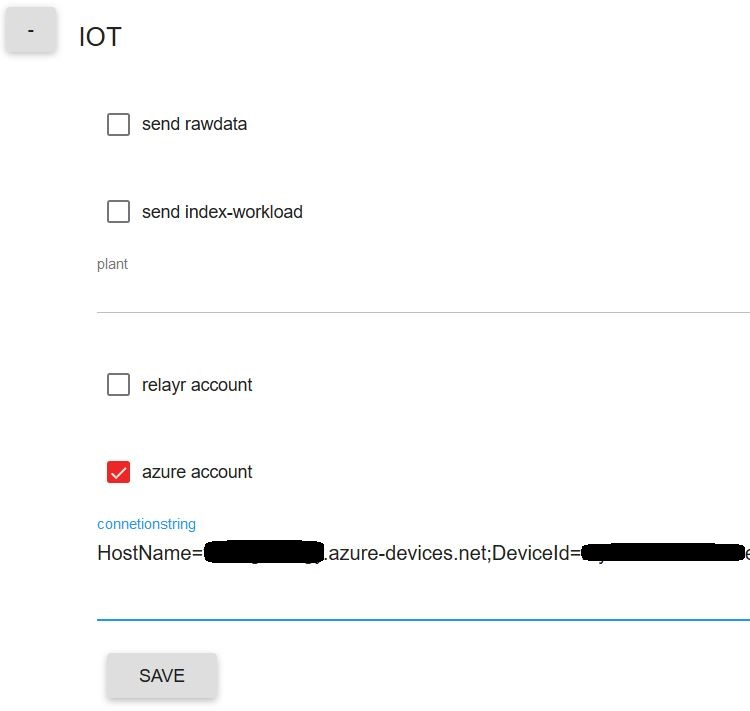
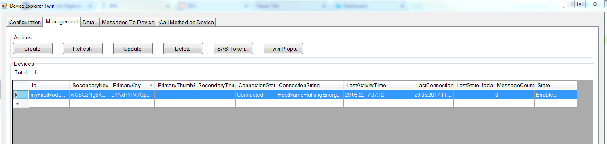

Run a simple JavaScript sample on Equipment Data Sensor (EDS) device running Arch Linux
===
---

# Table of Contents

-   [Introduction](#Introduction)
-   [Step 1: Prerequisites](#Prerequisites)
-   [Step 2: Prepare your Device](#PrepareDevice)
-   [Step 3: Connect your Device to the Cloud](#Connect)
-   [Documentation](#Documentation)
-   [Next Steps](#NextSteps)

# Introduction

**About this document**

This document describes how to connect Equipment Data Sensor (EDS) device running Arch Linux with Azure IoT SDK. This multi-step process includes:
-   Configuring Azure IoT Hub
-   Registering your IoT device
-   Build and deploy Azure IoT SDK on device

# Step 1: Prerequisites

You should have the following items ready before beginning the process:

-   [Prepare your development environment][setup-devbox-linux]
-   [Setup your IoT hub][lnk-setup-iot-hub]
-   [Provision your device and get its credentials][lnk-manage-iot-hub]
-   Equipment Data Sensor (EDS)  device.

# Step 2: Prepare your Device

-   Setup a connection between your Computer and the EDS device via LAN or WLAN. 
-   Open the integrated Browser Frontend by starting a web browser and navigate to http://172.24.127.127 (LAN) or http://192.168.127.1 (WLAN).
-   After the home screen has finished loading go to **settings**.
    
-   Choose **Administration**. Custom password is "root".
    
-   Navigate to **Network settings** and enter suitable network settings according to your network environment which allow the device to connect to the internet. **Save** settings after completing.
    
-   Navigate to **IOT** and check **azure account**. Enter the IoT Hub Connection String for your device and **save** settings.
    
-   Choose **Reboot** to make settings persistent.

# Step 3: Connect your Device to the Cloud

-   Launch the Device Explorer as described in [Provision your device and get its credentials][lnk-manage-iot-hub] and navigate to ***Management*** tab. Check the Connection State of your device in the list.
    

-   Navigate to the ***Data*** tab of the Device Explorer and select your device from the drop-down list of device IDs and click ***Monitor*** button. The Device Explorer is now monitoring data sent from the selected device to the IoT Hub.
    

# Documentation

The documentation for EDS can be found [here](http://www.ruppenergy.com/).

# Next Steps

You have now learned how to run a sample application that collects sensor data and sends it to your IoT hub. To explore how to store, analyze and visualize the data from this application in Azure using a variety of different services, please click on the following lessons:

-   [Manage cloud device messaging with iothub-explorer]
-   [Save IoT Hub messages to Azure data storage]
-   [Use Power BI to visualize real-time sensor data from Azure IoT Hub]
-   [Use Azure Web Apps to visualize real-time sensor data from Azure IoT Hub]
-   [Weather forecast using the sensor data from your IoT hub in Azure Machine Learning]
-   [Remote monitoring and notifications with Logic Apps]   

[Manage cloud device messaging with iothub-explorer]: https://docs.microsoft.com/en-us/azure/iot-hub/iot-hub-explorer-cloud-device-messaging
[Save IoT Hub messages to Azure data storage]: https://docs.microsoft.com/en-us/azure/iot-hub/iot-hub-store-data-in-azure-table-storage
[Use Power BI to visualize real-time sensor data from Azure IoT Hub]: https://docs.microsoft.com/en-us/azure/iot-hub/iot-hub-live-data-visualization-in-power-bi
[Use Azure Web Apps to visualize real-time sensor data from Azure IoT Hub]: https://docs.microsoft.com/en-us/azure/iot-hub/iot-hub-live-data-visualization-in-web-apps
[Weather forecast using the sensor data from your IoT hub in Azure Machine Learning]: https://docs.microsoft.com/en-us/azure/iot-hub/iot-hub-weather-forecast-machine-learning
[Remote monitoring and notifications with Logic Apps]: https://docs.microsoft.com/en-us/azure/iot-hub/iot-hub-monitoring-notifications-with-azure-logic-apps
[setup-devbox-linux]: https://github.com/Azure/azure-iot-device-ecosystem/blob/master/get_started/node-devbox-setup.md
[lnk-setup-iot-hub]: ../setup_iothub.md
[lnk-manage-iot-hub]: ../manage_iot_hub.md
