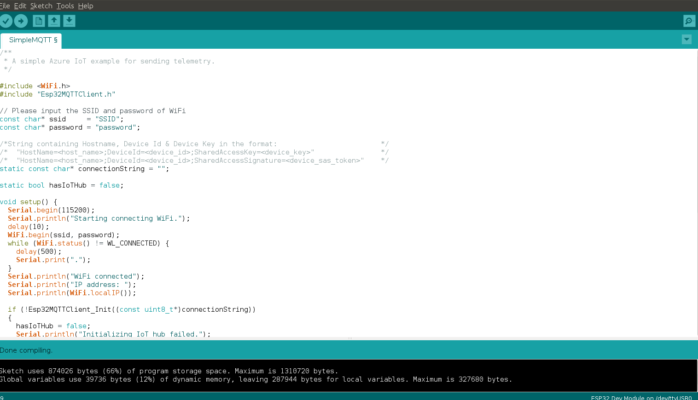

Run a simple C sample on Cavli P32-C1RM device running Arduino
===
---

# Introduction

Cavli P32-C1RM is a smart connected compute module that integrates an eSIM & comes with NB-IoT with 2G fallback and is powered by the Espressif ESP-32 MCU which provides powerful processing cores along with 2.4GHz WiFi & Bluetooth. 

This document shows the user how to run a simple MQTT example on the module to connect to an IoT Hub event that you will create. 

# What you will learn
-   How to create an IoT Hub and register a device for P32-C1RM.
-   How to connect  P32-C1RM with the sensor and your computer.
-   How to deploy sample MQTT code on your P32-C1RM to send data.

# What you will need
 
You need the following for your development environment:
-   Mac or PC that is running Windows or Ubuntu.
-   Wireless network for the Cavli P32-C1RM to connect to.
-   Internet connection to download the configuration tool.
-   [Arduino IDE](https://www.arduino.cc/en/main/software) version 1.6.8 (or newer), earlier versions will not work with the AzureIoT library.

# Create an IoT hub
1.  In the [Azure portal](https://portal.azure.com/), click Create a new resource > Internet of Things > IoT Hub.
 
2.  In the IoT hub pane, enter the following information for your IoT hub:
    **Name:** It is the name for your IoT hub. If the name you enter is valid, a green checkmark appears.
    **Pricing and scale tier**: Select the free F1 tier. This option is sufficient for this demo. See [pricing and scale tier](https://azure.microsoft.com/pricing/details/iot-hub/).
    **Resource group:** Create a resource group to host the IoT hub or use an existing one. See [Using resource groups to manage your Azure resources](https://docs.microsoft.com/en-us/azure/azure-resource-manager/resource-group-portal).
    **Location:** Select the closest location to you where the IoT hub is created.

3.  Click Create. It could take a few minutes for your IoT hub to be created. You can see progress in the Notifications pane.

4.  Once your IoT hub is created, click it from the dashboard. Make a note of the Hostname, and then click Shared access policies.

5.  In the Shared access policies pane, click the iothubowner policy, and then copy and make a note of the Connection string of your IoT hub. For more information, see [Control access to IoT Hub](https://docs.microsoft.com/en-us/azure/iot-hub/iot-hub-devguide-security).

# Register a device for Cavli P32-C1RM in your IoT hub

Every IoT hub has an identity registry that stores information about the devices that are permitted to connect to the IoT hub. Before a device can connect to an IoT hub, there must be an entry for that device in the IoT hub's identity registry.

In this section, you will use a CLI tool iothub explorer to register a device for P32-C1RM in the identity registry of your IoT hub.

> Note: iothub explorer requires Node.js 4.x or higher to work properly.

To register a device for P32-C1RM,  follow these steps:

1.  [Download](https://nodejs.org/en/download/) and install the latest LTS version of Node.js, NPM included.
2.  Install iothub explorer by using NPM.
    Windows 7 or later Start a command prompt as an administrator. Install iothub explorer by running the following command:

        npm install -g iothub-explorer

    Ubuntu 16.04 or later Open a terminal by using the keyboard shortcut Ctrl + Alt + T, and then run the following command:

        sudo npm install -g iothub-explorer

    macOS 10.1 or later Open a terminal, and then run the following command:

        npm install -g iothub-explorer

3.  Log in to your IoT hub by running the following command:

        iothub-explorer login [your iot hub connection string]

4.  Register a new device, which deviceID is new-device, and get its connection string by running the following command.

        iothub-explorer create new-device --connection-string

Make a note of the connection string of the registered device, it will be used later.

# Add serial port permissions – Ubuntu only

If you use Ubuntu, make sure a normal user has the permissions to operate on the USB port of P32-C1RM. To add serial port permissions for a normal user, follow these steps:

Run the following commands at a terminal:

    ls -l /dev/ttyUSB*

1. `ls -l /dev/ttyACM*`
    You get one of the following outputs:

    -   crw-rw---- 1 root uucp xxxxxxxx
    -   crw-rw---- 1 root dialout xxxxxxxx

2. In the output, notice uucp or dialout that is the group owner name of the USB port.

    Add the user to the group by running the following command:

        sudo usermod -a -G <group-owner-name> <username>

3. `<group-owner-name>` is the group owner name you obtained in the previous step. `<username>` is your Ubuntu user name.

4. Log out Ubuntu and log in it again for the change to take effect.

# Get the ESP32 board list 

1. In the Arduino IDE, click File > Preferences.
2. In the Preferences dialog box, click the icon next to the Additional Boards Manager URLs text box.
3. In the pop-up window, enter the following URL, and then click OK.

        https://dl.espressif.com/dl/package_esp32_index.json

4. In the Preference dialog box, click OK.
5. Click Tools > Board > Boards Manager, and then search for ESP32. 

# Install necessary libraries

1. In the Arduino IDE, click Sketch > Include Library > Manage Libraries.
2. Search for the following library names one by one. For each of the library you find, click Install.
    -   AzureIoTHub
    -   AzureIoTUtility
    -   AzureIoTProtocol_MQTT
    -   ArduinoJson
3. Cavli P32-C1RM libraries can be cloned from <https://github.com/cavli-wireless/P32C1RM-Arduino>

# Deploy the sample application Cavli P32-C1RM

1. In the Arduino IDE, click Tools > Port, and then click the serial port for Cavli P32-C1RM
2. Click Tools and make sure the following are selected

    -   Board > Select “ESP32 Dev Module”
    -   Upload Speed > “921600”
    -   CPU Frequency > “80Mz(WiFi/BT)”
    -   Flash Frequency> “80MHz”
    -   Flash Mode > “DIO”
    -   Flash Size > “2MB(16Mb)”
    -   Partition Scheme > “Default 4MB with spiffs”
    -   Core Debug Level > “None”
    -   PSRAM > “Disabled”

3. Go to File > Examples > ESP32 Azure IoT Arduino and select SimpleMQTT
4. Enter your local WiFi SSID and Password and add the Connection String you received from the previous steps.

5. Click Sketch > Upload to build and deploy the sample application to Cavli P32-C1RM.
6. When the console shows “connecting..”, hold the BOOT button and press the RESET button on the P32-C1RM. 
7. After successful upload, press the RESET button.

# Verify the sample application is running successfully

Open the Serial Monitor and check if you have received messages such as below:

# Next Steps

You have successfully connected Cavli P32-C1RM to your IoT hub and sent data to the hub. 

To explore how to store, analyze and visualize the data from your application in Azure using a variety of different services, please click on the following lessons:

-   [Manage cloud device messaging with iothub-explorer]
-   [Save IoT Hub messages to Azure data storage]
-   [Use Power BI to visualize real-time sensor data from Azure IoT Hub]
-   [Use Azure Web Apps to visualize real-time sensor data from Azure IoT Hub]
-   [Weather forecast using the sensor data from your IoT hub in Azure Machine Learning]
-   [Remote monitoring and notifications with Logic Apps]   

[Manage cloud device messaging with iothub-explorer]: https://docs.microsoft.com/en-us/azure/iot-hub/iot-hub-explorer-cloud-device-messaging
[Save IoT Hub messages to Azure data storage]: https://docs.microsoft.com/en-us/azure/iot-hub/iot-hub-store-data-in-azure-table-storage
[Use Power BI to visualize real-time sensor data from Azure IoT Hub]: https://docs.microsoft.com/en-us/azure/iot-hub/iot-hub-live-data-visualization-in-power-bi
[Use Azure Web Apps to visualize real-time sensor data from Azure IoT Hub]: https://docs.microsoft.com/en-us/azure/iot-hub/iot-hub-live-data-visualization-in-web-apps
[Weather forecast using the sensor data from your IoT hub in Azure Machine Learning]: https://docs.microsoft.com/en-us/azure/iot-hub/iot-hub-weather-forecast-machine-learning
[Remote monitoring and notifications with Logic Apps]: https://docs.microsoft.com/en-us/azure/iot-hub/iot-hub-monitoring-notifications-with-azure-logic-apps
