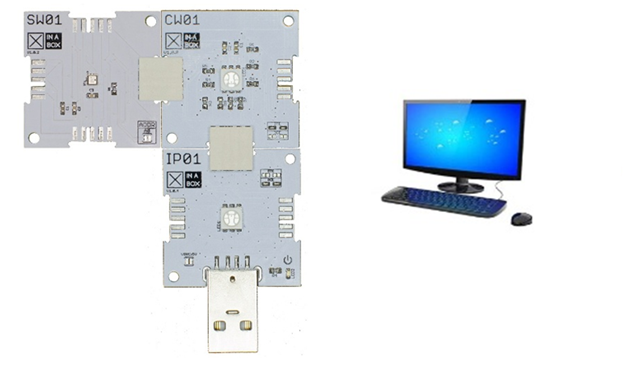
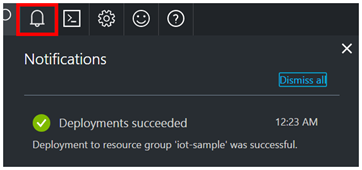
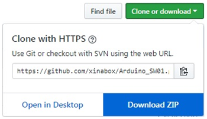
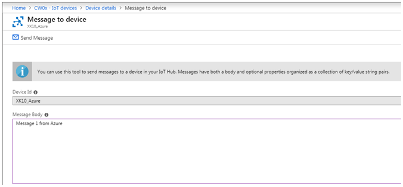

Run a simple C sample on XinaBox CW01 WiFi xChip device running Arduino
===
---

**Connect XinaBox xChip CW01 WiFi to Azure IoT Hub in the cloud**

In this tutorial, you begin by learning the basics of working with your
XinaBox CW01 WiFi and SW01 weather sensor xChips using the Arduino IDE.

You will also learn how to connect your CW01 xChip device to the Azure
cloud by using [Azure IoT Hub](https://docs.microsoft.com/en-us/azure/iot-hub/iot-hub-what-is-iot-hub).

**What you do**

Connect the XinaBox CW01 WiFi xChip to an IoT hub that you create.

Run a sample application on xChip CW01 to fetch time from the internet,
and weather data from the Bosch BME280 weather sensor xChip SW01.

This sample application will also send the collected data to your IoT
hub.

**What you learn**

-   How to create an IoT hub and register the XinaBox CW01 WiFi xChip.

-   How to connect the XinaBox CW01 WiFi xChip to your computer, and to the SW01 weather sensor xChip.

-   How to collect data from the SW01 weather sensor xChip using the provided sample application which executes in the XinaBox CW01 WiFi xChip.

-   How to send the data collected from the internet and the SW01 weather sensor xChip to your IoT hub.

**What you need**

You will require the following before proceeding:

-   An XinaBox IP01 xChip, an XinaBox CW01 xChip, and an XinaBox SW01 xChip.

-   A Computer with the latest Arduino IDE version 1.6.8 or later installed.

-   A free USB socket on your computer.

-   Access to the internet via a wireless router.

**Create an IoT hub**

1.  In the [Azure portal](https://portal.azure.com/), click **New** \> **Internet of Things** \> **IoT Hub**.

    

2.  In the **IoT hub** pane, enter the following information for your
    IoT hub:

    **Name**: The name you have chsen for your new IoT hub. If the name you enter is valid, a green check mark appears.

    **Pricing and scale tier**: Choose the free F1 tier, which is sufficient for your sample application. See [pricing and scale tier](https://azure.microsoft.com/pricing/details/iot-hub/).

    **Resource group**: Create a resource group to host the IoT hub or use an existing one. See [[Using resource groups to manage your Azure resources]](https://docs.microsoft.com/en-us/azure/azure-resource-manager/resource-group-portal).

    **Location**: Choose a location closest to your location.

    **Pin the dashboard**: Check this option for easy access to your IoT hub from the dashboard.

    

3.  Click **Create**. It could take a few minutes for your IoT hub to be created. You can see progress in the **Notifications** pane.

    

4.  Once your IoT hub is created, click it from the dashboard. Make a note of the **Hostname**, and then click **Shared access policies**.

    

5.  In the **Shared access policies** pane, click the **iothubowner** policy, and then copy and make a note of the **Connection string** of your IoT hub. For more information, see [Control access to IoT Hub](https://docs.microsoft.com/en-us/azure/iot-hub/iot-hub-devguide-security).

    

**Register a device in the IoT hub for the your device**

1.  In the [Azure portal](https://portal.azure.com/), open your IoT hub.

2.  Click **IoT devices under Explorers**.

3.  In the Device Explorer pane, click **Add** to add a device to your
    IoT hub.

    

    

4.  Add the following details.

    **Device ID:** The ID of the new device.

    **Authentication Type:** Select Symmetric Key.

    **Auto Generate Keys:** Check this field.

    **Connect device to IoT Hub:** Click Enable.

5.  Click **Save**.

6.  After the device is created, open the device in the **IoT devices
    Explorer** pane.

    

7.  Make a note of the primary key of the connection string.

**Prepare the Arduino IDE for the XinaBox xChips**

**Note: Where Arduino installs things**

On Linux machines, Arduino typically installs the folder referred to as
the \"app\" folder in /home/\<username\>/Sketchbook.

On Mac and Windows machines, Arduino typically installs the folder
referred to as the \"app\" folder in \"Arduino\" in your Documents
folder.

Libraries are typically installed in a \"libraries\" folder within your
\"app\" folder.

You can view the location of your \"app\" folder by navigating to
\"**File-\>Preferences**\" .

 

**Install support for the ESP8266, this installation will include
support for the CW01**

1.  Open the Arduino IDE.

2.  Open \"**File-\>Preferences**\" and add the following url text
    string to the \"**Additional Boards Manager URLs:**\" text box and
    click OK.

    

3.  Open \"**Tools-\>Board: xxx -\>Boards Manager**\" and type
    \"esp8266\" in the search dialog in order to find the ESP8266
    package. If it is not installed, select the install button.

    

**Install support for the ESP8266, this installation will include
support for the ESP8266 on the xChip CW01**

1.  Browse to \"<https://github.com/xinabox/xCore>\" and select the
    \"clone or download\" drop down box.

    

2.  Select the \"**Download ZIP**\" button, and save the file in a
    folder of your choosing.

3.  Select **Sketch-\>Include Library-\>Add .ZIP Library**, and select
    the ZIP file saved in the previous step.

    

**Install support for XinaBox xChips**

1.  Browse to \"<https://github.com/xinabox/Arduino_SW01>\" and select
    the \"clone or download\" drop down box.

    

2.  Select the \"**Download ZIP**\" button, and save the file in a folder of your choosing.

3.  Select **Sketch-\>Include Library-\>Add .ZIP Library**, and select the ZIP file saved in the previous step.

    

**Install all the required Arduino libraries**

1.  In the Arduino IDE, click **Sketch** \> **Include
    Library** \> **Manage Libraries**.

2.  Search for the following library names one by one. For each library
    that you find, click **Install**.

3.  NTPClient

    

4.  AzureIoTHub

    

5.  AzureIoTUtility

    

6.  AzureIoTProtocol\_MQTT

    

7.  ArduinoJson - install version 5.13.2

    

**Connect the XinaBox Wifi xChip CW01 and sensor xChip SW01 to your
computer**

Make sure your XinaBox xChips are arranged as follows.

Plug the XinaBox IP01 xChip, with xChip CW01 and xChip SW01 connected as
above, into a USB port on your computer.

**Collect sensor data and send it to your IoT hub**

In this section, you use the Arduino IDE to open, verify, and load a
sample application onto the XinaBox WiFi xChip CW01.

The application collects time data off an internet time server, and data
from the XinaBox sensor xChip SW01, once every 30 seconds, and then
sends the data to your IoT hub.

**Download the sample application from GitHub and load it into the
Arduino IDE**

The XinaBox sample application is hosted on GitHub.

Clone the sample repository from GitHub that contains the sample
application.

To clone the sample repository, follow these steps:

1.  Open a command prompt or a terminal window.

2.  Go to a folder where you want the sample application to be saved.

3.  Run the following command:

        git clone https://github.com/Azure-Samples/iot-hub-xinabox-cw01-client-app.git

4.  In the Arduino IDE, open \"**File-\>Open**\" and navigate to the
    folder which contains the sample application.

5.  Open the app.ino file of the sample application.

    

**Don't have a real BME280 sensor?**

The sample application can simulate temperature and humidity data in
case you don't have a real SW01(BME280) sensor. To set up the sample
application to use simulated data, follow these steps:

1.  Open the config.h file in the app folder.

2.  Locate the following line of code and change the value
    from false to true:

        define SIMULATED\_DATA true

    

3.  Save the file with Control-S.

**Deploy the sample application to the XinaBox CW01 WiFi xChip**

1.  In the Arduino IDE, click **Tool** \> **Port**, and then select the serial port for the CW01 xChip.

2.  Click **Sketch** \> **Upload** to build and deploy the sample application to the CW01 xChip.

**Enter your credentials**

After the upload completes successfully, follow these steps to enter
your credentials:

1.  In the Arduino IDE, click **Tools** \> **Serial Monitor**.

2.  In the serial monitor window, notice the two drop-down lists in the lower-right corner.

3.  Select **No line ending** for the left drop-down list at the bottom of the monitor dialog.

4.  Select **74880 baud** for the right drop-down list list at the bottom of the monitor dialog.

    

5.  In the input box located at the top of the serial monitor window, enter the following information if you are asked to provide them, and then click **Send**.

    -   Wi-Fi SSID

    -   Wi-Fi password

    -   Device connection string

    

**Note:** The credentials information you provide when the app
initializes is stored in the EEPROM of the CW01 xChip. Every time the
app restarts, it enquires about whether you wish to re-enter
credentials. If you wish to change your credentials for any reason,
enter Y within the 15 second waiting period, and the device will request
your WiFi-SSID, WiFi-password, and Azure IoT hub device connection
string. If you do not wish to re-enter your credential, enter N or wait
for the request to timeout and continue with the stored credentials.

**Verify the sample application is running successfully**

If you see the following output from the serial monitor window, the
sample application is running successfully.

Note that the message log below includes messages sent from the xChip
CW01 device to Azure, and also 5 messages sent

from Azure to the xChip CW01 device. These are the highlighted messages
in the image below.

The following image shows how the message was sent from the
**Device->Message to device** menu in Azure.

## Next steps

You have successfully connected an XinaBox CW01 xChipt to the Azure IoT
hub you created, and sent the captured sensor data to your IoT hub.

You have now learned how to run a sample application that collects
sensor data and sends it to an Azure IoT hub. To explore how to store,
analyze and visualize the data from this application in Azure using a
variety of different services, please click on the following lessons:

-   [Manage cloud device messaging with iothub-explorer](https://docs.microsoft.com/en-us/azure/iot-hub/iot-hub-explorer-cloud-device-messaging)

-   [Save IoT Hub messages to Azure data storage](https://docs.microsoft.com/en-us/azure/iot-hub/iot-hub-store-data-in-azure-table-storage)

-   [Use Power BI to visualize real-time sensor data from Azure IoT Hub](https://docs.microsoft.com/en-us/azure/iot-hub/iot-hub-live-data-visualization-in-power-bi)

-   [Use Azure Web Apps to visualize real-time sensor data from Azure IoT Hub](https://docs.microsoft.com/en-us/azure/iot-hub/iot-hub-live-data-visualization-in-web-apps)

-   [Weather forecast using the sensor data from your IoT hub in Azure Machine Learning](https://docs.microsoft.com/en-us/azure/iot-hub/iot-hub-weather-forecast-machine-learning)

-   [Remote monitoring and notifications with Logic Apps](https://docs.microsoft.com/en-us/azure/iot-hub/iot-hub-monitoring-notifications-with-azure-logic-apps)
