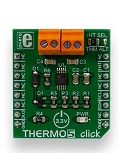

CEC1702 IoT Development Kit running no OS
===
---

# Table of Contents

-   Instructions for using this template
-   CEC1702 IoT Development kit
-   Connect the sensors
-   Build and Run the sample
-   Send Device Events to IoT Hub
-   Receive messages from IoT Hub
-   Next steps

# CEC1702 IoT Development Kit

The CEC1702 IoT Development Kit includes:

-   CEC1x02DevBoard with DICE capable CEC1702 device
-   Mikroe Wifi7 Click module with ATWINC1500 wifi chip
-   Mikroe Thermo5 Click module with EMC1414 Temperature sensor

# Connect the sensors

The CEC1702 IoT Development Kit includes a mikroe Thermo5 click module which has EMC1414 Temperature sensor from Microchip. The click module is plugged into MIKROBUS2 slot on the CEC1x02Devloment Board as shown below

For temperature measurement using external diode on Thermo5 Clicker board an external diode needs to be connected. Please refer section ***External diode connections*** in the sensor [datasheet](http://ww1.microchip.com/downloads/en/DeviceDoc/20005274A.pdf) for more information

# Build and Run the sample

### Build and download the code

1.  Download the [devBoard\_Azure\_IoT\_build](https://www.microchip.com/SWLibraryWeb/product.aspx?product=CEC1702_AZURE_IOT) package. This package contains all the required drivers to use with the CEC1x02 devBoard board with Winc1500 clicker board, together with pre-integrated Microsoft Azure IoT C SDK.

     The project uses mbedTLS as the TLS stack, which has been added to the project as a library:
     `Src/APP/framework/mbedTLS/mbedtls.X/dist/default/production/mbedtls.X.a`

2.  Extract the contents of the downloaded zip file: **CEC1702\_azure\_mplabx\_build\_0600.zip**

    Clear the ***Readonly*** attribute for the project folder
    -   Right click the project folder  and Select ***Properties***
    -   In the General tab, clear the Read-Only attribute and select Apply
    -   Select ***Apply changes to this folder, subfolder and files*** and click OK

3.  Open MPLAB X Project

    -   In MPLAB X IDE, Select ***Open Project*** from the File Menu
    -   Navigate to the downloaded CEC1702 DICE-RIoT project and open the MPLABX project **devBoard\_diceRIoT\_MPLABX.X**

4.  The DPS client application is **prov\_dev\_client\_ll\_sample.c**. It uses HTTPS as the transport for communicating to DPS server and MQTT as transport for communicating with AZURE IOT hub.

     `Src\APP\apps\ prov_dev_client_ll_sample.c`

    The certificates and keys required for authentication is generated through DICE (Device Identification Composition Engine)

    For testing purpose the UDS (Unique Device Secret) for the device, uses a test value hardcoded in dps_hsm_riot.c

        static unsigned char g_uds_seed[DICE_UDS_LENGTH] = { 
        0x54, 0x10, 0x5D, 0x2E, 0xCD, 0x07, 0xF9, 0x01,    
        0x99, 0xB3, 0x95, 0xC7, 0x42, 0x61, 0xA0, 0x8C, 
        0xFF, 0x27, 0x1A, 0x0D, 0xF6, 0x6F, 0x1F, 0xE0,
        0x00, 0x34, 0xBB, 0x11, 0xF7, 0x98, 0x9A, 0x12 };

        Src\APP\framework\azure\dps_client\adapters\dps_hsm_riot.c

    
    Later when you want to use the UDS value from efuse, you can comment the macro USE\_TEST\_UDS in dps\_hsm\_riot.c.

    See CEC1702.ld in project folder for the linker file memory layouts

    `devBoard\_diceRIoT\_MPLABX.X/CEC1702.ld`

5.  Update your Device Provisioning Service ID Scope in **prov\_dev\_client\_ll\_sample.c** line 37

    For example, if Device Provisioning Service ID is 0ne000000A9

        static const char* id_scope = "0ne000000A9";

    The ID scope value is used to identify Registration IDs. This value is retrieved from your DPS dashboard in Azure portal.

6.  Wifi Configuration - Currently the code is configured to connect through WPA-PSK. The SSID and password are set statically in winc1500_connect.c , modify these values to match your wifi router

    `Src\APP\platform\winc\winc1500_connect.c`

         #define CONN_SSID                    "TP-LINK_9746"
         #define CONN_PSK_PWD                    "69651946"

7.  Select ***Clean and Build for Debugging*** option 

    

8.  Connect the ICD4 using JTAG cable and power up the board. Next select Debug and Click Debug Project. MPLABX would detect the ICD4 automatically and start the debug session

    

    

### View the UART Traces

To view the UART traces, it is recommended to download and install [MCP2221 driver for USB to UART](http://ww1.microchip.com/downloads/en/DeviceDoc/MCP2221 Windows Driver 2014-10-09.zip)
Follow the below steps to use ComXDBG.exe

1.  Connect USB cable between devBoard board and Windows host 

2.  After driver installation, start `ComXDBG.exe` 

     `utilities\ ComEDBG \ ComXDBG.exe`

3.  Select port with **VID:PID** as **04D8:00DD**. For example; for the displayed options (in below snapshot) we would enter 0

    ![CEC1702]media/cec1702-iot-development-kit/6.png)

4.  You should be able to view UART traces from the devBoard board
Alternatively, you can use your serial terminal (e.g. TeraTerm for Windows) with the following parameters:

   -   BaudRate : 115200
   -   Data : 8-bit
   -   Parity : None
   -   Stop : 1 bit
   -   Flow Control : None

### Deriving the X.509 certificate

1.  The alias certificate is displayed on the serial terminal, after the following the text:

    RIOT: Alias Certificate

    Example:

        -----BEGIN CERTIFICATE-----
        MIIBdTCCARugAwIBAgIFDg0MCwowCgYIKoZIzj0EAwIwNDESMBAGA1UEAwwJcmlvdC1yb290MQswCQYDVQQGDAJVUzERMA8GA1UECgwITVNSX1RFU1QwHhcNMTcwMTAxMDAwMDAwWhcNMzcwMTAxMDAwMDAwWjA7MRkwFwYDVQQDDBByaW90LXNpZ25lci1jb3JlMQswCQYDVQQGDAJVUzERMA8GA1UECgwITVNSX1RFU1QwWTATBgcqhkjOPQIBBggqhkjOPQMBBwNCAAR2C/Fa9fotRGPpEN91dRjfT7iHPyBnpx/blWJ9CFvfA+65lPGvT2cuyVRh0XjaoDpWwhSPV/KbqYu/YrpqAu+9oxMwETAPBgNVHRMECDAGAQH/AgEBMAoGCCqGSM49BAMCA0gAMEUCIQDFhqlOoamzbIz/1NUWm2njxwjDcxM/uSOw8fc2iUkEEwIgBl2wjtTF2TXnWfN8wTj/vHRysR3lK6mit4JjvO9C0oE=

        -----END CERTIFICATE-----

2.  Copy the text from ***BEGIN CERTIFICATE*** to ***END CERTIFICATE*** to a text editor file. 
Remove the time stamps and leading spaces; and save with .pem extension. 

3.  Provision this alias certificate .pem file in your DPS dashboard in Azure Portal 

    See [Provision device to Hub tutorial](https://docs.microsoft.com/en-us/azure/iot-dps/tutorial-provision-device-to-hub) for provisioning your device using enrollment lists. Follow instructions for X.509 based devices using Individual Enrollment.

    **Note:** When you enroll your device, your device enrollment entry name will be **riot-device-3-cert**. This is changeable using the **DEVICE\_COMMON\_NAME** macro in *dps\_hsm\_riot.c* (line 28)

        #define DEVICE_COMMON_NAME          "riot-device-3-cert"

        #ifndef USE_TEST_UDS
        #define RIOT_COMMON_NAME            DEVICE_COMMON_NAME
        #else
        #define RIOT_COMMON_NAME            "riot-device-test-cert"
        #endif

**Power cycle the device**

Once the alias certificate is updated for the device; on the next power-on and debug session, the device should be able to connect to the Azure IoT hub

# Send Device Events to IoT Hub

See [Device Explorer](https://github.com/fsautomata/azure-iot-sdks/blob/master/tools/DeviceExplorer/doc/how_to_use_device_explorer.md) to learn how to observe the messages IoT Hub receives from the device.

You should be able to see the temperature readings from the Thermo5 Clicker board.

# Receive messages from Azure IoT Hub

See [Device Explorer](https://github.com/fsautomata/azure-iot-sdks/blob/master/tools/DeviceExplorer/doc/how_to_use_device_explorer.md) to learn how to send cloud-to-device messages from IoT hub.

-   Select the **‘Messages to Device’** tab in Device Explorer tool to **send** messages to your device
-   Select your device in drop-down and type the message you want to send as key-value pair
-   Click on Send
-   Example message: *{“led":“on”}*

This message should turn ON the RGB led on the board. The received messages are displayed in the serial terminal.

# Debugging connection failure

1.  Ensure the you have updated the wifi details correctly
2.  Ensure the MQTT port 8883 is not blocked in your network
3.  Ensure the device certificate is captured correctly from serial terminal and provisioned in Azure dashboard

# Next Steps

-   [Manage cloud device messaging with iothub-explorer](https://docs.microsoft.com/en-us/azure/iot-hub/iot-hub-explorer-cloud-device-messaging)
-   [Save IoT Hub messages to Azure data storage](https://docs.microsoft.com/en-us/azure/iot-hub/iot-hub-store-data-in-azure-table-storage)
-   [Use Power BI to visualize real-time sensor data from Azure IoT Hub](https://docs.microsoft.com/en-us/azure/iot-hub/iot-hub-live-data-visualization-in-power-bi)
-   [Use Azure Web Apps to visualize real-time sensor data from Azure IoT Hub](https://docs.microsoft.com/en-us/azure/iot-hub/iot-hub-live-data-visualization-in-web-apps)
-   [Weather forecast using the sensor data from your IoT hub in Azure Machine Learning](https://docs.microsoft.com/en-us/azure/iot-hub/iot-hub-weather-forecast-machine-learning)
-   [Remote monitoring and notifications with Logic Apps](https://docs.microsoft.com/en-us/azure/iot-hub/iot-hub-monitoring-notifications-with-azure-logic-apps)
-   [Device management with iothub-explorer](https://docs.microsoft.com/en-us/azure/iot-hub/iot-hub-device-management-iothub-explorer)

**Note:** For your application to support Device Management (DM), you will need to make additional changes that are not covered in this document. We suggest that you look at the DM tutorial, to understand how you can add DM support to your application. However, if you do not modify your application accordingly, then you should not provide links to this tutorial.
