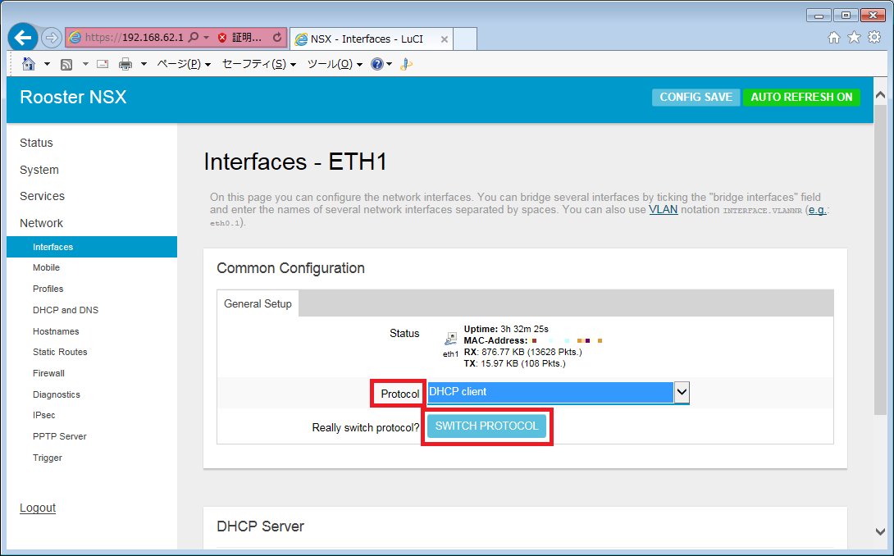
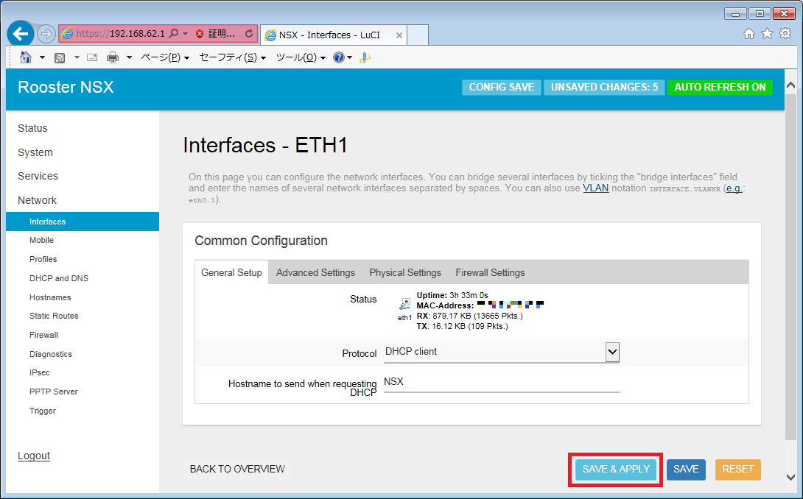
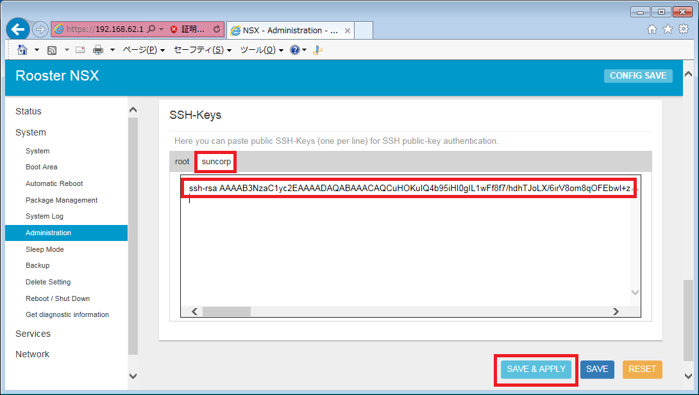

Run a simple JAVA sample on Rooster NSX7000 device running Custom Linux
===
---

# Table of Contents

-   [Introduction](#Introduction)
-   [Step 1: Prerequisites](#Prerequisites)
-   [Step 2: Prepare your Device](#PrepareDevice)
-   [Step 3: Build and Run the Sample](#Build)
-   [Next Steps](#NextSteps)

# Introduction
---

**About this document**

This document describes how to connect Rooster NSX7000 device running Custom Linux with Azure IoT SDK. This multi-step process includes:

-   Configuring Azure IoT Hub
-   Registering your IoT device
-   Build and deploy Azure IoT SDK on device

# Step 1: Prerequisites

You should have the following items ready before beginning the process:  
-   [Prepare your development environment](https://github.com/Azure/azure-iot-device-ecosystem/blob/master/get_started/java-devbox-setup.md)
-   [Setup your IoT hub](https://github.com/Azure/azure-iot-device-ecosystem/blob/master/setup_iothub.md)
-   [Provision your device and get its credentials](https://github.com/Azure/azure-iot-device-ecosystem/blob/master/manage_iot_hub.md)
-   [Rooster NSX7000 device](http://www.sun-denshi.co.jp/sc/nsx7000/)
-   Install [TeraTerm](https://ttssh2.osdn.jp/index.html.en) on your development environment in order to connect Rooster NSX7000 using ssh

# Step 2: Prepare your Device

## 2.1 Connect power supply and ethernet cables
1.  Connect the power supply to your Rooster NSX7000 device.
2.  Connect ethernet cable to your computer and to eth0 port of your Rooster NSX7000 device.
3.  Connect another ethernet cable to your Rooster NSX7000 device eth1 port to access the Internet.

## 2.2 Configure your computer in order to connect Rooster NSX7000 device using web browser

1.  Set your computer's IP address 192.168.62.100 and subnetmask 255.255.255.0.
2.  Login to your Rooster NSX7000 device using web browser to the IP: 192.168.62.1.

## 2.3 Configure network interface of Rooster NSX7000 device

-   Configure an interface of your Rooster NSX7000 device in order to access the Internet.  Following pictures show a sample to configure eth1 as a DHCP client. If you need another samples for network interface settings, visit [our web site (written by Japanese)](https://www2.sun-denshi.co.jp/config-example/?cat=48&tag=).

-   Open the [network configuration](https://192.168.62.1/cgi-bin/luci/admin/network/network)  page of your Rooster NSX7000 device, then click "[EDIT]" of ETH1.
 
     

-   Select "DHCP client" for "Protocol", then click "[SWITCH PROTOCOL]".
 
     

-   Click "[SAVE & APPLY]".
 
    

## 2.4 Configure SSH Access of Rooster NSX7000 device

-   Configure [SSH Access](https://192.168.62.1/cgi-bin/luci/admin/system/admin) in order to copy samples to your Rooster NSX7000 device from your development environment and in order to run them.

-    Run the following commands on your development environment to generate authentication key.

      ssh-keygen -t rsa -b 4096

-   Open the [Administration page](https://192.168.62.1/cgi-bin/luci/admin/system/admin) to configure SSH Access.
    -   Scroll down the page and show "Dropbear Instance" section.
    -   Cofigure the following settings.
    -   Enable ssh server: `On`(checked)
    -   Interface: Select `eth0`
    -   Password authentication: `Off`(unchecked)
    -   Allow root logins with password: `Off`(unchecked)
 
       

    -   Scroll down the page and show "SSH-Keys" section.
    -   Select "[suncorp]" tab, then paste your public key generated on your development environment. Don't forget to click "[SAVE & APPLY]".
  
      

## 2.5 Confirm Java package is installed

-   Make sure Java package(oracle-java-compact2) is installed on your Rooster NSX7000 device.

-   Open the [Package Management page](https://192.168.62.1/cgi-bin/luci/admin/system/package).
    -   Scroll down the page and show "Package List" section.
    -   Confirm "oracle-java-compact2" package is shown in the Package List.

  

# Step 3: Build SDK and Run the sample

## 3.1 Build the Azure IoT Device SDK for Java
Run the following commands on your development environment in sequence to build Azure IoT SDK [after you have prepared your development environment](https://github.com/Azure/azure-iot-device-ecosystem/blob/master/get_started/java-devbox-setup.md) in Step 1.

    cd ~/azure-iot-sdk-java/device/iot-device-samples
    mvn install -DskipTests | tee JavaSDK_Build_skipTests_Logs.txt

## 3.2 Copy the Samples to Rooster NSX7000 device
Run the following commands on your development environment in order to copy the samples to your Rooster NSX7000 device.

    cd ~/azure-iot-sdk-java/device/iot-device-samples/send-event/target
    scp send-event-{version}-with-deps.jar suncorp@192.168.62.1:/home/suncorp
    cd ~/azure-iot-sdk-java/device/iot-device-samples/handle-messages/target
    scp handle-messages-{version}-with-deps.jar suncorp@192.168.62.1:/home/suncorp

## 3.3 Run and Validate the Samples

### 3.3.1 Connect the Device

-   Connect your Rooster NSX7000 device with TeraTerm using ssh.

### 3.3.2 Send Device Events to IoT Hub

-   Navigate to the folder containing the executable JAR file for send event sample
and set `java_runtime` variable.

      cd $HOME
      java_runtime=/app/package/java-runtime/bin/java

-   Run the sample by issuing following command.

    **If using AMQPS protocol:**
  
        ${java_runtime} -jar ./send-event-{version}-with-deps.jar "{connection string}" "{number of requests to send}" "amqps"

    **If using HTTPS protocol:**
    
       ${java_runtime} -jar ./send-event-{version}-with-deps.jar "{connection string}" "{number of requests to send}" "https"

    **If using MQTT protocol:**

        ${java_runtime} -jar ./send-event-{version}-with-deps.jar "{connection string}" "{number of requests to send}" "mqtt"

    **If using Web Sockets with AMQPS protocol:**
    
        ${java_runtime} -jar ./send-event-{version}-with-deps.jar "{connection string}" "{number of requests to send}" "amqps_ws"

  Replace the following in above command:  
  `{version}`: Version of binaries you have build  
  `{connection string}`: Your device connection string  
  `{number of requests to send}`: Number of messages you want to send to IoT Hub  

-   See [Manage IoT Hub](https://github.com/Azure/azure-iot-device-ecosystem/blob/master/manage_iot_hub.md) to learn how to observe the messages IoT Hub receives from the application.

### 3.2.2 Receive messages from IoT Hub
-   Navigate to the folder containing the executable JAR file for the receive message sample
and set `java_runtime` variable.

      cd $HOME
      java_runtime=/app/package/java-runtime/bin/java

-   Run the sample by issuing following command.

    **If using AMQPS protocol:**
  
        ${java_runtime} -jar ./handle-messages-{version}-with-deps.jar "{connection string}" "amqps"

    **If using HTTPS protocol:**

        ${java_runtime} -jar ./handle-messages-{version}-with-deps.jar "{connection string}" "https"

    **If using MQTT protocol:**

        ${java_runtime} -jar ./handle-messages-{version}-with-deps.jar "{connection string}" "mqtt"

    **If using Web Sockets with AMQPS protocol:**

        ${java_runtime} -jar ./handle-messages-{version}-with-deps.jar "{connection string}" "amqps_ws"

      Replace the following in above command:  
     `{version}`: Version of binaries you have build  
     `{connection string}`: Your device connection string  
     `{number of requests to send}`: Number of messages you want to send to IoT Hub

-   See [Manage IoT Hub](https://github.com/Azure/azure-iot-device-ecosystem/blob/master/manage_iot_hub.md) to learn how to send cloud-to-device messages to the application.

# Next Steps
---
You have now learned how to run a sample application that collects sensor data and sends it to your IoT hub. To explore how to store, analyze and visualize the data from this application in Azure using a variety of different services, please click on the following lessons:

- [Manage cloud device messaging with iothub-explorer](https://docs.microsoft.com/en-us/azure/iot-hub/iot-hub-explorer-cloud-device-messaging)
- [Save IoT Hub messages to Azure data storage](https://docs.microsoft.com/en-us/azure/iot-hub/iot-hub-store-data-in-azure-table-storage)
- [Use Power BI to visualize real-time sensor data from Azure IoT Hub](https://docs.microsoft.com/en-us/azure/iot-hub/iot-hub-live-data-visualization-in-power-bi)
- [Use Azure Web Apps to visualize real-time sensor data from Azure IoT Hub](https://docs.microsoft.com/en-us/azure/iot-hub/iot-hub-live-data-visualization-in-web-apps)
- [Weather forecast using the sensor data from your IoT hub in Azure Machine Learning](https://docs.microsoft.com/en-us/azure/iot-hub/iot-hub-weather-forecast-machine-learning)
- [Remote monitoring and notifications with Logic Apps](https://docs.microsoft.com/en-us/azure/iot-hub/iot-hub-monitoring-notifications-with-azure-logic-apps)

[Manage cloud device messaging with iothub-explorer]: https://docs.microsoft.com/en-us/azure/iot-hub/iot-hub-explorer-cloud-device-messaging
[Save IoT Hub messages to Azure data storage]: https://docs.microsoft.com/en-us/azure/iot-hub/iot-hub-store-data-in-azure-table-storage
[Use Power BI to visualize real-time sensor data from Azure IoT Hub]: https://docs.microsoft.com/en-us/azure/iot-hub/iot-hub-live-data-visualization-in-power-bi
[Use Azure Web Apps to visualize real-time sensor data from Azure IoT Hub]: https://docs.microsoft.com/en-us/azure/iot-hub/iot-hub-live-data-visualization-in-web-apps
[Weather forecast using the sensor data from your IoT hub in Azure Machine Learning]: https://docs.microsoft.com/en-us/azure/iot-hub/iot-hub-weather-forecast-machine-learning
[Remote monitoring and notifications with Logic Apps]: https://docs.microsoft.com/en-us/azure/iot-hub/iot-hub-monitoring-notifications-with-azure-logic-apps
[setup-devbox-linux]: https://github.com/Azure/azure-iot-device-ecosystem/blob/master/get_started/java-devbox-setup.md
[lnk-setup-iot-hub]: ../../setup_iothub.md
[lnk-manage-iot-hub]: ../../manage_iot_hub.md
