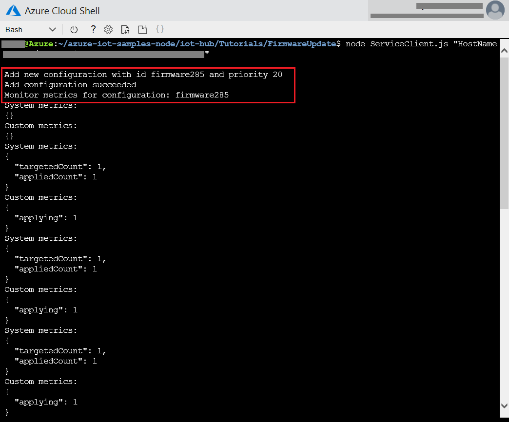
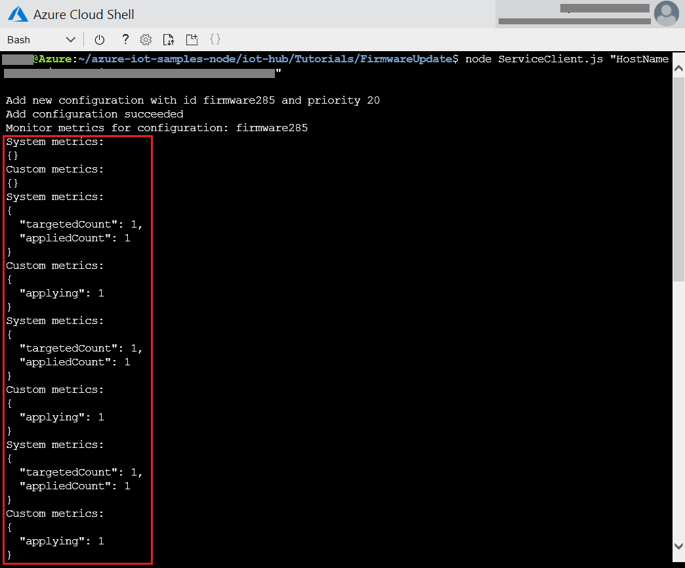
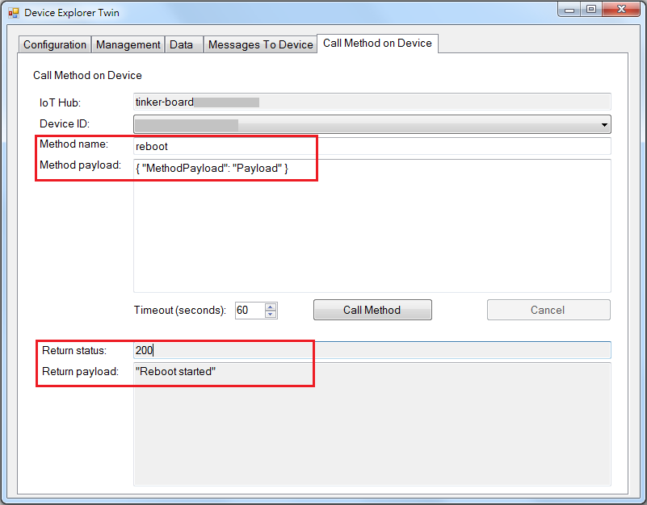

Run a simple NodeJS sample on Tinker Board S device running Debian 9
===
---

# Table of Contents

-   [Introduction](#Introduction)
-   [Step 1: Prerequisites](#Prerequisites)
-   [Step 2: Prepare your Device](#PrepareDevice)
-   [Step 3: Manual Test for Azure IoT Edge on device](#Manual)

# Introduction

**About this document**

This document describes how to connect Tinker Board S device running Debian 9 with Azure IoT Edge Runtime pre-installed and Device Management. This multi-step process includes:

-   Configuring Azure IoT Hub
-   Registering your IoT device
-   Build and Deploy client component to test device management capability 

# Step 1: Prerequisites

You should have the following items ready before beginning the process:

-   [Prepare your development environment][setup-devbox-linux]
-   [Setup your IoT hub](https://account.windowsazure.com/signup?offer=ms-azr-0044p)
-   [Provision your device and get its credentials][lnk-manage-iot-hub]
-   [Sign up to IOT Hub](https://account.windowsazure.com/signup?offer=ms-azr-0044p)
-   [Add the Edge Device](https://docs.microsoft.com/en-us/azure/iot-edge/quickstart-linux)
-   [Add the Edge Modules](https://docs.microsoft.com/en-us/azure/iot-edge/quickstart-linux#deploy-a-module)
-   Tinker Board S device

# Step 2: Prepare your Device

-   [Setup Tinker Board S device](https://tinkerboarding.co.uk/wiki/index.php/Main_Page)
-   Internet access is required during installation.
-   Install node.js for Debian stretch from [nodejs.org](https://nodejs.org/)

# Step 3: Manual Test for Azure IoT Edge on device

This section walks you through the test to be performed on the Edge devices running the Linux operating system such that it can qualify for Azure IoT Edge certification.

## 3.1 Edge RuntimeEnabled (Mandatory)

**Details of the requirement:**

The following components come pre-installed or at the point of distribution on the device to customer(s):

-   Azure IoT Edge Security Daemon
-   Daemon configuration file
-   Moby container management system
-   A version of `hsmlib` 

*Edge Runtime Enabled:*

**Check the iotedge daemon command:** 

Open the command prompt on your IoT Edge device , confirm that the Azure IoT edge Daemon is under running state

    systemctl status iotedge

 

Open the command prompt on your IoT Edge device, confirm that the module deployed from the cloud is running on your IoT Edge device

    sudo iotedge list

  

On the device details page of the Azure, you should see the runtime modules - edgeAgent, edgeHub and tempSensor modueles are under running status

 

## 3.2 Device Management (Mandatory)

**Pre-requisites:** Device Connectivity.

**Description:** A device that can perform basic device management operations (Reboot and Firmware update) triggered by messages from IoT Hub.

## 3.2.1 Firmware Update (Using Microsoft SDK Samples):

Download the sample Node.js project from https://github.com/Azure-Samples/azure-iot-samples-node/archive/master.zip and extract the ZIP archive.

To run the simulated device application, open a shell or command prompt window and navigate to the **iot-hub/Tutorials/FirmwareUpdate** folder in the Node.js project you downloaded. Then run the following commands:

    npm install
    node SimulatedDevice.js "{your device connection string}"

To run the back-end application, open another shell or command prompt window. Then navigate to the **iot-hub/Tutorials/FirmwareUpdate** folder in the Node.js project you downloaded. Then run the following commands:

    npm install
    node ServiceClient.js "{your service connection string}"

IoT device client will get the message and report the status to the device twin.

 

**Update firmware**

The following screenshot shows the output from the back-end application and highlights how it creates the configuration to update the firmware desired properties:

 

The following screenshot shows the output from the back-end application and highlights how it monitors the firmware update metrics from the simulated device:

 

## 3.2.2 Reboot (Using Microsoft SDK Samples):

Follow the [Get started with device management (Node)](https://docs.microsoft.com/en-us/azure/iot-hub/iot-hub-node-node-device-management-get-started) to get the source files.

**dmpatterns_getstarted_device.js**, which connects to your IoT hub with the device identity created earlier, receives a reboot direct method, simulates a physical reboot.

**dmpatterns_getstarted_service.js**, which calls a direct method in the simulated device app, displays the response, and displays the updated reported properties.

Trigger **Tinekr Board S** to reboot and get the last reboot time.

  

IoT device client will get the message and report the status to the device twin.

 

Or you can trigger device to reboot by [Device Explorer](https://github.com/Azure/azure-iot-sdk-csharp/blob/master/tools/DeviceExplorer/doc/how_to_use_device_explorer.md).

Confirm the IoT hub, Device ID, method name as below:

-   Press “call Method” button
-   Check the returning status as below:

 

  
## 3.3.3 Firmware Update (Modified SDK samples/Custom made application):

If the Client components are custom made please add the steps to execute the Firmware Update through Device Twin.

**Note**: Client Components must be shipped with the device 

## 3.3.4 Reboot (Modified SDK samples/Custom made application):

If the Client components are custom made please add the steps to execute the Device Reboot through Direct Methods

**Note**: Client Components must be shipped with the device 

[setup-devbox-linux]: https://github.com/Azure/azure-iot-sdk-c/blob/master/doc/devbox_setup.md
[lnk-setup-iot-hub]: ../setup_iothub.md
[lnk-manage-iot-hub]: ../manage_iot_hub.md
