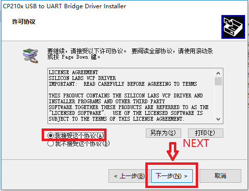
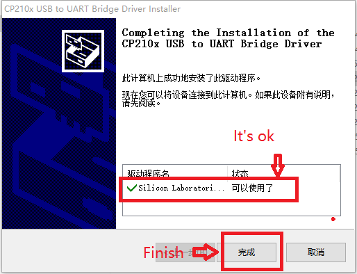
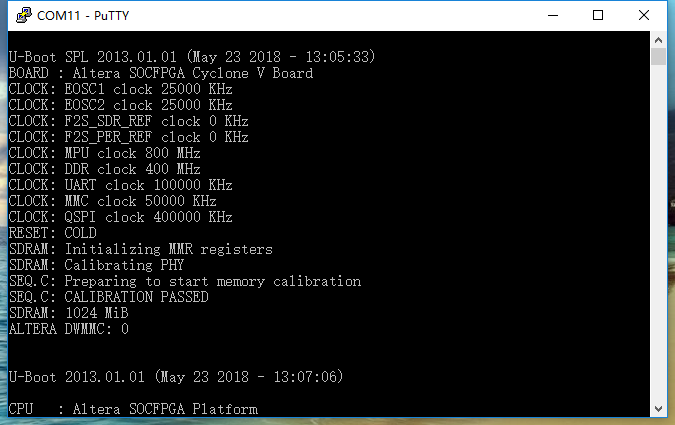
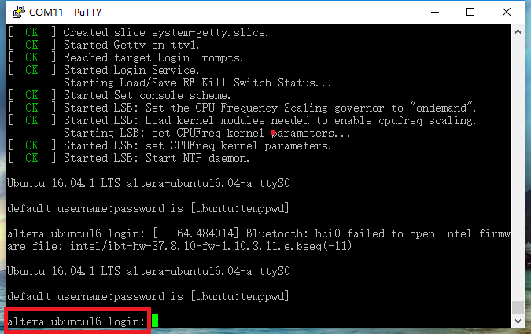
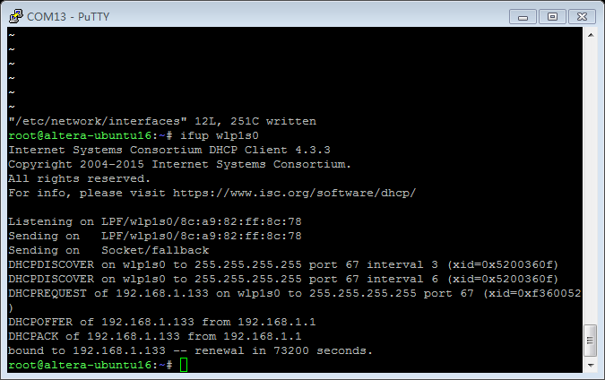
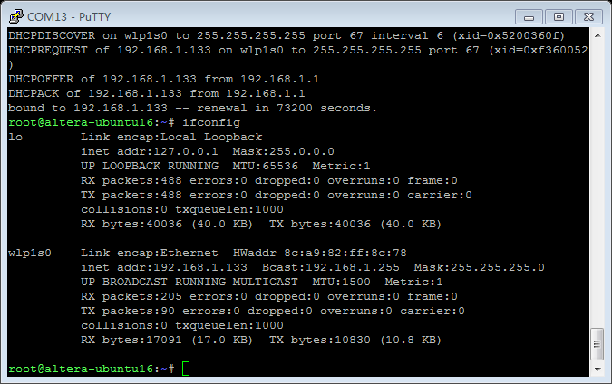

Run a simple C sample on Energy Gateway device running Ubuntu 16.04 LTS 32-bit
===
---

# Table of Contents

-   [Introduction](#Introduction)
-   [Step 1: Prerequisites](#Prerequisites)
-   [Step 2: Prepare your Device](#PrepareDevice)
-   [Step 3: Manual Test for Azure IoT Edge on device](#Manual)

# Introduction

**About this document**

This document describes how to connect Energy Gateway device running Ubuntu 16.04 LTS 32-bit with Azure IoT Edge Runtime pre-installed and Device Management. This multi-step process includes:

-   Configuring Azure IoT Hub
-   Registering your IoT device
-   Build and Deploy client component to test device management capability 

# Step 1: Prerequisites

You should have the following items ready before beginning the process:

-   [Prepare your development environment][setup-devbox-linux]
-   [Setup your IoT hub](https://account.windowsazure.com/signup?offer=ms-azr-0044p)
-   [Provision your device and get its credentials][lnk-manage-iot-hub]
-   [Sign up to IOT Hub](https://account.windowsazure.com/signup?offer=ms-azr-0044p)
-   [Add the Edge Device](https://docs.microsoft.com/en-us/azure/iot-edge/quickstart-linux)
-   [Add the Edge Modules](https://docs.microsoft.com/en-us/azure/iot-edge/quickstart-linux#deploy-a-module)
-   Energy Gateway device.
-   Serial debugging software(such PuTTY) and USB to UART driver

# Step 2: Prepare your Device

## 2.1 Device Information

-   [Datasheet download link](http://www.sixunited.com/uppic/file/20190610/20190610091171967196.docx)
-   [User Guide download link](http://www.sixunited.com/uppic/file/20190610/20190610091290769076.docx)

## 2.2 Install USB to UART Driver on PC

Select the USB to UART driver according to you system.

-   [CP210x USB to UART Driver download link](https://www.silabs.com/products/development-tools/software/usb-to-uart-bridge-vcp-drivers)

Connect the MicroUSB to PC.

## 2.3 Login in by PuTTY

-   [PuTTY download link](https://www.putty.org/) 
-   Open the PuTTY.exe

**Configure the UART:**

-   COM Port (according to CP2104 driver in device manager) 
-   Baud rate (115200)

If you insert the 220V AC adapter, the Ubuntu 16.04 system will run and print the date on PuTTY.

**Login interface:**

	account: root
	password: root 

## 2.4 Config the SSID
vim /etc/network/interface

Configure the wpa-ssid and wpa-psk.

Use command < ifup wlp1s0> to start the network. 

Use command <ifconfig>  and <ping> to check the connection.

# Step 3: Manual Test for Azure IoT Edge on device

This section walks you through the test to be performed on the Edge devices running the Linux operating system such that it can qualify for Azure IoT Edge certification.

## 3.1 Edge RuntimeEnabled (Mandatory)

**Details of the requirement:**

The following components come pre-installed or at the point of distribution on the device to customer(s):

-   Azure IoT Edge Security Daemon
-   Daemon configuration file
-   Moby container management system
-   A version of `hsmlib` 

*Edge Runtime Enabled:*

**Check the iotedge daemon command:** 

Open the command prompt on your IoT Edge device , confirm that the Azure IoT edge Daemon is under running state

    systemctl status iotedge

 

Open the command prompt on your IoT Edge device, confirm that the module deployed from the cloud is running on your IoT Edge device

    sudo iotedge list

  

On the device details page of the Azure, you should see the runtime modules - edgeAgent, edgeHub and tempSensor modueles are under running status

 

  
[setup-devbox-linux]: https://github.com/Azure/azure-iot-sdk-c/blob/master/doc/devbox_setup.md
[lnk-setup-iot-hub]: ../setup_iothub.md
[lnk-manage-iot-hub]: ../manage_iot_hub.md