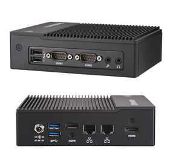

Supermicro E50-9AP-Wifi embedded system Azure IoT Edge Service with running Ubuntu 18.04
===
---

# Table of Contents

-   [Introduction](#Introduction)
-   [Step 1: Prerequisites](#Prerequisites)
-   [Step 2: Prepare your Device](#PrepareDevice)
-   [Step 3: Manual Test for Azure IoT Edge on device](#Manual)
-   [Step 4: Troubleshooting](#Troubleshooting)

# Introduction

**About this document**

This document describes how to connect Supermicro E50-9AP-Wifi  device running Ubuntu 18.04 with Azure IoT Edge Runtime pre-installed and Device Management. This multi-step process includes:

-   Configuring Azure IoT Hub
-   Registering your IoT device
-   Runtime sample to test device functionalities 

# Step 1: Prerequisites

You should have the following items ready before beginning the process:

-   Prepare your test environment in which you can run back-end sample apps
-   Setup your IoT Hub
-   Add the Edge Device E50-9AP-Wifi to IoT Hub and get its credentials

# Step 2: Prepare your Device

## 2.1 Introduce System 

-   Supermicro E50-9AP-Wifi embedded system comprised of the SCE50 chassis and the A2SAP-H single processor motherboard. 
-   Complete system supports up to 8GB DDR3L Non-ECC SODIMM 1866MHz memory in one DIMM slot.

## 2.2 System Setup Instruction

-   In shipping box, there is a 40W Power adapter. Please connect power cable and lock power adapter to chassis. 

 

-   Connection to network-Port #1 is power port, port #5-#6 are LAN ports. Connect to a monitor with HDMI cable to port #4 or #7 in below picture, if needed

 

**Note:** *There are two GB LAN ports (LAN1, LAN2) are located on the I/O back panel. They accept RJ45 type cables. Connect LAN 1 and LAN 2 into network with RJ45 type cables. Both LAN ports are DHCP configured.*

## 2.3 Power on the system and log in

-   Press the power button on the front of the system to turn it on.
-   The system has Ubuntu 18.04 installed. The login information is:

    -   Username: smc-iot
    -   Password: SMC1234!
    -   Root password: SMC1234!

-   After system boot, please check the IP addresses of the Ethernet ports in order to SSH into the device. The SSH port is the default value, port 22.

For additional information about SYS-E50-9AP-WiFi, see the [Supermicro Website.](https://www.supermicro.com/products/system/Box_PC/SYS-E50-9AP-Wifi.cfm)

# Step 3: Manual Test for Azure IoT Edge on device

This section walks you through the test to be performed on the Edge devices running the Linux operating system such that it can qualify for Azure IoT Edge certification.

## 3.1 Edge RuntimeEnabled (Mandatory)

**Details of the requirement:**

The following components come pre-installed when system before ship-out:

-   Azure IoT Edge Security Daemon
-   Daemon configuration file
-   Moby container management system
-   A version of `hsmlib` 

*Edge Runtime Enabled:*

**Check the iotedge daemon command:** 

Open the command prompt on your IoT Edge device , confirm that the Azure IoT edge Daemon is under running state

    systemctl status iotedge

 

Open the command prompt on your IoT Edge server, confirm that the module deployed from the cloud is running on your IoT Edge server. You will only see edgeAgent module running out of box.

    sudo iotedge list

  

On the device details page of the Azure, you should see the runtime modules – edgeAgent under running status

 

# Step 4: Troubleshooting

Please contact [Super Micro Computer](https://www.supermicro.com/) for help on device management component related issues.

  
