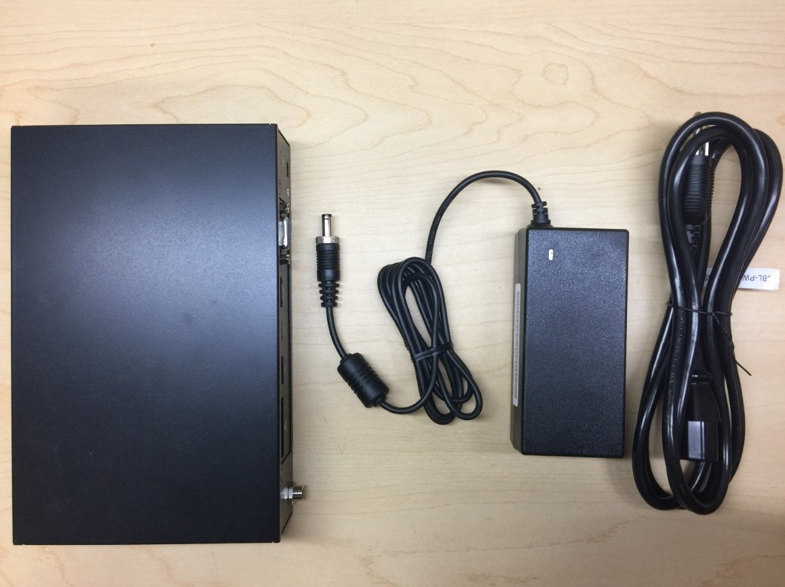
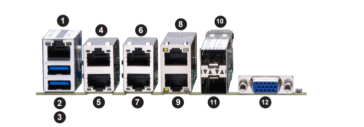

Supermicro SYS-E300-9D-8CN8TP Azure IoT Edge Server with running Ubuntu 18.04
===
---

# Table of Contents 
 
-   [Introduction](#Introduction)
-   [Step 1: Prerequisites](#Prerequisites)
-   [Step 2: Prepare your Device](#PrepareDevice)
-   [Step 3: Manual Test for Azure IoT Edge on device](#Manual)
-   [Step 4: Troubleshooting](#Troubleshooting)

# Introduction

**About this document**

This document describes how to run runtime samples to manage Supermicro SYS-E300-9D-8CN8TP Azure IoT edge server, with Azure IoT edge Runtime preinstalled in Ubuntu 18.04. This multi-step process includes:

-   Configuring Azure IoT Hub
-   Registering your IoT device
-   Build and Deploy client component to test device management capability 

# Step 1: Prerequisites

You should have the following items ready before beginning the process:

-   Prepare your test environment in which you can run back-end sample apps
-   Setup your IoT Hub
-   Add the Edge Device SYS-E300-9D-8CN8TP to IoT Hub and get its credentials

# Step 2: Prepare your Device

## 2.1 Introduce System 

-   SYS-E300-9D-8CN8TP is a compact, embedded system comprised of the SCE300 chassis and the X11SDV-4C-TP8F/8C-TP8F single processor motherboard. 
-   Complete server supports up to 512GB of DDR4-2666/2400/2133 ECC LRDIMM or up to 256GB of DDR4-2666/2400/2133 ECC/non-ECC RDIMM memory in four DIMM slots and Single fixed 2.5" hard drive bay with bracket (when AOC area is not occupied).

## 2.2 System Setup Instruction

-   In shipping box, there is a 150W Power adapter. Please connect power cable and lock power adapter to chassis. 

 

-   Connection to network-Port #1 is IPMI port, port #4-#11 are LAN ports. Connect to a monitor with VGA cable to port #12 in below picture, if needed.  

 

**Note:** *There are four 1GB LAN ports (Port#4-Port#7) are located on the I/O back panel. They accept RJ45 type cables. Connect LAN 1 into network with RJ45 type cables. Port#8 – Port#9 are 10GbE ports, and Port#7 – Port#88 are 10G SFP+ ports. The motherboard also offers one IPMI LAN port.*

# Step 3: Manual Test for Azure IoT Edge on device

This section walks you through the test to be performed on the Edge server running the Linux operating system such that it can qualify for Azure IoT Edge certification.

## Edge RuntimeEnabled (Mandatory)

**Details of the requirement:**

The following components come pre-installed when system before ship-out:

-   Azure IoT Edge Security Daemon
-   Daemon configuration file
-   Moby container management system
-   A version of `hsmlib` 

*Edge Runtime Enabled:*

**Check the iotedge daemon command:** 

Open the command prompt on your IoT Edge server, confirm that the Azure IoT edge Daemon is under running state

    systemctl status iotedge

 

Open the command prompt on your IoT Edge server, confirm that the module deployed from the cloud is running on your IoT Edge server. You will only see edgeAgent module running out of box.

    sudo iotedge list

 

On the device details page of the Azure, you should see the runtime modules - edgeAgent under running status

 

## Step 4: Troubleshooting

Please contact [Super Micro Computer](https://www.supermicro.com) for help on device management component related issues.

