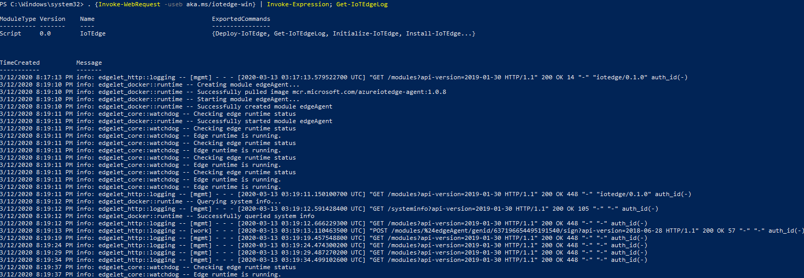

Run a simple c sample on ASUS PE200U device running Windows IoT Enterprise 2019
===

# Table of Contents

-   [Introduction](#Introduction)
-   [Step 1: Prerequisites](#Prerequisites)
-   [Step 2: Prepare your Device](#PrepareDevice)
-   [Step 3: Manual Test for Azure IoT Edge on device](#Manual)

# Introduction

**About this document**

This document describes how to connect ASUS PE200U device running Windows IoT Enterprise 2019 with Azure IoT Edge Runtime pre-installed and Device Management. This multi-step process includes:

-   Configuring Azure IoT Hub
-   Registering your IoT device
-   Build and Deploy client component to test device management capability 

# Step 1: Prerequisites

You should have the following items ready before beginning the process:

-   [Prepare your development environment][setup-devbox-windows]
-   [Setup your IoT hub](https://account.windowsazure.com/signup?offer=ms-azr-0044p)
-   [Provision your device and get its credentials][lnk-manage-iot-hub]
-   [Sign up to IOT Hub](https://account.windowsazure.com/signup?offer=ms-azr-0044p)
-   [Add the Edge Device](https://docs.microsoft.com/en-us/azure/iot-edge/quickstart)
-   [Add the Edge Modules](https://docs.microsoft.com/en-us/azure/iot-edge/quickstart#deploy-a-module)
-   [ASUS PE200U device](https://iot.asus.com/products/intelligent-edge-computer/PE200U/ )
-   Install Windows IoT Enterprise 2019 OS

# Step 2: Prepare your Device

1.  Check the ASUS PE200U can connect network with  Windows IoT Enterprise 2019
2.  Enable Hyper-v setting (May need reboot)
3.  Follow the Azure documentation to install [Azure IoT Edge Runtime](https://docs.microsoft.com/en-us/azure/iot-edge/how-to-install-iot-edge-windows)

# Step 3: Manual Test for Azure IoT Edge on device

This section walks you through the test to be performed on the Edge devices running the Windows operating system such that it can qualify for Azure IoT Edge certification.

## 3.1 Edge RuntimeEnabled (Mandatory)

**Details of the requirement:**

The following components come pre-installed or at the point of distribution on the device to customer(s):

-   Azure IoT Edge Security Daemon
-   Daemon configuration file
-   Moby container management system
-   A version of `hsmlib` 

*Edge Runtime Enabled:*

Open the powershell on your IoT Edge device , confirm the status of the IoT Edge service.

    Get-Service iotedge

Examine service logs from the last 5 minutes. If you just finished installing the IoT Edge runtime, you may see a list of errors from the time between running **Deploy-IoTEdge** and **Initialize-IoTEdge**. These errors are expected, as the service is trying to start before being configured. 

    . {Invoke-WebRequest -useb aka.ms/iotedge-win} | Invoke-Expression; Get-IoTEdgeLog
    

List running modules. After a new installation, the only module you should see running is **edgeAgent**. After you [deploy IoT Edge modules](https://github.com/MicrosoftDocs/azure-docs/blob/master/articles/iot-edge/how-to-deploy-modules-portal.md) (Could use Azure built module,SimulatedTemperatureSensor, to test), you will see others. 

    iotedge list

View the messages being sent from the module you created to the cloud.

    iotedge logs SimulatedTemperatureSensor

