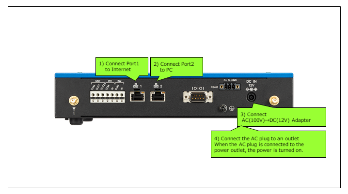
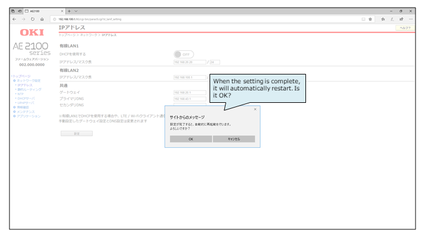
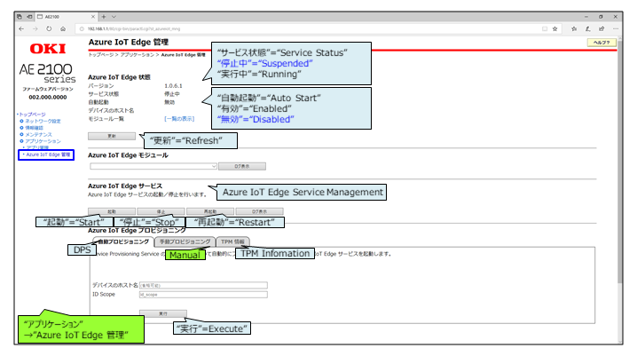
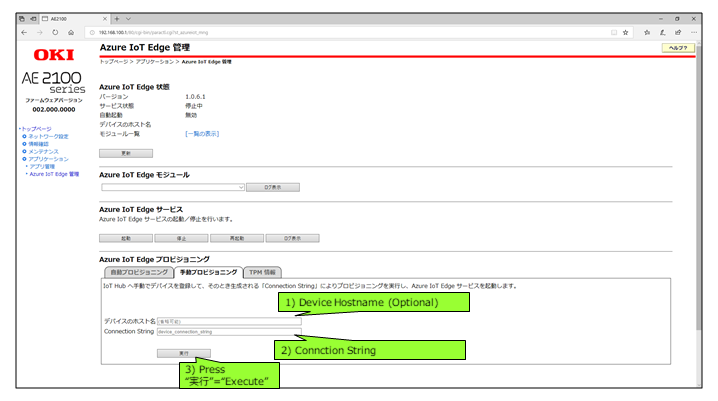
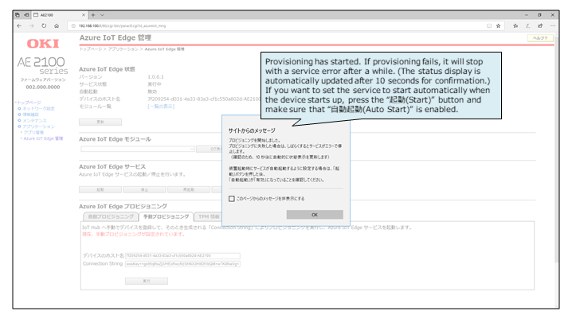
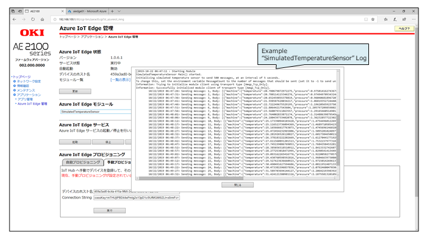
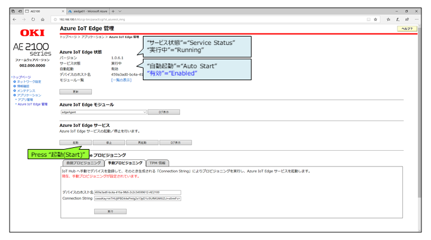

Run a simple sample on AI Edge Computer - AE2100 Series device running Yocto Project 2.5.1
===
---

# Table of Contents

-   [Introduction](#Introduction)
-   [Step 1: Prerequisites](#Prerequisites)
-   [Step 2: Prepare your Device](#PrepareDevice)
-   [Step 3: Manual Provisioning for Azure IoT Edge on device](#ManualProvisioning)

# Introduction
**About this document**

This document describes how to connect AI Edge Computer - AE2100 Series device running Yocto Project 2.5.1 with Azure IoT Edge Runtime pre-installed and Device Management. This multi-step process includes:

# Step 1: Prerequisites

You should have the following items ready before beginning the process:

-   [Create your IoT hub](https://docs.microsoft.com/en-us/azure/iot-edge/quickstart-linux#create-an-iot-hub)
-   [Register your IoT Edge device and Get connectionString](https://docs.microsoft.com/en-us/azure/iot-edge/quickstart-linux#register-an-iot-edge-device)
-   [Deploy a module](https://docs.microsoft.com/en-us/azure/iot-edge/quickstart-linux#deploy-a-module)

# Step 2: Prepare your Device

This section describes how to connect the cables

-   A network configuration example is shown below
-   Proxy not supported

## 2.1 Conect LAN cable, AC/DC Apdapter

This section describes how to connect the cables
-   Do not connect to an electrical outlet
-   Connect LAN cable
-   Connect AC/DC Apdapter

## 2.2 Power ON/OFF

This section explains how to turn on the power

-   Connected to an electrical outlet, the power turns on
-   Press the power button, the power turns off
-   Press the power button again, the power turns on

## 2.3 Login to WEB-UI

This section explains how to log in to WEB-UI

-   LAN Port 2 Factory IP address is 192.168.100.1/255.255.255.0
-   Connect to WEB-UI( http://192.168.100.1 )
-   Agree "使用許諾契約書(License agreement)"

---

-   Set password for WEB-UI

---

-   User name is "adm" for WEB-UI

## 2.4 Setup network

This section describes how to set up the network

-   Select "ネットワーク設定(Network Setting)"→"IPアドレス(IP Address)"

-   Set LAN Port1 IP Address
-   Set Default Gateway IP Address
-   Set Primary DNS Server IP Address

-   Reboot confirmation

-   Rebooting

# Step 3: Manual Provisioning for Azure IoT Edge on device

This section will guide you through the steps to enable IoT Edge Runtime

## 3.1 Edge Runtime enabled for manual provisioning

This section describes how to start the Azure service

-   Select "アプリケーション(Application)"→"Azure IoT Edge管理(Azure IoT Edge Management)"
-   Confirm that the service state is "停止中(suspended)"
-   Select "手動プロビジョニング(Manual provisioning)"

---
-   Set "デバイスのホスト名(Device Hostname)"
-   Set "Connection String"
-   Press "実行(Execute)"

---
-   The service status becomes "実行中(Running)"

-   Wait a few minutes
-   Check which module is running
-   Confirm that 3 modules are running

-   Check the service log

---
-   Press "起動(Start)" for Azure IoT Edge Service
-   Auto-start becomes "有効(Enabled)"

---
-   On the device details page of the Azure, you should see the runtime modules

-   edgeAgent, edgeHub and tempSensor modueles are under running status

