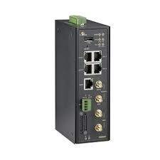

Run a simple C sample on EW200 device running Embedded Linux
===
---

# Table of Contents

-   [Introduction](#Introduction)
-   [Step 1: Prerequisites](#Prerequisites)
-   [Step 2: Prepare your Device](#PrepareDevice)
-   [Step 3: Build and Run the Sample](#Build)
-   [Next Steps](#NextSteps)

# Introduction

**About this document**

This document describes how to connect EW200 device running Embedded Linux with Azure IoT SDK. This multi-step process includes:
-   Configuring Azure IoT Hub
-   Registering your IoT device
-   Build and deploy Azure IoT SDK on device

# Step 1: Prerequisites

You should have the following items ready before beginning the process:

-   [Prepare your development environment][setup-devbox-linux]
-   [Setup your IoT hub][lnk-setup-iot-hub]
-   [Provision your device and get its credentials][lnk-manage-iot-hub]
-   VM Ubuntu14.04
-   Cross compiler tools
-   EW200

# Step 2: Prepare your Device
-   Connect the EW200 device to network. And connect the EW200 using the Telnet with Tera Term.

# Step 3: Build and Run the sample

## 3.1 Build SDK on Ubuntu machine

### 3.1.1 Setup the development environment

    $sudo apt-get update
    $sudo apt-get install lib32z1-dev
    $sudo apt-get install lib32z1
    $sudo apt-get install libncurses5-dev
    $sudo apt-get install libncurses5
    cmake --version => version 3.5.1
    gcc --version => 5.4.0

### 3.1.2 Make the Cross Compilation Toolchain

    $tar -jxv -f buildroot-2012.05.tar.bz2
    $sudo make menuconfig

**Choose:**

    Target Architecture => MIPS (little endian)
    Target Architecture => mips 32r2
    Linux Version => 2.6.3
    uClibc => 9.33.2
    gcc => 4.5.3

Exit and Save. Make Complete. Cross Compilation Toolchain file in the  **/buildroot-2012.05/output/host/usr/bin/mipsel-linux-gcc**

### 3.1.3 Clone github repository

    $git clone --recursive https://github.com/Azure/azure-iot-sdk-c.git

### 3.1.4 Cross Compile Azure IoT SDK for C

    $cd azure-iot-sdk-c
    $touch build.cmake

-   The content is as follows:

        INCLUDE(CMakeForceCompiler)
        SET(CMAKE_SYSTEM_NAME linux)
        SET(CMAKE_C_COMPILER /buildroot-2012.05/output/host/usr/bin/mipsel-linux-gcc)
        SET(CMAKE_FIND_ROOT_PATH_MODE_PROGRAM NEVER)
        SET(CMAKE_FIND_ROOT_PATH_MODE_LIBRARY ONLY)
        SET(CMAKE_FIND_ROOT_PATH_MODE_INCLUDE ONLY)

-   Open the telemetry and c2d sample files in a text editor

        $vim azure-iot-sdk-c/iothub_client/samples/iothub_ll_telemetry_sample/iothub_ll_telemetry_sample.c
        $vim azure-iot-sdk-c/iothub_client/samples/iothub_ll_telemetry_sample/iothub_ll_c2d_sample.c

-   Find the following place holder for IoT connection String:

        Static const char* connectionString = “[device connection string]”;

-   Replace the above placeholder with device connection String you obtain in Step1 and save the changes.
-   Find the following place holder for editing protocol:

    // The protocol you wish to use should be uncommented
     //
     #define SAMPLE_HTTP
     //#define SAMPLE_MQTT
     //#define SAMPLE_MQTT_OVER_WEBSOCKETS
     //#define SAMPLE_AMQP
     //#define SAMPLE_AMQP_OVER_WEBSOCKETS

-   Build the SDK using following command

        $cmake .. -DCMAKE_TOOLCHAIN_FILE=build.cmake; make

-   Using wget cmd to copy the **iothub\_ll\_telemetry\_sample** and **iothub_ll_c2d_sample** to EW200 device.

## 3.2 Send Device Events to IoT Hub:

-   Launch the DeviceExplorer as explained in Step 1 and navigate to Data tab. Select the device name you created from the frop-down list of device IDs and click Monitor button.

-   DeviceExplorer is now monitoring data sent from the selected device to the IoT Hub.
-   Using the session on Tera Teram and run the sample by issuing following command:

        $./iothub_ll_telemetry_sample

-   Verify that the confirmation messages show an OK. If not, then you may have incorrectly copied the device hub connection information.

DeviceExplorer should show that IoTHub has successfully received data sent by sample test.

## 3.3 Receive messages from IoT Hub:

-   Using the session on Tera Teram and run the sample by issuing following command:

        $./iothub_ll_c2d_sample

-   To verify that you can send messages from the IoTHub to your device, go to the Message To Device tab in DeviceExplorer.
-   Select the device you created using Device ID drop down.
-   Add some text to the Message field, then click Send.

-   You should be able to see the command received in the console window for the client sample.

# Next Steps

You have now learned how to run a sample application that collects sensor data and sends it to your IoT hub. To explore how to store, analyze and visualize the data from this application in Azure using a variety of different services, please click on the following lessons:

-   [Manage cloud device messaging with iothub-explorer]
-   [Save IoT Hub messages to Azure data storage]
-   [Use Power BI to visualize real-time sensor data from Azure IoT Hub]
-   [Use Azure Web Apps to visualize real-time sensor data from Azure IoT Hub]
-   [Weather forecast using the sensor data from your IoT hub in Azure Machine Learning]
-   [Remote monitoring and notifications with Logic Apps]   

[Manage cloud device messaging with iothub-explorer]: https://docs.microsoft.com/en-us/azure/iot-hub/iot-hub-explorer-cloud-device-messaging
[Save IoT Hub messages to Azure data storage]: https://docs.microsoft.com/en-us/azure/iot-hub/iot-hub-store-data-in-azure-table-storage
[Use Power BI to visualize real-time sensor data from Azure IoT Hub]: https://docs.microsoft.com/en-us/azure/iot-hub/iot-hub-live-data-visualization-in-power-bi
[Use Azure Web Apps to visualize real-time sensor data from Azure IoT Hub]: https://docs.microsoft.com/en-us/azure/iot-hub/iot-hub-live-data-visualization-in-web-apps
[Weather forecast using the sensor data from your IoT hub in Azure Machine Learning]: https://docs.microsoft.com/en-us/azure/iot-hub/iot-hub-weather-forecast-machine-learning
[Remote monitoring and notifications with Logic Apps]: https://docs.microsoft.com/en-us/azure/iot-hub/iot-hub-monitoring-notifications-with-azure-logic-apps
[setup-devbox-linux]: https://github.com/Azure/azure-iot-sdk-c/blob/master/doc/devbox_setup.md
[lnk-setup-iot-hub]: ../setup_iothub.md
[lnk-manage-iot-hub]: ../manage_iot_hub.md