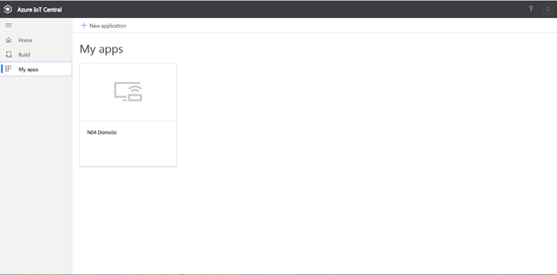

Connect N04 device to your Azure IoT Central Application
===

---
# Table of Contents

-   [Introduction](#Introduction)
-   [Prerequisites](#Prerequisites)
-   [Create Azure IoT Central application](#Create_AICA)
-   [Device Connection Details](#DeviceConnectionDetails)
-   [Prepare the Device](#preparethedevice)
-   [Integration with IoT Central](#IntegrationwithIoTCentral)
-   [Additional Links](#AdditionalLinks)

# Introduction 

**About this document**

This document describes how to connect N04 to Azure IoT Central application using the IoT plug and Play model. Plug and Play simplifies IoT by allowing solution developers to integrate devices without writing any device code. Using Plug and Play, device manufacturers will provide a model of their device to cloud developers to be integrated quickly into IoT Central or any solution built on the Azure IoT platform. IoT Plug and Play will be open to the community by way of a definition language and SDKs.

N04 is an IoT platform designed for the retrofit of industrial plants, metering, home automation, building automation and access control. It is compatible with any RS485 modbus device and it can manage up to 100 modbus measures and / or commands with related thresholds management. By using Modbus expansions, it can manage up to 100 outputs and 100 inputs. N04 supports the continuous logging of events and daily readings. Finally, N04 is remotely upgradeable (FOTA, firmware over the air). 
Technical features:

-	On board LTE modem
-	Power supply from 180 to 270Vac 50 / 60Hz
-	6V battery input (and battery charge management)
-	Consumption: from 200 mW up to a maximum of 1W
-	RS485 BUS with Modbus RTU protocol
-	Two onboard digital inputs also configurable as pulse counter and frequency meter for electric energy meters, thermal energy and flow meters
-	Two onboard relay outputs for loads up to 3KVA
-	Dimensions: 91x71x62mm (4 din modules)
-	Installation: electrical panel and wall-mounted

# Prerequisites

You should have the following items ready before beginning the process: 

-   [Azure Account](https://portal.azure.com)
-   [Azure IoT Hub Instance](https://docs.microsoft.com/en-us/azure/iot-hub/about-iot-hub)
-   [Azure IoT Hub Device Provisioning Service](https://docs.microsoft.com/en-us/azure/iot-dps/about-iot-dps)
-   Provide SIM card with data traffic enabled and available and insert it in the dedicated slot of the device. The SIM card PIN must be removed before insert the SIM card in the device

# Prepare the Device.

**Hardware Environmental setup**

-   Unpack your device
-   Insert the SIM card in your device
-   Insert the USB cable in your device and connect it to your Windows Operating System Computer

**Software Environmental setup**

-  Ensure that the ***Nable USB driver for N04 GSM*** has been installed. If not, it can be downloaded from [here](https://www.eurosystems.it/DevIc/Drivers/CDCDriver/N04CDC.zip). After download unpack and install the driver
-   Power supply your device
-   Wait after USB driver installation completion. After completion you should find your device in Windows Device Explorer (Device Manager)

-   Download the DevIc Host tool executables from [here](https://www.eurosystems.it/DevIc/Host/DevIcHost.zip)
-   Launch the DevIc Host tool and click on functions menu / parameters management menu
 

-   Setup the APN of your mobile operator

-   Setup the IoT Hub Connection String for your device. The device connection string must be composed as “DpsEndpoint=global.azure-devices-provisioning.net;IdScope=XXXX;SasKey=YYYY;RegistrationId=ZZZZ”. You must replace XXXX, YYYY, ZZZZ with the IdScope, SasKey and RegistrationId provided by your Azure IoT Central application

# Integration with IoT Central
-   Use your Azure account log into [Azure IoT Central](https://apps.azureiotcentral.com)
 

-   Press “My apps”, then “New Application” and select “Custom App”
-   Fill the form choosing your application name and location and press “Create”.

-   Click in your new created application and you will see the dashboard of your application
-   Click on “Device Templates”, than “New” and select N04 template from the catalog
 

-   Click on “Devices”, select “N04”, and then “New”

 

-   Fill the form with Device ID and Device Name and press “Create”
-   Click on the new created device to see device details. Then press “Connect”
 

-   Select “Shared Access Signature (SaS)” as connection mode and take note of “ID Scope”, “Device ID” and “Primary Key”
 

-   Use the “ID Scope”, “Device ID” and “Primary Key” to build the connection string according to rules defined in Software Environmental setup

# Additional Links

Please refer to the below link for additional information for Plug and Play 

-    [Blog](https://azure.microsoft.com/en-us/blog/iot-plug-and-play-is-now-available-in-preview/)
-    [FAQ](TBD) 
-    [Plug and Play C SDK](https://github.com/Azure/azure-iot-sdk-c/tree/public-preview) 
-    [Plug and Play Node SDK](https://github.com/Azure/azure-iot-sdk-node/tree/digitaltwins-preview)
-    [Plug and Play Definitions](https://github.com/Azure/IoTPlugandPlay)

