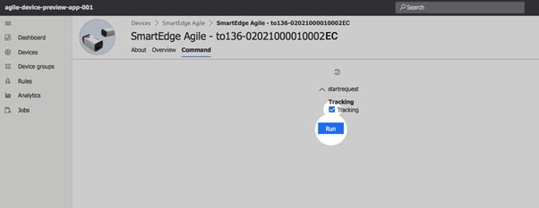
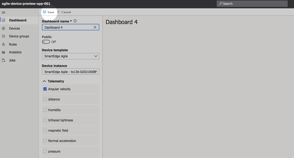

Connect SmartEdge Agile device to your Azure IoT Central Application
===
---
# Table of Contents

-   [Introduction](#Introduction)
-   [Prerequisites](#Prerequisites)
-   [Create Azure IoT Central application](#Create_AICA)
-   [Device Connection Details](#DeviceConnectionDetails)
-   [Prepare the Device](#preparethedevice)
-   [Integration with IoT Central](#IntegrationwithIoTCentral)
-   [Additional Links](#AdditionalLinks)

# Introduction

**About this document**

This document describes how to connect SmartEdge Agile device to Azure IoT Central application using IoT Plug and Play model. 

Microsoft IoT Plug and Play simplifies IoT by allowing solution developers to integrate devices without writing any device code. Using IoT Plug and Play, device manufacturers will provide a model of their device to cloud developers to be integrated quickly into Azure IoT Central or any other solution built on the Azure IoT platform.

The SmartEdge Agile device is a certified hardware solution powered by  Brainium - a full software stack featuring Edge Intelligence. With Brainium, a 3 layers software from Edge to Cloud, you benefit the full control of environmental sensors integrated into SmartEdge Agile device:

-   Absolute value of acceleration in device and **world** axis
-   Air humidity
-   Angular velocity
-   Atmospheric pressure 
-   Infrared and Visible lightness 
-   Magnetic field 
-   Proximity Distance 
-   Sound Level 
-   Internal temperature of device

# Prerequisites

You should have the following items ready before beginning the process:
-   [Azure Account](https://portal.azure.com)
-   Android smartphone or tablet with BLE 4.1 chip onboard and powered by Android 5 (or later version)
-   Its mandatory that the software image is preinstalled into SmartEdge Agile device to enable IoT Plug and Play compatibility
-   SmartEdge Agile device’s firmware is proprietary, it means that the user cannot modify it by himself or request access to the sources. 

**Note:** If the device code is not preinstalled following the [options](#preparethedevice) to enable IoT Plug and Play compatibility.

# Prepare the Device.

**Hardware environmental setup:**

-   Charge your SmartEdge Agile device by plugging a USB-C cable and charging it on your PC USB port or on a USB adaptor. LED is red while charging and green when the battery is fully charged
-   When your SmartEdge Agile device is charged, turn it on by pressing and holding the button for at least 2 seconds, LED will start blinking blue
-   Compatibility of SmartEdge Agile device with IoT Plug in Play is currently on public preview stage, so in order to get a binary image of device firmware, please contact our customer support team at <mailto:support@brainium.com>. You will be provided with an Android application for firmware update and instructions for update. 

**Software environmental setup:**

-   Compatibility of SmartEdge Agile with IoT Plug in Play is currently on public preview stage, so in order to receive a gateway application, please contact our customer support team at <mailto:support@brainium.com>. The gateway application is used for getting access to the Internet for SmartEdge Agile device.
Please follow the instructions to set up:
-   Log-in in the application with your IoT Central credentials and select SmartEdge Agile device to connect

-   Ensure that your SmartEdge Agile device is turned on

-   Ensure that your Gateway is connected through WIFI or 3G/4G with a stable connection

-   Ensure to enable both Bluetooth and Location Services (for the discovery of new Bluetooth device)  
-   Don’t connect in Bluetooth to SmartEdge Agile device using your phone settings as it won’t work. You need a device which is BLE compatible and at least Android 5.0 (for Android).

# Integration with IoT Central

-   Go to the IoT Central app, access the **Devices** tab and choose **SmartEdgeAgile**

 
-   If you want to start tracking the data, tick **Tracking** and press **Run**
 

-   You can design your own dashboard with the necessary widgets.  On the **Dashboard** tab press **New** to create a new dashboard, enter all the paraments and press **Save** 

-   Wait a bit and observe the telemetry coming from your PnP device

# Additional Links

Please refer to the below link for additional information for Plug and Play

-   [Blog](https://azure.microsoft.com/en-us/blog/iot-plug-and-play-is-now-available-inpreview/)
-   [FAQ](TBD)
-   [Plug and Play C SDK](https://github.com/Azure/azure-iot-sdk-c/tree/public-preview)
-   [Plug and Play Node SDK](https://github.com/Azure/azure-iot-sdk-node/tree/digitaltwinspreview)
-   [Plug and Play Definitions](https://github.com/Azure/IoTPlugandPlay)
