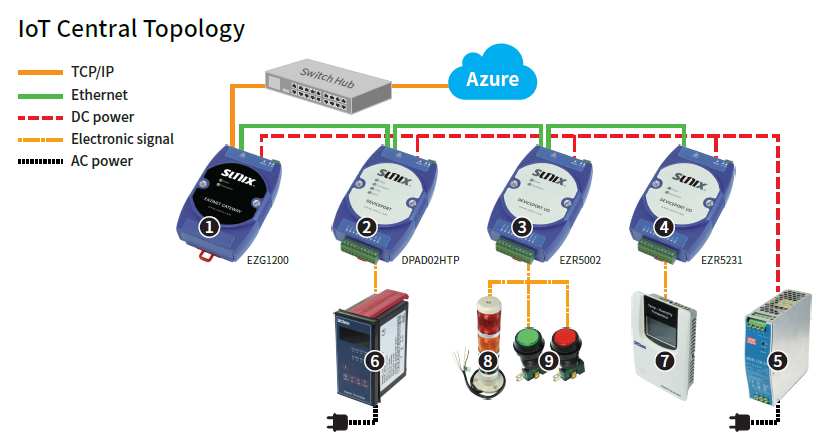
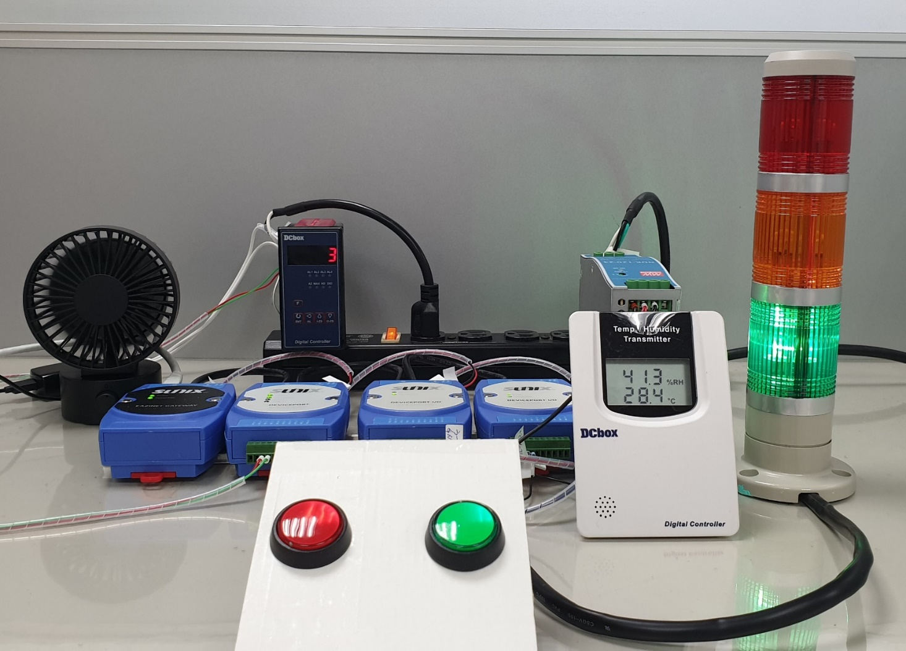
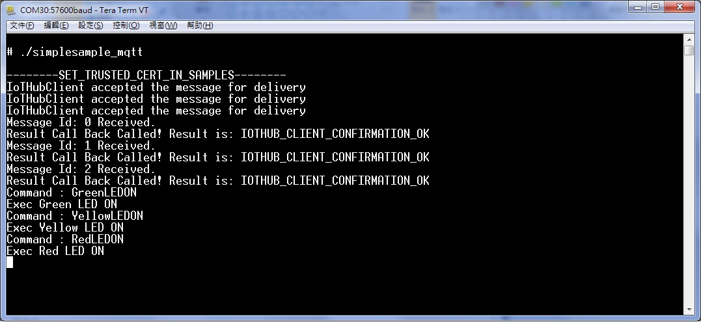

SUNIX IoT Central Starter Kit is running Linux
===
---

# Table of Contents

-   Instructions for using this template
-   SUNIX IoT Central Starter Kit
-   Connect the sensors
-   Build and Run the sample
-   Send Device Events to IoT Hub
-   Receive messages from IoT Hub
-   Next steps

# SUNIX IoT Central Starter Kit

The SUNIX IoT Central Starter Kit includes:

1.  IoT Central Gateway
2.  DevicePort (RS-422/485)
3.  DevicePort I/O (Digital)
4.  DevicePort I/O (Analog)
5.  Power Supply
6.  Power Meter (RS-485)
7.  Temp. & RH Sensor (Analog)
8.  Stack Light (Digital)
9.  Green & Red Button (Digital)
10.  5 Packs of Wire
    (Including Ethernet 20cm *3; Ethernet 1M *1; AC/DC+ Signal cables *1)

# Connect the sensors 

# Build and Run the sample

## Starter Kit Software Configuration:

1.  IoT Gateway Basic Configuration
2.  Create IoT IoTHub
3.  IoT Gateway connection authentication 
4.  Data Collection Confirmation

### 1.	IoT Gateway Basic Configuration

**1-1 Login IoT Gateway**

1.  Use Internet Cable to connect computer and Gateway, after confirming connection, open the browser and enter Gateway preset IP address： 

        192.168.111.254.

2.	Enter preset Username: admin, Password：admin.
3.	After entering username and password, press 【Sign in 】 to enter Gateway Management Interface.

**1-2 Setting Gateway IP address**

1.	After logging in Gateway, click 【System】on the left panel.
2.	Pull down the right panel and find the Network segment. Change the IP address to match your network environment.
3.	After you complete the setting, press 【Apply】 to finish setting and login Gateway again.

**1-3 Setting Gateway Profiles**

1.	After changing IP, login Gateway again and click 【System】 on the left panel.
2.	Pull down the right panel and find Azure IoT Central’s segment.
3.	Please set the column Profiles as Starter Kit 1.
4.	Press 【Apply】 to finish basic setting.
**1-4 Check Pair DP List Connection Status**

1.	After logging in Gateway, click 【Home】 on the left panel.      
2.	Confirm the following three DevicePort connection status. Should display 【Connect】.

### 2. Create Azure IoTHub

**2-1 Create Real Devices**

1.  Login <https://portal.azure.com/>, if you havn't account, first signup.
2.  Create **New --> Internet of Things --> IoT hub**, detail refer to <https://docs.microsoft.com/en-us/azure/iot-hub/iot-hub-create-through-portal>.
3.  create a device, move on **All resources --> YOUR_IOTHUB --> Device Explorer --> Add Device**, save.
4.  click the device, copy **Connection string—primary key**.

### 3. IoT Gateway Connection Authentication 
**3-1 Copy Connection Information to IoT Gateway**

1.	Enter IoT Gateway management interface, on the left panel, after clicking 【System】, roll down the right panel and find the segment of Azure IoT Central.
2.	Connection Method choose 【IoT Hub】     
3.	Copy and paste the Device Connection information of Primary Key to the corresponding IoT Gateway columns. After completing setting, press the button 【Apply】to finish the operation.

**3-2 Check whether IoT Gateway Connect to IoT Hub**

1.	Enter IoT Gateway management interface, on the left panel, click 【Home】.
2.	Check whether  IoT Central Connection State display 【Connected】.

### 4. Data Collection Confirmation

1.	Using DeviceExplorer application.
2.	Click Starter Kit to check information Check whether data collected Success.

# Send Device Events to IoT Hub

Send Device Events to IoT Hub and Display using DeviceExplorer
Commands sent from the Device to Azure IoT Hub:

# Receive messages from IoT Hub

Send Device Events to IoT Hub and Display using DeviceExplorer
Commands sent to the Device from Azure IoT Hub: 

# Next Steps

You have now learned how to run a sample application that collects sensor data and sends it to your IoT hub. To explore how to store, analyze and visualize the data from this application in Azure using a variety of different services, please click on the following lessons:

-   [Manage cloud device messaging with iothub-explorer]
-   [Save IoT Hub messages to Azure data storage]
-   [Use Power BI to visualize real-time sensor data from Azure IoT Hub]
-   [Use Azure Web Apps to visualize real-time sensor data from Azure IoT Hub]
-   [Weather forecast using the sensor data from your IoT hub in Azure Machine Learning]
-   [Remote monitoring and notifications with Logic Apps]   

[Manage cloud device messaging with iothub-explorer]: https://docs.microsoft.com/en-us/azure/iot-hub/iot-hub-explorer-cloud-device-messaging
[Save IoT Hub messages to Azure data storage]: https://docs.microsoft.com/en-us/azure/iot-hub/iot-hub-store-data-in-azure-table-storage
[Use Power BI to visualize real-time sensor data from Azure IoT Hub]: https://docs.microsoft.com/en-us/azure/iot-hub/iot-hub-live-data-visualization-in-power-bi
[Use Azure Web Apps to visualize real-time sensor data from Azure IoT Hub]: https://docs.microsoft.com/en-us/azure/iot-hub/iot-hub-live-data-visualization-in-web-apps
[Weather forecast using the sensor data from your IoT hub in Azure Machine Learning]: https://docs.microsoft.com/en-us/azure/iot-hub/iot-hub-weather-forecast-machine-learning
[Remote monitoring and notifications with Logic Apps]: https://docs.microsoft.com/en-us/azure/iot-hub/iot-hub-monitoring-notifications-with-azure-logic-apps

