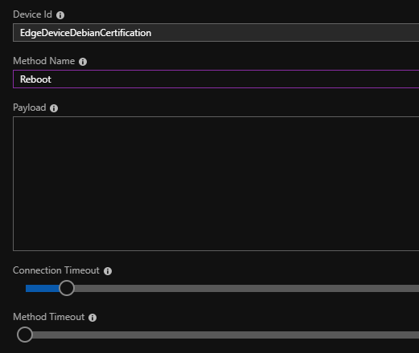

Run a simple C# / .NET Standard sample on Kontron KBox A-203 device running Debian 9.5.
===
---

# Table of Contents

-   [Introduction](#Introduction)
-   [Step 1: Prerequisites](#Prerequisites)
-   [Step 2: Prepare your Device](#PrepareDevice)
-   [Step 3: Manual Test for Azure IoT Edge on device](#Manual)

<a name="Introduction"></a>
# Introduction

**About this document**

This document describes how to connect Kontron KBox A-203 device running Debian 9.5 with Azure IoT Edge Runtime pre-installed and Device Management. This multi-step process includes:

-   Configuring Azure IoT Hub
-   Registering your IoT device
-   Build and Deploy client component to test device management capability 

<a name="Prerequisites"></a>
# Step 1: Prerequisites

You should have the following items ready before beginning the process:

-   [Prepare your development environment][setup-devbox-linux]
-   [Setup your IoT hub](https://account.windowsazure.com/signup?offer=ms-azr-0044p)
-   [Provision your device and get its credentials][lnk-manage-iot-hub]
-   [Sign up to IOT Hub](https://account.windowsazure.com/signup?offer=ms-azr-0044p)
-   [Add the Edge Device](https://docs.microsoft.com/en-us/azure/iot-edge/quickstart-linux)
-   [Add the Edge Modules](https://docs.microsoft.com/en-us/azure/iot-edge/quickstart-linux#deploy-a-module)
-   [Kontron KBox A-203 device](https://www.kontron.de/products/systems/embedded-box-pc/kbox-a-series/kbox-a-203.html)
-   Power supply unit, computer mouse, keyboard and a monitor.

<a name="PrepareDevice"></a>
# Step 2: Prepare your Device

-   The Kontron KBox A-203 device comes already pre-installed with all requirements.
    -   Moby Container Runtime
    -   Azure IoT Edge 1.0.5
    -   SUSiEtec IIoT-Platform
-   Connect the device to a power supply with the provided power supply unit.
-   Connect peripherals like a computer mouse, a keyboard and a monitor.
-   The device boots automatically after power supply is provided.
-   Wait for the operation system Debian 9.5 to load and login with the default credentials:
    -   Username: susietec
    -   Password: susietec
-   After the login process all required components are loading and the device is operable.
-   To enable connection to your IoT Hub please enter the connection settings for the IoT Hub in the configuration file:
    - Navigate to folder `\home\susietec\SusieStorage\Blobs` and open file `appconfig.json` with a text editor (Editor nano is already pre-installed)
    - Navigate to line 434 in the file and adapt following configuration section:
	

            "moduleConfig:": {
            "hostname" : "{HostName}", 
            "transportType" : "mqtt_tcp_only", 
            "deviceId":  "{DeviceId}", 
            "sharedAccessKey" : "{SharedAccessKey}"
            }	


Replace all placeholders marked with {placeholder} with the appropriate settings from the IoT Hub Connection String. These settings can be copied from the field `Connection string (primary key)` from your IoT Hub Device Management Portal:

 

This field contains a string with following sections: HostName, DeviceId and SharedAccessKey. Copy the value of these sections into the configuration snippet with the placeholders above.

Example Connection String:

    HostName=iothub.azure-devices.net;DeviceId=Device01;SharedAccessKey=dGVzdDEyM3Rlc3QxMjN0ZXN0MTIzdGVzdDE=

Example SUSiEtec IoT Hub connection settings:

    "moduleConfig:": {
    "hostname" : "iothub.azure-devices.net", 
    "transportType" : "mqtt_tcp_only", 
    "deviceId":  "Device01", 
    "sharedAccessKey" : "dGVzdDEyM3Rlc3QxMjN0ZXN0MTIzdGVzdDE="
    }


<a name="Manual"></a>
# Step 3: Manual Test for Azure IoT Edge on device

This section walks you through the test to be performed on the Edge devices running the Linux operating system such that it can qualify for Azure IoT Edge certification.

<a name="Step-3-1-IoTEdgeRunTime"></a>
## 3.1 Edge RuntimeEnabled (Mandatory)

**Details of the requirement:**

The following components come pre-installed or at the point of distribution on the device to customer(s):

-   Azure IoT Edge Security Daemon
-   Daemon configuration file
-   Moby container management system
-   A version of `hsmlib` 

*Edge Runtime Enabled:*

**Check the iotedge daemon command:** 

Open the command prompt on your IoT Edge device , confirm that the Azure IoT edge Daemon is under running state

    systemctl status iotedge

 

Open the command prompt on your IoT Edge device, confirm that the module deployed from the cloud is running on your IoT Edge device

    sudo iotedge list

  

On the device details page of the Azure, you should see the runtime modules - edgeAgent, edgeHub and tempSensor modueles are under running status

 

<a name="Step-3-2-DeviceManagement"></a>
## 3.2 Device Management (Mandatory)

**Pre-requisites:** Device Connectivity.

**Description:** A device that can perform basic device management operations (Reboot and Firmware update) triggered by messages from IoT Hub.

## 3.2.1 Firmware Update (Using Microsoft SDK Samples):

All related SUSiEtec components are installed in path `\home\susietec`.

To run the simulated device application, open a shell or command prompt window and navigate to the **iot-hub/Tutorials/FirmwareUpdate** folder in the Node.js project you downloaded. Then run the following commands:

    npm install
    node SimulatedDevice.js "{your device connection string}"

To run the back-end application, open another shell or command prompt window. Then navigate to the **iot-hub/Tutorials/FirmwareUpdate** folder in the Node.js project you downloaded. Then run the following commands:

    npm install
    node ServiceClient.js "{your service connection string}"

IoT device client will get the message and report the status to the device twin.

 

**Update firmware**

Confirm the IoT hub, Device ID, method name and method payload as below:

-   Press “call Method” button
-   Check the returning status as below:

 


## 3.2.2 Reboot (Using Microsoft SDK Samples):

All related SUSiEtec components are installed in path `\home\susietec`.

Confirm the IoT hub, Device ID, method name as below:

-   Press “call Method” button
-   Check the returning status as below:

 


IoT device client will get the message and report the status to the device twin.

 
  
## 3.3.3 Firmware Update (Modified SDK samples/Custom made application):

Following steps are needed to perform an update via the SUSiEtec components. All required components are pre-installed on the device.

-   Open the Device Twin information of your device on the IoT Hub Device Management Portal.

```
{
  "deviceId": "EdgeDeviceDebianCertification",
  "etag": "AAAAAAAAAA4=",
  "deviceEtag": "Nzc5Mzg3Njkw",
  "status": "enabled",
  "statusUpdateTime": "0001-01-01T00:00:00",
  "connectionState": "Disconnected",
  "lastActivityTime": "2018-12-11T10:29:35.4983597",
  "cloudToDeviceMessageCount": 0,
  "authenticationType": "sas",
  "x509Thumbprint": {
    "primaryThumbprint": null,
    "secondaryThumbprint": null
  },
  "version": 25,
  "properties": {
    "desired": {
      "osUpdate": "11/12/2018 11:42:00",
      "$metadata": {
        "$lastUpdated": "2018-12-11T10:29:35.049049Z",
        "$lastUpdatedVersion": 14,
        "osUpdate": {
          "$lastUpdated": "2018-12-11T10:29:35.049049Z",
          "$lastUpdatedVersion": 14
        }
      },
      "$version": 14
    },
    "reported": {
      "lastOsUpdate": "12/06/2018 10:05:58",
      "lastBoot": "12/11/2018 09:38:30",
      "lastRemoteReboot": "12/11/2018 09:37:21",
      "$metadata": {
        "$lastUpdated": "2018-12-11T09:39:27.463793Z",
        "lastOsUpdate": {
          "$lastUpdated": "2018-12-11T09:39:27.463793Z"
        },
        "lastBoot": {
          "$lastUpdated": "2018-12-11T09:39:27.463793Z"
        },
        "lastRemoteReboot": {
          "$lastUpdated": "2018-12-11T09:39:27.463793Z"
        }
      },
      "$version": 11
    }
  },
  "capabilities": {
    "iotEdge": false
  }
}
```

-   Set desired property `osUpdate`.
    -   This propery can be found in `properties.desired.osUpdate`.
    -   Set the value to a timestamp in the near future, e.g. just add a minute to your current time and enter the timestamp in format `DD/MM/YYYY hh:mm:ss`.
-   Save the altered device twin information.
-   This will trigger the update on the edge device.
-   The timestamp of the last update process can be found in reported property `lastOsUpdate` found in path `properties.reported.lastOsUpdate`.

Extract from the log files of systemd:

```
Dec 11 10:38:25 susietec systemd[1]: Started SUSiEtec.
Dec 11 10:38:30 susietec susietec[371]: [12/11/2018 09:38:30 INF] host application listens on 0.0.0.0:55555
Dec 11 10:38:55 susietec susietec[371]: [12/11/2018 09:38:55 INF] connected to 172.19.0.3:33163
Dec 11 10:38:57 susietec susietec[371]: [12/11/2018 09:38:57 INF] connected to 172.19.0.3:37623
Dec 11 10:40:25 susietec susietec[371]: [12/11/2018 09:40:25 INF] message received: {"type":"properties","data":{"osUpdate":"11/12/2018 10:41:00"},"guid":"eabf3f45-a06b-4e50-8709-2358fcc31639","attachedFeatures":["00000004-0000-0000-0002-000000000000"],"source":"ffffffff-ffff-0000-0000-000000000007","creationDateTime":"2018-12-11T09:40:25.4973412Z"}
```

Extract from the log files of SUSiEtec:

```
[12/11/2018 09:36:17 INF] module Azure stopped
[12/11/2018 09:36:17 INF] module Azure reconfigured
[12/11/2018 09:36:17 INF] desired properties have changed
[12/11/2018 09:36:17 INF] module Azure started
[12/11/2018 09:36:37 INF] reported properties have changed
```

Extract from log files of apt-get:

```
Start-Date: 2018-12-04  06:02:55
Commandline: /usr/bin/unattended-upgrade
Upgrade: perl-base:amd64 (5.24.1-3+deb9u4, 5.24.1-3+deb9u5), openssl:amd64 (1.1.0f-3+deb9u2, 1.1.0j-1~deb9u1), perl-modules-5.24:amd64 (5.24.1-3+deb9u4, 5.24.1-3+deb9u5), libperl5.24:amd64 (5.24.1-3+deb9u4, 5.24.1-3+deb9u5), libtiff5:amd64 (4.0.8-2+deb9u2, 4.0.8-2+deb9u4), perl:amd64 (5.24.1-3+deb9u4, 5.24.1-3+deb9u5), libssl1.1:amd64 (1.1.0f-3+deb9u2, 1.1.0j-1~deb9u1)
End-Date: 2018-12-04  06:03:02
```

```
Start-Date: 2018-12-06  11:06:11
Commandline: apt -qy upgrade
Upgrade: dotnet-host:amd64 (2.1.6-1, 2.2.0-1), teamviewer:amd64 (13.2.26559, 14.0.14470)
End-Date: 2018-12-06  11:06:25
```

*Detailed explanation of desired property `osUpdate`:*
>This property triggers the update of the Operating System. Please enter a timestamp in the near future. The Edge device then tries to update its Operating System as soon as possible and within the limitations of the specified timestamp.
Side note: A Boolean flag indicating perform update yes/no would have been a better solution. However, this requires to reset the desired property from the Edge device, otherwise the flag has to be reset manually by the user in the cloud. This is not possible, since the Edge device is only capable to set reported properties. Therefore we implemented above solution with the time stamp defining the update interval from now on up to the time stamp.

*Detailed explanation of reported property `lastOsUpdate`:*
>This property displays the date time of the last successful remotely triggered update of the Operating System, based on the date time information from apt package manager. 

## 3.3.4 Reboot (Modified SDK samples/Custom made application):

Following steps are needed to perform a reboot of the device via the SUSiEtec components. All required components are pre-installed on the device.

- Open the Direct Method page of the IoT Hub Device Management Portal.
- Enter value `Reboot` in form field `Method Name`.
- Do not change any other values on this page.
- Click on button `Invoke Method`.
- This will trigger the reboot logic on the edge device.
- The information about the reboot process can be found in reported properties `lastBoot` and more relevant `lastRemoteBoot`.

 

Extract from the log files of SUSiEtec:

```
[12/10/2018 09:43:04 INF] received rpc to method Reboot
[12/10/2018 09:43:05 INF] reported properties have changed
```

*Detailed explanation of reported property `lastBoot`*:
>This property displays the last time of boot from the Edge device. This is set independently of which way the reboot was triggered: manually, forced, remote.

*Detailed explanation of reported property `lastRemoteBoot`*:
>This property display the last time of boot from the Edge device. In contradiction to `lastBoot` this property only displays the date time of the boot triggered by a remote Cloud to Device (Direct Method) message.


[setup-devbox-linux]: https://github.com/Azure/azure-iot-sdk-c/blob/master/doc/devbox_setup.md
[lnk-setup-iot-hub]: ../setup_iothub.md
[lnk-manage-iot-hub]: ../manage_iot_hub.md
