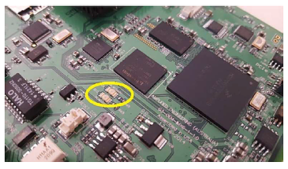
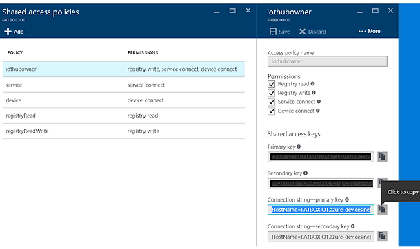

Configure FATBOX G3 as a LTE device gateway for Azure IoT
===
---

# Table of Contents

-   [Introduction](#Introduction)
-   [Step 1: Prerequisites](#Prerequisites)
-   [Step 2: Prepare your Device](#PrepareDevice)
-   [Step 3: Test the IoT client](#Test)
    -   [Option 1: Use the development board, without sensors](#Device-Sample)
    -   [Option 2: Use the FATBOX G3 Azure IoT Gateway Starter Kit kit from Amplified Engineering](#Kit01-Sample)
-   [Next Steps](#NextSteps)

# Introduction

**About this document**

This document describes how to configure FATBOX G3 as device gateway for Azure IoT with Azure IoT SDK. This multi-step process includes:
-   Configuring Azure IoT Hub
-   Registering your IoT device
-   Test your device

<a href="http://www.amplified.com.au/#!4gltegateway/c192n">FATBOX G3</a>

An industrial LTE gateway device to allow secure remote monitoring and management of industrial equipment with Modbus RTU, Modbus TCP, RS-485 or CAN bus using the Azure IoT platform.

# Step 1: Prerequisites

You should have the following items ready before beginning the process:

-   [Setup your IoT hub][lnk-setup-iot-hub]
-   [Provision your device and get its credentials][lnk-manage-iot-hub]
-   FATBOX G3 device
-   Save your device connection string into a text file named connstr.txt. It will be used to setup and configure your FATBOX G3 as a secure device to connect to your IoT Hub.

# Step 2: Prepare your Device

-   Login to your FATBOX G3 using the LAN port.

    We suggest 2 ways to upload your unique Azure IoT Hub device connection string to your FATBOX.

    1)  Using a USB drive (with micro USB connector)
        -   Copy the connstr.txt file into your USB drive /user folder.
	-   Insert USB drive into FATBOX G3's USB port in the rear.
        -   From 'Management', click on 'Download to FATBOX' and check that 'OK' led on FATBOX blinks once.
	
	    
	    
    2)  Using SCP or WINSCP over Ethernet connection
        -   Enable SSH on the FATBOX (reboot after 'Update').
	-   Use SCP or WINSCP to transfer the connstr.txt from your computer to the FATBOX /user folder. 
-   In the FATBOX G3 'Azure IoT' menu, enable the Azure IoT device client option.

    
	    

# Step 3: Test the IoT client

## Option 1: Use the development board, without sensors

## 3.1 Send Device Events to IoT Hub:

-   SSH to the FATBOX (using root and password as setup in your LOGIN).
-   Create or copy a few lines of 'test data' into the /tmp/dataq.txt file.
-   Run the /etc/M2MBOT in the FATBOX.
-	'Test data' will be sent line by line by the IoT client to your Azure IoT Hub  
-   See [Manage IoT Hub][lnk-manage-iot-hub] to learn how to observe the messages IoT Hub receives from the application.

## 3.2 Receive messages from IoT Hub

-   See [Manage IoT Hub][lnk-manage-iot-hub] to learn how to send cloud-to-device messages to the application.

## Option 2: FATBOX G3 Azure IoT Gateway Starter kit from Amplified Engineering

### FATBOX G3 Azure IoT Gateway Starter kit

The FATBOX G3 Azure IoT Gateway Starter kit includes:

-   1pc FATBOX G3 – Industrial 3G Gateway with Azure IoT client and Modbus RTU and TCP server

-   1pc Digital input module – 4 x digital inputs (or switch contacts) Modbus RTU slave unit

-   1pc Analog input – 2 x analog input Modbus RTU slave unit

-   Prewired FATBOX G3 to Modbus slave unit (0.3m)

-   2x 24VDC power supply 100-240VAC – 1 for FATBOX G3 and 1 for the 2 Modbus slave units

-   1x cellular antenna (2m wire length)

-   1x temperature sensor (0c - 400c) with 1m wire

### Connect the sensors

## Design

It's usually good practice to start my mapping out what you want to monitor, e.g. a switch and a sensor to start with. Later, you can move on to your own field devices like power meters or PLCs.

## Wiring Up

The Modbus I/O modules included in the starter kit is already prewired – Modbus RS-485 to the FATBOX G3 and also to its 24VDC power supply. The temperature sensor is also prewired to the analog Modbus module. They following are simplified wiring diagrams for the Novus Automation I/O modules but please refer to details in the instruction manual download links.​

In your starter kit, a temperature sensor is pre-wired as following to the Digirail-2A analog module to facilitate immediate testing of transmission of field data to your Azure platform. 

You may attach more switches or digital inputs to the Digirail-4C module or additional analog output devices to the Digirail-2A as following.

## Configure & Test the ModBus Device Server

The FATBOX G3 integrates a 'device server' that will poll all attached Modbus RTU and TCP slaves at a configure period. This server reads a configuration file 'iotasset.txt' that is a simple text file with each polled device register specified as following.
/user/iotasset.txt (copied over via USB drive or SCP command)

    MBM_START
    
    TYPE,R
    ADDR,2
    MBFC,3
    REGS,14,1,SINT16HL
    Site,MicrosoftAzureIoTStarterKit
    Eqpt,DIGIRAIL.2A.CH1 #analog input 1 Temperature Sensor
    Unit,Celcius/10
    Key,Temperature.CH1
    
    MBM_STOP

Please refer to our [Modbus User Guide](https://media.wix.com/ugd/918126_e47748f226634cebab80fbff742f9865.pdf) for further details.

The configuration file needs to be transferred to the FATBOX G3. Please refer to instructions in page(9) on using USB drive or SCP command over Ethernet.

To enable auto-start of the Modbus master, please configure 'Azure IoT' as following.

"DeviceID" is the name of the FATBOX G3 as a device in your Azure IoT Hub (see section 4). This name is unique and should describe the site or role of the sets of Modbus field devices attached to the FATBOX G3. E.g. in our example, it is a pump control station at SouthLake for a local council.
Click 'Update' and either 'Reset Device' in 'Management' or just power off, wait 5 seconds and power back up the FATBOX.Technical :: we suggest doing an 'interim' test that your Modbus master, network and I/O modules are working before interacting with the Azure system.

Power up the FATBOX G3 and the Modbus I/O modules. After about 2 minutes, if board is outside of its enclosure, you can observe the TX/RX leds (below) on the board blinking at the specified polling period. The Tx and Rx leds on the I/O Modules should also blink at the same time. This means the Modbus master is successfully polling data from the attached Modbus I/O slave modules.

To further check if device data has been successfully collected into the buffer of the FATBOX G3, we need to do a SSH console session. Please set 'Enable Secure Shell (SSH)' to '1' in 'Management', then 'Update' and reboot the FATBOX.

Initiate a SSH session (e.g. using Putty) to the FATBOX over LAN, eth0 (root@192.168.1.1). After about 2 minutes upon power up, the FATBOX G3's Modbus master will start polling the attached I/O Modules at the 'Poll Period' specified.

Now do a 'cat /tmp/dataq.txt' command. If you observe JSON data messages (like below) being added to the file, CONGRATULATIONS! Your site level devices are properly configured and now we can proceed to the Azure settings.

    root@FATBOX:/etc# cat /tmp/dataq.txt

    [{"DeviceId":"FATBOX_P1","Site":"MicrosoftAzureIoTStarterKit","Eqpt":"DIGIRAIL.2A.CH1","Unit":"Celcius/10","Key":"Temperature.CH1","Rec0nUTC":"2017-05-09T07:09:20Z","Temperature":331}]Properties:'PropName':'PropMsg_16'

    [{"DeviceId":"FATBOX_P1","Site":"MicrosoftAzureIoTStarterKit","Eqpt":"DIGIRAIL.2A.CH1","Unit":"Celcius/10","Key":"Temperature.CH1","Rec0nUTC":"2017-05-09T07:09:20Z","Temperature":331}]Properties:'PropName':'PropMsg_17'

## Add FATBOX G3 to Azure IOT Hub

We worked hard and closely to integrate AZURE IoT Hub client. You can securely collect data from remote industrial devices like MODBUS RTU and TCP power meters, PLCs or sensors. The FATBOX G3 with serial RS-485/232, Ethernet and CAN Bus is a flexible and robust LTE and 3G I(IoT) field gateway for your Azure remote monitoring and analytics solution.

### Add an IOT Hub in AZURE

From the new Azure Portal (https://portal.azure.com), add a new IoT Hub to your account at New >Internet of Things > IoT Hub.

Copy your IoT Hub Connection String like above, it will be in the form of (example),

HostName=name.azure-devices.net;SharedAccessKeyName=iothubowner;SharedAccessKey=Qm..=

### Register Your New Device (FATBOX G3)

The [Device Explorer](https://github.com/Azure/azure-iot-sdk-csharp/tree/master/tools/DeviceExplorer) will be used to create new devices (e.g. to connect to a FATBOX G3 gateway), generate the device connection string and also for monitoring data from devices and sending data to devices for testing.

Install and run the Device Explorer. Paste the IoT Hub Connection String from the Azure Portal into the Device Explorer > Configuration as following.

We will add a new FATBOX G3 as “SOUTHLAKE” in Management > Create. From the table, you will see your new device. Right-click the new device and copy the device connection string.

Copy and paste this device connection string into a text file named connstr(.txt). It will be used to setup and configure your FATBOX G3 as a secure device to connect to your IoT Hub

### Download settings to FATBOX G3

Now login to your FATBOX G3 using the LAN port. We suggest 2 ways to upload your unique Azure IoT Hub device connection string to your FATBOX.

- Using a USB drive (with micro USB connector)
    -   Name you USB drive 'FATBOX'. Then copy the connstr.txt file into your USB drive /user folder. Insert USB drive into FATBOX G3's USB port in the rear.
    -   From 'Management', click on 'Download to FATBOX' and check that 'OK' led on FATBOX blinks once.  
    

- Using SCP or WINSCP over Ethernet connection
    -   If you prefer, you can enable SSH on the FATBOX (reboot after 'Update') and use SCP or WINSCP to transfer the connstr.txt from your computer to the FATBOX /user folder.​
    
## Configure FATBOX 3G/4G Settings

Check the correct APN for your 3G or 4G provider of your SIM card. Enter the provider's APN into the 'APN' field in the 'WAN Settings' page.

   
Click 'Update' and then 'Reboot Device' in 'Management' or press the RESET button in the front of FATBOX. After boot-up, login and check in 'System Status' for an IP address to be assigned by your cellular service provider. This is a confirmation that data connection is successful over 3G (or 4G).

    
## Switch On!

The FATBOX G3 Azure IoT client auto-starts after boot-up as it has been enable. It will continuously check for new serial device data in a buffer file. With cellular connection operational, the Modbus device data in this buffer will be sent sequentially FIFO to the Azure IoT Hub until its depleted. 

Data sent to Azure IoT Hub can be monitored in 'Data' tab of the Device Explorer. For example, from your starter kit you should see the temperature data within the JSON messages sent to Azure IoT Hub.

    

# Next Steps

You have now learned how to run a sample application that collects sensor data and sends it to your IoT hub. To explore how to store, analyze and visualize the data from this application in Azure using a variety of different services, please click on the following lessons:

-   [Manage cloud device messaging with iothub-explorer]
-   [Save IoT Hub messages to Azure data storage]
-   [Use Power BI to visualize real-time sensor data from Azure IoT Hub]
-   [Use Azure Web Apps to visualize real-time sensor data from Azure IoT Hub]
-   [Weather forecast using the sensor data from your IoT hub in Azure Machine Learning]
-   [Remote monitoring and notifications with Logic Apps]   

[Manage cloud device messaging with iothub-explorer]: https://docs.microsoft.com/en-us/azure/iot-hub/iot-hub-explorer-cloud-device-messaging
[Save IoT Hub messages to Azure data storage]: https://docs.microsoft.com/en-us/azure/iot-hub/iot-hub-store-data-in-azure-table-storage
[Use Power BI to visualize real-time sensor data from Azure IoT Hub]: https://docs.microsoft.com/en-us/azure/iot-hub/iot-hub-live-data-visualization-in-power-bi
[Use Azure Web Apps to visualize real-time sensor data from Azure IoT Hub]: https://docs.microsoft.com/en-us/azure/iot-hub/iot-hub-live-data-visualization-in-web-apps
[Weather forecast using the sensor data from your IoT hub in Azure Machine Learning]: https://docs.microsoft.com/en-us/azure/iot-hub/iot-hub-weather-forecast-machine-learning
[Remote monitoring and notifications with Logic Apps]: https://docs.microsoft.com/en-us/azure/iot-hub/iot-hub-monitoring-notifications-with-azure-logic-apps
[lnk-setup-iot-hub]: ../setup_iothub.md
[lnk-manage-iot-hub]: ../manage_iot_hub.md

