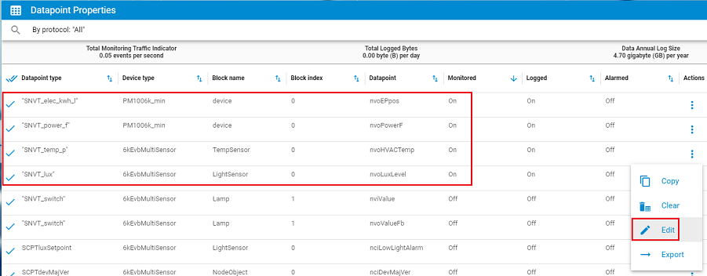
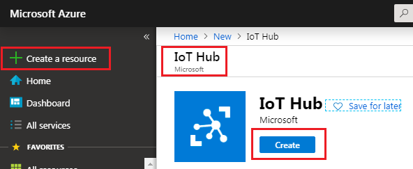
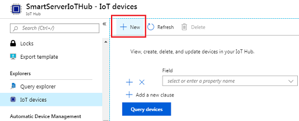
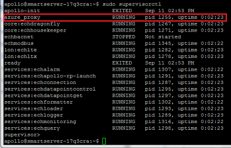

Connect the SmartServer IoT to the Azure IoT Hub
===
---

# Table of Contents

-   [Introduction](#Introduction)
-   [Step 1: Prerequisites](#Prerequisites)
-   [Step 2: Configure your SmartServer IoT](#ConfigureSSIoT)
-   [Step 3: Create an IoT Hub in Azure](#CreateIoTHub)
-   [Step 4: Add your SmartServer device to your IoT Hub](#RegisterSSIoT)
-   [Step 5: Run the Sample Application on your SmartServer to send data to your IoT Hub](#ModifyandRun)
-   [Next Steps](#NextSteps)

# Introduction

**About this document**

This document describes how to connect a SmartServer IoT to an Azure IoT Hub for the purpose of publishing telemetry data via MQTT up to the Azure cloud.  This multi-step process includes:
-   Configuring a SmartServer IoT & devices
-   Creating an Azure IoT Hub
-   Registering your SmartServer IoT as an IoT Device under your IoT Hub
-   Run (and modify if necessary) the sample application on your SmartServer

# Step 1: Prerequisites

You should have the following items ready before beginning the process:

-   A SmartServer IoT
-   A suitable SmartServer IoT power supply.  For details click [here](http://docs.adestotech.com/display/SSPortal/Connecting+the+Power+Input)
-   Two FT 6050 Evaluation Boards (used in the sample app) or some other LON, BACnet, or Modbus device(s) connected up to the SmartServer IoT
-   A U60 FT DIN Network Interface (required if using FT LON devices like the FT 6050 Evaluation Boards)
-   An FT free topology terminator (required if using FT LON devices like the FT 6050 Evaluation Boards)
-   An SSH terminal client application like [PuTTY](http://www.putty.org/)
-   A sftp client application like [WinSCP](https://winscp.net/eng/download.php) or [CoreFTP](http://www.coreftp.com/download.html)

# Step 2: Configure your SmartServer IoT

The sample application is based on using two FT 6050 Evaluation Boards.  One should be loaded up with a Multisensor application that provides light level (nvoLuxLevel) and temperature (nvoHVACTemp) using onboard sensors.  The other FT 6050 Evaluation Board is loaded with an application that simulates an energy meter (PM100) providing both power (nvoPowerF) and energy data (nvoEPpos).  The application image files for these applications can be downloaded [here](https://github.com/izot/smartserver-iot/tree/master/apps/Example%20Support%20Files).

The SmartServer IoT supports two primary network management integration methods for provisioning devices.  In Device Management Mode (DMM), the SmartServer IoT provisions and manages the devices directly from its built-in CMS.  In Independent Management Mode (IMM) a network management tool like the IzoT Commissioning Tool (CT) is used to provision the devices.  The provided sample application works independent of the network management mode used to create the device network.  The SmartServer IoT Portal Site provides complete, step-by-step documentation on how to set up a SmartServer IoT and how to provision the devices in either mode.  There are also startup training videos available on the portal site.  Follow the instructions provided on the SmartServer IoT Portal Site [here](http://docs.adestotech.com/display/SSPortal/The+SmartServer+IoT) to set up a SmartServer IoT and to provision the devices.

Once the SmartServer IoT is configured and the devices are provisioned, the data points used in the sample application need to be monitoring by the SmartServer IoT.  This causes them to be published onto the SmartServer IoT's internal IAP messaging bus, which the sample application subscribes to in order to forward these points to the IoT Hub in Azure.  In order to set up monitoring for these points, log into the SmartServer IoT's internal CMS and access the **Datapoint Properties** Widget.  Right-click on a point in the far right column and choose **Edit** to configure monitoring.

On the **Monitoring and Logging Configuration** tab, set both **Monitored** and **Polled** to Yes and specify the same rate (Seconds) for the Poll Interval and the Publish Interval then choose **Update**.

Note that the Poll & Publish Interval will determine the frequency that these points are published up to the Azure IoT Hub so caution should be used in setting this rate to prevent excessive cloud updates.  For the purpose of this sample, the following rates were used (recommended).

-   nvoLuxLevel (60 seconds)
-   nvoHVACTemp (60 seconds)
-   nvoPowerF (60 seconds)
-   nvoEPpos (300 seconds)

Finally, you can use your SSH client application to log into the console interface of the SmartServer IoT in order to verify that the data point events are being published onto the SmartServer's internal IAP messaging bus.  From the console run the following 

    mosquitto_sub -v -t glp/0/+/ev/data/#

You should see events published for these data points based on the Poll & Publish Interval rates specfied above.  Cancel out of mosquitto_sub using **control-C** to return back to a standard console prompt.

# Step 3: Create an IoT Hub in Azure

In the [Azure portal](https://portal.azure.com/), click **Create a resource** then search for **IoT Hub** and select **Create**.

On the IoT Hub **Basics** tab, enter the following information for your IoT hub:

-   The associated **subscription**
-   Create a new **Resource Group** and provide a name
-   Create a globally unique **IOT Hub Name**

On the **Size and Scale** tab, enter the following information for your IoT hub:

-   **Pricing and scale tier**: Select the free F1 tier. This option is sufficient for this demo. See [pricing and scale tier](https://azure.microsoft.com/pricing/details/iot-hub/)
-   **Number of F1 IoT Hub units** 1
-   Choose **Review + Create** then select **Create**

# Step 4: Add your SmartServer device to your IoT Hub

Select **Go to Resource** to navigate to your newly created IoT Hub and choose **IoT Devices** in the navigation menu and select **+NEW** to create a new device under your IoT Hub.  

Enter the following information for your new device:

-   Specify a unique **Device ID** for your device.  As a recommendation, use the Hostname found on the label on the back of your SmartServer IoT as this Hostname contains your install code and will be unique to your SmartServer IoT
-  Choose **Symmettric Key**
-   Check **Auto-generate Keys**
-   Specify **Enable** and then **Save**

Select the newly created IoT device and copy the **Primary Connection String**.  This string will have a format that includes the HostName for your IoTHub, the DeviceId for your IoT Device and the SharedAccessKey like this.

    HostName=YourHubName.azure-devices.net;DeviceId=xxx;SharedAccessKey=xxx=

Make sure to copy and record this key.  You'll need to set this key in the sample application which will run on your SmartServer IoT in order to publish to Azure

# Step 5: Run the Sample Application on your SmartServer to send data to your IoT Hub

The sample application and associated files are maintained in a public Github repository and can be accessed [here](https://github.com/izot/smartserver-iot/tree/master/connectors/Azure).

The sample can be run within Visual Studio Code, accessing the SmartServer's message bus remotely, or it can be run directly on the SmartServer itself both explicitly or as a service.

Prior to running the sample application the **Primary Connection String** in the source code needs to be updated in order to successfully route the telemetry data up to your specific Azure IoT Hub & device.  If you want to run the sample application within Visual Studio Code, you should also edit the device target IP address so the application can reach your SmartServer IoT.  Locate the launch.json file located under the /.vscode directory and edit this file.  Replace the default **DEVICE\_CONNECTION\_STRING** shown below within the double-quotes with your **Primary Connection String** previously recorded.  Also replace the default **DEV\_TARGET** IP address within the double-quotes with your SmartServer IoT's actual IP address (see below).

Likewise, open / edit the azure_proxy.js file and replace the default **Primary Connection String** assigned to **connectionString** in the second line shown below.  If you are just intending to run the sample application within Visual Studio Code you can uncomment the first line and the connectionString will be pulled from the environment variable found in launch.json.  If you plan to run the sample application on the SmartServer IoT itself, instead uncomment the second line, which makes the assignment directly.

Although this sample application is designed to publish these four, specific data points derived from the connected FT 6050 Evaluation Boards up to an Azure IoT Hub, the source can be easily modified to instead publish different data points coming from other devices connected up to the SmartServer IoT, including data points from devices based on LON, BACnet, Modbus etc.  Note that these data points first need to have their internal polling / publishing intervals set (see step 2 above) in lieu of the 4 points used in this sample.  In order to publish different data points up to your Azure IoT Hub, edit this table in the azure_proxy.js file and replace the listed data points with those from your SmartServer IoT.

## 5.1 Running the application in Visual Studio Code

-   Running the sample application remotely from the SmartServer IoT requires that the application have access to the SmartServer IoT's MQTT traffic on TCP port 1883.  Use an SSH console application to log into the SmartServer IoT and verify that port 1883 is open by checking the firewall status.

        sudo ufw status

-   If port 1883 is not listed as ALLOW under the list of open ports, then enable port 1883 by issuing the following console command.

        sudo ufw allow 1883

-   Within Visual Studio Code, open the folder containing the sample application.  Open a terminal window in Visual Studio Code and install the required packages for the application.

        npm install

-   At this point you should be able to debug and run the sample application.  The debug console in Visual Studio Code should provide feedback regarding connecting to the Azure IoT Hub, connecting to the SmartServer IoT's MQTT feed, and publishing data points up to Azure.

## 5.2 Running the application on the SmartServer IoT

-   Use a sftp client application and connect to the SmartServer IoT.  Create a directory under /home/apollo/apps/ called **azure-proxy**.

-   Copy the azure_proxy.js, package.json, and package-lock.json files into this newly created directory /home/apollo/apps/azure-proxy

-   Use an SSH console application to log into the SmartServer IoT and navigate to this new azure-proxy directory

        cd ~/apps/azure-proxy

-   Install the required packages for the application onto the SmartServer IoT.  Note the SmartServer IoT will need to access the internet to pull down the package files.

        npm install

-   At this point you can run the application locally on the SmartServer IoT itself.  Use **control-C** to cancel out.

        node azure_proxy.js

## 5.3 Running the application as a service

-   Instead of explicity running the sample application on the SmartServer IoT directly, you can configure the application to run as a service any time the SmartServer IoT is running.

-   Follow the steps previously described in section 5.2 to create the application directory, copy over the files, and use npm to install the required packages onto the SmartServer IoT.

-   Use a sftp client application and connect to the SmartServer IoT.  Copy the azure_proxy.conf file into the /etc/supervisor/conf.d/ directory on the SmartServer IoT.

-   Reboot the SmartServer IoT.  After it comes up, the sample application should be running as a service.  Use an SSH console application to log into the SmartServer IoT and run supervisorctl to verify that the azure_proxy application is running

        sudo supervisorctl

-   supervisorctl should show the azure_proxy application running as shown below.  **control-C** to exit out of supervisorctl.

    

-   If you want to monitor the standard output activity of the sample application when running as a service, you can do this from the console application.

        tail -f ~/apps/azure-proxy/stdout-azure_proxy.log

# Next Steps

You have now learned how to run a sample application that collects sensor data and sends it to your IoT hub. To explore how to store, analyze and visualize the data from this application in Azure using a variety of different services, please click on the following lessons:

-   [Manage cloud device messaging with iothub-explorer]
-   [Save IoT Hub messages to Azure data storage]
-   [Use Power BI to visualize real-time sensor data from Azure IoT Hub]
-   [Use Azure Web Apps to visualize real-time sensor data from Azure IoT Hub]
-   [Weather forecast using the sensor data from your IoT hub in Azure Machine Learning]
-   [Remote monitoring and notifications with Logic Apps]   

[Manage cloud device messaging with iothub-explorer]: https://docs.microsoft.com/en-us/azure/iot-hub/iot-hub-explorer-cloud-device-messaging
[Save IoT Hub messages to Azure data storage]: https://docs.microsoft.com/en-us/azure/iot-hub/iot-hub-store-data-in-azure-table-storage
[Use Power BI to visualize real-time sensor data from Azure IoT Hub]: https://docs.microsoft.com/en-us/azure/iot-hub/iot-hub-live-data-visualization-in-power-bi
[Use Azure Web Apps to visualize real-time sensor data from Azure IoT Hub]: https://docs.microsoft.com/en-us/azure/iot-hub/iot-hub-live-data-visualization-in-web-apps
[Weather forecast using the sensor data from your IoT hub in Azure Machine Learning]: https://docs.microsoft.com/en-us/azure/iot-hub/iot-hub-weather-forecast-machine-learning
[Remote monitoring and notifications with Logic Apps]: https://docs.microsoft.com/en-us/azure/iot-hub/iot-hub-monitoring-notifications-with-azure-logic-apps
[setup-devbox-linux]: https://github.com/Azure/azure-iot-device-ecosystem/blob/master/get_started/node-devbox-setup.md
[lnk-setup-iot-hub]: ../setup_iothub.md
[lnk-manage-iot-hub]: ../manage_iot_hub.md

