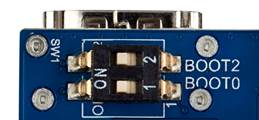

IoT Edge Get Started with STM32MP157A
===
---

# Table of Contents

-   [Introduction](#Introduction)
-   [Step 1: Prerequisites](#Prerequisites)
-   [Step 2: Prepare your Device](#PrepareDevice)
-   [Step 3: Create IoT edge device and module](#Create)
-   [Step 4: Manual Test for Azure IoT Edge on device](#Manual)

# Introduction

**About this document**

This document describes how to connect STM32MP157A device running Linux 64 bits OS with Azure IoT Edge Runtime pre-installed and Device Management. This multi-step process includes:

-   Configuring Azure IoT Hub
-   Registering your IoT device
-   Build and Deploy client component to test device management capability
 

# Step 1: Prerequisites

You should have the following items ready before beginning the process:

###Prepare PC
OS: Linux 64 bits (Tested with Ubuntu 18.04 and 16.04)

The table below correspond to the minimal validated configuration:

| Hardware item | Minimal validated configuration | Comments / Recommendations | 
| ------------- |:-------------------------------:| -----:|
| CPU           | core i5-2540M @ 2.6GHz 2 cores (4 threads) 3MB cache | 64 bits instruction set is mandatory 8 cores/threads or more is a good config moreover for Developer Package and Distribution Package. |
| RAM           | 8GB     |   16GB or more is recommended especially for Virtual Machine setup , Developer Package and Distribution Package. |
| Hard Drive | 320GB     |  1TB is probably a better config when using Distribution Package |

###Prepare your development environment

1.  Create your STM32MPU workspace directory on your host computer

        PC $> mkdir $HOME/STM32MPU_workspace

        PC $> cd $HOME/STM32MPU_workspace

2.  Install the tools (More details on [here](https://wiki.st.com/stm32mpu/index.php/Getting_started/STM32MP1_boards/STM32MP157C-DK2/Let%27s_start/Populate_the_target_and_boot_the_image) )

     2.1  STM32CubeProgrammer

     -   STM32CubeProgrammer requires 1.8 version of the Java platform.

            PC $> sudo apt-get install openjdk-8-jre

            PC $> sudo update-alternatives --config java

       Select the java-8-openjdk configuration.

     -   Create your STM32MPU tools directory on your host computer

            PC $> mkdir $HOME/STM32MPU_workspace/STM32MPU-Tools

            PC $> mkdir $HOME/STM32MPU_workspace/STM32MPU-Tools/STM32CubeProgrammer-2.2.0

     -   Download [STM32CubeProgrammer v2.2.0](https://www.st.com/en/development-tools/stm32cubeprog.html#getsoftware-scroll)

     -   Uncompress the archive file to get the STM32CubeProgrammer installers

     -   Execute the Linux installer, which guides you through the installation process. Select "$HOME/STM32MPU-Tools/STM32CubeProgrammer-2.2.0" as the installation directory, when it's requested by the installer

    -   Add the STM32CubeProgrammer binary path to your PATH environment variable

            export PATH=$HOME/STM32MPU_workspace/STM32MPU-Tools/STM32CubeProgrammer-2.2.0/bin:$PATH

    -   Check that the STM32CubeProgrammer tool is properly installed and accessible

            PC $> STM32_Programmer_CLI --h

            -------------------------------------------------------------------

                          STM32CubeProgrammer v2.2.0                 

            -------------------------------------------------------------------

     2.2  USB serial link

    -   Install the libusb on your host computer
  
            PC $> sudo apt-get install libusb-1.0-0

    -   To allow STM32CubeProgrammer to access the USB port through low-level commands, proceed as follows
    
            PC $> cd $HOME/STM32MPU_workspace/STM32MPU-Tools/STM32CubeProgrammer-2.2.0/Drivers/rules

            PC $> sudo cp *.* /etc/udev/rules.d/

3.  Install distribution Package

     3.1  Install extra Ubuntu packages

         PC $> sudo apt-get update

         PC $> sudo apt-get install sed wget curl cvs subversion git-core coreutils unzip texi2html texinfo docbook-utils gawk python-pysqlite2 diffstat help2man make gcc build-essential g++ desktop-file-utils chrpath libxml2-utils xmlto docbook bsdmainutils iputils-ping cpio python-wand python-pycryptopp python-crypto

         PC $> sudo apt-get install libsdl1.2-dev xterm corkscrew nfs-common nfs-kernel-server device-tree-compiler mercurial u-boot-tools libarchive-zip-perl

         PC $> sudo apt-get install ncurses-dev bc linux-headers-generic gcc-multilib libncurses5-dev libncursesw5-dev lrzsz dos2unix lib32ncurses5 repo libssl-dev

         PC $> sudo apt-get install default-jre

     3.2  Install the STM32MP1 OpenSTLinux distribution (More details on [here](https://wiki.st.com/stm32mpu/wiki/STM32MP1_Distribution_Package#Fast_links_to_essential_commands))

    -   create and go to the distribution package directory
    
            $ mkdir $HOME/STM32MPU_workspace/Distribution-Package

            $ cd $HOME/STM32MPU_workspace/Distribution-Package

    -   Create the OpenSTLinux distribution installation sub-directory:
         
            $ mkdir openstlinux-4.19-thud-mp1-19-10-09

            $ cd openstlinux-4.19-thud-mp1-19-10-09

    -   Initialize repo in the current directory (More details on 'repo init' [here](https://source.android.com/setup/develop/repo#init)).
         
            $ repo init -u https://github.com/STMicroelectronics/oe-manifest.git -b refs/tags/openstlinux-4.19-thud-mp1-19-10-09

    -   Synchronize the local project directories with the remote repositories specified in the manifest (more details on 'repo sync' [here](https://source.android.com/setup/develop/repo#sync))
    
            $ repo sync

     3.3  Get meta-iotedge and the dependencies (More details on [here](https://github.com/Azure/meta-iotedge/tree/thud) )

         PC $> cd $HOME/STM32MPU_workspace/Distribution-Package

         PC $> git clone -b thud [https://github.com/Azure/meta-iotedge.git](https://github.com/Azure/meta-iotedge.git)

         PC $> git clone git://github.com/meta-rust/meta-rust.git

         PC $> git clone -b thud git://git.yoctoproject.org/meta-virtualization

     3.4  Change STM32MP1 Distribution Package for IoT edge

    -   Initializing the OpenEmbedded build environment
    
        The OpenEmbedded environment setup script must be run once in each new working terminal in which you use the BitBake or devtool tools (see later):

            PC $> cd $HOME/STM32MPU_workspace/Distribution-Package/openstlinux-4.19-thud-mp1-19-10-09

            PC $> DISTRO=openstlinux-weston MACHINE=stm32mp1 source layers/meta-st/scripts/envsetup.sh

    -   Add the meta-iotedge layer and dependencies to build configuration

            $ bitbake-layers add-layer $HOME/STM32MPU_workspace/Distribution-Package/meta-rust/

            $ bitbake-layers add-layer $HOME/STM32MPU_workspace/Distribution-Package/meta-virtualization/

            $ bitbake-layers add-layer $HOME/STM32MPU_workspace/Distribution-Package/meta-iotedge/

    -   Change the config file for iot edge

      -   Add DISTRO_FEATURES_append = " virtualization" into $HOME/STM32MPU_workspace /Distribution-Package/openstlinux-4.19-thud-mp1-19-10-09/layers/meta-st/meta-st-openstlinux/conf/distro/openstlinux-weston.conf

      -   Add IMAGE_INSTALL_append += "iotedge-daemon iotedge-cli libiothsm-std docker docker-contrib connman connman-client" into $HOME/STM32MPU_workspace /Distribution-Package/openstlinux-4.19-thud-mp1-19-10-09/build-openstlinuxweston-stm32mp1/conf/local.conf

      -   Change ROOTFS_PARTITION_SIZE = "763904" to ROOTFS_PARTITION_SIZE = "2097152" in $HOME/STM32MPU_workspace /Distribution-Package/openstlinux-4.19-thud-mp1-19-10-09/layers/meta-st/meta-st-stm32mp/conf/machine/include/st-machine-common-stm32mp.inc file

      -   Add CONFIG_EXT4_FS_SECURITY=y into $HOME/STM32MPU_workspace /Distribution-Package/openstlinux-4.19-thud-mp1-19-10-09/layers/meta-st/meta-st-stm32mp\recipes-kernel/linux/linux-stm32mp/4.19/fragment-03-systemd.config

    -   Build the image and resolve build errors

        Use the bitbake command to build the image

            $ bitbake st-image-weston

        This task will take a long time (about 4-8 hours). In the build process Bitbake will sync the iot edge source code from github and then do compile, in the compile section we will get errors like these:

        error: trait objects without an explicit `dyn` are deprecated

        --> workload/src/apis/workload_api.rs:37:14

        |

        37 |     ) -> Box<Future<Item = ::models::CertificateResponse, Error = Error<serde_json::Value>>>;

        |              ^^^^^^^^^^^^^^^^^^^^^^^^^^^^^^^^^^^^^^^^^^^^^^^^^^^^^^^^^^^^^^^^^^^^^^^^^^^^^^ help: use `dyn`: `dyn Future<Item = ::models::CertificateResponse, Error = Error<serde_json::Value>>`

        |

        We should go to $HOME/STM32MPU_workspace/Distribution-Package/openstlinux-4.19-thud-mp1-19-10-09/ build-openstlinuxweston-stm32mp1/tmp-glibc/work/cortexa7t2hf-neon-vfpv4-openstlinux_weston-linux-gnueabi/iotedge-daemon/1.0.8-r0/iotedge-1.0.8/edgelet/workload/src/apis folder and do the follow changes of the source codes( client.rs , configuration.rs, workload_api.rs):

        ####configuration.rs : 19

        pub uri_composer: Box<Fn(&str, &str) -> Result<Uri, Error>> ---> pub uri_composer: Box<dyn Fn(&str, &str) -> Result<Uri, Error>>

        ####client.rs:7

        workload_api: Box<::apis::WorkloadApi> --->

        workload_api: Box<dyn (::apis::WorkloadApi)>

        ####client.rs:22

        pub fn workload_api(&self) -> &::apis::WorkloadApi ---> pub fn workload_api(&self) -> &dyn (::apis::WorkloadApi)

        ####workload_api.rs:37

        Box<Future<Item = ::models::CertificateResponse, Error = Error<serde_json::Value>>> --->

        Box<dyn Future<Item = ::models::CertificateResponse, Error = Error<serde_json::Value>>>

        ####workload_api.rs:44

        Box<Future<Item = ::models::CertificateResponse, Error = Error<serde_json::Value>>> --->

        Box<dyn Future<Item = ::models::CertificateResponse, Error = Error<serde_json::Value>>>

        ####workload_api.rs:51

        Box<Future<Item = ::models::DecryptResponse, Error = Error<serde_json::Value>>> --->

        Box<dyn Future<Item = ::models::DecryptResponse, Error = Error<serde_json::Value>>>

        ####workload_api.rs:58

        Box<Future<Item = ::models::EncryptResponse, Error = Error<serde_json::Value>>> --->

        Box<dyn Future<Item = ::models::EncryptResponse, Error = Error<serde_json::Value>>>

        ####workload_api.rs:65

        Box<Future<Item = ::models::SignResponse, Error = Error<serde_json::Value>>> --->

        Box<dyn Future<Item = ::models::SignResponse, Error = Error<serde_json::Value>>>

        ####workload_api.rs:69

        Box<Future<Item = ::models::TrustBundleResponse, Error = Error<serde_json::Value>>> --->

        Box<dyn Future<Item = ::models::TrustBundleResponse, Error = Error<serde_json::Value>>>

        ####workload_api.rs:83

        Box<Future<Item = ::models::CertificateResponse, Error = Error<serde_json::Value>>> --->

        Box<dyn Future<Item = ::models::CertificateResponse, Error = Error<serde_json::Value>>>

        ####workload_api.rs:151

        Box<Future<Item = ::models::CertificateResponse, Error = Error<serde_json::Value>>> --->

        Box<dyn Future<Item = ::models::CertificateResponse, Error = Error<serde_json::Value>>>

        ####workload_api.rs:220

        Box<Future<Item = ::models::DecryptResponse, Error = Error<serde_json::Value>>> --->

        Box<dyn Future<Item = ::models::DecryptResponse, Error = Error<serde_json::Value>>>

        ####workload_api.rs:289

        Box<Future<Item = ::models::EncryptResponse, Error = Error<serde_json::Value>>> --->

        Box<dyn Future<Item = ::models::EncryptResponse, Error = Error<serde_json::Value>>>

        ####workload_api.rs:358

        Box<Future<Item = ::models::SignResponse, Error = Error<serde_json::Value>>> --->

        Box<dyn Future<Item = ::models::SignResponse, Error = Error<serde_json::Value>>> 

        ####workload_api.rs:423

        Box<Future<Item = ::models::TrustBundleResponse, Error = Error<serde_json::Value>>> --->

        Box<dyn Future<Item = ::models::TrustBundleResponse, Error = Error<serde_json::Value>>>

        After changes were completed re-run ‘bitbake st-image-weston ’ command.

# Step 2: Prepare your Device

**Populate the target and boot the image**

1.  Set the boot switches (located at the back of the board) to the off position

    

2.  Power up the board

3.  Press the reset button to reset the board

4.  Go to the Package directory($HOME/STM32MPU_workspace/Distribution-Package/openstlinux-4.19-thud-mp1-19-10-09/build-openstlinuxweston-stm32mp1/tmp-glibc/deploy/images/stm32mp1) that contains the binaries and the Flash layout files

5.  Get the device port location for the USB link

        PC $> STM32_Programmer_CLI -l usb

        -------------------------------------------------------------------

                           STM32CubeProgrammer v2.2.0                 

        -------------------------------------------------------------------

        =====  DFU Interface   =====

        Total number of available STM32 device in DFU mode: 1

         Device Index           : USB1

         USB Bus Number         : 003

         USB Address Number     : 002

         Product ID             : DFU in HS Mode @Device ID /0x500, @Revision ID /0x0000

         Serial number          : 004800233338511634383330

         Firmware version       : 0x0110

         Device ID              : 0x0500

6.  Program the microSD card with the image for the trusted boot chain

        PC $> STM32_Programmer_CLI -c port=usb1 -w flashlayout_st-image-weston/FlashLayout_sdcard_stm32mp157c-dk2-trusted.tsv

     The flash programming operation takes several minutes (mainly depending of the rootfs size). A successful flash programming should be terminated by this following log information

     Flashing service completed successfully

7.  Set the boot switches (located at the back of the board) to the on position

    

   -   Power up the board
   -   Press the reset button to reset the board
   
   
# Step 3: Create IoT edge device and module

1.  Sign in to the [Azure portal](https://portal.azure.com/#home) and navigate to your IoT hub.
2.  Select IoT Edge from the menu.
3.  Click Add an IoT Edge device.
4.  Click on the ID of the target device from the list of devices.
5.  Select Set Modules.
6.  Click Add and then click IoT Edge Module to add a new module
7.  Do the following setting for the Module and then click Save:

        Name - SimulatedTemperatureSensor 

        Image URI - mcr.microsoft.com/azureiotedge-simulated-temperature-sensor:1.0.9-rc2-linux-arm32v7

8.  Select Next to the routes section
9.  Click Submit to deploy the module
10. Click Set Modules and then select Configure advanced Edge Runtime settings
11. Change the image value of Edge Hub and Edge Agent like these:

        Edge Hub Image - mcr.microsoft.com/azureiotedge-hub:1.0.8-linux-arm32v7

        Edge Agent Image - mcr.microsoft.com/azureiotedge-agent:1.0.8-linux-arm32v7

12. Click Save
13. Go back you created IoT Edge device and make a note of Connection String

# Step 4: Manual Test for Azure IoT Edge on device

1.  Get the IP address of your board

        Board $> ip addr show eth0                                                                          

        3: eth0: <BROADCAST,MULTICAST,UP,LOWER_UP> mtu 1500 qdisc mq state UP group default qlen 1000

          link/ether 00:xx:xx:xx:xx:xx brd ff:ff:ff:ff:ff:ff

          inet xx.xx.xx.xx/22 brd xx.xx.xx.xx scope global dynamic eth0

             valid_lft 159045sec preferred_lft 159045sec

          inet6 xx::xx:xx:xx:xx/64 scope link

             valid_lft forever preferred_lft forever

2.  On the host computer connect the terminal to the board using ssh

        PC $> ssh root@xx.xx.xx.xx

        root@stm32mp1:~#

3.  Use the following command to open IoT edge config file

        root@stm32mp1:~# vi /etc/iotedge/config.yaml

4.  Update the value of device_connection_string with the connection string from your IoT Edge device.

        # Manual provisioning configuration
   
        provisioning:
   
          source: "manual"
   
          device_connection_string: "<ADD DEVICE CONNECTION STRING HERE>"

5.  Update the value of hostname, connect.management_uri, connect.workload_uri, listen.management_uri, listen.workload_uri

        hostname: "stm32mp1"
   
        connect:
   
          management_uri: "unix:///var/run/iotedge/mgmt.sock"
   
          workload_uri: "unix:///var/run/iotedge/workload.sock"

        listen:

          management_uri: " unix:///var/run/iotedge/mgmt.sock "

          workload_uri: " unix:///var/run/iotedge/workload.sock"

6.  Run the following commands:

        root@stm32mp1:~# chown iotedge:iotedge /var/run/iotedge/

        root@stm32mp1:~# chown iotedge:iotedge /var/lib/iotedge/

7.  Restart daemon

        root@stm32mp1:~# systemctl restart iotedge

8.  View iotedge log

        root@stm32mp1:~# journalctl -u iotedge -f

