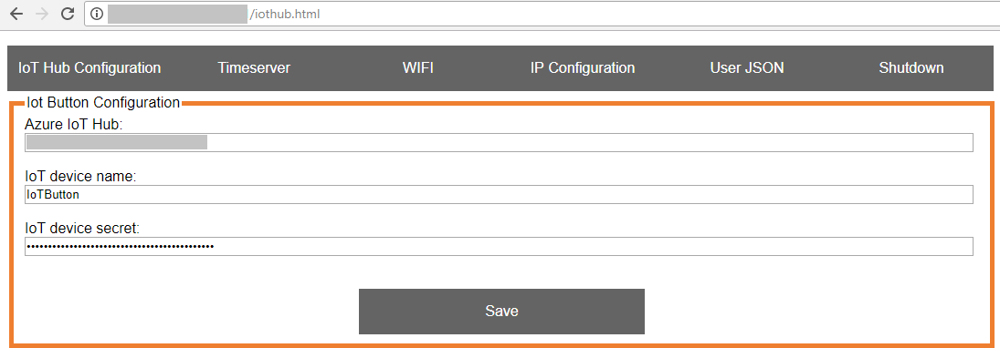

Run a simple Python sample on teXXmo IoT Button device running micropython
===
---

# Table of Contents

-   [Introduction](#Introduction)
-   [Step 1: Prerequisites](#Prerequisites)
-   [Step 2: Prepare your Device](#PrepareDevice)
-   [Step 3: Configure and Run the Sample](#Run)
-   [Next Steps](#NextSteps)

# Introduction

**About this document**

This document describes how to connect teXXmo IoT Button device running micropython with Azure IoT Hub. This multi-step process includes:
-   Configuring Azure IoT Hub
-   Registering your IoT device
-   Configure the device and run the IoT sample

# Step 1: Prerequisites

You should have the following items ready before beginning the process:

-   [Setup your IoT hub][lnk-setup-iot-hub]
-   [Provision your device and get its credentials][lnk-manage-iot-hub]
-   teXXmo IoT Button device.

# Step 2: Prepare your Device

# Step 3: Run the sample

## 3.1 Configure the Azure IoT settings

-   Hold power button for 5 sec. LED changes from Green Flash to Yellow, then Red flash.When LED flashes in RED, the device is in AP Mode. It can be Smartphone as well 
-   From any desktop machine, connect to the device via WiFi using the SSID : ESP_<Last 3 digits of MAC Address>.

	
				
-   Access to Web Interface and REST API with 192.168.4.1

	
				
-   Use IoT Hub Configuration to set IoT Hub Device connection string.

       
		
-   Use WiFi settings to set a local WiFi connection.

       
		
-   Use User JSON to set JSON data to append to message.

       
		
-   Make sure to call Shutdown to save setting. 

       
    
### 3.2 Send Telemetry to IoT Hub Sample:

-	Single Click (more like short press rather than click) the power button. This will send message to IoT Hub. See [Manage IoT Hub][lnk-manage-iot-hub] to learn how to observe the messages IoT Hub receives from the application. 

     

# Next Steps

You have now learned how to run a sample application that collects sensor data and sends it to your IoT hub. To explore how to store, analyze and visualize the data from this application in Azure using a variety of different services, please click on the following lessons:

-   [Manage cloud device messaging with iothub-explorer]
-   [Save IoT Hub messages to Azure data storage]
-   [Use Power BI to visualize real-time sensor data from Azure IoT Hub]
-   [Use Azure Web Apps to visualize real-time sensor data from Azure IoT Hub]
-   [Weather forecast using the sensor data from your IoT hub in Azure Machine Learning]
-   [Remote monitoring and notifications with Logic Apps]   

[Manage cloud device messaging with iothub-explorer]: https://docs.microsoft.com/en-us/azure/iot-hub/iot-hub-explorer-cloud-device-messaging
[Save IoT Hub messages to Azure data storage]: https://docs.microsoft.com/en-us/azure/iot-hub/iot-hub-store-data-in-azure-table-storage
[Use Power BI to visualize real-time sensor data from Azure IoT Hub]: https://docs.microsoft.com/en-us/azure/iot-hub/iot-hub-live-data-visualization-in-power-bi
[Use Azure Web Apps to visualize real-time sensor data from Azure IoT Hub]: https://docs.microsoft.com/en-us/azure/iot-hub/iot-hub-live-data-visualization-in-web-apps
[Weather forecast using the sensor data from your IoT hub in Azure Machine Learning]: https://docs.microsoft.com/en-us/azure/iot-hub/iot-hub-weather-forecast-machine-learning
[Remote monitoring and notifications with Logic Apps]: https://docs.microsoft.com/en-us/azure/iot-hub/iot-hub-monitoring-notifications-with-azure-logic-apps
[lnk-setup-iot-hub]: ../setup_iothub.md
[lnk-manage-iot-hub]: ../manage_iot_hub.md
