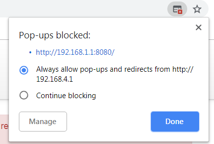

Connecting CloudGate to Azure IoThub
===
---

# Table of Contents

-   [Introduction](#Introduction)
-   [Step 1: Prerequisites and Preparation](#Prerequisites)
-   [Step 2: Getting started with CloudGate](#Build)
-   [Step 3: Create and Deploy the Example](#Build)
-   [Next Steps](#NextSteps)

# Introduction

**About this document**

This document describes how to connect the CloudGate device running luvitred with Azure IoT SDK. This multi-step process includes:
-   Configuring Azure IoT Hub
-   Registering your IoT device
-   Connect your device to Azure IoT

# Step 1: Prerequisites and Getting started

You should have the following items ready before beginning the process:

You can download a Quickstart guide for CloudGate [here](https://cloudgateuniverse.com/system/files/Documentation/2003998_-_cloudgate_qsg_lte_2003998.pdf)

-   Create an account on CloudGate Universe. This is the platform that contains all CloudGate documentation and handles the provisioning of the devices. <https://cloudgateuniverse.com/>
-   Activate your device on CloudGate Universe with the serial number and the activation code. These can be found on the sticker on the bottom of the device. https://cloudgateuniverse.com/docs/activating-cloudgate
-   Internet access on the CloudGate
-   Set up your IoTHub
-   Add your device to your IoTHub and get its connection string. 

# Step 2: Getting started with CloudGate

## 2.1 Connect to your CloudGate:

Getting to know the CloudGate will make following this guide a lot easier. You can log in to the CloudGate web UI by connecting the device to a PC using a LAN cable. With standard settings, you can reach the UI on IP address `192.168.1.1.`

For further steps it is important to set the device up with an internet connection. To be able to access the device and have internet at the same time, you can set up the CloudGate in your routed network. For this to work, you will need to change the firewall rules, or set up port forwarding.  <https://cloudgateuniverse.com/docs/firewall-tab> 

The easiest way to connect the CG to the internet is by inserting a SIM card with internet access. Don't forget to enter the PIN and APN settings, if needed, in the 3G/LTE Tab. To confirm internet access, look for the connection status on the Home tab of CloudGate's web UI. 

 

## 2.1 Install LuvitRed:

 Install LuvitRed on your device. This is done through CloudGate Universe. The CloudGate needs to be connected to the internet to download the update. When the device or group settings for the application are set, the CloudGate will download LuvitRed upon the next check-in. You can accelerate this by doing a reboot. During the process of installation, the CloudGate will reboot once again. <https://cloudgateuniverse.com/docs/managing-applications-configs>

When logged in to the CloudGate web UI, you can find the LuvitRed Editor under the Plugins tab. If you can't find LuvitRed there or you don't see a Plugin tab, make sure the device is booted all the way (wait a bit) and make sure LuvitRed is installed. (See Home tab)

**Plugins>LuvitRed>Advanced Editor**

Your browser might block LuvitRed popping up, so make sure you allow your browser to let LuvitRed open.

 

# Step 3: Create and Run the Example

## 3.1 Create the example

There are two samples one for sending messages to IoT Hub and another for receiving messages from IoT Hub. These examples are made by using the IoTHub In- and Out nodes. 
    
### 3.2.1 Send Telemetry to IoT Hub Sample:

This example uses an inject node and the IotHub out node. In the configuration of the inject node, you type a string which will be sent over to IotHub. 'Hello' For example. 
The IoTHub node also needs to be configured. Click **add new IoTHub>Pencil**

### 3.1.1 Send message from IoT Hub to Device Sample:

This example is made by connecting a debug node to the IoThub In node. All messages received, will be shown in the debug screen, on the right side of the page. For this example, you can select the same node config as used in the IoTHub out example. 

### 3.1.1 Deploy the example:
When the nodes are placed and configured, the flow can be **deployed**. The Deploy button is located in the top right corner of the LuvitRed editor. This action sends the nodes to the CloudGate and creates the corresponding code. The code will start running and the results will be shown in the LuvitRed editor. 

## 3.2 Run and Validate the Examples

You can now send messages to your IoThub by clicking the green tab on the left side of the inject node. Congratulations! You have connected the CloudGate to IoTHub!

# Next Steps

You have now learned how to run a sample application that creates a string and sends it to your IoT hub. Now you have reached this milestone, you can go ahead and start experimenting! Take a look at LuvitRed's node collection and start creating awesome flows. Some very usefull nodes are the function node and the template node. You can find a lot of documentation in both the info tab in LuvitRed, and CloudGate Universe.  

To explore how to store, analyze and visualize the data from this application in Azure using a variety of different services, please click on the following lessons:

-   [Manage cloud device messaging with iothub-explorer]
-   [Save IoT Hub messages to Azure data storage]
-   [Use Power BI to visualize real-time sensor data from Azure IoT Hub]
-   [Use Azure Web Apps to visualize real-time sensor data from Azure IoT Hub]
-   [Weather forecast using the sensor data from your IoT hub in Azure Machine Learning]
-   [Remote monitoring and notifications with Logic Apps]   

[Manage cloud device messaging with iothub-explorer]: https://docs.microsoft.com/en-us/azure/iot-hub/iot-hub-explorer-cloud-device-messaging
[Save IoT Hub messages to Azure data storage]: https://docs.microsoft.com/en-us/azure/iot-hub/iot-hub-store-data-in-azure-table-storage
[Use Power BI to visualize real-time sensor data from Azure IoT Hub]: https://docs.microsoft.com/en-us/azure/iot-hub/iot-hub-live-data-visualization-in-power-bi
[Use Azure Web Apps to visualize real-time sensor data from Azure IoT Hub]: https://docs.microsoft.com/en-us/azure/iot-hub/iot-hub-live-data-visualization-in-web-apps
[Weather forecast using the sensor data from your IoT hub in Azure Machine Learning]: https://docs.microsoft.com/en-us/azure/iot-hub/iot-hub-weather-forecast-machine-learning
[Remote monitoring and notifications with Logic Apps]: https://docs.microsoft.com/en-us/azure/iot-hub/iot-hub-monitoring-notifications-with-azure-logic-apps
[setup-devbox-linux]: https://github.com/Azure/azure-iot-sdk-c/blob/master/doc/devbox_setup.md
[lnk-setup-iot-hub]: ../setup_iothub.md
[lnk-manage-iot-hub]: ../manage_iot_hub.md

**You can copy and paste this jason to import the example flow using menu>import>from clipboard**

	[{"id":"9c31db59.d04cb8","type":"iothub","__package":"luvitred/services","__version":"0.1.0","sas":"put your connection string here","retryTime":10,"keepalive":60,"acktimeout":20,"protolog":false,"name":"","__users":["959dac7d.1dbaa","bee0fade.f2a4c8"]},{"id":"959dac7d.1dbaa","type":"iothub in","__package":"luvitred/services","__version":"0.1.0","name":"","topic":"","iotdevice":"9c31db59.d04cb8","x":262.5,"y":275,"z":"4425fcbd.a60414","wires":[["df35c0f3.06f91"]]},{"id":"bee0fade.f2a4c8","type":"iothub out","__package":"luvitred/services","__version":"0.1.0","name":"","queueenabled":false,"queue":"_ADD_","iotdevice":"9c31db59.d04cb8","x":462.5,"y":175,"z":"4425fcbd.a60414","wires":[]},{"id":"18a67e68.9dd422","type":"inject","__package":"luvitred/core-core","__version":"0.1.0","name":"","key":"payload","topic":"","payload":"Hello","payloadType":"string","fromval":0,"toval":10,"repeat":"","crontab":"","once":false,"x":275,"y":175,"z":"4425fcbd.a60414","wires":[["bee0fade.f2a4c8"]]},{"id":"df35c0f3.06f91","type":"debug","__package":"luvitred/core-core","__version":"0.1.0","name":"","active":true,"highlight":"none","console":"false","complete":"false","x":450,"y":275,"z":"4425fcbd.a60414","wires":[]}]