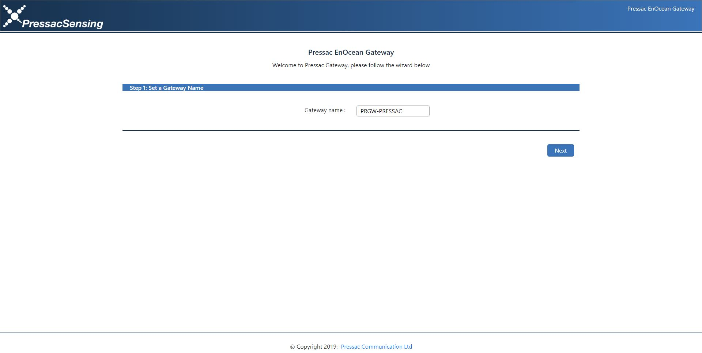
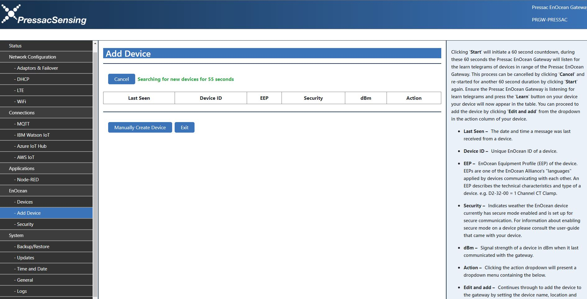

Connecting the Pressac Gateway to Azure IoT Hub
===
---

# Introduction

**About this document**

This document explains how to connect the Pressac EnOcean Gateway running Pressac Gateway Software to Azure IoT Hub. This multi-step process includes: 
-   Configuring Azure IoT Hub
-   Registering your IoT device
-   Configuring the Pressac EnOcean Gateway to send device data to Azure IoT Hub 

# Step 1: Prerequisites

You should have the following items/actions ready before beginning the process:

-   [Setup your IoT hub][lnk-setup-iot-hub]
-   [Provision your device and get its credentials][lnk-manage-iot-hub]
-   Pressac EnOcean Gateway Ethernet (E) or Ethernet, LTE and WiFi (ELW) running firmware   version 0.2.0.6 or above.
-   Pressac EnOcean device compatible with the Pressac EnOcean Gateway e.g. CO2, Temperature and Humidity Sensor (EnOcean Radio Protocol Version).
-   Computer running either Windows or OSX
-   Suitable web browser to connect to both Node-RED and the Pressac EnOcean Gateway configuration pages. 

# Step 2: Prepare your Device

Plug in one end of the Ethernet cable into your network point and plug the opposite end of the cable into the Ethernet port on the Pressac EnOcean gateway.

Connect the EnOcean antenna along by screwing it onto the connection on the Pressac EnOcean Gateway taking care not to cross thread or bend. If your gateway supports LTE and WiFi attach the antennas for these as well.

Connect your Pressac EnOcean Gateway’s power supply. Connecting the power supply will boot up the Pressac EnOcean Gateway and you will see the products LED start blinking. The Pressac EnOcean Gateway will take a few seconds to initialise.

Next you need to find the IP Address of the Pressac EnOcean Gateway. The most common way of doing this is to check your routers list of connected devices. If this is not possible the following alternative methods can be used: 

1. Windows: The Pressac EnOcean Gateway announces itself over Universal Plug and Play (UPnP) and can be found in the “Gateways” or “Other Devices” section of the Windows Network area. To find this area click “Start” search for “Network” and click “View network connected computers and devices”. Double clicking a gateway from here will open up the web-ui.
2. Mac: The Pressac EnOcean Gateway can be discovered using Bonjour. One of the easiest ways of using this method is to open “Safari”, go to “Preferences” then “Advanced” and tick “Include Bonjour in the Bookmarks menu”. Then close Preferences navigate to “Bookmarks” and you will now see all your networked Bonjour devices including the Pressac EnOcean Gateway. 

Now you have the IP Address you can use it to access the Pressac EnOcean Gateways web interface. Launch your chosen web browser and type http://<your-ip> e.g. http://192.168.1.188 This will display the Pressac EnOcean Gateway’s first boot wizard. Follow the steps on the wizard to set up your Pressac EnOcean Gateway for the first time. 

# Step 3: Add Your Devices to the Pressac EnOcean Gateway 

To learn-in a new device click “– Add Devices” in the EnOcean sub-menu on the Pressac EnOcean Gateway web-interface and then click “Start”. 

This will initiate a 60 second countdown, during these 60 seconds the Pressac EnOcean Gateway will listen for the learn telegrams of devices in range of the Pressac EnOcean Gateway. This process can be cancelled by clicking “Cancel” and re-started for another 60 second duration by clicking “Search” again.

Ensure the Pressac EnOcean Gateway is listening for learn telegrams and press the “Learn” button on your Pressac device. To locate the learn button for your device please consult your individual device manual. Once pressed a new device entry will now appear in a table with the following columns:

**Last Seen** – The Date and Time the Pressac EnOcean Gateway last received a telegram from the device
**Device ID** – The unique identification number of the device
**EEP** – EnOcean Equipment Profile used by the device. 
**Security** – Security enabled on the device Yes / No 
**dBm** – Signal strength of the device to the gateway 
**Action** – The action column contains a menu containing options to EDIT AND ADD and DELETE the device. 

Click on “Edit and add” from the menu under the Action column as shown in the above image. To edit the device a new screen will appear as shown in the image below. 

The only required field is the device name, it is advised to use a device name which resembles the function and location of the device. e.g. if your device is a CO2, Temperature and Humidity Sensor and it is situated in Classroom 1, your Device Name could be “Classroom1-CO2Temperature-Humidity”. 

Other optional properties include the location of your physical device. Please note that only characters A-Z, numbers, ‘_’ and ‘-‘ are permitted to be used in any of these fields. 

Once you have specified your desired device name and any of the other optional properties click “Save” at the bottom of the screen to save the entry. 

You can now navigate to the devices page and see the device along with its last state. Repeat step 2 until all your desired devices are learnt-in to the Pressac EnOcean Gateway. 

# Step 4: Connect Pressac EnOcean Gateway to Your Provisioned Azure IoT Hub Device 

Navigate to the Azure IoT Hub connection page by clicking “- Azure IoT Hub” in the Connections sub-menu on the Pressac EnOcean Gateway web-interface and then change the Azure IoT Hub Connection from “OFF” to “ON”.

Once you have switched “ON” the connection you will need to input the Hostname, Device ID and Access Key from your Azure Device connection string.  

    HostName=Hostname;DeviceId=DeviceID;SharedAccessKey=AccessKey 

After inputting your connection details select which data you would like to be included in the payload and click “Save”. The Azure IoT Hub connection status will now change to “Connected”. 

# Next Steps

You have now learned how to run a sample application that collects sensor data and sends it to your IoT hub. To explore how to store, analyze and visualize the data from this application in Azure using a variety of different services, please click on the following lessons:

-   [Manage cloud device messaging with iothub-explorer]
-   [Save IoT Hub messages to Azure data storage]
-   [Use Power BI to visualize real-time sensor data from Azure IoT Hub]
-   [Use Azure Web Apps to visualize real-time sensor data from Azure IoT Hub]
-   [Weather forecast using the sensor data from your IoT hub in Azure Machine Learning]
-   [Remote monitoring and notifications with Logic Apps]   

[Manage cloud device messaging with iothub-explorer]: https://docs.microsoft.com/en-us/azure/iot-hub/iot-hub-explorer-cloud-device-messaging
[Save IoT Hub messages to Azure data storage]: https://docs.microsoft.com/en-us/azure/iot-hub/iot-hub-store-data-in-azure-table-storage
[Use Power BI to visualize real-time sensor data from Azure IoT Hub]: https://docs.microsoft.com/en-us/azure/iot-hub/iot-hub-live-data-visualization-in-power-bi
[Use Azure Web Apps to visualize real-time sensor data from Azure IoT Hub]: https://docs.microsoft.com/en-us/azure/iot-hub/iot-hub-live-data-visualization-in-web-apps
[Weather forecast using the sensor data from your IoT hub in Azure Machine Learning]: https://docs.microsoft.com/en-us/azure/iot-hub/iot-hub-weather-forecast-machine-learning
[Remote monitoring and notifications with Logic Apps]: https://docs.microsoft.com/en-us/azure/iot-hub/iot-hub-monitoring-notifications-with-azure-logic-apps
[lnk-setup-iot-hub]: ../setup_iothub.md
[lnk-manage-iot-hub]: ../manage_iot_hub.md

