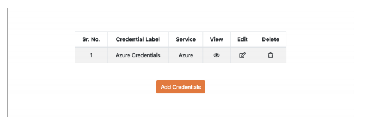
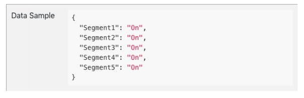
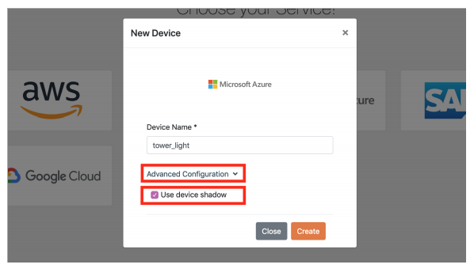
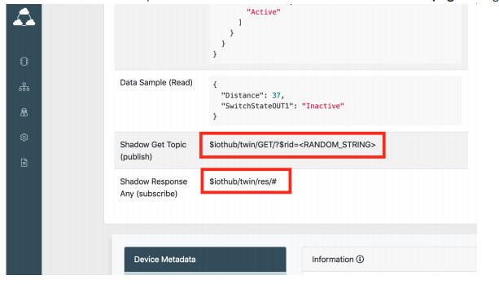

Run a simple JavaScript(Node) sample on CloudRail Box device running Raspbian Linux
===
---

## Sign up for Azure

**Note:** If you have an Azure account you can skip this step.

In order to use Microsoft Azure with Device Management Cloud you must have an Azure account and have created an IoT Hub
service.

You can follow the instructions below to create an Azure account.
Go to (<https://www.azure.com>) and click the green **Start free** button.
Next, click another "Start free" button.

If you already have an account with Microsoft, for example, Office 365, you’ll be prompted to log in.

When you log in, some of your details may already be there.

Follow the prompts to verify your account by phone (you can use SMS).
You’ll also need to supply a valid credit card. Prepaid credit cards won’t work, you’ll need a “normal” credit or debit card.
There is no charge involved with the setting up of a trial account. Microsoft just wants to see your card to verify your identity.

In Agreement select **I agree** and click the Sign up button.

Within a few seconds (or minutes), your account will be ready.

Your Microsoft Azure account has been created.
To continue, click the **My Account** link at the top right corner or go straight to the Microsoft Azure Portal:
<https://portal.azure.com/>

## Create an IoT Hub

Once you have logged into for Azure portal. Go to **All services** and search for IoT Hub.

In the IoT Hub add a hub by adding the following product details.

-   **Select Subscription:**
-   **Resource Group:**Create a new one if you don't have one
-   **Region:**Your Region
-   **IoT Hub Name:** (e.g. NewSampleIoTHub)

Once you have added the following press the **Review + create** button and the IoT Hub will take a few minutes to deploy.
Once The IoT Hub is deploy you should see **Your deployment is complete**. Now click on the Resource (IoT Hub Name e.g.
NewSampleIoTHub)

The IoT Hub should look this (below). Now you are ready to use Azure with the Management Cloud.

## Get Shared access policies

Shared access policies is used to give device permissions. This can be found in the side menu **Settings** and **Shared access
policies.**

Under **POLICY** click on **registryReadWrite** to see the Permissions.
For **registryReadWrite** you must give the following permissions: **Registry write Service connect and Device connect** Click the Save button to save the permissions.

If you wish to use Credential Manager or automatically add devices you need the following (which are available on the Shared
access policies).

-   **Policy Key:** Is the Primary key of registryReadWrite
-   **Endpoint:** Azure endpoint is IoTHubName.azure‑devices.net (e.g. NewSampleIoTHub.azure‑devices.net)

## Adding Azure Credentials to Credentials Manager (Recommended)

**Note: If you wish to Add Devices Manually you can skip this section.**You can go to the section [Manually Creating a Device](https://devices.cloudrail.com/documentation)

To add Azure credentials to **Credential Manager**. Click on the credential logo as shown below. Select Azure and afterwards press the **Add Credentials** button.

To add Azure Credentials you need the following

-   **Credential Label:** Any name you want to give credential (e.g. Azure Credentials)
-   **Policy Key:** How to get the policy key can be found in the section [Get Shared access policies](https://devices.cloudrail.com/documentation)
-   **Endpoint:** The endpoint is **IoTHubName.azure‑devices.net** (e.g. NewSampleIoTHub.azure‑devices.net).

After you have added all the fields press the Add Credentials button

Once you have added the credentials you should see them in the Credential Manager. You can view the credential, edit or delete. Now you can use this credential's to easy add devices by going to the section [Adding a Device](https://devices.cloudrail.com/documentation).

## Manually Creating Device in Azure

To add a device go to your IoT Hub and from the side menu go to **Explorers** and click on **IoT devices**.

To add a new device click on the **+Add** button.

To create a device you need to do the following

-   **Device ID:** Add the device id which is the device name (e.g temp\_device).
-   **Authentication Type:** Select Sysmmetric key
-   **Auto‑generate type:** Tick this
-   **Connect this device to an IoT Hub:** Enable this

Once you have filled and selected the fields above press the **Save** button to create the device.

Once the device is created you can see in under **IoT devices**. Click on the device to get the required fields

Once in the **Device details** you need the following to manually add the device in Management Cloud.

-   **Device Name:** Which is the Device Id (e.g temp_device).
-   **Primary Key:** Which is the Primary key.
-   **Endpoint:** The endpoint is IoTHubName.azure‑devices.net (e.g. NewSampleIoTHub.azure‑devices.net).

## Adding a Device

To add a device go to the **Boxes** page and click on **New Connection**

For this example we will use a Temperature sensor and it will send data after every 2 seconds (2000 milliseconds) interval

Select the Temperature sensor (from Port 1) and press **Next Step** button.

Select the Frequency as Interval. Enter 2000 ms and press the **Next** button.

On the Cloud Platform services select Azure.

If you have credentials added for Azure you can go to [Create device](https://devices.cloudrail.com/documentation). For [Automatically add a device](https://devices.cloudrail.com/documentation) or [Manually add a device](https://devices.cloudrail.com/documentation)

## Manually add a device

If you have no credentials add you can add a device manually by pressing the **Manual** button.

To add a device manually you need the following

-   **Device Primary Key:**Is the primary key generated which creating the device. How to get the primary key can be found in
the section [Manually Creating Device](https://devices.cloudrail.com/documentation) in Azure
-   **Endpoint:** The endpoint is **IoTHubName.azure‑devices.net** (e.g. NewSampleIoTHub.azure‑devices.net).

## Automatically add a device

If you have no credentials add you can add a device automatically (without saving credentials) by pressing the **Auto** button.

To add a device automatically you need the following

-   **Policy Key:**The policy key can be found in the section[ Get Shared access policies](https://devices.cloudrail.com/documentation)
-   **Endpoint:** The endpoint is **IoTHubName.azure‑devices.net** (e.g. NewSampleIoTHub.azure‑devices.net).

## Create device

**Note: If you have credentials added you will be brought directly to here.**

To create a new device, enter a device name (e.g. temp_device) and press the **Create** button.
**Note:** For manually adding a device, the Device Name must be the same as the one added in Azure

## Device Metadata

Once you have created the device you will the device metadata. The metadata give basic like Platform, Box, Device Info etc.

The important information is **MQTT** topic subscribe or publish to device depending on your device or the frequency selected.

Data Scheme (JSON type of data) and **Data Sample** which you receieve from the device or send to device.

## Subscribe to device

For subscibe to device we will use the existing Temperature Sensor that we added in the section [Adding a Device](https://devices.cloudrail.com/documentation). Once this device has been added data should automatically start coming in.

You can connect this device to [Power Bi](https://powerbi.microsoft.com/en-us/) and see the information from the sensor

You can also get basic information to tell if the device is active by seeing last activity.

## Publish to device

Before we publish to device we will add new device, Tower Light (e.g tower‑light) Sensor to port 2. To add a device see section [Adding a Device](https://devices.cloudrail.com/documentation)

Once we have added the device we can use the Data Sample to publish to device.

Now go to the device (e.g. tower‑light) in the IoT devices. On in the Device details click on the **Message to device** button.

In **Message** to device add the sample data JSON from the device metadata to the **Mesage Body** and press the **Send Message** button and this will send the data to the device.

## Device Twin (Shadow)

Before we use the Twins (Shadow) feature, we will add new device, Tower Light (e.g tower_light) sensor to port 2. When selecting the device name click in the **advanced configuration** and check the box for **use device shadows**. To add a device see section [Adding a Device](https://devices.cloudrail.com/documentation).

Now the device is already configured to use Azure Twins and CloudRail Box will handle the Twins tasks that should be handled by the device, like receiving updates on Twins changes, apply those updates on the device, and report back the state to the Twins.

The topics related to the Twins can be seen in the **details page** configured device.

For better understanding on how to operate with device Twins (shadows) from the Azure point of view, you can check their own documentation and specifications, we`ve gathered some of the references that can be helpful:

-   [Understanting Azure Twins](https://docs.microsoft.com/en-us/azure/iot-hub/iot-hub-devguide-device-twins)
-   [Understanding Module Twins](https://docs.microsoft.com/en-us/azure/iot-hub/iot-hub-devguide-device-twins)
-   [Azure Portal](https://portal.azure.com/), to access twins online tool navigate to **IoT‑Hub ‑> [HUB_NAME] ‑> IoT‑Devices ‑> [DEVICE_NAME] ‑>Device Twin**

