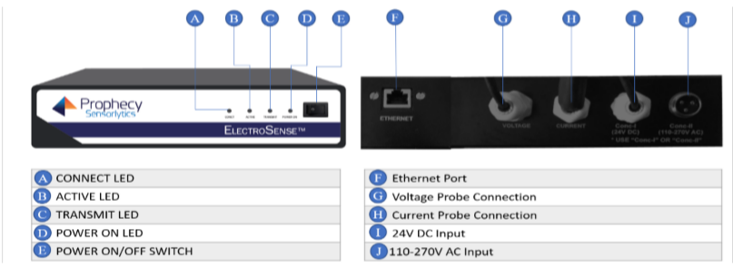
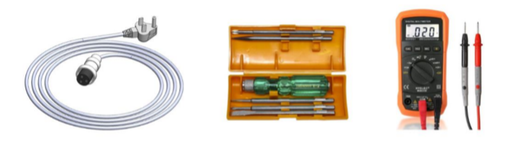
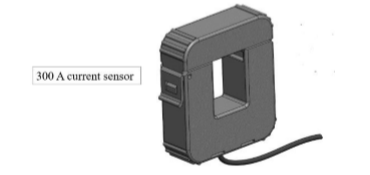
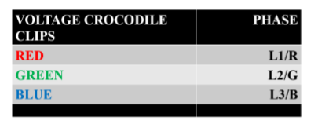
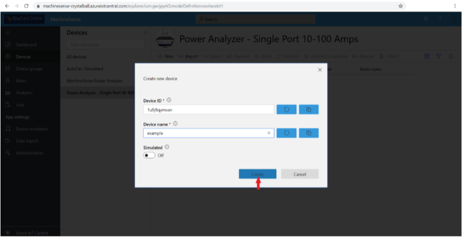
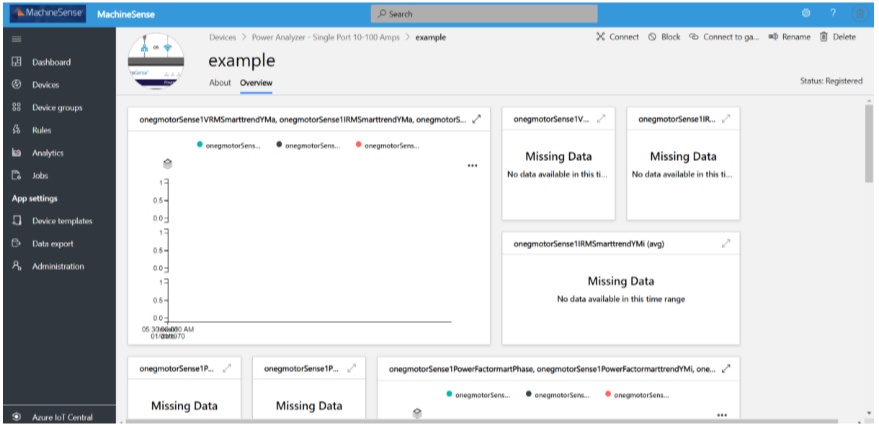

--- 
platform: raspbian 
device: power analyzer – single port 10-100 amps 
language: python 3 
---

Connect Power Analyzer – Single Port 10-100 Amps device to your Azure IoT Central Application 
=== 
 
--- 
# Table of Contents 
 
-   [Introduction](#Introduction) 
-   [Prerequisites](#Prerequisites) 
-   [Create Azure IoT Central application](#Create_AICA) 
-   [Device Connection Details](#DeviceConnectionDetails) 
-   [Prepare the Device](#preparethedevice) 
-   [Integration with IoT Central](#IntegrationwithIoTCentral) 
-   [Additional Links](#AdditionalLinks) 
 
 
# Introduction  
 
**About this document** 
 
This document describes how to connect **Power Analyzer – Single Port 10-100 Amps** to **Azure IoT Central** application using the **IoT plug and Play model**. Plug and Play simplifies IoT by allowing solution developers to integrate devices without writing any device code. Using Plug and Play, device manufacturers will provide a model of their device to cloud developers to be integrated quickly into IoT Central or any solution built on the Azure IoT platform. IoT Plug and Play will be open to the community by way of a definition language and SDKs. 
 
Power Analyzer technology, is designed to capture, interpret and diagnose relevant data obtained from electrical components and internal power distribution. MachineSense products are specifically designed to help diagnose everyday electrical issues and present them factually in a way that can be easily understood by plant management regardless of any electrical engineering experience on electrical components and related issues. 

MachineSenseTM Power Analyzer toroids are placed directly on incoming power lines to automatically monitor power conditions and detect power anomalies. The sensor data transmits through a selfcontained data hub directly to your router and onto cloud-based servers running powerful analytic software. Results are then transmitted from the server to either a desktop or user-friendly app where you will view power conditions with helpful advice to correct power anomalies. 
 
<https://machinesense.com/pages/power-quality-analyzer> : Link for detail study. 
 
 
# Prerequisites 
 
You should have the following items ready before beginning the process:  
 
-   [Azure Account](https://portal.azure.com) 
-   [Azure IoT Hub Instance](https://docs.microsoft.com/en-us/azure/iot-hub/about-iot-hub) 
-   [Azure IoT Hub Device Provisioning Service](https://docs.microsoft.com/en-us/azure/iot-dps/aboutiot-dps) 
-   Provide Network connectivity (Wifi, LAN) supported by the device 
-   Its mandatory that the device code/software image is preinstalled in device to enable Plug and Play 
 
**Note:** If the device code is not preinstalled following are the [options](#preparethedevice) to choose to enable the plug and play device. 
 
 
# Prepare the Device. 

**Hardware Environmental setup:**
 
To start with the Hardware Setup let’s first get acquainted with the hardware parts. The figure below is representing the Power Analyzer with its LEDs, Switch, Ports and Connections. 

The accessories included with the Power Analyzer System are shown below: 

Following tools and accessories should be present during the installation: 

The following steps would be helpful to setup the hardware:  

1.  **Unlock the Current Sensor(CT)** 

   -   Use small headed screwdriver while opening. 
   -   Hold the tip of the Current Sensor firmly.
   -   Push & Twist the screwdriver slowly.
   -   Now place the wire inside the core and firmly press the top of the core lock again. 

    

2.  **Connect 300 A CT** 

    -   It can be done in the same way as that of 100 A CT

    

3.  **Make current connections**

    -   There are three retrofit current sensors with shielded cable for measuring the three phase currents (**L1/R, L2/G, L3/B**). CTs are already connected with ES housing with 2-core 2-meter shielded cable each. If the distance between equipment and ES is more than 2-meters additional cable needs to be added by opening the top of the housing. 

4.  **Make voltage connections**

    -   There are 3 crocodile clips for voltage tapping from the three-phase equipment/ motor terminals. Red, Green and Blue color clips correspond L1, L2, L3 respectively. Please do the connection carefully.
    -   Make sure voltage clips and CTs are connected in proper sequence. 

     

5.  **Power Supply Connections**

    -   110-270V AC is to be given for the power input to the SMPS for the control supply of the 1Port Power Analyzer. 3-core cable (Power cable) to be connected to 3-pin brass metal connector as shown in rear view of the 1-Port Power Analyzer. 

     

6.  Powering up the 1-PORT POWER ANALYZER

    -   Make sure that 3-core power cable is properly connected to 3-pin metal shell connector and ON/OFF switch is in "OFF" position.  Now turn on the ON the switch, immediately the LED's corresponding to "Power On" and "Active" will start glowing. If not, check 3-core power connections before going for next step. 

**Software Environmental Setup ** 
 
To work with the firmware, you need to configure it with new credentials by using the following steps: 

1.  Open the MachineSense IoT Central Setup Portal with the private IP of the PowerAnalyzer or the local IP with port 5000.  
Example, if your PowerAnalyzer board has the IP `192.168.1.123` then to access the portal you need to enter `192.168.1.123:5000`. 
2.  You need to input the Device Id, Scope Id and Device Key in the respective fields. The input should be alpha-numeric and special characters with no space in between. 
3.  Click the **Submit** button for successful configuration of the firmware. 

     

Once you have configured the previous steps, powered on the MachineSense PowerAnalyzer and have connected it to the internet you should be able to view data in the Dashboard section. 

### Option 2 
-   For the partners using the Microsoft PnP SDK samples 
Proper software environmental setup will lead to successful integration. No recompilation and no manual configuration are required. 

 
# Integration with IoT Central 

-   Include the steps on how to connect the Device to IoT Central 
-   Include the steps by step process on how the devices use the DPS configuration (ID Scope, SAS Key, Device ID, Registration ID) to provision to IoT Central. 
-   Include screenshots and comments on how IoT Central shows/visualize telemetry coming from your PnP device. 
-   Use this [Get started]( https://aka.ms/AA66he8 ) doc as an example 

For creating a device, you must create device template prior to device creation. Follow the steps for device template and then device creation: 

1.  Create a device template using MachineSense Power Analyzer under “Use a Preconfigured Device Template”. 

    

2.  Follow the steps to create a new device template.
3.  After successful creation of the device template click on **Devices** and select the product and click on **New** for creation of the Device. .

    

4. Add the device name as desired and click on **Create**. 

    

5.  Click on the newly created device from the list and the device is ready to be viewed. 

    

    Once you have configured the previous steps, powered on the MachineSense PowerAnalyzer and have connected it to the internet you should be able to view data in the Dashboard section. 

    

 
# Additional Links 
 
Please refer to the below link for additional information for Plug and Play  
 
-    [Blog](https://azure.microsoft.com/en-us/blog/iot-plug-and-play-is-now-available-in-preview/) 
-    [FAQ](TBD)  
-    [Plug and Play C SDK](https://github.com/Azure/azure-iot-sdk-c/tree/public-preview)  
-    [Plug and Play Node SDK](https://github.com/Azure/azure-iot-sdk-node/tree/digitaltwins-preview) 
-    [Plug and Play Definitions](https://github.com/Azure/IoTPlugandPlay) 