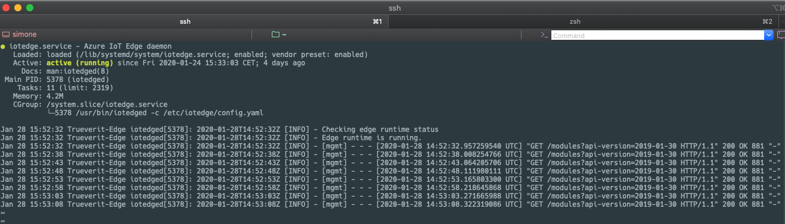

Run a simple Python sample on Trueverit V Edge Gateway device running Raspbian 10 Buster
===
---

# Table of Contents

-   [Introduction](#Introduction)
-   [Step 1: Prerequisites](#Prerequisites)
-   [Step 2: Prepare your Device](#PrepareDevice)
-   [Step 3: Manual Test for Azure IoT Edge on device](#Manual)
-   [Step 4: Next Steps](#NextSteps)
-   [Step 5: Troubleshooting](#Step-5-Troubleshooting)

# Introduction

**About this document**

This document describes how to connect Trueverit V Edge Gateway device running Raspbian 10 Buster with Azure IoT Edge Runtime pre-installed and Device Management. This multi-step process includes:

-   Configuring Azure IoT Hub
-   Registering your IoT device
-   Build and Deploy client component to test device management capability 

# Step 1: Prerequisites

You should have the following items ready before beginning the process:

-   [Prepare your development environment][setup-devbox-linux]
-   [Setup your IoT hub](https://account.windowsazure.com/signup?offer=ms-azr-0044p)
-   [Provision your device and get its credentials][lnk-manage-iot-hub]
-   [Sign up to IOT Hub](https://account.windowsazure.com/signup?offer=ms-azr-0044p)
-   [Add the Edge Device](https://docs.microsoft.com/en-us/azure/iot-edge/quickstart-linux)
-   [Add the Edge Modules](https://docs.microsoft.com/en-us/azure/iot-edge/quickstart-linux#deploy-a-module)
-   Trueverit V Edge Gateway device.

# Step 2: Prepare your Device

-   As an Enterprise grade Plug & Play device, you can flash the specified base Operating System (Raspbian 10 Buster) version into a microSD using the win32flashtools or Balena Etcher
-   Put the sd into the housing screwing down the screw placed in the lower right part of the gateway
-   Connect a power source to the Edge Gateway, like: 110-230VAC, 12VDC or PoE Lan Cable
-   A led green will show you the correct power presence, at this point, the Trueverit V Edge Gateway will start it's booting process
-   To get the ip address of the device, you have three options:
    -   Ping the address: ping trueverit-edge.local and get the respective IP address
    -  Do a network scan and identify the corresponding Trueverit-Edge device
    -   Access the console device using a USB-COM RJ-45 cable and login with the default credentials 

# Step 3: Manual Test for Azure IoT Edge on device

This section walks you through the test to be performed on the Edge devices running the Linux operating system such that it can qualify for Azure IoT Edge certification.

## 3.1 Edge RuntimeEnabled (Mandatory)

**Details of the requirement:**

The following components come pre-installed or at the point of distribution on the device to customer(s):

-   Azure IoT Edge Security Daemon
-   Daemon configuration file
-   Moby container management system
-   A version of `hsmlib` 

*Edge Runtime Enabled:*

**Check the iotedge daemon command:** 

Open the command prompt on your IoT Edge device , confirm that the Azure IoT edge Daemon is under running state

    systemctl status iotedge

 

Open the command prompt on your IoT Edge device, confirm that the module deployed from the cloud is running on your IoT Edge device

    sudo iotedge list

  

On the device details page of the Azure, you should see the runtime modules - edgeAgent, edgeHub and tempSensor modueles are under running status

 

  
[setup-devbox-linux]: https://github.com/Azure/azure-iot-sdk-c/blob/master/doc/devbox_setup.md
[lnk-setup-iot-hub]: ../setup_iothub.md
[lnk-manage-iot-hub]: ../manage_iot_hub.md