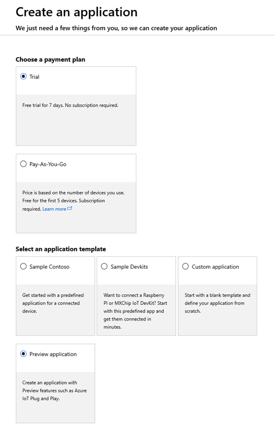
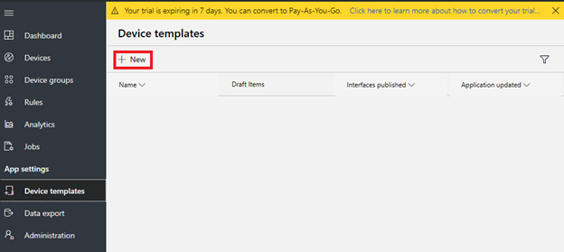
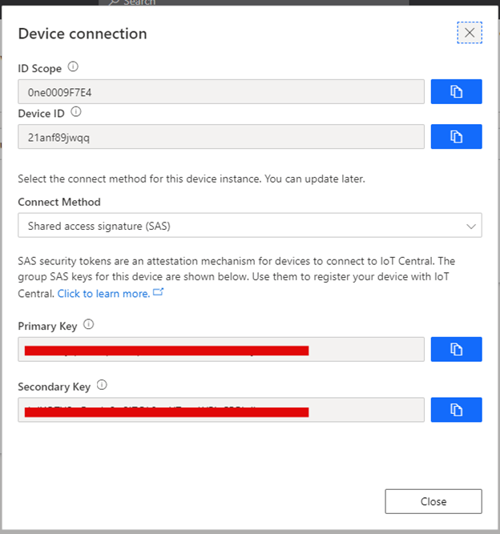

Connect WM-BN-BM-22 device to your Azure IoT Central Application
===

---
# Table of Contents

-   [Introduction](#Introduction)
-   [Prerequisites](#Prerequisites)
-   [Create Azure IoT Central application](#Create_AICA)
-   [Device Connection Details](#DeviceConnectionDetails)
-   [Prepare the Device](#preparethedevice)
-   [Integration with IoT Central](#IntegrationwithIoTCentral)
-   [Additional Links](#AdditionalLinks)

# Introduction 

**About this document**

This document describes how to connect WM-BN-BM-22 to Azure IoT Central application using the IoT plug and Play model. Plug and Play simplifies IoT by allowing solution developers to integrate devices without writing any device code. Using Plug and Play, device manufacturers will provide a model of their device to cloud developers to be integrated quickly into IoT Central or any solution built on the Azure IoT platform. IoT Plug and Play will be open to the community by way of a definition language and SDKs.

The WM-BN-BM-22 wireless SiP module which refers as “SiP module” is a small size module and consists of a Cypress CYW43438 single-chip, a ST STM32F412 MCU. The WM-BN-BM-22 provides for the highest-level integration for electronic accessories on WICED licensing, featuring integrated IEEE 802.11b/g/n and BT4.2.

# Prerequisites

You should have the following items ready before beginning the process: 

-   [Azure Account](https://portal.azure.com)
-   [Azure IoT Hub Instance](https://docs.microsoft.com/en-us/azure/iot-hub/about-iot-hub)
-   [Azure IoT Hub Device Provisioning Service](https://docs.microsoft.com/en-us/azure/iot-dps/about-iot-dps)
-   Provide Network connectivity (Wifi, LAN) supported by the device
-   Its mandatory that the device code/software image is preinstalled in device to enable Plug and Play

# Prepare the Device.

**Hardware Environmental setup**

-   Follow [USI BM-22 Quickguide](https://github.com/USIWP1Module/USI_BM-22_Azure_IoT_PnP)  to setup hardware environment.

**Software Environmental Setup**

-   Download and install [WiCED SDK](https://www.cypress.com/products/wiced-software) from Cypress.
-   Get [USI BM-22 platform](https://github.com/USIWP1Module/USI_BM-22_Azure_IoT_PnP) patch and copy to WICED SDK 43xxx_Wi-Fi folder.
-   Get [USI BM-22 Azure IoT SDK](https://github.com/USIWP1Module/USI_BM-22_Azure_IoT_PnP) and copy to WICED SDK 43xxx_Wi-Fi\libraries\protocols folder.
-   Get [USI BM-22 Azure IoT PnP App](https://github.com/USIWP1Module/USI_BM-22_Azure_IoT_PnP) and copy to WICED SDK 43xxx_Wi-Fi\apps\demo folder.

### Option 1

**Edit Wifi Settings**

-   Open /include/default\_wifi\_config\_dct.h to edit the CLIENT\_AP settings you wish the device to.

**Update the DPS Settings in the Code**

-   Go to find the following lines in the project ():

        // TODO: Specify DPS scope ID if you intend on using DPS / IoT Central.
        static const char *dpsIdScope = "[DPS Id Scope]";

        // TODO: Specify symmetric keys if you intend on using DPS / IoT Central and symmetric key based auth.
        static const char *sasKey = "[DPS symmetric key]";

        // TODO: specify your device registration ID
        static const char *registrationId = "[device registration Id]";

Build and Run IoT Plug and Play sample project
Use following mk command to build the projects for the respective OS:

**ThreadX**

    demo.azure\_iot\_pnp-BNBM22-ThreadX download run

# Integration with IoT Central
Connect to IoT Central

1.  Use your Azure account log into [Azure IoT Central](https://apps.azureiotcentral.com/).
2.  Create a free **preview application**.
 
 
 
3.  Select **Device templates** and then click **+ New** to create device template.

 
 
4.  Choose the pre-certified device (WM-BN-BM-22 Kit) to create Device template.

 
 
5.  Go to the **Devices** page select **WM-BN-BM-22 Kit** and click **+ New** to create a new device.

 
 
6.  In the popup device info page, set **Device ID**, Device Name and then click **Create** button to create a new device.

 
 
7.  In the **Devices** page, click the device you created in **step 6** to enter device detail info page.

 
 
8.  Click **Connect** button to get **Scope ID, Device ID, Primary Key,** and make a note of them.

 

# Additional Links

Please refer to the below link for additional information for Plug and Play 

-    [Blog](https://azure.microsoft.com/en-us/blog/iot-plug-and-play-is-now-available-in-preview/)
-    [Plug and Play C SDK](https://github.com/Azure/azure-iot-sdk-c/tree/public-preview) 
-    [Plug and Play Node SDK](https://github.com/Azure/azure-iot-sdk-node/tree/digitaltwins-preview)
-    [Plug and Play Definitions](https://github.com/Azure/IoTPlugandPlay)
-    [USI BM-22 Azure IoT PnP]( https://github.com/USIWP1Module/USI_BM-22_Azure_IoT_PnP)