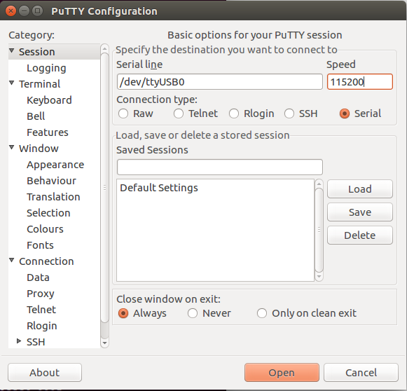
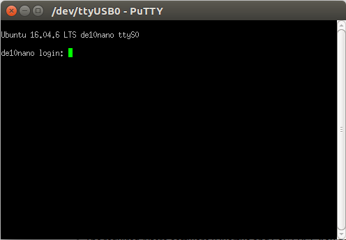

Run a simple C sample on DE10-Nano Development Kit device running Ubuntu16.04
===
---

# Table of Contents

-   [Introduction](#Introduction)
-   [Step 1: Prerequisites](#Prerequisites)
-   [Step 2: Prepare your Device](#PrepareDevice)
-   [Step 3: Build and Run the Sample](#Build)
-   [Next Steps](#NextSteps)

<a name="Introduction"></a>
# Introduction

**About this document**

This document describes how to connect DE10-Nano Development Kit device running Ubuntu16.04 with Azure IoT SDK. This multi-step process includes:
-   Configuring Azure IoT Hub
-   Registering your IoT device
-   Build and deploy Azure IoT SDK on device

<a name="Prerequisites"></a>
# Step 1: Prerequisites

You should have the following items ready before beginning the process:

-   [Prepare your development environment][setup-devbox-linux]
-   [Setup your IoT hub][lnk-setup-iot-hub]
-   [Provision your device and get its credentials][lnk-manage-iot-hub]
-   DE10-Nano Development Kit (Contains below)
    -   DE10-Nano (Device)
    -   MicroSD card 8GB or more
    -   Ethernet Cable
    -   USB Cable(Mini-B to Type-A)

Optional:

-   MicroSD card reader (If your PC doesn't have MicroSD card slot)
-   HDMI cable (If you want to use LXDE GUI)

<a name="PrepareDevice"></a>
# Step 2: Prepare your Device
At first, you need to install a bootable image on your SD card.

## Download the bootable image

[The bootable image is available to download here][Bootable-image-link].  
The image contains Lubuntu16.04 image.

As the bootable image is compressed with zip, you need to unzip it.

```
unzip sdcard.img.zip
```

**Note:** This tutorial describes how to install the image in Linux environment. If you use another OS such as Windows OS, please find the way to install microSD card image yourself.

## Write the image to the microSD card

Insert your microSD to your PC and identify the path of it with dmesg or lsblk command. In this time, we will assume that the device path of it exists in /dev/sdb.
Using dd command, write the image to your microSD card.  
**Please do not mistake device path.**  
**dd command writes the image specified by if="image" to the device path specified by of="device path".**  
**So if you choose another device path as the destination of dd, it may crash your PC.**  
With the option of "status=progress", you can check the progress of dd command.

```
dd if=sdcard.img of=/dev/sdb status=progress
```

## Setup MSEL on DE10-Nano

DE10-Nano has some switches named MSEL to configure the board setting. You need to setup the MSEL swtiches to run Linux on the device.
According to section2.2 (MSEL Settings) of [this document][terasic-getting-started-guide], setup MSEL[4:0] to 01010.


## Boot DE10-Nano

This bootable supports three ways to operate the device.
Three ways are "Using GUI" or "Using Serial Console" or "Using SSH".

### Using Serial Console

Install serial console application like PuTTY or minicom on your PC.

Connect UART-TO-USB port shown in the picture and USB port of your PC with USB cable(Mini-B to Type-A).

Using dmesg, identify what device path is.

    dmesg | tail

    [12782.413742] usb 1-2.4: Detected FT232RL
    [12782.414335] usb 1-2.4: FTDI USB Serial Device converter now attached to ttyUSB0

In this time, ttyUSB0 is given for the USB cable.

Open PuTTY and set up for serial connection.  
**Note: sudo is necessary**  
Configuration for serial connection are below.

-   115200 baud rate
-   no parity
-   1 stop bit
-   no flow control settings

If the device path and baud rate are set as shown in the photo below, there should be no problem.




Then, click "Open" and if you see black box window, push enter key.
If you can see interactive login shell, you can login.



Username and Password are here.
**UserName: "root", Password: "de10nano"**

### Using SSH

If you have a router or modem which get your PC and DE10-Nano are on the same network, using SSH is a good choice too.

Before you boot DE10-Nano, connect DE10-Nano to your moderm or router with an ethernet cable.

Then boot the device and wait about 1 minute.
In the boot process, ssh daemon is called and make SSH login enable.

At first, you need to identify your network address.
Use "ip addr" or "ifconfig" to do it.

    ip addr

    1: lo:
        link/loopback 00:00:00:00:00:00 brd 00:00:00:00:00:00
        inet 127.0.0.1/8 scope host lo
           valid_lft forever preferred_lft forever
    2: eno1:
        link/ether 94:c6:91:a0:76:17 brd ff:ff:ff:ff:ff:ff
        inet 192.168.3.28/24 brd 192.168.3.255 scope global dynamic eno1

In this time, we can find that network address is "192.168.3.XX".

Then using ping command, find what addresses are located on the same network.

    echo 192.168.3.{1..254} | xargs -P255 -n1 ping -s1 -c1 -W1 | grep ttl

    9 bytes from 192.168.3.1: icmp_seq=1 ttl=64
    9 bytes from 192.168.3.28: icmp_seq=1 ttl=64
    9 bytes from 192.168.3.98: icmp_seq=1 ttl=64
    9 bytes from 192.168.3.5: icmp_seq=1 ttl=64
    9 bytes from 192.168.3.30: icmp_seq=1 ttl=64

In this time, 192.168.3.98 or 192.168.3.30 may be DE10-Nano's network address. So you can try ssh with these addresses.  
Since DHCP often gives larger numbers to devices connected later, it is a good idea to start with an address such as 192.168.3.98, which is the largest number.

**Note: If you cannot find another network address, try the command above several times or make sure ethernet cable is surely connected to DE10-Nano.**

    ssh root@192.168.3.98
    root@192.168.3.98's password: de10nano

### Using GUI

GUI seems to be the easiest way to use.
If you connect DE10-Nano and Display with HDMI cable, you can find a GUI like this.


However you will notice that there isn't USB Type-A port on DE10-Nano.
DE10-Nano only supports **USB Micro-A port** to connect your USB devices.
Therefore, you need to buy USB Micro-A to USB Type-A adopter and also USB hub for connecting multi USB devices to use GUI.

**Note: USB Micro-A cannot be substituted by USB Micro-B and often Micro-B is sugested when searching in web. Please be careful not to made a mistake.**

## Install required packages

Before try to run sample code, some packages must be installed in advance.

Please execute below.

    apt install -y libssl-dev

<a name="Build"></a>
# Step 3: Build and Run the sample

## 3.1 Load the Azure IoT bits and prerequisites on device

-   Open a PuTTY session and connect to the device.
-   Install the prerequisite packages by issuing the following commands from the command line on the device. Choose your commands based on the OS running on your device.

    **Debian or Ubuntu**

        sudo apt-get update

        sudo apt-get install -y curl uuid-dev libcurl4-openssl-dev build-essential cmake git

    ***Note:*** *This setup process requires cmake version 2.8.12 or higher.* 
    
    *You can verify the current version installed in your environment using the  following command:*

        cmake --version

    *This library also requires gcc version 4.9 or higher. You can verify the current version installed in your environment using the following command:*
    
        gcc --version 

    *For information about how to upgrade your version of gcc on Ubuntu 14.04, see <http://askubuntu.com/questions/466651/how-do-i-use-the-latest-gcc-4-9-on-ubuntu-14-04>.*
    
-   Download the SDK to the board by issuing the following command in PuTTY:

        git clone --recursive https://github.com/Azure/azure-iot-sdk-c.git

-   Verify that you now have a copy of the source code under the
    directory ~/azure-iot-sdk-c.

<a name="Step-3-2-Build"></a>
## 3.2 Build the samples

There are two samples one for sending messages to IoT Hub and another for receiving messages from IoT Hub. Both samples supports different protocols. You can make modification to the samples with your choice of protocol before building the samples. By default the samples will build for AMQP protocol.  Follow the below instructions to edit the samples before building: 
    
### 3.2.1 Send Telemetry to IoT Hub Sample:

1.  Open the telemetry sample file in a text editor

		vim azure-iot-sdk-c/iothub_client/samples/iothub_ll_telemetry_sample/iothub_ll_telemetry_sample.c     

2. Enter "i" into input mode of vim, then find the following placeholder for IoT connection string:

        static const char* connectionString = "[device connection string]";

3. Replace the above placeholder with device connection string.
    
4. Find the following place holder for editing protocol:

          // Select the Protocol to use with the connection
		#ifdef USE_AMQP
		    //protocol = AMQP_Protocol_over_WebSocketsTls;
		    protocol = AMQP_Protocol;
		#endif
		#ifdef USE_MQTT
		    //protocol = MQTT_Protocol;
		    //protocol = MQTT_WebSocket_Protocol;
		#endif
		#ifdef USE_HTTP
		    //protocol = HTTP_Protocol;
		#endif
	
5. Please uncomment the protocol that you would like to test with and comment other protocols. If testing for multiple protocols, please repeat above step for each protocol. 

6. Enter "Esc" to exit input mode of vim, and save your changes by pressing "wq" and ENTER.


### 3.2.2 Send message from IoT Hub to Device Sample:

1. Open the telemetry sample file in a text editor

	 	vim azure-iot-sdk-c/iothub_client/samples/iothub_ll_c2d_sample/iothub_ll_c2d_sample.c

2. Follow same steps 1-6 as above to edit this sample.

### 3.2.3 Build the samples:

-   Build the SDK using following command. If you are facing any issues during build.

        sudo ./azure-iot-sdk-c/build_all/linux/build.sh | tee LogFile.txt
    
    ***Note:*** *LogFile.txt in above command should be replaced with a file name where build output will be written.*
    
    *build.sh creates a folder called "cmake" under "~/azure-iot-sdk-c/". Inside "cmake" are all the results of the compilation of the complete software.*

<a name="Step-3-3-Run"></a>
## 3.3 Run and Validate the Samples

In this section you will run the Azure IoT client SDK samples to validate
communication between your device and Azure IoT Hub. You will send messages to the Azure IoT Hub service and validate that IoT Hub has successfully receive the data. You will also monitor any messages send from the Azure IoT Hub to client.

### 3.3.1 Send Device Events to IOT Hub:

-   Run the sample by issuing following command.    

		azure-iot-sdk-c/cmake/iotsdk_linux/iothub_client/samples/iothub_ll_telemetry_sample/iothub_ll_telemetry_sample


### 3.3.2 Receive messages from IoT Hub

-   Run the sample by issuing following command.

		azure-iot-sdk-c/cmake/iotsdk_linux/iothub_client/samples/iothub_ll_c2d_sample/iothub_ll_c2d_sample
		

<a name="NextSteps"></a>
# Next Steps

You have now learned how to run a sample application that collects sensor data and sends it to your IoT hub. To explore how to store, analyze and visualize the data from this application in Azure using a variety of different services, please click on the following lessons:

-   [Manage cloud device messaging with iothub-explorer]
-   [Save IoT Hub messages to Azure data storage]
-   [Use Power BI to visualize real-time sensor data from Azure IoT Hub]
-   [Use Azure Web Apps to visualize real-time sensor data from Azure IoT Hub]
-   [Weather forecast using the sensor data from your IoT hub in Azure Machine Learning]
-   [Remote monitoring and notifications with Logic Apps]   

[Manage cloud device messaging with iothub-explorer]: https://docs.microsoft.com/en-us/azure/iot-hub/iot-hub-explorer-cloud-device-messaging
[Save IoT Hub messages to Azure data storage]: https://docs.microsoft.com/en-us/azure/iot-hub/iot-hub-store-data-in-azure-table-storage
[Use Power BI to visualize real-time sensor data from Azure IoT Hub]: https://docs.microsoft.com/en-us/azure/iot-hub/iot-hub-live-data-visualization-in-power-bi
[Use Azure Web Apps to visualize real-time sensor data from Azure IoT Hub]: https://docs.microsoft.com/en-us/azure/iot-hub/iot-hub-live-data-visualization-in-web-apps
[Weather forecast using the sensor data from your IoT hub in Azure Machine Learning]: https://docs.microsoft.com/en-us/azure/iot-hub/iot-hub-weather-forecast-machine-learning
[Remote monitoring and notifications with Logic Apps]: https://docs.microsoft.com/en-us/azure/iot-hub/iot-hub-monitoring-notifications-with-azure-logic-apps
[setup-devbox-linux]: https://github.com/Azure/azure-iot-sdk-c/blob/master/doc/devbox_setup.md

[lnk-setup-iot-hub]: ../setup_iothub.md
[lnk-manage-iot-hub]: ../manage_iot_hub.md

[Bootable-image-link]: http://download.terasic.com/downloads/cd-rom/de10-nano/AzureImage/DE10_Nano_Azure.zip
[terasic-getting-started-guide]: https://www.terasic.com.tw/attachment/archive/1046/Getting_Started_Guide.pdf
