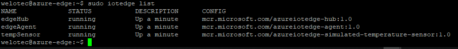

Run a simple Nodejs sample on Alderamin-IoT device device running Ubuntu 18.04 LTS
===
---

# Table of Contents

-   [Introduction](#Introduction)
-   [Step 1: Prerequisites](#Prerequisites)
-   [Step 2: Prepare your Device](#PrepareDevice)
-   [Step 3: Manual Test for Azure IoT Edge on device](#Manual)

# Introduction

**About this document**

This document describes how to connect **Alderamin-IoT device** running Ubuntu 18.04 LTS with Azure IoT Edge Runtime pre-installed and Device Management. This multi-step process includes:

-   Configuring Azure IoT Hub
-   Registering your IoT device
-   Build and Deploy client component to test device management capability 

# Step 1: Prerequisites

You should have the following items ready before beginning the process:

-   [Prepare your development environment][setup-devbox-linux]
-   [Setup your IoT hub](https://account.windowsazure.com/signup?offer=ms-azr-0044p)
-   [Provision your device and get its credentials][lnk-manage-iot-hub]
-   [Sign up to IOT Hub](https://account.windowsazure.com/signup?offer=ms-azr-0044p)
-   [Add the Edge Device](https://docs.microsoft.com/en-us/azure/iot-edge/quickstart-linux)
-   [Add the Edge Modules](https://docs.microsoft.com/en-us/azure/iot-edge/quickstart-linux#deploy-a-module)
-   Alderamin-IoT device.

# Step 2: Prepare your Device

## Connecting the device

-   Connect the shipped power-supply to the power-plug slot of the Alderamin.
-   Connect the patch-cable to LAN1 (left port) of the Alderamin.
-   Connect a 2nd patch-cable to LAN2 (2nd Port from left) of the Alderamin to your Gateway / Network.
-   Power on the device using the Power-Button next to the ethernet-ports.

## Access device via ssh

-   LAN1 is set to IP-Address: `192.168.100.1/24`
-   LAN2 is set to IP-Address: `DHCP-Client`

-   Configure your PC to 

        IP-Address: 192.168.100.10
        Subnet-mask: 255.255.255.0

-   Use a hyperterminal-tool like putty to access the Alderamin on 192.168.100.1 with port 22 (SSH)

        Login
        Username: welotec
        Password: 123456

## Configure edge runtime

-   After you have established the connection to the device you can follow the instructions in readme.md how to configure the edge runtime with your IoT Hub Connection 

**NOTE**

*Make sure that the device received an IP-Address, Gateway and DNS-Server from your network / gateway and ensure that it can access the internet.*

*Use ifconfig to verify your network settings*

*Use ping 8.8.8.8 to check if you have access to the internet.*

# Step 3: Manual Test for Azure IoT Edge on device

This section walks you through the test to be performed on the Edge devices running the Linux operating system such that it can qualify for Azure IoT Edge certification.

## 3.1 Edge RuntimeEnabled (Mandatory)

**Details of the requirement:**

The following components come pre-installed or at the point of distribution on the device to customer(s):

-   Azure IoT Edge Security Daemon
-   Daemon configuration file
-   Moby container management system
-   A version of `hsmlib` 

*Edge Runtime Enabled:*

**Check the iotedge daemon command:** 

Open the command prompt on your IoT Edge device , confirm that the Azure IoT edge Daemon is under running state

    systemctl status iotedge

 

Open the command prompt on your IoT Edge device, confirm that the module deployed from the cloud is running on your IoT Edge device

    sudo iotedge list

  

On the device details page of the Azure, you should see the runtime modules - edgeAgent, edgeHub and tempSensor modueles are under running status

 

## 3.2 Device Management (Mandatory)

**Pre-requisites:** Device Connectivity.

**Description:** A device that can perform basic device management operations (Reboot and Firmware update) triggered by messages from IoT Hub.

## 3.2.1 Firmware Update (Using Microsoft SDK Samples):

Specify the path **/home/azure-iot-samples-node-master/iot-hub/Tutorials** where the firmwareupdate client components are installed.

To run the simulated device application, open a shell or command prompt window and navigate to the **iot-hub/Tutorials/FirmwareUpdate** folder in the Node.js project you downloaded. Then run the following commands:

    npm install
    node SimulatedDevice.js "{your device connection string}"

To run the back-end application, open another shell or command prompt window. Then navigate to the **/home/azure-iot-samples-node-master/iot-hub/Tutorials/FirmwareUpdate ** folder in the Node.js project you downloaded. Then run the following commands:

    npm install
    node ServiceClient.js "{your service connection string}"

IoT device client will get the message and report the status to the device twin.

 

**Update firmware**

Confirm the IoT hub, Device ID, method name and method payload as below:

-   Press “call Method” button
-   Check the returning status as below:

 

## 3.2.2 Reboot (Using Microsoft SDK Samples):

Specify the path /home/azure-iot-samples-node-master/iot-hub/Tutorials where the components are installed 

Confirm the IoT hub, Device ID, method name as below:

-   Press “call Method” button
-   Check the returning status as below:

 

IoT device client will get the message and report the status to the device twin.

 
  
## 3.2.3 Firmware Update (Modified SDK samples/Custom made application):

If the Client components are custom made please add the steps to execute the Firmware Update through Device Twin.

**Note**: Client Components must be shipped with the device 

**1. General information:**

   The Alderamin device comes with pre-installed JSON scripts which are started while the boot of the device as a service. The files are stored in `/home/welotec/device`

**2. Configure service**

   To get the service to work with your device (your device connection string) you have to modify the service arguments.

        sudo nano /etc/systemd/system/azuredevice.service

   The content of the file should look like this

    [Unit]
    Description=Azure Device
    [Service]
    ExecStart=/usr/bin/node /home/welotec/device/index.js "YOUR DEVICE CONNECTIONN STRING"
    Restart=always
    User=welotec
    Group=nogroup
    WorkingDirectory=/home/welotec
    [Install]
    WantedBy=multi-user.target

**3. Username / working directory**

**NOTE:** if you change the directory or the username make sure that you modify the parameters
Furthermore - if you cahnge username - you have to edit the username on the modified visudo

    sudo visudo
    username ALL=NOPASSWD: /usr/bin/apt-get 
    username ALL=NOPASSWD: /sbin/reboot 

**4. Service status**

   To make the service run:   

    sudo systemctl enable azuredevice.service 
 

   After making changes to service file:  

    sudo systemctl daemon-reload 
    reboot your device
    sudo systemctl restart azuredevice.service 
 
**To check the status:**
   
    systemctl status azuredevice.service 
 
**How to see logs:**
  
    sudo journalctl -u azuredevice.service 
 
**Or in real time:**
  
    sudo journalctl -f -u azuredevice.service

**Server side:**

-   server scripts
    
    Welotec also provides JSON based service scripts which can be executed on a regular linux system.

-    Regarding some differences between several linux distributions there may be some issues.
-    Please place the scripts inside the folder "server" on the linux device which you would like to use for managing your edge devices.
in this chapter we describe the procedure of updateing the device using device twin and rebooting the device with direct methods on Ubuntu 18.04.
For running the application you need to install nodejs

        curl -sL https://deb.nodesource.com/setup_10.x | sudo -E bash -
        sudo apt-get install -y nodejs

-   navigate to the folder "server" and execute 

        npm install

    Above command will install all the necessary packages now, as the script is installed you can run an update of a specific device using:

        node update.js 'service_connection_string' 'device_id'

## 3.2.4 Reboot (Modified SDK samples/Custom made application):

If the Client components are custom made please add the steps to execute the Device Reboot through Direct Methods

**Note**: Client Components must be shipped with the device 

-   navigate to the folder "server" and execute 

        node reboot.js 'service_connection_string' 'device_id'

  
[setup-devbox-linux]: https://github.com/Azure/azure-iot-sdk-c/blob/master/doc/devbox_setup.md
[lnk-setup-iot-hub]: ../setup_iothub.md
[lnk-manage-iot-hub]: ../manage_iot_hub.md