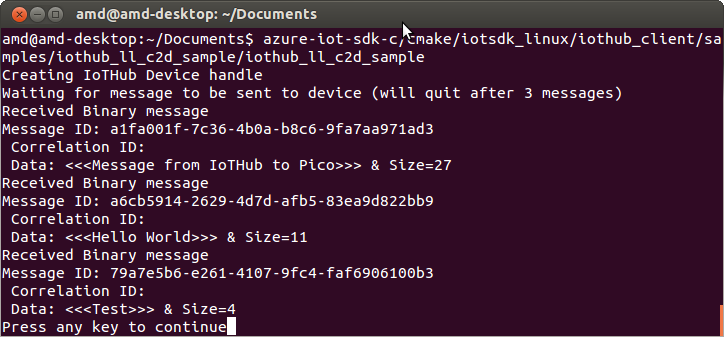
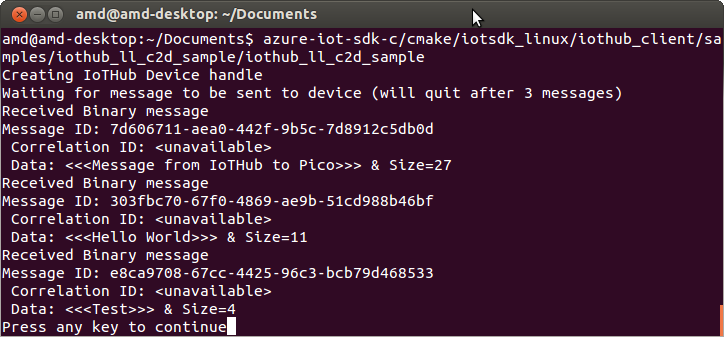

Run a simple C sample on Pico PC device running Ubuntu 12.04 LTS
===
---

# Table of Contents

-   [Introduction](#Introduction)
-   [Step 1: Prerequisites](#Prerequisites)
-   [Step 2: Prepare your Device](#PrepareDevice)
-   [Step 3: Build and Run the Sample](#Build)
-   [Tips](#tips)
-   [Next Steps](#NextSteps)

# Introduction

**About this document**

This document describes how to connect Pico PC device running Ubuntu 12.04 LTS with Azure IoT SDK. This multi-step process includes:
-   Configuring Azure IoT Hub
-   Registering your IoT device
-   Build and deploy Azure IoT SDK on device

# Step 1: Prerequisites

You should have the following items ready before beginning the process:

-   [Prepare your development environment][setup-devbox-linux]
-   [Setup your IoT hub][lnk-setup-iot-hub]
-   [Provision your device and get its credentials][lnk-manage-iot-hub]
-   Pico PC device

# Step 2: Prepare your Device

-   Install Ubuntu 12.04 LTS.
-   Install drivers provided by manufacturer.

## 2.1 Register device:

In this section, you will register your device using DeviceExplorer. The DeviceExplorer is a Windows application that interfaces with Azure IoT Hub and can perform the following operations:

-   Device management
    -   Create new devices
    -   List existing devices and expose device properties stored on Device Hub
    -   Provides ability to update device keys
    -   Provides ability to delete a device
-   Monitoring events from your device
-   Sending messages to your device

To run DeviceExplorer tool, use following configuration string as described in Step1:

-   IoT Hub Connection String

**Steps:**

1.  Click [here](https://github.com/Azure/azure-iot-sdk-csharp/blob/master/tools/DeviceExplorer/readme.md) to download and install DeviceExplorer.
2.  Add connection information under the **Configuration** tab and click the **Update** button.
3.  Create and register the device with your IoT Hub using instructions as below.

    a. Click the **Management** tab.

    b. Your registered devices will be visible in the list. In case your device is not there in the list, click **Refresh** button. If this is your first time, then you shouldn't retrieve anything.

    c. Click **Create** button to create a device ID and key.

    d. Once created successfully, device will be listed in DeviceExplorer.

    e. Right click the device and from context menu select **"Copy connection string for selected device"**.

    f. Save this information in Notepad. You will need this information in later steps.

# Step 3: Build and Run the sample

## 3.1 Load the Azure IoT bits and prerequisites on device

-   Open a Terminal session.
-   Install the prerequisite packages by issuing the following commands from the command line on the device. 

   **Debian or Ubuntu**

    sudo apt-get update

    sudo apt-get install -y curl uuid-dev libcurl4-openssl-dev build-essential cmake git

   **Note:** This setup process requires cmake version 2.8.12 or higher.
You can verify the current version installed in your environment using the following command:

    cmake --version

   *This library also requires gcc version 4.9 or higher. You can verify the current version installed in your environment using the following command:*

    gcc --version 

   For information about how to upgrade your version of gcc on Ubuntu 14.04, see <http://askubuntu.com/questions/466651/how-do-i-use-the-latest-gcc-4-9-on-ubuntu-14-04>.

-   Download the SDK to the board by issuing the following command in terminal:

        git clone --recursive https://github.com/Azure/azure-iot-sdk-c.git

-   Verify that you now have a copy of the source code under the directory `~/azure-iot-sdk-c`.

## 3.2 Build the samples

There are two samples one for sending messages to IoT Hub and another for receiving messages from IoT Hub. Both samples supports different protocols. You can make modification to the samples with your choice of protocol before building the samples. By default the samples will build for AMQP protocol. Follow the below instructions to edit the samples before building:

### 3.2.1 Send Telemetry to IoT Hub Sample:

-   Open the telemetry sample file in a text editor:

        nano azure-iot-sdk-c/iothub_client/samples/iothub_ll_telemetry_sample/iothub_ll_telemetry_sample.c     

-   Find the following placeholder for IoT connection string:

        static const char* connectionString = "[device connection string]";

-   Replace the above placeholder with device connection string.
-   Find the following place holder for editing protocol:

 

    Please uncomment the protocol that you would like to test with and comment other protocols. If testing for multiple protocols, please repeat above step for each protocol.

-   Save your changes by pressing Ctrl+O and when nano prompts you to save it as the same file, just press ENTER.
-   Press Ctrl+X to exit nano.
### 3.2.1 Send message from IoT Hub to Device Sample:

-   Open the telemetry sample file in a text editor

        nano azure-iot-sdk-c/iothub_client/samples/iothub_ll_c2d_sample/iothub_ll_c2d_sample.c

-   Follow same steps 1-7 as above to edit this sample.

### 3.2.1 Build the samples:

-   Build the SDK using following command. If you are facing any issues during build.

        sudo ./azure-iot-sdk-c/build_all/linux/build.sh | tee LogFile.txt

    **Note:** LogFile.txt in above command should be replaced with a file name where build output will be written.

    build.sh creates a folder called "cmake" under "~/azure-iot-sdk-c/". Inside "cmake" are all the results of the compilation of the complete software.

### 3.3 Run and Validate the Samples

In this section you will run the Azure IoT client SDK samples to validate communication between your device and Azure IoT Hub. You will send messages to the Azure IoT Hub service and validate that IoT Hub has successfully receive the data. You will also monitor any messages send from the Azure IoT Hub to client.

**3.3.1	Send Device Events to IOT Hub:**

-   Launch the DeviceExplorer as explained in Step 2 and navigate to Data tab. Select the device name you created from the drop-down list of device IDs and click Monitor button.

 

-   DeviceExplorer is now monitoring data sent from the selected device to the IoT Hub.
-   Run the sample by issuing following command.

        azure-iot-sdk-c/cmake/iotsdk_linux/iothub_client/samples/iothub_ll_telemetry_sample/iothub_ll_telemetry_sample

-   Verify that the confirmation messages show an OK. If not, then you may have incorrectly copied the device hub connection information.
 
   **For HTTP protocol:**

 

   **For MQTT protocol:**

 

-   DeviceExplorer should show that IoTHub has successfully received data sent by sample test.
 
   **For HTTP protocol:**

 

   **For MQTT protocol:**

 

**3.3.2	Receive messages from IoT Hub**

-   Run the sample by issuing following command.

        azure-iot-sdk-c/cmake/iotsdk_linux/iothub_client/samples/iothub_ll_c2d_sample/iothub_ll_c2d_sample

-   To verify that you can send messages from the IoT Hub to your device, go to the Message To Device tab in DeviceExplorer.
-   Select the device you created using Device ID drop down.
-   Add some text to the Message field, then click Send.

 
 
-   You should be able to see the command received in the console window for the client sample.

   **For HTTP protocol:**

 

   **For MQTT protocol:**

 

# Next Steps

You have now learned how to run a sample application that collects sensor data and sends it to your IoT hub. To explore how to store, analyze and visualize the data from this application in Azure using a variety of different services, please click on the following lessons:

-   [Manage cloud device messaging with iothub-explorer]
-   [Save IoT Hub messages to Azure data storage]
-   [Use Power BI to visualize real-time sensor data from Azure IoT Hub]
-   [Use Azure Web Apps to visualize real-time sensor data from Azure IoT Hub]
-   [Weather forecast using the sensor data from your IoT hub in Azure Machine Learning]
-   [Remote monitoring and notifications with Logic Apps]   

[Manage cloud device messaging with iothub-explorer]: https://docs.microsoft.com/en-us/azure/iot-hub/iot-hub-explorer-cloud-device-messaging
[Save IoT Hub messages to Azure data storage]: https://docs.microsoft.com/en-us/azure/iot-hub/iot-hub-store-data-in-azure-table-storage
[Use Power BI to visualize real-time sensor data from Azure IoT Hub]: https://docs.microsoft.com/en-us/azure/iot-hub/iot-hub-live-data-visualization-in-power-bi
[Use Azure Web Apps to visualize real-time sensor data from Azure IoT Hub]: https://docs.microsoft.com/en-us/azure/iot-hub/iot-hub-live-data-visualization-in-web-apps
[Weather forecast using the sensor data from your IoT hub in Azure Machine Learning]: https://docs.microsoft.com/en-us/azure/iot-hub/iot-hub-weather-forecast-machine-learning
[Remote monitoring and notifications with Logic Apps]: https://docs.microsoft.com/en-us/azure/iot-hub/iot-hub-monitoring-notifications-with-azure-logic-apps
[setup-devbox-linux]: https://github.com/Azure/azure-iot-sdk-c/blob/master/doc/devbox_setup.md
[lnk-setup-iot-hub]: ../setup_iothub.md
[lnk-manage-iot-hub]: ../manage_iot_hub.md

