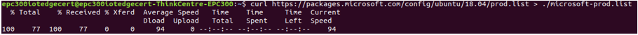
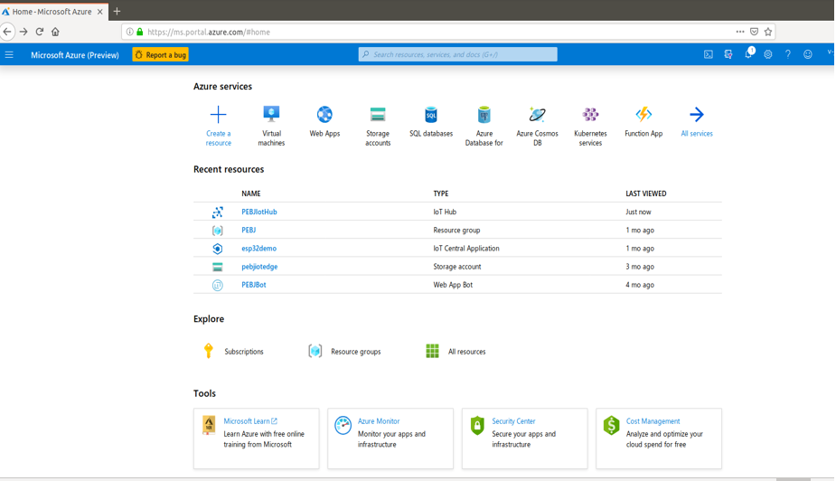
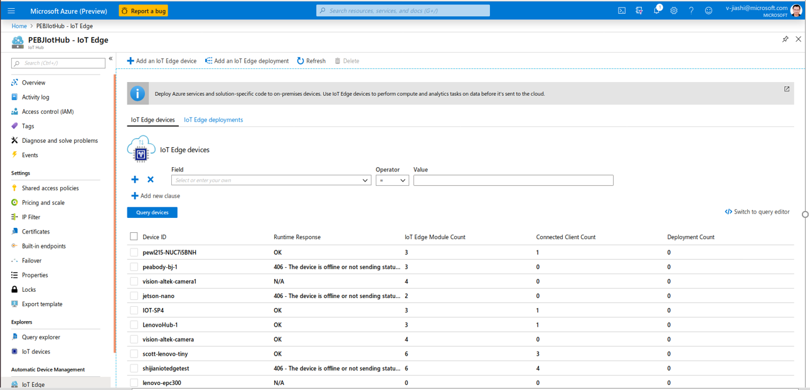

Run an Edge Runtime on Lenovo EPC300 device running Ubuntu 18.04
===
---

# Table of Contents

-   [Introduction](#Introduction)
-   [Step 1: Prerequisites](#Prerequisites)
-   [Step 2: Prepare your Devices](#PrepareDevice)
-   [Step 3: How to enable Ubuntu iot-edge with EPC300](#Deploy)
-   [Step 4: Create and Deploy your own IoT Edge Module](#Create)
-   [Step 5: Troubleshooting](#Step-5-Troubleshooting)

# Introduction

**About this document**  

The Azure IoT Edge modules can be used to deploy code that implements your business logic directly to your IoT Edge devices .  This step-by-step guide will allow you how to enable Ubuntu IoT Edge modules and deploy it into a Lenovo EPC300 device.

# Step 1: Prerequisites

By completing either of those tutorials, you should have the following prerequisites in place:

-   [Setup your IoT hub](https://account.windowsazure.com/signup?offer=ms-azr-0044p)
-   A Lenovo EPC300 device running Ubuntu18.04 as **Target Deploy device**.
-  [Register a new Azure IoT Edge device from the Azure portal](https://docs.microsoft.com/en-us/azure/iot-edge/how-to-register-device-portal)

# Step 2: Prepare Your Lenovo EPC300 device

The steps in this section all take place on your Lenovo EPC300 device.

# Step 3: How to enable Ubuntu iot-edge with EPC300

The following steps shows how to How to enable Ubuntu iot-edge with EPC300

**1.  Right click the mouse, choose open Terminal** 

**2.  sudo apt install curl**

  

**3.	Register Microsoft key and software repository feed ** 

Prepare your device for the IoT Edge runtime installation.    
*curl  https://packages.microsoft.com/config/ubuntu/18.04/prod.list > ./microsoft-prod.list*

 

-   Copy the generated list.  

        sudo cp ./microsoft-prod.list /etc/apt/sources.list.d/

 

-   Install Microsoft GPG public key  

        curl https://packages.microsoft.com/keys/microsoft.asc | gpg --dearmor > microsoft.gpg

        sudo cp ./microsoft.gpg /etc/apt/trusted.gpg.d/

 

**4.	Install the container runtime  **

-   Perform apt update.   

        sudo apt-get update

  

**5.	Install the Azure IoT Edge Security Daemon ** 

-   Install the security daemon. The package is installed at.  

        sudo apt-get install iotedge

 

# Step 4:  Create and Deploy your own IoT Edge Module

The following steps Configure the Azure IoT Edge Security Daemon.

**1.	Configure the Azure IoT Edge Security Daemon**  

-   Option 1: Manual provisioning
Open the configuration file.  

    sudo nano /etc/iotedge/config.yaml

Update the value of device\_connection\_string with the connection string from your IoT Edge device

Operation: sudo Nano /etc/iotedge/config.yaml->change device\_connection\_string:”xxxxxx”->ctrl+o (save) ->enter->ctrl+x (exit)

Change device_connection_string “primary connection string” Example:  
1).  Log in Microsoft Azure web.

 

2).  Choose Shijianiotedgetest devices.

 

3).  Copy the primary connection string to change device_connection_string.

 

**2.Restart the daemon**

        sudo systemctl restart iotedge

 

**3.Verify successful installation ** 

-   You can check the status of the IoT Edge Daemon using  

        systemctl status iotedge

 
-   And list running modules with  

        sudo iotedge list

 

# Step 5: Troubleshooting

Please contact engineering support on **<mailto:iotcert@microsoft.com>** for help with troubleshooting. and Issues can be filed in the [issues section](https://github.com/azure/iotedge/issues) of the IoT Edge GitHub repo. 
  
[setup-devbox-Windows]: https://github.com/Azure/azure-iot-sdk-c/blob/master/doc/devbox_setup.md
[lnk-setup-iot-hub]: ../setup_iothub.md
[lnk-manage-iot-hub]: ../manage_iot_hub.md

