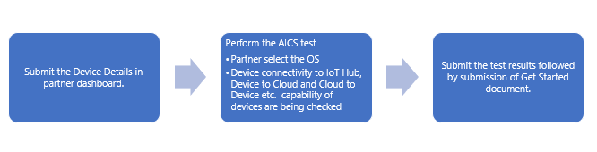
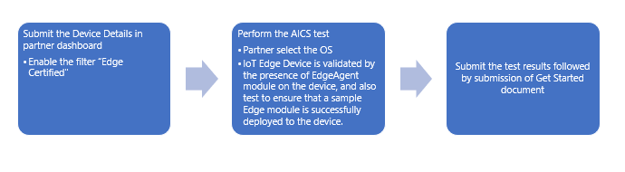
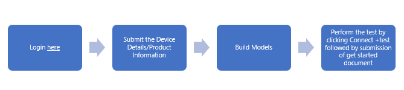
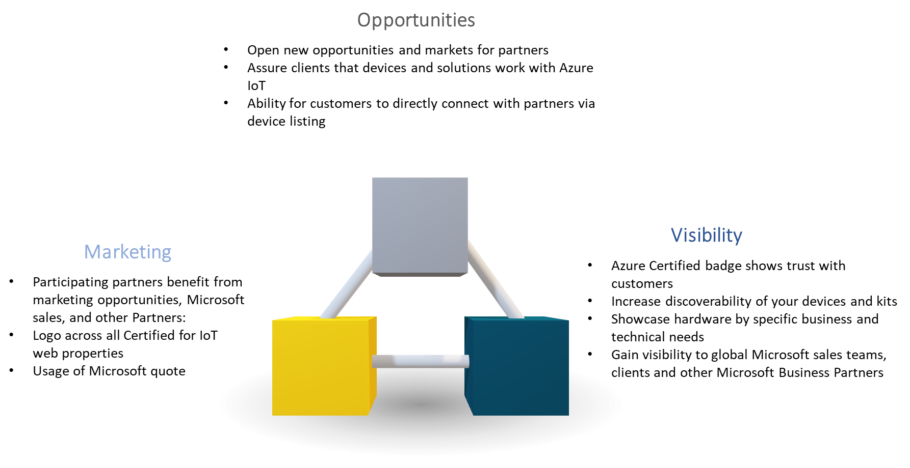

# *Certified for Azure IoT Program* #
---

## Getting started

The Certified for Azure IoT Program (Device certification) is a hardware certification  program that is open to any hardware partners who want to certify their device hardware covering spectrum of intelligent edge devices (sensors , gateway, server class workstations etc.) by validating a device works with Azure IoT Hub, Azure IoT Edge, and IoT Plug and Play (Public Preview). It allows partners to rapidly validate, list device capability and gain global visibility to Microsoft customers.

Certified IoT Hub devices, IoT Edge devices and pre-certified IoT Plug and Play devices get listed in the [Device Catalog](https://catalog.azureiotsolutions.com/) which allows customers to discover IoT Hub Device , IoT Edge Devices and Plug and Play devices that work with Azure. The catalog help to identify certified devices to customers, it includes *Get Started document* which is a step by step instruction for connecting the device to *Azure IoT , Device Data sheets* and *Buy links* to buy listed hardware for evaluation and creates a channel for partners to reach and engage new customers.

## Types of Certification

### IoT Hub Devices Certification

IoT Hub Certification help customers and partners to ensure the device was tested to work with Azure IoT technology. IoT device gets validated for IoT hub primitives like Device to Cloud, Cloud to Device, Device Twin and Direct Methods. This is a baseline certification requirement which applies to any devices (IoT Edge or IoT Plug and Play) to ensure devices are provisioned to IoT Hub securely and capable of sending meaningful data. 

Steps for IoT Hub device Certification click [here](#AzureIoTHubDeviceCertificationProcess).

### IoT Edge Devices Certification

IoT Edge Certification helps customer and partners to ensure device is tested to work as IoT Edge runtime components. IoT Edge device certification is to ensure the minimum-security capability and great out of box experience by checking that Azure IoT Edge runtime is pre-installed on the device. 

To see The reference architecture of IoT Edge click [here](https://docs.microsoft.com/en-us/azure/iot-edge/about-iot-edge). 

Steps for IoT Edge Device Certification click [here](#AzureIoTEdgeDeviceCertificationProcess).

### IoT Plug and Play Devices Certification (Preview)

Plug and Play certification helps customer and partners to simplifies device integration by enabling solution developers to connect and interact with IoT devices using device capability models defined with the [Digital Twin definition language](https://aka.ms/DTDL). Solution developers can start using [Azure IoT Central](https://azure.microsoft.com/en-us/services/iot-central/) or [Azure IoT Hub](https://azure.microsoft.com/en-us/services/iot-hub/) to build solutions that integrate seamlessly with IoT devices enabled with IoT Plug and Play. IoT Plug and Play allows device manufacturers to expand addressable market and make the cloud development simple. 

To understand the Plug and Play please refer [here](https://docs.microsoft.com/en-us/azure/iot-pnp/overview-iot-plug-and-play).

Steps for IoT Plug and Play Certification click [here](#IoTPlugandPlayCertificationProcess).

## Qualify devices steps

To certify the IoT Hub and IoT Edge Device login to the [Partner Dashboard](https://catalog.azureiotsolutions.com/devices) and perform the steps as listed below.

### Azure IoT Hub Device Certification Process 

Device test results go through technical validation and content review. After successful completion approved devices are listed on Device Catalog.

### Azure IoT Edge Device Certification Process 

Device test results go through technical validation and content review. After successful completion approved devices are listed on Device Catalog. Edge Devices are being asked to be shipped to Microsoft or authorized Microsoft partners for further validation. 

### IoT Plug and Play Certification Process  

Device test results go through technical validation and content review. After successful completion approved devices are listed on Device Catalog .For more information on Plug and Play Certification click [here](https://docs.microsoft.com/en-us/azure/iot-pnp/tutorial-certification-test).

## Certification Program Benefits

## Additional Information 

Below is the documentation quick list for complete list of conceptual overviews, tutorials and reference documentation for performing Azure IoT Certifications.

-   [Create Azure account](https://azure.microsoft.com/en-us/free/) : A community, to create and use Azure account 
-   [How to Perform AICS](https://github.com/Azure/azure-iot-device-ecosystem/blob/master/AICS/how-to-use-aics-edge.md) : Details guidelines with screen to screen support on how to perform AICS
-   [Install IoT Edge Runtime](https://docs.microsoft.com/en-us/azure/iot-edge/how-to-install-iot-edge-linux) : Details instructions on how to download Azure IoT Edge Runtime on device 
-   [SDK Tool Kit and Installations](https://docs.microsoft.com/en-us/azure/iot-hub/iot-hub-devguide-sdks) : Detailed device and Service SDK information required to setup on device while performing the IoT Hub Device Certifications
-   Plug and Play SDK : Currently we have Plug and Play SDK in [Node](https://github.com/Azure/azure-iot-sdk-node/tree/digitaltwins-preview) and [C](https://github.com/Azure/azure-iot-sdk-c/tree/public-preview). Tune in to the [Internet of Things Show deep dive](https://aka.ms/iotpnpdeepdiveshow) on September 11 2019
-   IoT Central : [Read IoT Central documentation](https://aka.ms/iotpnpcentraldocs) to learn how to build solutions with IoT Plug and Play devices.
-   [Browse IoT Plug and Play devices](https://catalog.azureiotsolutions.com/) on the Azure IoT Device Catalog.
-   Learn about other Certifications: <https://docs.microsoft.com/en-us/azure/marketplace/cloud-partner-portal/iot-edge-module/cpp-offer-process-parts>

## Azure Device Certification Program FAQs

-   Can I certify same IoT Device as IoT Edge Device? 
   
    Yes , you can certify the device as IoT Edge also , in your partner dashboard you will have to edit the device information and select Edge certified filter and perform the test as followed. Once the device is certify , by default Edit option on device is disabled , please contact [iotcert@microsoft.com](mailto:iotcert@microsoft.com) for enabling the edit option.

-   I need to update the device information.
   
    Once the devices are certified by default Edit option is disabled , you can drop the email to [iotcert@microsft.com](mailto:iotcert@microsoft.com) to update the changes

-   Do I need to send the Edge Device to Microsoft Redmond? 
    For IoT Edge Certification it is required to send the physical Edge device to Redmond for further validation. Shipping details will be shared over emails.

-   Performed AICS but selected OS is not visible second time.

    Once OS is selected, same OS option won’t be present for same device. If your certification is still in progress and unable to see the OS in the partner dashboard please check here <https://aics.azureiotsolutions.com/> .Select the relevant OS/device record to check the existing result.

-   Performed the test unable to submit the test results/facing errors when hit submit button, even-though passed the test

    Please contact [iotcert@microsoft.com](mailto:iotcert@microsoft.com)

-   Created the partner account but unable to add device on partner dashboard 

    Please contact [iotcert@microsft.com](mailto:iotcert@microsoft.com) 

-   How much does it cost to qualify a device for listing?

    Participation in the Azure Device Certification Program is made available to Partners at no additional cost.

-   If the device is passed the IoT Edge certification, do I have to install the IoT Edge Runtime before the device is sold?

    We do recommend to pre-install the certified Edge runtime because pre-installing would make the unboxing experience for the developers great.

## Key concepts

**Internet of Things (IoT):** A collective term for the physical objects that are connected to the internet (directly or indirectly) and can exchange data without user involvement.

**Device:** A "Thing" in the "Internet of Things"; a processing unit that can connect to the internet and exchanging data with the cloud. Devices are often called "smart devices" or "connected devices." They communicate two types of data: telemetry and state.

**Telemetry:** All event data which can be either sent from devices to the cloud or cloud to device.

**IoT Hub:** Enable highly secure and reliable communication between your IoT application and the devices it manages. Azure IoT Hub provides a cloud-hosted solution backend to connect virtually any device. For more information about IoT Hub click [here](https://docs.microsoft.com/en-us/azure/iot-hub/iot-hub-devguide-sdks)

**MQTT:** An industry standard IoT protocol (Message Queue Telemetry Transport). MQTT is a publish/subscribe (pub/sub) messaging protocol.

**Gateway:** A **gateway** is a hardware **device** that acts as a "gate" between two networks. For devices that require protocol translation or some form of custom processing before reaching the cloud gateway, a Gateway device is used

**Leaf Devices/Downstream Devices:** Device that can have secure connections via internet or Gateway

**IoT Edge Device:** Azure IoT Edge device supports cloud analytics and custom business logic processing on device itself.

**DPS:** The IoT Hub Device Provisioning Service (DPS) is a helper service for IoT Hub that enables zero-touch, just-in-time provisioning to the right IoT hub without requiring human intervention. DPS enables the provisioning of millions of devices in a secure and scalable manner.

**AICS:** Azure IoT Certification Service is a web-based certification test for IoT and IoT edge devices 
