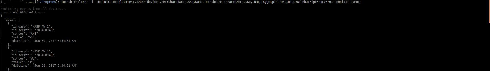
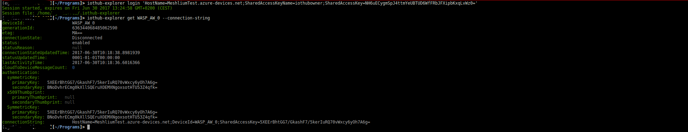
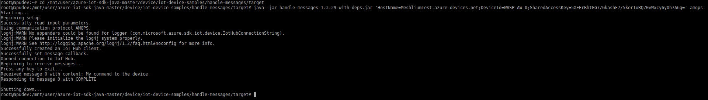
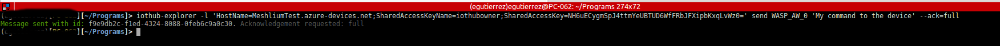

Run a simple JAVA sample on Meshlium device running Debian GNU/Linux 8
===
---

# Table of Contents

-   [Introduction](#Introduction)
-   [Step 1: Prerequisites](#Prerequisites)
-   [Step 2: Prepare your Device](#PrepareDevice)
-   [Step 3: Build and Run the Sample](#Build)
    -   [Option 1: Use the development board, without sensors](#Device-Sample)
    -   [Option 2: Use the Libelium-Azure Development Kit from Libelium](#Kit01-Sample)
-   [Next Steps](#NextSteps)

<a name="Introduction"></a>
# Introduction

**About this document**

This document describes how to connect Meshlium device running Debian GNU/Linux 8 with Azure IoT SDK. This multi-step process includes:
-   Configuring Azure IoT Hub
-   Registering your IoT device
-   Build and deploy Azure IoT SDK on device

<a name="Prerequisites"></a>
# Step 1: Prerequisites

You should have the following items ready before beginning the process:

-   Computer with GitHub installed and access to the
    [azure-iot-sdk-java](https://github.com/Azure/azure-iot-sdk-java) GitHub public repository.
-   Meshlium device.
-   [Setup your IoT hub][lnk-setup-iot-hub]
-   [Provision your device and get its credentials][lnk-manage-iot-hub]

<a name="PrepareDevice"></a>
# Step 2: Prepare your Device
-   Open a PuTTY session and connect to the IP your Meshlium has assigned. If you are connected to the Meshlium WiFi Access Point, the IP will be 10.10.10.1. On the other hand, if you are connected to the Ethernet network, you will have to be able to identify the IP your Meshlium has assigned by DHCP in order to access to the
Manager System. If your network does not offer DHCP service, Meshlium starts with a default IP (192.168.1.100)

- The credentials are: 
  - user: root
  - password: libelium

<a name="Build"></a>
# Step 3: Build SDK and Run the sample

<a name="Device-Sample"></a>
## Option 1: Use the development board, without sensors

<a name="Step_3_1"></a>
## 3.1 Install Azure IoT Device SDK and prerequisites on device

-   Install the prerequisite packages by issuing the following commands from the command line on the device.

<a name="Step_3_1_1"></a>
### 3.1.1  Install Java JDK and set up environment variables
        
1. Install openjdk-8

        sudo apt-get update        
        sudo apt-get install openjdk-8-jdk      
   
    ***Note:*** *If openjdk-8-jdk package is not available, use following steps to add source in sources.list and rerun above commands again.*
    
    -   Edit /etc/apt/sources.list
    
    -   Add below line and save the changes.
        
        `deb http://ftp.debian.org/debian testing main`
   
2.  Update the PATH environment variable to include the full path to the bin folder containing Java. To ensure the correct path of Java run below command:     
       
        which java
        
3.  Ensure that the directory shown by the `which java` command matches one of the directories shown in your $PATH variable. You can confirm this by running following command.

        echo $PATH

4.  If Java path is missing in PATH environment variable, run following command to set the same.    

        export PATH=[PathToJava]/bin:$PATH       

    ***NOTE:*** *Here **[PathToJava]** is output of `which java` command. For example, if `which java` output is /usr/bin/java, then export command will be* **export PATH=/usr/bin/java/bin:$PATH**

5.  Make sure that the JAVA_HOME environment variable includes the full path to the JDK. Use below command to get the JDK path.

        update-alternatives --config java

6.  Take note of the JDK location. `update-alternatives` output will show something similar to **/usr/lib/jvm/java-8-openjdk-amd64/jre/bin/java**. The JDK directory would then be **/usr/lib/jvm/java-8-openjdk-amd64/**.

7.  Run the following command to set **JAVA_HOME** environment variable.

        export JAVA_HOME=[PathToJDK]

    ***Note***: *Here [PathToJDK] is JDK directory. For example if jdk directory is /usr/lib/jvm/java-8-openjdk-amd64/, export command will be* **export JAVA_HOME=/usr/lib/jvm/java-8-openjdk-amd64/**

<a name="Step_3_1_2"></a>
### 3.1.2  Install Maven and set up environment variables

1.  Install maven

        sudo apt-get install maven

2.  Update the PATH environment variable to include the full path to the bin folder containing maven. To ensure the correct path of maven, run below command:     
       
        which mvn
         
3.  Ensure that the directory shown by the `which mvn` command matches one of the directories shown in your $PATH variable. You can confirm this by running following command.
 
        echo $PATH

4.  If maven path is missing in PATH environment variable, run following command to set the same.     

        export PATH=[PathToMvn]/bin:$PATH

    ***Note***: *Here [PathToMvn] is output of `which mvn`. For example if `which mvn` output is /usr/bin/mvn, export command will be* **export PATH=/usr/bin/mvn/bin:$PATH**
   
5.  You can verify that the environment variables necessary to run Maven 3 have been set correctly by running `mvn --version`.

<a name="Step_3_1_3"></a>
### 3.1.3  Install GIT

        sudo apt-get install git

<a name="Step_3_1_4"></a>
### 3.1.4  Build Qpid JMS

1.  Clone the repository for Qpid JMS.
    
        git clone https://github.com/avranju/qpid-jms.git

2.  Install Qpid JMS by executing following commands in sequence:

        cd qpid-jms
        mvn install | tee Qpid_Build_Logs.txt
        cd ..
    
    ***Note:*** *We have noticed that certain unit tests can fail when running  `mvn install` as given above with the latest version of JDK 8 (1.8.0_60 at the time this document was written). It works fine with older versions however. If this occurs please skip running unit tests using following command:*
    
        mvn install -DskipTests

<a name="Step_3_1_5"></a>
### 3.1.5 Build the Azure IoT Device SDK for Java

1.  Download the SDK to the board by issuing the following command in PuTTY:

        git clone https://github.com/Azure/azure-iot-sdk-java.git

2.  Verify that you now have a copy of the source code under the directory **azure-iot-sdk-java**.

3.  Run the following commands on device in sequence to build Azure IoT SDK.

        cd azure-iot-sdk-java/device
        mvn install | tee JavaSDK_Build_Logs.txt

4.  Above command will generate the compiled JAR files with all dependencies. This bundle can be found at:

        azure-iot-sdk-java/device/iothub-java-client/target/iothub-java-client-{version}-with-deps.jar

<a name="Kit01-Sample"></a>
## Option 2: Use the Libelium-Azure Development Kit from Libelium

The Libelium-Azure development kit includes:

-   Meshlium 4G 802.15.4 AP device
-   Plug & Sense! SC-PRO 802.15.4-PRO 5dBi
-   Plug & Sense! SA 802.15.4-PRO 5dBi
-   Noise / Sound Level Sensor
-   Luminosity (luxes accuracy)
-   Ultrasound probe
-   Temperature, Humidity and Pressure Sensor Probe
-   Calibrated Carbon Dioxide (CO2) gas Sensor Probe
-   Soil moisture 1.5 probe
-   Weather Station WS-3000 probe
-   2x Outdoors USB cable
-   3x International adapter
-   2x 6600mA·h rechargeable battery+external solar panel 7V + 500m
-   Plug & Sense! Documentation
-   Meshlium Documentation
-   Technical Consultancy (2 hours included)
-   Programming Service
-   Technical Support Forum (Free)

### Connect the sensors

For connecting the sensors, please follow the [P&S Quick Start Guide](http://www.libelium.com/downloads/quick-start-guides/quick_start_guide_azure_development_kit.pdf).

Specially the chapter "14. Check conecction diagram"

### Build and Run the sample

#### 1. Install in Meshlium:

-   [Maven](https://maven.apache.org/)

    Execute the command below in your Meshlium:

    ```bash
    $ remountrw && sudo apt-get install maven
    ```

-   [Azure IoT Java sdk](https://github.com/Azure/azure-iot-sdk-java)

    Download and compile Azure IoT Java sdk in your Meshlium executing the commands below:.

    ```bash
    $ cd /mnt/user/
    $ wget https://github.com/Azure/azure-iot-sdk-java/archive/master.zip
    $ cd azure-iot-sdk-java-master/
    $ mvn install
    ```

#### 2. Install in your computer:

-   [iothub-explorer](https://github.com/Azure/iothub-explorer).

### Send Device Events to IoT Hub

#### 1. IN MESHLIUM:

-   Configure and run the plugin for sending waspmotes messages to IoT-Hub following the instructions in the ["Quickstart Guide"](http://www.libelium.com/downloads/quick-start-guides/quick_start_guide_azure_development_kit.pdf) **page 15** section **20.2. Setup in Azure**

    
    *Figure 1: Meshlium Azure cloud connector*


#### 2. IN YOUR COMPUTER

-   Using the IoT-HuB **Connection String** obtained in the previous step, execute [iothub-explorer](https://github.com/Azure/iothub-explorer) with the parameters **login** and **monitor-events** as in this example:

    ```bash
    $ iothub-explorer -l 'HostName=MeshliumTest.azure-devices.net;SharedAccessKeyName=iothubowner;SharedAccessKey=NH6uECygmSpJ4ttmYeUBTUD6WfFRbJFXipbKxqLvWz0=' monitor-events
    ```

    
    *Figure 2: Monitor events*

### Receive messages from IoT Hub

#### 1. IN YOUR COMPUTER

-   Get the Connection String of one of the **Waspmote** devices using the IoT Hub **Connection String**. In the example the device is *WASP_AW_0*:

    ```bash
    $ iothub-explorer login 'HostName=MeshliumTest.azure-devices.net;SharedAccessKeyName=iothubowner;SharedAccessKey=NH6uECygmSpJ4ttmYeUBTUD6WfFRbJFXipbKxqLvWz0='
    $ iothub-explorer get WASP_AW_0 --connection-string
    ```

    
    *Figure 3: Get the Waspmote Connection String*

-   Copy the parameter **connectionString** displayed. In the example the parameter is:

    ```bash
    "HostName=MeshliumTest.azure-devices.net;DeviceId=WASP_AW_0;SharedAccessKey=5XEErBhtGG7/GkashF7/5kerIuRQ70vWxcy6yOh7A6g="
    ```

    We will use this parameter later to send a message to the *WASP_AW_0*

#### 2. IN MESHLIUM:

-   Execute sample for reading messages from IoT-HuB using the previously obtained Waspmote **Connection String**:

    ```bash
    $ cd /mnt/user/azure-iot-sdk-java-master/device/iot-device-samples/handle-messages/target
    $ java -jar handle-messages-1.3.29-with-deps.jar 'HostName=MeshliumTest.azure-devices.net;DeviceId=WASP_AW_0;SharedAccessKey=5XEErBhtGG7/GkashF7/5kerIuRQ70vWxcy6yOh7A6g=' amqps
    ```

    
    *Figure 4: Read messages in Meshlium*

#### 3. IN YOUR COMPUTER:

-   Send a message to the *WASP_AW_0*:

    ```bash
    $ iothub-explorer -l 'HostName=MeshliumTest.azure-devices.net;SharedAccessKeyName=iothubowner;SharedAccessKey=NH6uECygmSpJ4ttmYeUBTUD6WfFRbJFXipbKxqLvWz0=' send WASP_AW_0 'My command to the device' --ack=full
    ```

    
    *Figure 5: Receive messages from Meshlium*


<a name="Step_3_2"></a>
## 3.2 Run and Validate the Samples

<a name="Step_3_2_1"></a>
### 3.2.1 Send Device Events to IoT Hub:

-   Navigate to the folder containing the executable JAR file for send event sample.

        cd azure-iot-sdk-java/device/samples/send-event/target

-   Run the sample by issuing following command.

        java -jar ./send-event-{version}-with-deps.jar "{connection string}" "{number of requests to send}" "amqps"

    Replace the following in above command:
    
    -   `{version}`: Version of binaries you have build
    -   `{connection string}`: Your device connection string
    -   `{number of requests to send}`: Number of messages you want to send to IoT Hub

-   See [Manage IoT Hub][lnk-manage-iot-hub] to learn how to observe the messages IoT Hub receives from the application.

<a name="Step_3_2_2"></a>
### 3.2.2 Receive messages from IoT Hub

-   Navigate to the folder containing the executable JAR file for the receive message sample.

        cd azure-iot-sdk-java/device/samples/handle-messages/target
     
-   Run the sample by issuing following command.
   
        java -jar ./handle-messages-{version}-with-deps.jar "{connection string}" "amqps"

    Replace the following in above command:
    
    -   `{version}`: Version of binaries you have build
    -   `{connection string}`: Your device connection string
    -   `{number of requests to send}`: Number of messages you want to send to IoT Hub

-   See [Manage IoT Hub][lnk-manage-iot-hub] to learn how to send cloud-to-device messages to the application.

<a name="NextSteps"></a>
# Next Steps

You have now learned how to run a sample application that collects sensor data and sends it to your IoT hub. To explore how to store, analyze and visualize the data from this application in Azure using a variety of different services, please click on the following lessons:

-   [Manage cloud device messaging with iothub-explorer]
-   [Save IoT Hub messages to Azure data storage]
-   [Use Power BI to visualize real-time sensor data from Azure IoT Hub]
-   [Use Azure Web Apps to visualize real-time sensor data from Azure IoT Hub]
-   [Weather forecast using the sensor data from your IoT hub in Azure Machine Learning]
-   [Remote monitoring and notifications with Logic Apps]   

[Manage cloud device messaging with iothub-explorer]: https://docs.microsoft.com/en-us/azure/iot-hub/iot-hub-explorer-cloud-device-messaging
[Save IoT Hub messages to Azure data storage]: https://docs.microsoft.com/en-us/azure/iot-hub/iot-hub-store-data-in-azure-table-storage
[Use Power BI to visualize real-time sensor data from Azure IoT Hub]: https://docs.microsoft.com/en-us/azure/iot-hub/iot-hub-live-data-visualization-in-power-bi
[Use Azure Web Apps to visualize real-time sensor data from Azure IoT Hub]: https://docs.microsoft.com/en-us/azure/iot-hub/iot-hub-live-data-visualization-in-web-apps
[Weather forecast using the sensor data from your IoT hub in Azure Machine Learning]: https://docs.microsoft.com/en-us/azure/iot-hub/iot-hub-weather-forecast-machine-learning
[Remote monitoring and notifications with Logic Apps]: https://docs.microsoft.com/en-us/azure/iot-hub/iot-hub-monitoring-notifications-with-azure-logic-apps
[lnk-setup-iot-hub]: ../setup_iothub.md
[lnk-manage-iot-hub]: ../manage_iot_hub.md

