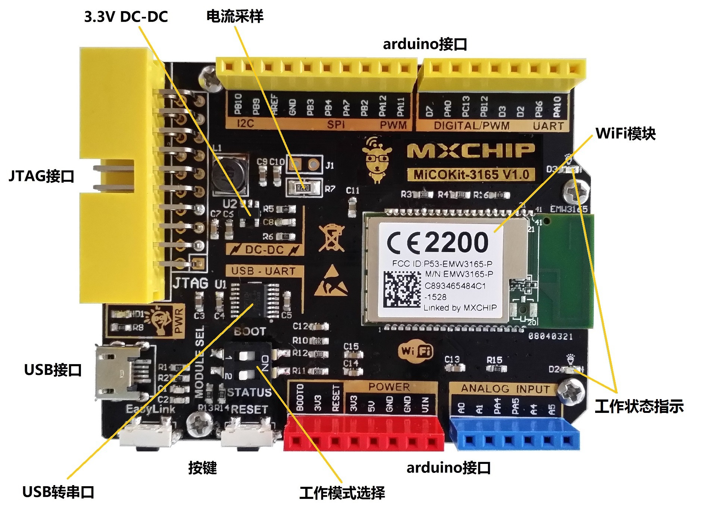

Run a simple C sample on supported MiCOKit device running MiCO
===
---

# Table of Contents

-   [Introduction](#Introduction)
-   [Step 1: Prerequisites](#Prerequisites)
-   [Step 2: Prepare your Device](#PrepareDevice)
-   [Step 3: Build and Run the Sample](#Build)
    -   [Option 1: Use the development board, without sensors](#Device-Sample)
    -   [Option 2: Use the AZ3166 IoT development kit from Shanghai MXCHIP Information Technology Co., Ltd.](#Kit01-Sample)
-   [Next Steps](#NextSteps)

# Introduction

**About this document**

This document describes how to connect supported MiCOKit device running MiCO with Azure IoT SDK. This multi-step process includes:
-   Configuring Azure IoT Hub
-   Registering your IoT device
-   Build and deploy Azure IoT SDK using [azure-iot-c-sdk-mico](https://github.com/zhaojuntao/azure-iot-c-sdk-mico) on supported device
-	Validate the sample using secureCRT-serial-debug-tool and Device-Explorer-Twin

**About the MiCOKit**

MiCOKit board is ShangHai MXCHIP's development kits for developer and engineer to fast connect the iot internet.
Static state show:

-   MXCHIP's WiFi module picture

-   MXCHIP's development kits picture

# Step 1: Prerequisites

Before executing any of the steps below, read through each process, step by step
to ensure end to end understanding.

You should have the following items ready before beginning the process:

-   Computer with GitHub installed and access to the
    [azure-iot-sdk-c](https://github.com/Azure/azure-iot-sdk-c) and [azure-iot-c-sdk-mico](https://github.com/zhaojuntao/azure-iot-c-sdk-mico) GitHub
    public repository.
-   Required hardware:
	-	Prepare [mxchip wifi module board](http://www.mxchip.com/product/wifi),for example MiCOKit3239.Please submit Sample application information on [mico.io](http://bbs.mico.io/),if you have not a mxchip wifi module board.
	-	Download and install [MiCoder IDE](http://developer.mico.io/downloads)
	-   USB Mini cable
	-	STLINK-v2/v1 or J-link v8/v9

***Note:*** *If you haven't contacted Microsoft about being an Azure Certified for IoT partner, please submit this [form](<https://catalog.azureiotsuite.com/>) first to request it and then follow these instructions.*

# Step 2: Prepare your Device

-   Install the latest MiCoderIDE software on your computer by
following the instructions in the [MiCO开发者中心](http://developer.mico.io/docs/13).
-   When the installation process is complete, the MiCoderIDE software have cotain latest MiCO SDK.You need to add azureIotclient files to MiCOderIDE project explorer's demos directory, you can directly copy [“demos\application\azure\azure_iothub_mqtt_demo” files](https://github.com/zhaojuntao/azure-iot-c-sdk-mico/tree/master/demos/application/azure/azure_iothub_mqtt_demo) here.And you need to add [“libraries\protocols\azure” files](https://github.com/zhaojuntao/azure-iot-c-sdk-mico/tree/master/libraries/protocols/azure) to MiCOderIDE project explorer's libraries directory.

  

-	[Regist azure.microsoft account](https://azure.microsoft.com/zh-cn/free/) to get free account for iothub.
-	Add iothub service in azure cloud control center.
-	Install [Azure tool(Azure CLI)](https://docs.microsoft.com/zh-cn/azure/iot-hub/iot-hub-raspberry-pi-kit-node-lesson2-get-azure-tools-win32) on your computer.
-	Click here to download and install DeviceExplorer，you will register your device using DeviceExplorer. Fllowing [here](https://github.com/Azure/azure-iot-device-ecosystem/blob/master/iotcertification/iot_certification_port_c_libraries_other_platforms/iot_certification_port_c_libraries_other_platforms.md) to study how to regist your device.
-	When have you regested your device, you can get DEVICE ID and connect string-primary key in your devices list. Copy the connect string-primary key and pasted on micoderIDE's "/demos/azureIotclient/mqtt/azure_mqtt_client.c".(static const char* connectionString = "xxx";)

  

# Step 3: Build SDK and Run the sample

## Option 1: Use the development board, without sensors

 -	In micoderIDE, using "azureIotclient.mqtt@MK3165 total download run JTAG=stlink-v2" command to compile and download to the board.
 -	In this section you will run the Azure IoT client SDK samples and DeviceExplorer to validate communication between your device and Azure IoT Hub. You will send messages to the Azure IoT Hub service and validate that IoT Hub has successfully receive the data.

## Option 2: Use the AZ3166 IoT development kit from Shanghai MXCHIP Information Technology Co., Ltd.

### AZ3166 IoT development kit

The AZ3166 IoT development kit includes:

 - AZ3166 board
 - Micro USB cable

Main control unit of AZ3166 is EMW3166---a low power consumption Wi-Fi module developed by MXCHIP, with DAP Link emulator and 128x64 OLED and other resources such as LED light. Sensors are integrated on the board including Motion sensor, Magnetometer sensor, Atmospheric pressure sensor, Temperature and humidity sensor. The development kit also has audio processing unit to connect to Azure for vioce recognition and voice play. 

### Connect the sensors

Sensors are integrated on the board including Motion sensor, Magnetometer sensor, Atmospheric pressure sensor, Temperature and humidity sensor.

### Prepare SDK

**Download SDK**

SDK could be download from [here](https://github.com/Neo117/AZ3166-connect-Azure).

**Compiling Environment**

 - Python is required in compiling. Download python from [here](https://www.python.org/downloads/release/python-2713/).
 - mbed CLI. For how to Install mbed CLI, please follow the link: [https://docs.mbed.com/docs/mbed-os-handbook/en/latest/dev_tools/cli/](https://docs.mbed.com/docs/mbed-os-handbook/en/latest/dev_tools/cli/)
 - GNU ARM Embedded Toolchain 4.9-2015-q3 is required in compiling. Download [here](https://www.python.org/downloads/release/python-2713/).

After install mbed CLI and GNU ARM Embedded Toolchain, configure mbed in sdk file by using cmd command:

<pre>
mbed config -G GCC_ARM_PATH ****
</pre>

### Build and Run the sample

**A. Configure WiFi**

Configure WiFi in mbed_app.json. Input Wifi SSID and password in main.app as shown below.

<pre>
        "wifi-ssid": {
            "value": "\"****\""
        },
        "wifi-password": {
            "value": "\"****\""
        }
</pre>

**B. Configure Device Registration**

 -	[Regist azure.microsoft account](https://azure.microsoft.com/zh-cn/free/) to get free account for iothub.
 -	Add iothub service in azure cloud control center.
 -	Install [Azure tool(Azure CLI)](https://docs.microsoft.com/zh-cn/azure/iot-hub/iot-hub-raspberry-pi-kit-node-lesson2-get-azure-tools-win32) on your computer.
 -	Click [here](https://github.com/Azure/azure-iot-sdk-csharp/blob/master/tools/DeviceExplorer/doc/how_to_use_device_explorer.md) to download and install DeviceExplorer，you will register your device using DeviceExplorer. Fllowing [here](https://github.com/Azure/azure-iot-device-ecosystem/blob/master/iotcertification/iot_certification_port_c_libraries_other_platforms/iot_certification_port_c_libraries_other_platforms.md) to study how to regist your device.
 - Configure device information in iothub_client_sample_mqtt.c. As shown below.

<pre>
static const char* connectionString = "HostName=****;DeviceId=****;SharedAccessKey=****";
</pre>

**C. Build the Sample**

Use the following command(Command Prompt on Windows, or Terminal on Mac OS X)

<pre>
     mbed compile -m AZ3166 -t GCC_ARM
</pre>

After compile the sample. a `.bin` file with the same name of the SDK would be generated in the path: `...\mbed-wifi-example\BUILD\AZ3166\GCC_ARM`.

**D. Download Firmware to DevKit**

Once the DevKit is connected, you will see a new USB mass storage device in your File Explorer.

Drag & drop the `.bin` file you compiled to AZ3166 device.

Wait until file copied, the DevKit will reboot to the latest firmware.

### Results

Az3166 would send data to Iothub-explorer and Iothub-explorer would receive the data.

At the same time,you can send message to Az3166 from iothub-explorer.

# Next Steps

You have now learned how to run a sample application that collects sensor data and sends it to your IoT hub. To explore how to store, analyze and visualize the data from this application in Azure using a variety of different services, please click on the following lessons:

-   [Manage cloud device messaging with iothub-explorer]
-   [Save IoT Hub messages to Azure data storage]
-   [Use Power BI to visualize real-time sensor data from Azure IoT Hub]
-   [Use Azure Web Apps to visualize real-time sensor data from Azure IoT Hub]
-   [Weather forecast using the sensor data from your IoT hub in Azure Machine Learning]
-   [Remote monitoring and notifications with Logic Apps]   

[Manage cloud device messaging with iothub-explorer]: https://docs.microsoft.com/en-us/azure/iot-hub/iot-hub-explorer-cloud-device-messaging
[Save IoT Hub messages to Azure data storage]: https://docs.microsoft.com/en-us/azure/iot-hub/iot-hub-store-data-in-azure-table-storage
[Use Power BI to visualize real-time sensor data from Azure IoT Hub]: https://docs.microsoft.com/en-us/azure/iot-hub/iot-hub-live-data-visualization-in-power-bi
[Use Azure Web Apps to visualize real-time sensor data from Azure IoT Hub]: https://docs.microsoft.com/en-us/azure/iot-hub/iot-hub-live-data-visualization-in-web-apps
[Weather forecast using the sensor data from your IoT hub in Azure Machine Learning]: https://docs.microsoft.com/en-us/azure/iot-hub/iot-hub-weather-forecast-machine-learning
[Remote monitoring and notifications with Logic Apps]: https://docs.microsoft.com/en-us/azure/iot-hub/iot-hub-monitoring-notifications-with-azure-logic-apps
[setup-devbox-windows]: https://github.com/Azure/azure-iot-sdk-c/blob/master/doc/devbox_setup.md
[lnk-setup-iot-hub]: ../../setup_iothub.md
[lnk-manage-iot-hub]: ../../manage_iot_hub.md

