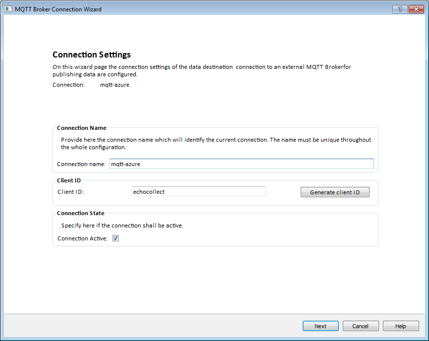
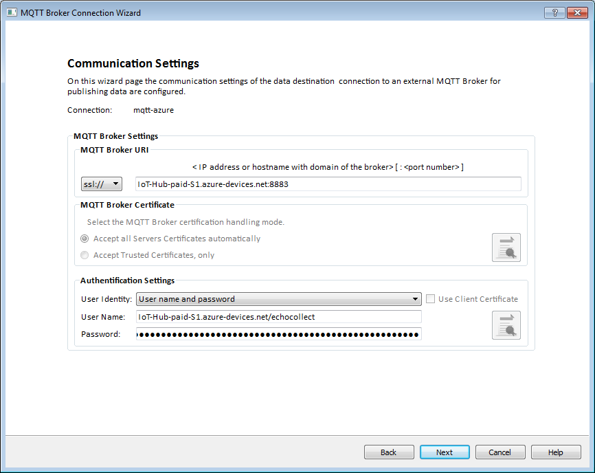
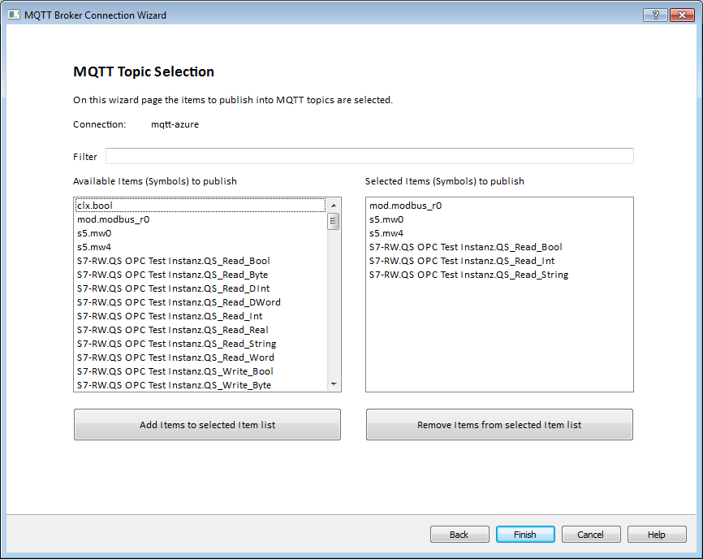

Configure [echocollect e](https://industrial.softing.com/en/products/plc-connectivity/integration-of-plc-data/stand-alone-application-gateways-multiprotocol/echocollect-e.html) or [echocollect r-m](https://industrial.softing.com/en/products/plc-connectivity/integration-of-plc-data/stand-alone-application-gateways-multiprotocol/echocollect-rm.html) as Azure IoT-device
===
---

# Table of Contents

-   [Introduction](#Introduction)
-   [Step 1: Prerequisites](#Prerequisites)
-   [Step 2: Prepare your Device](#PrepareDevice)
-   [Tips](#tips)

# Introduction

**About this document**

This document describes how to connect echocollect model e or r-m device with Azure IoT. This multi-step process includes:
-   Configuring Azure IoT Hub
-   Registering your IoT device
-   Configure the device to publish PLC data to Azure IoT

# Step 1: Prerequisites

You should have the following items ready before beginning the process:

-   [Setup your IoT hub][lnk-setup-iot-hub]
-   [Provision your device and get its credentials][lnk-manage-iot-hub]
-   Create a SAS token for your device as described in [iot-hub-mqtt-support](https://docs.microsoft.com/en-Us/azure/iot-hub/iot-hub-mqtt-support)
-   echocollect (e or r-m) device configured to connect to PLCs.

# Step 2: Prepare your Device
-   With the configuration program NetCon create a new MQTT connection.

-   On the first wizard page you need to enter the IoT-hub device-id of your device as client id. In the screenshot above the device-id is "echocollect".

-   On the second wizard page you need to enter the URI of your Azure IoT hub for MQTT connections. In the screenshot above: ´IoT-Hub-paid-S1.azure-devices.net:8883´.
-   As user name you need to enter the name of your Azure IoT hub, ´.azure-devices.net/´ and the device-id. In the screenshot above: ´IoT-Hub-paid-S1.azure-devices.net/echocollect´.
-   Finally you need to enter the SAS token, which you have created with the deviceExplorer for your device.
    You need to enter/copy the part after the ´SharedAccessSignature=´ part as password!

-   On the 3rd wizard page you need to set the MQTT Root Topic: ´devices/<device-id>/messages/events´. In the screenshot above: ´devices/echocollect/messages/events´.
-   Select flattened PLC hierarchy.
-   Set the MQTT payload format string:

´´´
{"HostName":"Softing","MonitoredItem":{"Id":"s=@ITEM@","Uri":"http://industrial.softing.com/echocollect"},"Value":{"Value":"@VALUE@","SourceTimestamp":"@TIME@","ServerTimestamp":"@TIME@","quality":"@QUALITY@"}}
´´´

-   Select QoS0 or QoS1
-   Set the minimum sampling intervall as needed by your application. *ATTENTION:* The PLC data would be sampled with this rate, which could cause a huge ammount of messages to the Azure IoT hub!

-   Finally choose the PLC symbols you want to send to your Azure IoT hub.

# Tips

Read [iot-hub-mqtt-support](https://docs.microsoft.com/en-Us/azure/iot-hub/iot-hub-mqtt-support) for further information how to publish data to IoT hub with protocoll MQTT.

[setup-devbox-linux]: https://github.com/Azure/azure-iot-sdk-c/blob/master/doc/devbox_setup.md
[lnk-setup-iot-hub]: ../setup_iothub.md
[lnk-manage-iot-hub]: ../manage_iot_hub.md
