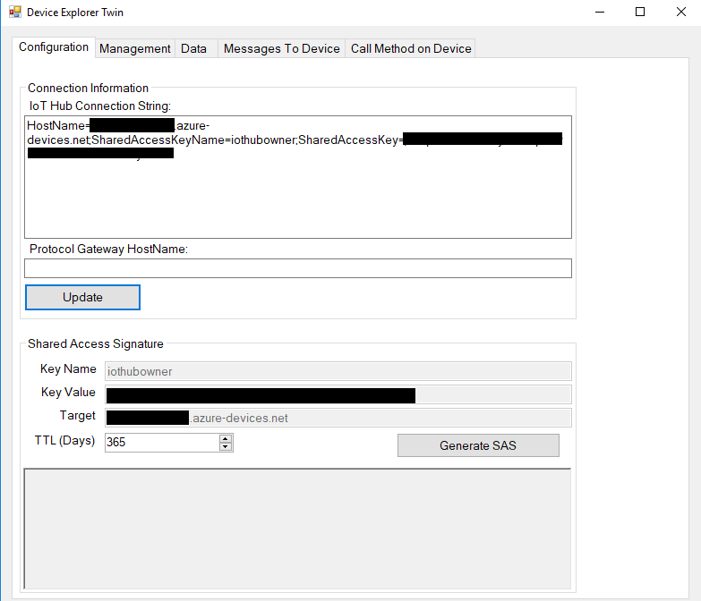
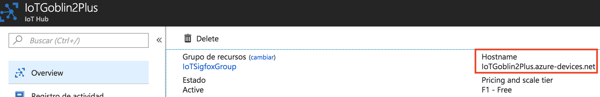
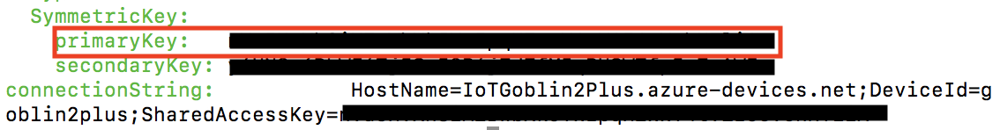
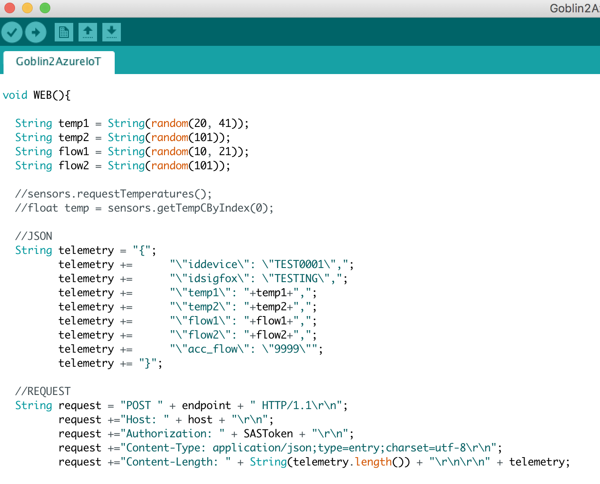
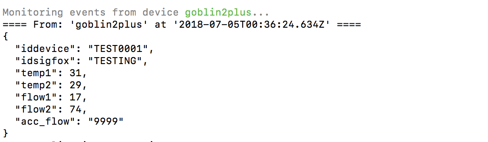

# Connect Goblin 2 Plus to Azure IoT Hub in the cloud
---

# Table of Contents

-   [Introduction](#Introduction)
-   [Step 1: Prerequisites](#Step-1-Prerequisites)
-   [Step 2: Prepare your Device](#Step-2-PrepareDevice)
-   [Step 3: Build and Run the Sample](#Step-3-Build)
-   [Next Steps](#NextSteps)

# Introduction

**About this document**

The following document describes the process of connecting a Goblin 2 Plus system to Azure IoT Hub. This multi-step process includes:
-   Configuring Azure IoT Hub
-   Registering your IoT device and get your SAS Token
-   Send messages to IoT Hub

# Step 1: Prerequisites

You should have the following items ready before beginning the process:
-   Computer with a Git client installed.
-   [Arduino IDE](https://www.arduino.cc/en/main/software) version 1.6.8 or later.
-   [Setup your IoT hub](https://catalog.azureiotsolutions.com/docs?title=Azure/azure-iot-device-ecosystem/setup_iothub) 
-   [Provision your device and get its credentials](https://github.com/Azure/azure-iot-device-ecosystem/blob/master/manage_iot_hub.md)

# Step 2: Prepare your Device

-   Connect the Goblin 2 Plus using the mini-USB cable.
-   Select the Arduino/Genuino ZERO board in tools.

 

# Step 3: Build and Run the sample

## Setup the development environment

In this section we are going to run a sample application that send different values, these values are random.

## Get the SAS Token

You can get the SAS (SharedAccessSignature) Token through this methods: [iothub-explorer](https://github.com/Azure/iothub-explorer), [Device Explorer](https://github.com/Azure/azure-iot-sdk-csharp/releases) or running the following [code](https://gitlab.com/joserey/sastoken-generator/blob/master/index.js) that is based on this [article of Microsoft](https://docs.microsoft.com/en-us/azure/iot-hub/iot-hub-devguide-security#security-tokens)

### Using Device Explorer

1.  Get the connection string for your IoT hub. See Set up IoT Hub for more details.

2.  On the Configuration tab, paste the IoT Hub connection-string for your IoT hub into IoT Hub connection string and click Update:

    

3.  Go to the Management tab, click on list to see your devices, click on SAS Token.

    

4.  Select your device, write the days, then click on generate.

    

### Using JavaScript code

1.  Run the follow code

    [https://gitlab.com/joserey/sastoken-generator/blob/master/index.js](https://gitlab.com/joserey/sastoken-generator/blob/master/index.js)

    **NOTE:** Requires Node.js 4.x or later to work properly.

2.  You need to fill the following lines

        var host = "";          //Hostname, {your-iothub-name}.azure-devices.net
        var device = "";        //Your device
        var signingKey = "";    //any symmetric key for the {device id} identity
        var days = 365;         //Valid days

    You can see the hostname here

    

    You can see the symmetric key here at the time of create your device

    

3.  Run the file and copy the output (your SAS Token).

         SharedAccessSignature sr=XXXXXXXXXXXX.azure-devices.net%2Fdevices%2FXXXXXXXXXXX&sig=XXXXXXXXXXXXXXXXXXXXXXXXXXXXXXXXXXXXXXXXXXXXX&se=1562285589

### Get the sample application from GitHub

The sample application is hosted on GitHub. Clone the sample repository that contains the sample application from GitHub. To clone the sample repository, follow these steps:

1.  Open a command prompt or a terminal window.
2.  Go to a folder where you want the sample application to be stored.
3.  Run the following command:

        git clone https://github.com/jose-verse/goblin2plus-get-started.git

4.  In these lines you need to put your information

        String host = "";                                                  //Hostname, {your-iothub-name}.azure-devices.net
        String deviceid = "";                                              //Your device
        String api = "2018-06-30";                                         //API version
        String SASToken = "";                                              //SAS Token

    You can watch the api-version following this [link](https://docs.microsoft.com/en-us/azure/iot-hub/iot-hub-devguide-security)

5.  The JSON and request are building here.

    

6. Compile and run in your goblin 2 plus.

    

## Verify the sample application is running successfully

You can use the monitor of iothub-explorer to watch your messages coming to IoT Hub.

    $ iothub-explorer monitor-events myDevice --login "connection-string"

 

# Next Steps

You have now learned how to run a sample application that collects sensor data and sends it to your IoT hub. To explore how to store, analyze and visualize the data from this application in Azure using a variety of different services, please click on the following lessons:

-   [Manage cloud device messaging with iothub-explorer]
-   [Save IoT Hub messages to Azure data storage]
-   [Use Power BI to visualize real-time sensor data from Azure IoT Hub]
-   [Use Azure Web Apps to visualize real-time sensor data from Azure IoT Hub]
-   [Weather forecast using the sensor data from your IoT hub in Azure Machine Learning]
-   [Remote monitoring and notifications with Logic Apps]   

[Manage cloud device messaging with iothub-explorer]: https://docs.microsoft.com/en-us/azure/iot-hub/iot-hub-explorer-cloud-device-messaging
[Save IoT Hub messages to Azure data storage]: https://docs.microsoft.com/en-us/azure/iot-hub/iot-hub-store-data-in-azure-table-storage
[Use Power BI to visualize real-time sensor data from Azure IoT Hub]: https://docs.microsoft.com/en-us/azure/iot-hub/iot-hub-live-data-visualization-in-power-bi
[Use Azure Web Apps to visualize real-time sensor data from Azure IoT Hub]: https://docs.microsoft.com/en-us/azure/iot-hub/iot-hub-live-data-visualization-in-web-apps
[Weather forecast using the sensor data from your IoT hub in Azure Machine Learning]: https://docs.microsoft.com/en-us/azure/iot-hub/iot-hub-weather-forecast-machine-learning
[Remote monitoring and notifications with Logic Apps]: https://docs.microsoft.com/en-us/azure/iot-hub/iot-hub-monitoring-notifications-with-azure-logic-apps
[setup-devbox-linux]: https://github.com/Azure/azure-iot-sdk-c/blob/master/doc/devbox_setup.md
