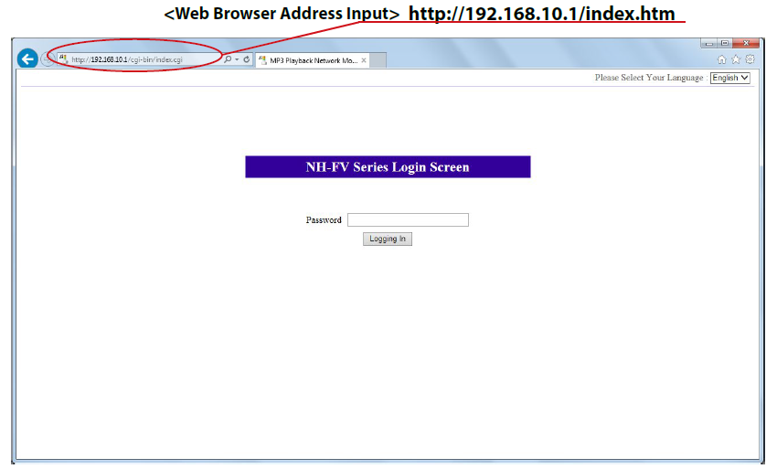
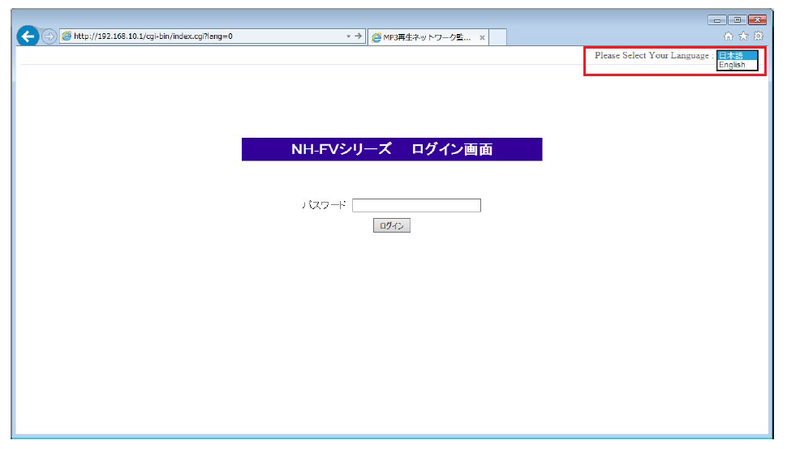
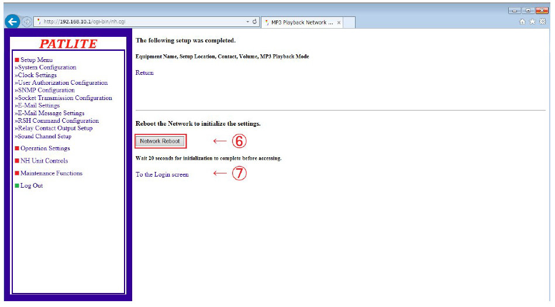
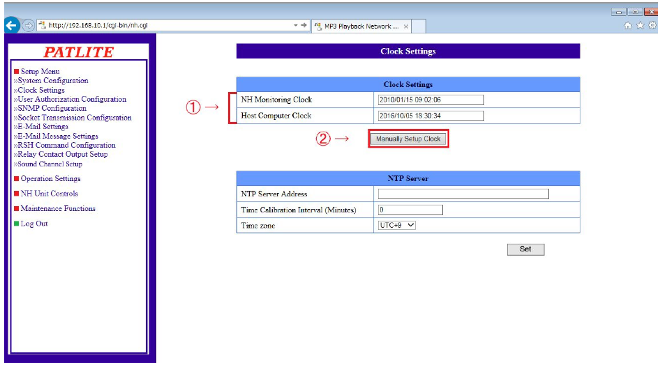
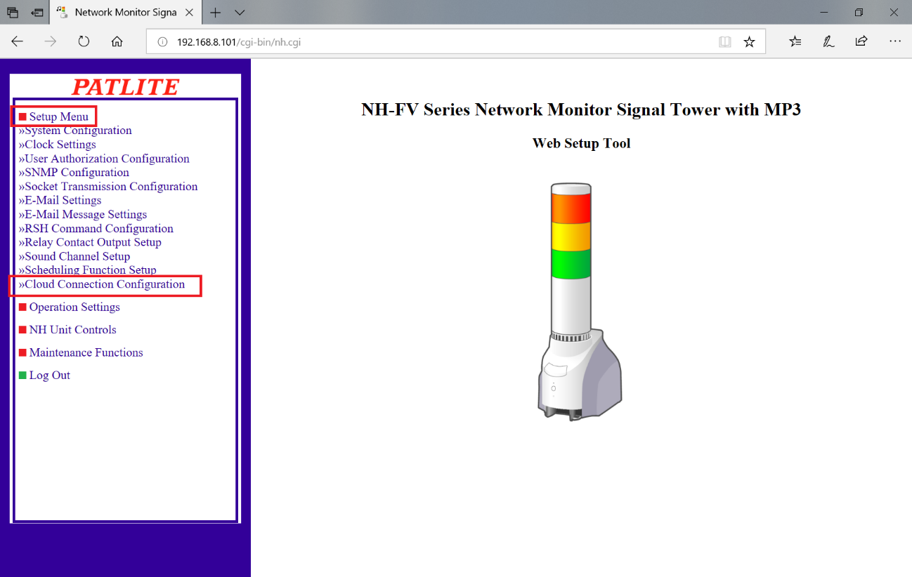
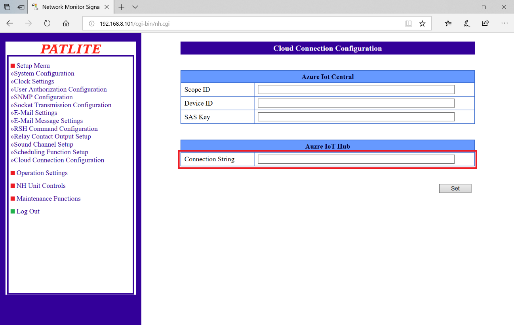
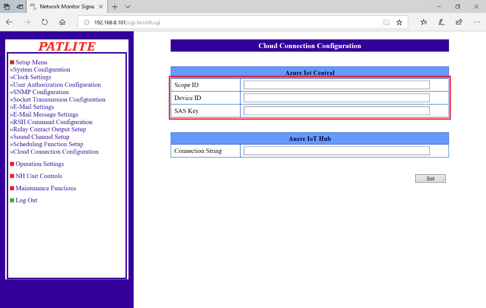

Run a simple java sample on NH-FV Series device running Arduino
===
---

# Table of Contents

-   [Introduction](#Introduction)
-   [Step 1: Prerequisites](#Prerequisites)
-   [Step 2: Prepare your Device](#PrepareDevice)
-   [Step 3: Configure the Device](#Build)
-   [Step 4: Control NH using field list](#Control)
-   [Next Steps](#NextSteps)

# Introduction

This document describes how to connect NH-FV Series device running JAVA
with Azure IoT Hub. This multi-step process includes:

-   Configuring Azure IoT Hub
-   Registering your IoT device
-   Configure the device
-   Control NH using field list

# Step 1: Prerequisites

You should have the following items ready before beginning the process:

-   [Prepare your development environment][setup-devbox-linux]
-   [Provision your device and get its credentials][lnk-manage-iot-hub]

# Step 2: Prepare your Device

-   NH-FV Series device

# Step 3: Configure the Device

## 3.1 Installation Procedure and Flowchart

1.  Install this product on a level surface. If necessary, use the accessories (rubber foot, adhesive seal, support base) if needed when
installing.

2.  Connect the AC Adaptor to this product Using the cable clamp will prevent the power cord from being unintentionally pulled out. (Refer to **1.5 About AC Adaptor**)

3.  Connect the LAN cable to this product.

4.  Set up the network environment configuration. Refer to **3.2 Network Setup -- 3.3 Clock Setup**  on how to setup the network.

5.  Set up the detailed settings after the network environment has been configured

6.  Azure IoT Hub **3.4 Azure IoT HUB**

7.  Azure IoT Central **3.5 Azure IoT Central**

8.  This product is now ready to be used.

## 3.2 Network Setup

The default IP address for this product is: `192.168.10.1`

Subnet mask is: `255.255.255.0`

The IP address change should be done by logging in to the web browser of the personal computer (henceforth PC) to change the setup. Log into the personal computer before changing the Network settings, so that the personal computer can communicate with this product. Refer to **Login** for the login method.

Various setups for this product is done by logging in from a web browser. In order to log in, the IP address for this product is entered into the address portion of the web browser.

 

Attention： When the login screen is displayed, enter "patlite" in the password field, then click the "Logging In" button. The default password is set to "patlite". Be sure to change the password to prevent any security breaching.

When the login screen is displayed, go to the upper right of the screen where **Please Select Your Language** is located to select the preferred language.

 

Select the preferred language from the pull down menu in the upper right of the login screen. (Refer to　above.)

The currently selectable languages available are **Japanese** and **English**. Once selected, the language will be displayed on each screen in the Web setup tool.

When the login screen is displayed, go to the upper right of the screen where **Please Select Your Language** is located to select the preferred language. Enter **patlite** in the password field, then click the **Logging In** button.

The default password is set to "patlite." Be sure to change the password to prevent any security breaching.

2.  Setting the IP Address

After logging in, the web setup tool will be executed and the **System Setup** screen will be displayed.

1.  Click the **Setup Menu** in the Setup Table Entry on the left-hand side of the setup screen.

2.  Click **System Setup** from the tree menu. The System Setup Screen is displayed. (Refer to **Figure 2.7.2--2**)

    

    In the System Setup Screen, the network can be changed.

    **Setup Method:**

3.  Enter the Main Unit IP address.

4.  Set up the net mask, default gateway, etc. if needed.

5.  Click the **Set** button to activate the setup.

    

6.  In order to activate the setting parameters, click the **Network Reboot**\" button.

7.  Rebooting the network takes about 20 seconds. If no action occurs
after time elapses, click To the Login screen to log in, again.

    

**Setup Confirmation:**

If the web browser address is reflecting the changed value of the IP address after clicking **To the Login screen**, the setup of the new IP address has been  uccessful. However, in cases where the preset value of other networks had been changed, be sure to enter the proper IP Address value where it was moved to in order to verify it in the system setup screen.

Verify that the IP Address has changed (Below example shows
**192.168.10.1**)

## 3.3 Clock Setup

The PC clock time is reflected in this product when logged in again.

**[Setup Method]**

1.  Compare the columns between the **NH Monitor Time** and the **Host Computer Time**.

2.  Click the **Manually Setup Clock** button to synchronize the time with the PC which is logged in.

    

## 3.4 Azure IoT Hub

1.  Click **Setup Menu** in the menu to open the tree menu.

2.  Click **Cloud Connection Configuration** in the tree menu to move to the settings screen.

3.  Enter the device's connection string value in the **Connection string** field.

4.  Click the **Settings** button to apply the settings.

5.  Click **Logout** in the tree menu and close the browser.

    

    

## 3.5 Azure IoT Central

1.  Click **Setup Menu** in the menu to open the tree menu.

2.  Click **Cloud Connection Configuration** in the tree menu to move to the settings screen.

3.  Enter numerical values in the **Scope ID** field, the **Device ID** field, and the **Primary Key** field.

4.  Click the **Settings** button to apply the settings.

5.  Click **Logout** in the tree menu and close the browser.

    

    

# Step 4: Field Name List

List and description of field names for controlling NH-FV.

Choose the appropriate method depending on the control application.

## 4.1 Device Twin

Field Name States Description

led\_red 「0」：Off LED unit 「Red」

led\_yellow LED 「1」：On LED unit 「Yellow」

led\_green LED 「2」：Flashing pattern1 LED unit 「Green」

led\_blue LED 「3」：Flashing pattern2 LED unit 「Blue」

led\_white LED 「9」：No Change LED unit 「White」

buz\_pattern 「0」：Stop Buzzer control

> 「1」：Buzzer pattern1
>
> 「2」：Buzzer pattern2
>
> 「3」：Buzzer pattern3
>
> 「4」：Buzzer pattern4
>
> 「9」：No change

sound\_pattern 「1」～「70」channel Sound channel

digit\_output\_1 「0」：OFF Digital output

> 「1」：ON

## 4.2 Direct Method / Cloud-to-device Message

Field Name States Description

alert 6-digit ・Control the LED unit and the buzzer

> ・ Specify the pattern in the order of R（Red）→ Y（Yellow）→
> G（Green）→ B（Blue）→ C（White）→ Z（Buzzer）
>
> ・ ［RYGBC］：Off「0」、On「1」、Flashing pattern1「2」、Flashing
> pattern2「3」、No change「9」
>
> ・ ［Z］：Stop「0」、Buzzer pattern1「1」、Buzzer
> pattern2「2」、Buzzer pattern3「3」、Buzzer pattern4「4」、No
> change「9」

led 5-digit ・ Specify the pattern in the order of R（Red）→
Y（Yellow）→ G（Green）→ B（Blue）→ C（White）

> ・ ［RYGBC］：Off「0」、On「1」、Flashing pattern1「2」、Flashing
> pattern2「3」、No change「9」

alert\_do 0,1,9 ・ Control digital output

> ・ Off「0」、On「1」、No change「9」

Clear 1 All LED unit turn off and the channel currently playing is
stopped.

Sound 1 ～ 70 Play the specified channel

repeat 0 ～ 255 Play the specified number of times.

## 4.4 Device-to-cloud Message

Field Name States Description

clear\_switch on Notify when the clear switch is pressed.

digital\_input\_1 on Notify when digital input 1 is turned on.

> off Notify when digital input 1 is turned off.

digital\_input\_2 on Notify when digital input 2 is turned on.

> off Notify when digital input 2 is turned off.

digital\_input\_3 on Notify when digital input 3 is turned on.

> off Notify when digital input 3 is turned off.

digital\_input\_4 on Notify when digital input 4 is turned on.

> off Notify when digital input 4 is turned off.

red\_state 0 Notify when LED red goes out.

> 1 Notify when LED red lights up.
>
> 2 Notify when the LED red operates with flashing pattern 1.
>
> 3 Notify when the LED red operates with flashing pattern 2

yellow\_state 0,1,2,3 Notify when the LED yellow has changed. The value is the same as No. 6 red\_state.

green\_state 0,1,2,3 Notify when the LED green has changed. The value is the same as No. 6 red\_state.

blue\_state 0,1,2,3 Notify when the LED blue has changed. The value is the same as No. 6 red\_state.

white\_state 0,1,2,3 Notify when the LED white has changed. The value is the same as No. 6 red\_state

buzzer\_state 0,1,2,3 Notify when Buzzer changes. The value is the same as No. 6 red\_state.

sound\_state 1～70 Notify when sound changes.

output\_state on Notify when digital output is turned on.

> off Notify when digital output is turned off.
