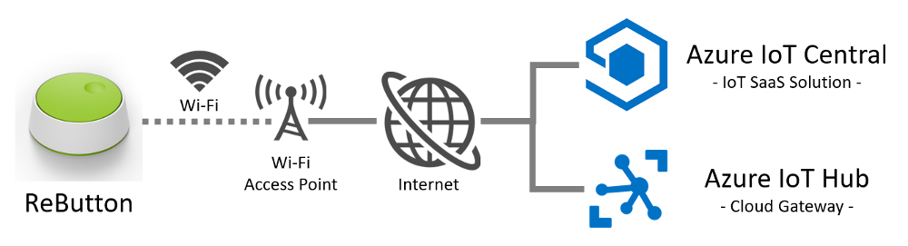
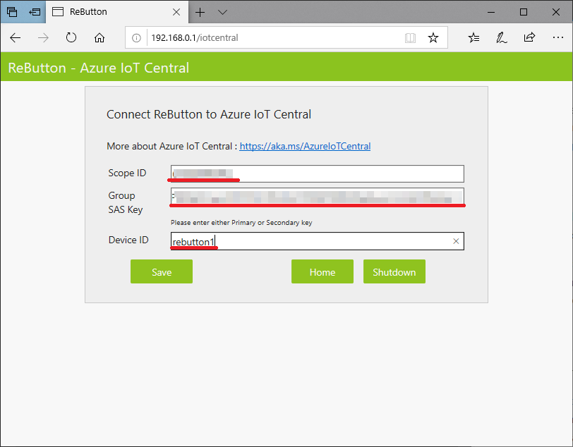

Connect ReButton device to your Azure IoT Central Application
===

---
# Table of Contents

-   [Introduction](#Introduction)
-   [Step 1: Prerequisites](#Prerequisites)
-   [Step 2: Device Connection Details](#Deviceconnectiondetails)
-   [Step 3: Prepare the Device](#Preparethedevice)
-   [Step 4: Additional Links](#AdditionalLinks)

# Introduction 

**About this document**

This document describes how to connect ReButton to Azure IoT Central application using the IoT plug and Play model. By using Plug and Play, device manufacturers can provide a model of their device to cloud developers to be integrated quickly into IoT Central or any solution built on Azure IoT platform. IoT Plug and Play will be open to the community by way of a definition language and SDKs.

# Step 1: Prerequisites

You should have the following items ready before beginning the process: 

-   [Azure Account](https://portal.azure.com)
-   [Azure IoT Central Application](https://docs.microsoft.com/en-us/azure/iot-central/overview-iot-central)
-   Network connectivity (Wifi)
-   Its mandatory that the device code/software image is preinstalled in device to enable Plug and Play

**Note:** If the device code is not preinstalled following are the [options](#preparethedevice) to choose to enable the plug and play device

# Step 2: Device Connection Details.

Seeed ReButton is a developer device for simple trigger actions, supporting multiple clicks and long press.  
In addition, you can connect Seeed Grove sensors to add more data points.

1.  When you push ReButton, it will power up and connect to internet via pre-configured Wi-Fi.
2.  ReButton will receive Device Twin changes from pre-configured Azure IoT Central or Azure IoT Hub.
3.  ReButton will send Device to Cloud Message to pre-configured Azure IoT Central or Azure IoT Hub.
4.  After D2C message was sent, ReButton will shutdown.

 

# Step 3: Prepare the Device.

## Step 3.1: Update firmware

**OTA consume power. Please use fresh battery, not to interrupt OTA process.**

1.  Enter ReButton to AP mode by press and hold the button until RGB LED turns into White. 
   (reminder: connect to the AP `AZB-xxxxxxxxxxxx` and the URL of the page is `http://192.168.0.1`)
2.  Configure Wi-Fi configuration. ([detail](https://github.com/SeeedJP/ReButton#2-wi-fi-configuration))
3.  Firmware update. ([detail](https://github.com/SeeedJP/ReButton/blob/master/OTA.md#step-3-ota-process))

Some Package URI, CRC and size are [here](https://github.com/SeeedJP/ReButton/blob/master/firmware/readme.md).

## Step 3.2: Configure Wi-Fi configuration

Configure Wi-Fi settings to connect to internet. ([detail](https://github.com/SeeedJP/ReButton/blob/master/README.md#2-wi-fi-configuration))

## Step 3.3: Configure Azure IoT Central configuration

In order to send Device to Cloud (D2C) message to Azure IoT Central, you need to set device provisioning information in ReButton.

1.  Get `Scope ID` and `Primary Key` of SAS from Administration - Device Connection page in Azure IoT Central Application.
2.  Set `Scope ID`, `Primary Key` and `Device ID` to Azure IoT Central page in ReButton.  

 

# Step 4: Additional Links

Please refer to the below link for additional information for Plug and Play 

- [Blog article](https://azure.microsoft.com/en-us/blog/iot-plug-and-play-is-now-available-in-preview/)
- FAQ (TBD) 
- [Plug and Play C SDK](https://github.com/Azure/azure-iot-sdk-c/tree/public-preview) 
- [Plug and Play Node SDK](https://github.com/Azure/azure-iot-sdk-node/tree/digitaltwins-preview)
- [Plug and Play Definitions](https://github.com/Azure/IoTPlugandPlay)
