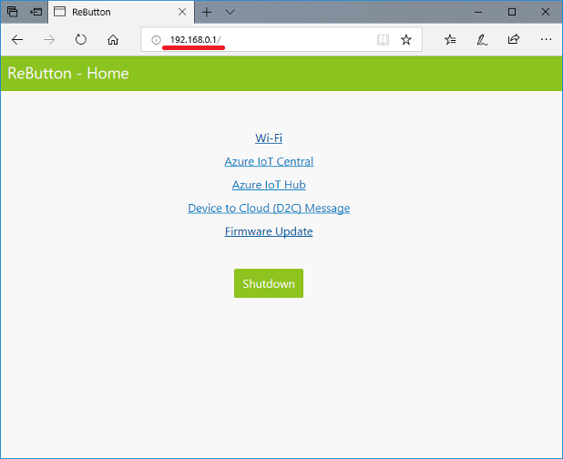

Run a simple C sample on Seeed ReButton device running Arduino
===
---

# Table of Contents

-   [Introduction](#Introduction)
-   [Step 1: Prerequisites](#Prerequisites)
-   [Step 2: Prepare your Device](#PrepareDevice)
-   [Step 3: Configure and Run the Sample](#Run)
-   [Next Steps](#NextSteps)

<a name="Introduction"></a>
# Introduction

This document describes how to connect Seeed ReButton device running C with Azure IoT Hub. This multi-step process includes:
-   Configuring Azure IoT Hub
-   Registering your IoT device
-   Configure the device and run the sample

<a name="Prerequisites"></a>
# Step 1: Prerequisites

You should have the following items ready before beginning the process:

-   [Setup your IoT hub][lnk-setup-iot-hub]
-   [Provision your device and get its credentials][lnk-manage-iot-hub]
-   Seeed ReButton device.

<a name="PrepareDevice"></a>
# Step 2: Prepare your Device

<a name="Run"></a>
# Step 3: Run the sample

## 3.1 Access to ReButton

Use AP Mode (Access Point Mode) to configure ReButton.

1. Hold button until RGB LED turns into White.  
  RGB LED will start with Blue, Yellow, Cyan, then White.  
  This will take about 10 seconds.

1. Release button and confirm ReButton is in AP mode.  
  When ReButton successfully boots into AP Mode, RGB LED will blink in White.

1. Connect to AP  
  Look for Wi-Fi Access Point `AZB-xxxxxxxxxxxx` and connect to it from your PC.  
  `xxxxxxxxxxxx` is MAC address of your ReButton Wi-Fi.  
  

1. Use a Web Browser to access ReButton - Home at `http://192.168.0.1`.  
  

## 3.2 Wi-Fi Configuration

Configure Wi-Fi settings to connect to Internet.

1. Click `Wi-Fi` at ReButton - Home.
1. Select your Wi-Fi Access Point from `Wi-Fi SSID` list.  
  If you do not see your Access Point, refresh browser.
1. Enter `Wi-Fi Passphrase` for your Wi-Fi AP.
1. In case you would like to use specific Internet Time Server, enter FQDN to `Time Server`.  
  Default Internet Time Server is pool.ntp.org -> cn.pool.ntp.org -> europe.pool.ntp.org -> asia.pool.ntp.org -> oceania.pool.ntp.org .

1. Click `Save`.


### 3.3 Azure IoT Hub

In order to send Device to Cloud (D2C) message to Azure IoT Hub, save Connection String in ReButton.

1. Browse to ReButton - Home page then click `Azure IoT Hub`.
1. Paste Connection String to `Azure IoT Hub connection string`.
1. Click `Save`.


## 3.4 Power off

Exit AP Mode and power off ReButton.

1. Click `Shutdown` button.

## 3.5 Device To Cloud (D2C) Messsage

Button push will trigger D2C message to the cloud.  
ReButton supports 5 types of button triggers and default D2C message strings are following.

|Clicks|RGB led|actionNum|message|
|:--|:--|:--|:--|
|Single click|Blue|1|"Single click"|
|Double click|Lime|2|"Double click"|
|Triple click|Magenta|3|"Triple click"|
|Long press (> 3sec.)|Yellow|10|"Long press"|
|Super long press (> 6sec.)|Cyan|11|"Super long press"|

Examples of D2C message:
```json
{
  "actionNum": "1",
  "message": "Single click",
  "batteryVoltage": 2.59
}

{
  "actionNum": "2",
  "message": "Double click",
  "batteryVoltage": 2.59
}

{
  "actionNum": "3",
  "message": "Triple click",
  "batteryVoltage": 2.59
}

{
  "actionNum": "10",
  "message": "Long press",
  "batteryVoltage": 2.59
}

{
  "actionNum": "11",
  "message": "Super long press",
  "batteryVoltage": 2.59
}
```

<a name="NextSteps"></a>
# Next Steps

You have now learned how to run a sample application that collects sensor data and sends it to your IoT hub. To explore how to store, analyze and visualize the data from this application in Azure using a variety of different services, please click on the following lessons:

-   [Manage cloud device messaging with iothub-explorer]
-   [Save IoT Hub messages to Azure data storage]
-   [Use Power BI to visualize real-time sensor data from Azure IoT Hub]
-   [Use Azure Web Apps to visualize real-time sensor data from Azure IoT Hub]
-   [Weather forecast using the sensor data from your IoT hub in Azure Machine Learning]
-   [Remote monitoring and notifications with Logic Apps]   

[Manage cloud device messaging with iothub-explorer]: https://docs.microsoft.com/en-us/azure/iot-hub/iot-hub-explorer-cloud-device-messaging
[Save IoT Hub messages to Azure data storage]: https://docs.microsoft.com/en-us/azure/iot-hub/iot-hub-store-data-in-azure-table-storage
[Use Power BI to visualize real-time sensor data from Azure IoT Hub]: https://docs.microsoft.com/en-us/azure/iot-hub/iot-hub-live-data-visualization-in-power-bi
[Use Azure Web Apps to visualize real-time sensor data from Azure IoT Hub]: https://docs.microsoft.com/en-us/azure/iot-hub/iot-hub-live-data-visualization-in-web-apps
[Weather forecast using the sensor data from your IoT hub in Azure Machine Learning]: https://docs.microsoft.com/en-us/azure/iot-hub/iot-hub-weather-forecast-machine-learning
[Remote monitoring and notifications with Logic Apps]: https://docs.microsoft.com/en-us/azure/iot-hub/iot-hub-monitoring-notifications-with-azure-logic-apps
[lnk-setup-iot-hub]: ../setup_iothub.md
[lnk-manage-iot-hub]: ../manage_iot_hub.md
