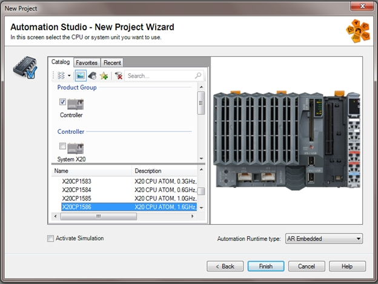
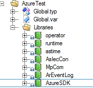
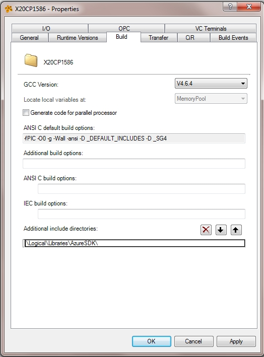
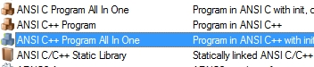
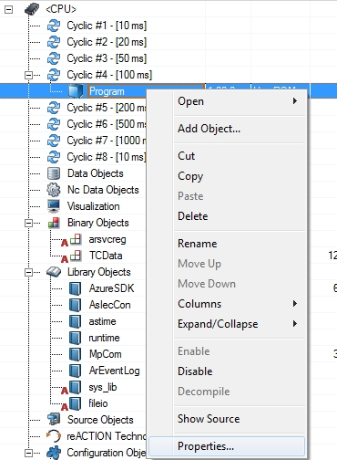
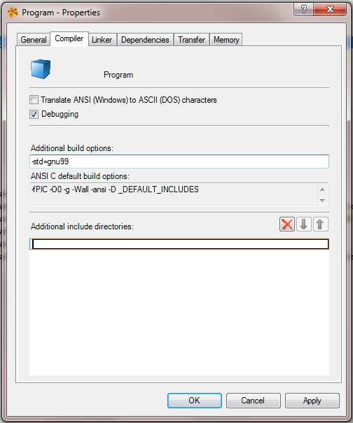
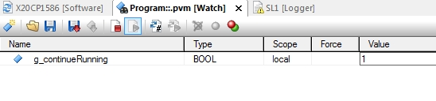
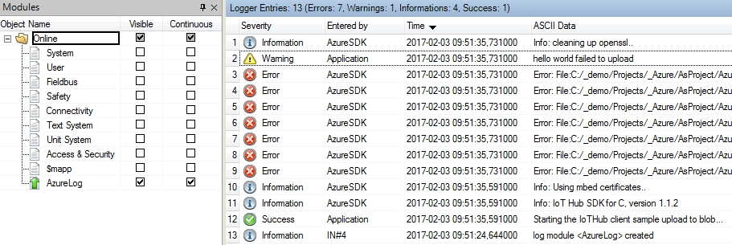
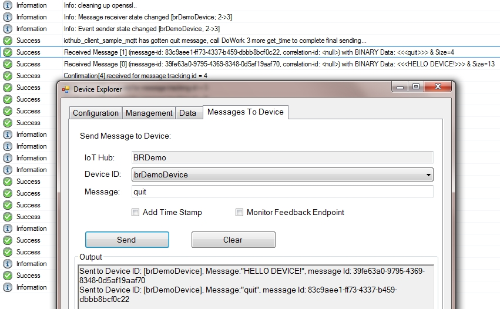

Run a simple AMQP sample on a X20CP1586 PLC using AzureSDK and Automation Runtime 4.27
===
---

# Table of Contents

-   [Introduction](#Introduction)
-   [Step 1: Prerequisites](#Prerequisites)
-   [Step 2: Prepare your Device](#PrepareDevice)
-   [Step 3: Build and Run the Sample](#Build)
-   [Next Steps](#NextSteps)

<a name="Introduction"></a>
# Introduction

**About this document**

This document describes how to connect a X20CP1586 PLC running Automation Runtime 4.27 with Azure IoT SDK. This multi-step process includes:

-   Configuring Azure IoT Hub
-   Registering your IoT device
-   Build and deploy Azure IoT SDK on device

<a name="Prerequisites"></a>
# Step 1: Prerequisites

You should have the following items ready before beginning the process:

-   [Setup your IoT hub][lnk-setup-iot-hub]
-   [Provision your device and get its credentials][lnk-manage-iot-hub]
-   A X20CP1586 device.
-   [Automation Studio](https://www.br-automation.com/en-in/products/software/automation-studio/) 4.2.7 or later, [Automation Runtime](https://www.br-automation.com/en-in/products/software/automation-runtime/) 4.27 or later

<a name="PrepareDevice"></a>
# Step 2: Prepare your Device

<a name="Build"></a>
# Step 3: Build and Run the sample

<a name="Load"></a>
## 3.1 Build SDK and sample

-   Download the Microsoft Azure IoT Device SDK Ported to Automation Runtime 

    -   download the zip package from this repository: https://github.com/br-automation-com/AzureSDK_Library/archive/master.zip
	
    -   or use the git command line:
        git clone --recursive https://github.com/br-automation-com/AzureSDK_Library.git
	
-   Create a new Automation Studio Project using Automation Runtime 4.27 or higher

    

-   Insert AzureSDK library as Exisiting Library into your new project, and place it under Libraries

    

-   The libraries that AzureSDK is dependent on are inserted automatically. You should now have the following set of libraries:		

    

-   In order to compile your sample program, set the include directory for the project under the menu "Project/Change Runtime Versions../Build"

    

-   Add a new Program using the Object Catalog Toolbox

    

-   The AzureSDK is built for C99, set this compiler option for the new program under "Program/Properties/Build" in the Software configuration

    

-   The C99 build option that should be used is -std=gnu99

    

-   The samples declare one _LOCAL BOOL PLC-variable each that starts up the worker thread when set to true. This variable can be accessed via the Watch window, or other PV services available in Automation Studio. For more information on declaring PLC variables, see Automation Studio Help, Location ID 3.5.2.5 - "B&R Language extensions for ANSI C/C++". For more info on the Watch window, see Automation Studio Help, Location ID 12.1.18 - "Watch Window". The declaration of PLC-variables from C/C++ is not activated by default inside Automation Studio. In order to activate the creation of _LOCAL and _GLOBAL varaibles from the code, you check the "Enable declaration of PLC variables", under Project/Settings..

    

## 3.2 Send Device Events to IoT Hub:

This repository contains the files needed for running your AMQP messaging sample. 

-   Main program: https://github.com/br-automation-com/AzureSDK_PUBLIC/blob/master/Samples/AMQP/Main.cpp
-   Sample Header file: https://github.com/br-automation-com/AzureSDK_PUBLIC/blob/master/Samples/AMQP/iothub_client_sample_amqp.h
-   AMQP Sample Source file: https://github.com/br-automation-com/AzureSDK_PUBLIC/blob/master/Samples/AMQP/iothub_client_sample_amqp.c

Simple copy these files into your Program by drag and drop from the Explorer, or use the Object Catalog - Existing File. You need to replace the Main.cpp, either by removing the existing file in you project, or simply by copy-pasting the contents of the file.

### 3.2.1 General

The "Main.cpp" is the main program that is started by the Automation Runtime Task Scheduler using the _INIT and _CYCLIC hooks. Here the iothub_client_sample_upload_to_blob_run() is called by starting up a new non-cyclic thread with the azure-iot API.

### 3.2.2 console output

Automation Runtime does not support a standard console output, instead it utilizes a designated runtime logger in order to separate entries from different system objects and applications.

The AzureSDK uses a logger called "AzureLog". You can add your own entries synchronously to the internal AzureSDK messages with the <ar/logger.h> interface.

The AzureLog is initialized in the Main.cpp:

```
#include <ar/logger.h>

...

void _INIT ProgramInit(void)
{
	ArLoggerInit();
}
```

All console outputs from the azure_amqp_sample is entered via ArLogInfo() respectively ArLogError(), in the same way as printf()

```
#include <ar/logger.h>

void iothub_client_sample_amqp_run(void)
{
	...
	ArLogInfo("Starting the IoTHub client sample AMQP...\r\n");
	...
}

static IOTHUBMESSAGE_DISPOSITION_RESULT ReceiveMessageCallback(IOTHUB_MESSAGE_HANDLE message, void* userContextCallback)
{
	...
		ArLogInfo("\tKey: %s Value: %s\r\n", keys[index], values[index]);
	...
}
```

### 3.3.3 Thread programming

The iothub_client_sample_upload_to_blob_run() function needs to run as a non-cyclic thread. By default the Automation Runtime system does not provide non-cyclic user processes, as these could interfere with the real-time performance when run under the wrong priorities. With the AzureSDK, non-cyclic threads can be created using the azure-iot-sdk APIs, the ThreadAPI. 

```
#include <azure_c_shared_utility/threadapi.h>
...

//non-cyclic program thread, using THREAD_START_FUNC prototype  -> int func(void *args) 
int ProgramMain(void* args)
{
   iothub_client_sample_amqp_run();
   return 0;
}

THREAD_HANDLE ThreadIdent;
void _CYCLIC ProgramCyclic(void)
{
	...
	ThreadAPI_Create(&ThreadIdent, ProgramMain, 0);
	...
}
```

The threads created with this API runs under the same priority as the rest of the AzureSDK, which is below the cyclic system, network communication and visualization.

In this case the non-cyclic thread is started out of the _CYCLIC context, and you would probably create more _LOCAL variables for your further testing via the Automation Studio Watch window. For more information on integrating your sample, see the Automation Studio Help, Location ID 3.5.2.5 - "B&R Language extensions for ANSI C/C++". One benefit of starting the sample thread out of the _CYCLIC context of the program is that you have time to activate the debugger and set breakpoints before launching the sample - if it out of some reason shouldn't behave as expected.

### 3.3.4 Starting up the Worker Thread

As mentioned earlier, each sample defines a _LOCAL BOOL variable to start up the worker thread, that makes it possible for the PLC to start without sending messages to the Azure cloud, and give you a possibility as a developer, to set activate the debugger and set the breakpoints you need before the show goes down. You access this PLC-variable via the watch window. For more info on the Watch window, see Automation Studio Help, Location ID 12.1.18 - "Watch Window".




### 3.3.5 Checking the Output

To see if the output is working, check the logger:


As mentioned before, the <ar/logger.h> defines the ArLogInfo and the ArLogError function to add user messages to the AzureLog. Note that the user Informations are entered as "Success" and the Internal SDK-messages are entered as "Information". The same goes with Errors, whereas the user errors are entered as "Warning" and the SDK errors are "Error".



## 3.3 Receive messages from IoT Hub

-   See [Manage IoT Hub][lnk-manage-iot-hub] to learn how to send cloud-to-device messages to the application.

-   As long as the g_continueRunning flag is set (that keeps the thread alive), the sample application will output all received messages in the logger. you can shut down the thread remotely by sending "quit" from the Device Explorer, which will set the g_continueRunning flag to FALSE.




<a name="NextSteps"></a>
# Next Steps

You have now learned how to run a sample application that collects sensor data and sends it to your IoT hub. To explore how to store, analyze and visualize the data from this application in Azure using a variety of different services, please click on the following lessons:

-   [Manage cloud device messaging with iothub-explorer]
-   [Save IoT Hub messages to Azure data storage]
-   [Use Power BI to visualize real-time sensor data from Azure IoT Hub]
-   [Use Azure Web Apps to visualize real-time sensor data from Azure IoT Hub]
-   [Weather forecast using the sensor data from your IoT hub in Azure Machine Learning]
-   [Remote monitoring and notifications with Logic Apps]   

[Manage cloud device messaging with iothub-explorer]: https://docs.microsoft.com/en-us/azure/iot-hub/iot-hub-explorer-cloud-device-messaging
[Save IoT Hub messages to Azure data storage]: https://docs.microsoft.com/en-us/azure/iot-hub/iot-hub-store-data-in-azure-table-storage
[Use Power BI to visualize real-time sensor data from Azure IoT Hub]: https://docs.microsoft.com/en-us/azure/iot-hub/iot-hub-live-data-visualization-in-power-bi
[Use Azure Web Apps to visualize real-time sensor data from Azure IoT Hub]: https://docs.microsoft.com/en-us/azure/iot-hub/iot-hub-live-data-visualization-in-web-apps
[Weather forecast using the sensor data from your IoT hub in Azure Machine Learning]: https://docs.microsoft.com/en-us/azure/iot-hub/iot-hub-weather-forecast-machine-learning
[Remote monitoring and notifications with Logic Apps]: https://docs.microsoft.com/en-us/azure/iot-hub/iot-hub-monitoring-notifications-with-azure-logic-apps
[lnk-setup-iot-hub]: ../setup_iothub.md
[lnk-manage-iot-hub]: ../manage_iot_hub.md


