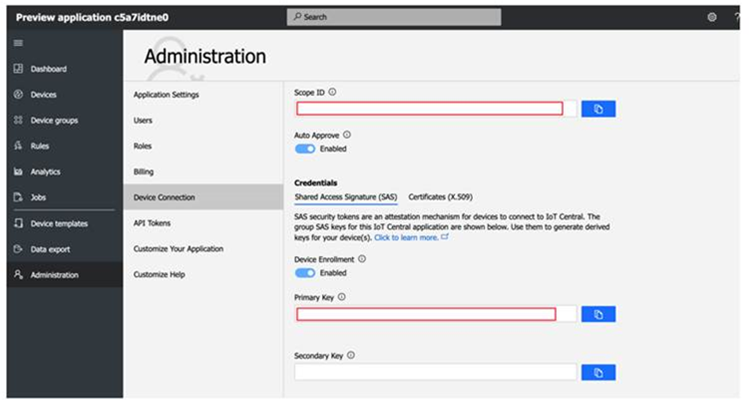
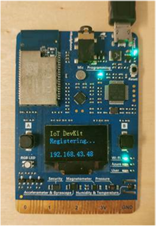
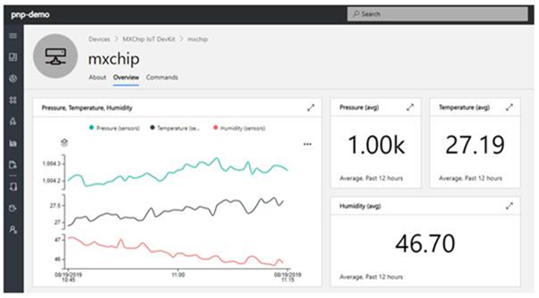

Connect an MXChip IoT DevKit device to your Azure IoT Central application
===

---
# Table of Contents

-   [Introduction](#Introduction)
-   [Prerequisites](#Prerequisites)
-   [Get device connection details](#Getdeviceconnectiondetails)
-   [Prepare the device](#Preparethedevice)
-   [View the telemetry](#Viewthetelemetry)
-   [Review the code](#Reviewthecode)
-   [Next steps](#Nextsteps)

# Introduction 
This article shows you how to connect an MXChip IoT DevKit (DevKit) device to an Azure IoT Central application. The device uses the certified IoT Plug and Play model for the DevKit device to configure its connection to IoT Central.
In this how-to article, you:

-   Get the connection details from your IoT Central application.
-   Prepare the device and connect it to your IoT Central application.
-   View the telemetry and properties from the device in IoT Central.

# Prerequisites

To complete the steps in this article, you need the following resources:

1.  A [DevKit device](https://aka.ms/iot-devkit-purchase).
2.  An IoT Central application created from the Preview application template. You can follow the steps in [Create an IoT Plug and Play application](https://github.com/MicrosoftDocs/azure-docs-pr/blob/release-preview-central-pnp/articles/iot-central/quick-deploy-iot-central-pnp.md?toc=/azure/iot-central-pnp/toc.json&bc=/azure/iot-central-pnp/breadcrumb/toc.json).

# Get device connection details

In your Azure IoT Central application, select the **Administration** tab and select **Device Connection**. Make a note of the **Scope ID** and **Primary key**.

# Prepare the device

1.  Download the latest [pre-built Azure IoT Central Plug and Play firmware](https://nam06.safelinks.protection.outlook.com/?url=https%3A%2F%2Fgithub.com%2FMXCHIP%2FIoTDevKit%2Fraw%2Fmaster%2Fpnp%2Fiotc_devkit%2Fbin%2Fiotc_devkit.bin&data=02%7C01%7Ckoichih%40microsoft.com%7C0c6b8855c2a848d5463408d725a9eca1%7C72f988bf86f141af91ab2d7cd011db47%7C1%7C0%7C637019284067732045&sdata=vWCwffesClBJjYLuuVzQpXsHzXoP9Wgj8xF6sqgXIXk%3D&reserved=0) for the DevKit device from GitHub.
2.  Connect the DevKit device to your development machine using a USB cable. In Windows, a file explorer window opens on a drive mapped to the storage on the DevKit device. For example, the drive might be called **AZ3166 (D:)**.
3.  Drag the **iotc_devkit.bin** file onto the drive window. When the copying is complete, the device reboots with the new firmware.

    **Note:** If you see errors on the screen such as No Wi-Fi, this is because the DevKit has not yet been connected to WiFi.

4.  On the DevKit, hold down **button B**, push and release the **Reset** button, and then release **button B**. The device is now in access point mode. To confirm, the screen displays "IoT DevKit - AP" and the configuration portal IP address.
5.  On your computer or tablet, connect to the WiFi network name shown on the screen of the device. The WiFi network starts with **AZ**- followed by the MAC address. When you connect to this network, you don't have internet access. This state is expected, and you only connect to this network for a short time while you configure the device.
6.  Open your web browser and navigate to <http://192.168.0.1/>. The following web page displays:

    

    On the web page, enter:
    -   The name of your WiFi network (SSID).
    -   Your WiFi network password.
    -   The connection details: the **Device ID** that you can choose yourself, and the **Scope ID** and **Group SAS Primary Key** you made a note of previously.

    **Note:** Currently, the IoT DevKit only can connect to 2.4 GHz Wi-Fi, 5 GHz is not supported due to hardware restrictions.

7.  Choose Configure Device, the DevKit device reboots and runs the application:

    

    The DevKit screen displays a confirmation that the application is running:

    

The DevKit first registers a new device in IoT Central application and then starts sending data.

# View the telemetry

In this step, you view the telemetry in your Azure IoT Central application.

In your IoT Central application, select **Devices** tab, select the device you added. In the **Overview** tab, you can see the telemetry from the DevKit device:

  

# Review the code

To review the code or modify and compile it, go to the [MXChip IoT DevKit sample code GitHub repository](https://github.com/MXCHIP/IoTDevKit/tree/master/pnp).

# Next steps

Now that you've learned how to connect a DevKit device to your Azure IoT Central application, the suggested next step is to learn how to [set up a custom device template](https://github.com/MicrosoftDocs/azure-docs-pr/blob/release-preview-central-pnp/articles/iot-central/howto-set-up-template-pnp.md?toc=/azure/iot-central-pnp/toc.json&bc=/azure/iot-central-pnp/breadcrumb/toc.json) for your own IoT device.
