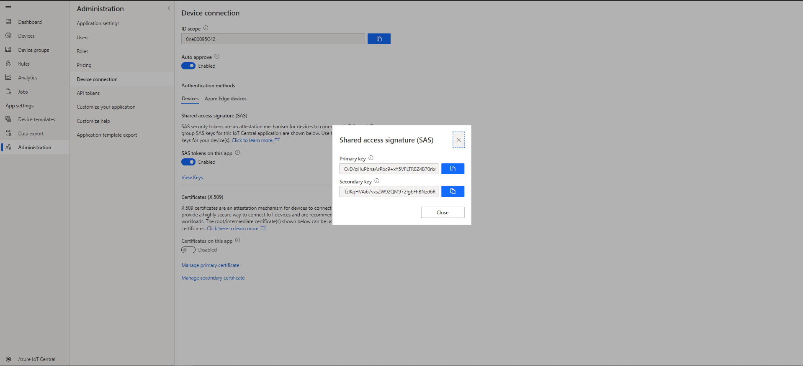
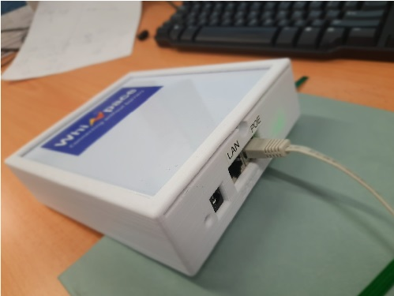
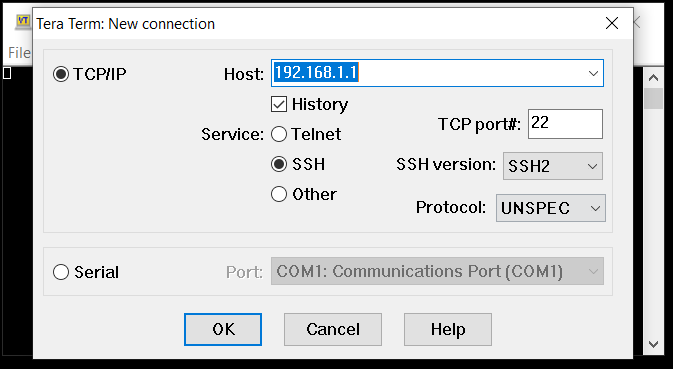
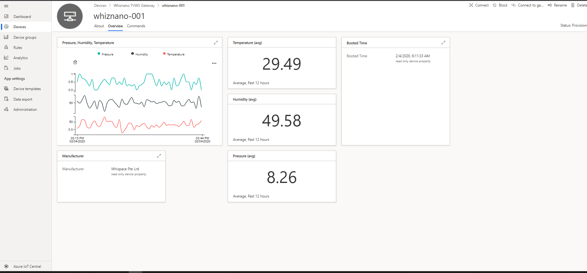

# Table of Contents

-   [Introduction](#Introduction)
-   [Prerequisites](#Prerequisites)
-   [Device Connection Details](#DeviceConnectionDetails)
-   [Hardware Connection Details](#HardwareConnectionDetails)
-   [Prepare the Device](#preparethedevice)
-   [Integration with IoT Central](#IntegrationwithIoTCentral)
-   [Additional Links](#AdditionalLinks)

# Introduction 

**About this document**

This document describes how to connect Whiznano Gateway device to Azure IoT Central application using the IoT plug and Play model. Plug and Play simplifies IoT by allowing solution developers to integrate devices without writing any device code. Using Plug and Play, device manufacturers will provide a model of their device to cloud developers to be integrated quickly into IoT Central or any solution built on the Azure IoT platform. IoT Plug and Play will be open to the community by way of a definition language and SDKs.

Whiznano Gateway is the world’s first IoT Gateway in sub-GHz ISM and TVWS bands. It can support up to 8000 WhizNano nodes simultaneously. Equipped with high performance ARM MCU, WhizNano Gateway delivers unparalleled performance in real time data acquisition. It connects with backhaul internet access devices using an ethernet interface. The Gateway has the state-of-the art Real Time Operating System (RTOS) which makes real time response possible. It is equipped with all the important protocols for IoT like MQTT, TCP/IP, DHCP, DNS and HTTPS. The data transmission is secured using advanced encryption protocols like TLS 1.2. It comes prebuilt with HAL, graphics software and frameworks with free license.

# Prerequisites

You should have the following items ready before beginning the process: 

1.  A [Whiznano Gateway](https://www.whizpace.com/products-and-services).
2.  An IoT Central application created from the Preview application template. You can follow the steps in [Create an IoT Central application](https://docs.microsoft.com/en-us/azure/iot-central/core/quick-deploy-iot-central).
3. Tera Term software installed in your PC.

# Get device connection details

In your Azure IoT Central application, select the **Administration** tab, select **Device Connection** and select **View Key**. Make a note of the **ID Scope**, **Primary key** and **Secondary Key**.

# Hardware Connection Details

Use a PoE adapter along with a Ethernet cable to power up the Whiznano Gateway device. 

Alternatively, DC jack (12-24V) may be used to power up the device if PoE is not available.

# Prepare the Device.

Set up your PC first. Ensure IP Address: `192.168.1.10`, Subnet Mask: `255.255.255.0`

-   Go to Control Panel
-   Network and Internet -> View network status and tasks
-   Left Hand Side of Screen. Click on “Change network setting”
-   Right Click on Ethernet -> Properties
-   Under Networking, Select Internet Protocol (IPv4) -> Click on Properties
-   Select Use the following IP Address:  

Whiznano Gateway comes with pre-installed IoT Central Application.

# Integration with IoT Central
1. User needs to open up Tera Term software to connect to Gateway.

    

2. Enter username as “root” with no password and proceed.

3. Key in command as shown in the figure below. 
(For e.g. Whiznano\_IoT\_Central\_app(space)**Device\_ID**(space)**ID\_Scope**(space)**Primary\_Key** )

    

4. You should be able to see your program running the same as the figure below, indicating the Gateway connection information.

    

5. In your IoT Central application, select **Devices** tab, select the device you added. In the **Overview** tab, you can see the telemetry from the Whiznano Gateway Device:

    

# Additional Links

Please refer to the below link for additional information for Plug and Play 

-    [Blog](https://azure.microsoft.com/en-us/blog/iot-plug-and-play-is-now-available-in-preview/)
-    [FAQ](TBD) 
-    [Plug and Play C SDK](https://github.com/Azure/azure-iot-sdk-c/tree/public-preview) 
-    [Plug and Play Node SDK](https://github.com/Azure/azure-iot-sdk-node/tree/digitaltwins-preview)
-    [Plug and Play Definitions](https://github.com/Azure/IoTPlugandPlay)

