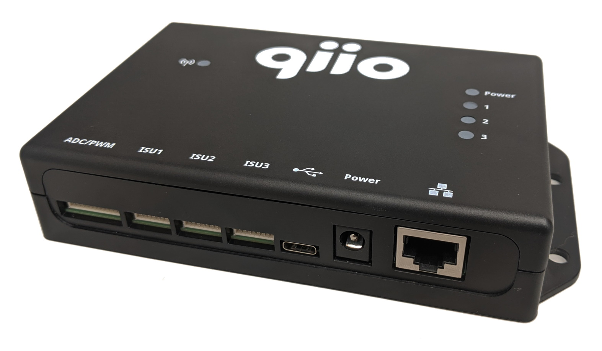

Get Started with Microsoft Azure IoT using qiio q200 Guardian
===
---

# Table of contents

-   [Introduction](#Introduction)
-   [Step 1: Prerequisites](#Prerequisites)
-   [Step 2: Prepare your Device](#PrepareDevice)
-   [Step 3: Connect to Azure Service](#Build)
-   [Next Steps](#NextSteps)

# Introduction

**About this document**

This document describes how to connect the q200 Guardian IoT device based on Azure Sphere with Microsoft IoT Hub. This multi-step process includes:

-   Configuring the Azure Sphere development environment
-   Preparing your IoT device
-   Build and deploy an Azure Sphere sample application on the device

**About q200 Guardian**

 

The q200 Guardian by qiio is based on Azure Sphere and built to securely and quickly connect assets to the cloud using cellular connectivity.

Features include:
-   **Hardware Interfaces (I/O)**: USB <-> UART, 3xISU (I2C, SPI, UART), 3xPWM, 6xADC
-   **Cloud Connectivity**: Cellular (Multiple RAT types), Wi-Fi, Ethernet
-   **Localization**: qMAPS (Cellular Triangulation), GNSS (GPS, GLONASS, BeiDou, and Galileo)
-   **Provisioning**: QR code, built-in mechanism for provisioning to cloud and cellular profile
-   **Security**: Hardware security module – Azure Sphere
-   **Enclosure**: Drop-resistant
-   **Special Features**: Fully integrated with the Azure platform, integrated eSIM works in 190 countries, Plug & Play, fully programmable (on development version)
-   **Edge Solution**: Azure Sphere

For testing and development, you will receive a development kit which has an additional Micro-USB port for connection to a PC or laptop.

# Step 1: Prerequisites

You should have the following items ready before beginning the process:

-   [Azure Account](https://portal.azure.com/)
-   [Azure IoT Hub instance](https://docs.microsoft.com/en-us/azure/iot-hub/about-iot-hub)
-   [Azure IoT Hub Device Provisioning Service (DPS)](https://docs.microsoft.com/en-us/azure/iot-dps/quick-setup-auto-provision)
-   [Azure Sphere SDK](https://docs.microsoft.com/en-us/azure-sphere/install/overview)
-   [Azure Sphere user account](https://docs.microsoft.com/en-us/azure-sphere/deployment/microsoft-account)
-   [Azure Sphere tenant](https://docs.microsoft.com/en-us/azure-sphere/deployment/create-tenant) (provided by qiio)
-   [Visual Studio Code](https://code.visualstudio.com/)
-   q200 Guardian dev kit
-   Micro-USB cable

# Step 2: Prepare your device

## Connect your device
 
Connect your device over USB to your workstation, then power it on.

You should be able to read the Sphere device id. To do so,  open "Azure Sphere Developer Command Prompt" and run the following command:

    azsphere device show-attached

## Set up an enrollment group for the device

In order for your device to be allowed to connect to IoT Hub, you need to create an enrollment group on the DPS that uses a valid certificate from your Azure Sphere tenant. 

First select the Azure Sphere tenant provided for you by qiio:

    azsphere tenant select --tenantid {id of your tenant}

Then download the certificate from the tenant using the following command:

    azsphere tenant download-ca-certificate -o tenantCertificate.cer

Then go to the DPS, and add the downloaded certificate so it can be used for the enrollment group. The DPS will ask to validate the certificate based on a key. Once you have it, you have to download the validation certificate from the tenant by using the following command:

    azsphere tenant download-validation-certificate -c verificationcode "{code provided by DPS}" -o tenantValidationCertificate.cer

Upload the validation certificate and create a new enrollement group based on the newly added certificate on the DPS.

# Step 3: Build a sample application

## Clone the sample application

Some changes to the Azure Sphere sample application are reuqired in order to enable your device to connect to IoT Hub over cellular.

First, clone the sample code using the following command:

    git clone https://github.com/Azure/azure-sphere-samples.git

Then open the folder **azure-sphere-samples/Samples/AzureIoT** in VS Code. VS Code will execute preliminary scripts in order to create the **out/\<sdk-version>** folder where the binary and the generated image will be located.
 
## Update the application manifest

The application manifest needs to be updated with your environment configuration, and to enable cellular connectivity.

Make the following changes:

-   Pass the id scope of your DPS: `"CmdArgs": [ "--ConnectionType", "DPS", "--ScopeID", "{id scope of your DPS}" ]`
-  Update the whitelist of authorized connections to allow connecting to IoT Hub and the device's built-in router: `"AllowedConnections" : [ "{hostname of your IoT Hub instance}", "global.azure-devices-provisioning.net", "router.qiio.com" ]`
-   Enable the network configuration capability to enable the _eth0_ interface required for cellular connectivity: `"NetworkConfig": true`
-   Set the device authentication to your Azure Sphere tenant id: `"DeviceAuthentication": "{id of your Azure Sphere tenant}"`

The final manifest file should look something like this:
 

    {​
      "SchemaVersion": 1,
      "Name": "AzureIoT",
      "ComponentId": "819255ff-8640-41fd-aea7-f85d34c491d5",
      "EntryPoint": "/bin/app",
      "CmdArgs": [ "--ConnectionType", "DPS", "--ScopeID", "{id scope of your     DPS}" ],
      "Capabilities": {​
        "AllowedConnections" : [ "{hostname of your IoT Hub instance}",     "global.azure-devices-provisioning.net", "router.qiio.com" ],
        "Gpio": [ "$SAMPLE_BUTTON_1", "$SAMPLE_LED" ],
        "NetworkConfig": true,
        "DeviceAuthentication": "{id of your Azure Sphere tenant}"
      }​,
        "ApplicationType": "Default"
    }​
 
## Update the source code

The main function of the sample project must be changed slightly in order to enable the _eth0_ interface instead of Wi-Fi.

To do this, open the file **main.c** and update the main function as shown below:

    int main(int argc, char *argv[])
    {​
    Log_Debug("Azure IoT Application starting.\n");
    
        // Add this:
        int err = Networking_SetInterfaceState("eth0", true);
        if (err < 0) {​
               Log_Debug("Error setting interface state %d", errno);
               return -1;
        }​
    
        bool isNetworkingReady = false;
        while ( !isNetworkingReady ) {​
            if ((Networking_IsNetworkingReady(&isNetworkingReady) == -1) || !    isNetworkingReady) {​
                Log_Debug("WARNING: Network is not ready. Device cannot connect     until network is ready.\n");
                sleep(1);
            }​
        }​
    
        // And remove this:
        /* bool isNetworkingReady = false;
        if ((Networking_IsNetworkingReady(&isNetworkingReady) == -1) || !    isNetworkingReady) {
            Log_Debug("WARNING: Network is not ready. Device cannot connect until     network is ready.\n");
        } */
    
        // End of changes
 
## Run the sample

In VS Code, select **Start Debugging** from the **Run** menu, or type F5 to build and run the sample. VS Code will take care of generating a new image, and install gdb related libraries required for step by step debugging. 

The execution will start immediately, and the console displays messages as the application sends device-to-cloud messages to IoT Hub.

-   See [Manage IoT Hub][lnk-manage-iot-hub] to learn how to observe the messages IoT Hub receives from the application and how to send cloud-to-device messages to the application.

# Next Steps

You have now learned how to run a sample application that collects sensor data and sends it to your IoT hub. To explore how to store, analyze and visualize the data from this application in Azure using a variety of different services, please click on the following lessons:

-   [Manage cloud device messaging with iothub-explorer]
-   [Save IoT Hub messages to Azure data storage]
-   [Use Power BI to visualize real-time sensor data from Azure IoT Hub]
-   [Use Azure Web Apps to visualize real-time sensor data from Azure IoT Hub]
-   [Weather forecast using the sensor data from your IoT hub in Azure Machine Learning]
-   [Remote monitoring and notifications with Logic Apps]

[manage cloud device messaging with iothub-explorer]: https://docs.microsoft.com/en-us/azure/iot-hub/iot-hub-explorer-cloud-device-messaging
[save iot hub messages to azure data storage]: https://docs.microsoft.com/en-us/azure/iot-hub/iot-hub-store-data-in-azure-table-storage
[use power bi to visualize real-time sensor data from azure iot hub]: https://docs.microsoft.com/en-us/azure/iot-hub/iot-hub-live-data-visualization-in-power-bi
[use azure web apps to visualize real-time sensor data from azure iot hub]: https://docs.microsoft.com/en-us/azure/iot-hub/iot-hub-live-data-visualization-in-web-apps
[weather forecast using the sensor data from your iot hub in azure machine learning]: https://docs.microsoft.com/en-us/azure/iot-hub/iot-hub-weather-forecast-machine-learning
[remote monitoring and notifications with logic apps]: https://docs.microsoft.com/en-us/azure/iot-hub/iot-hub-monitoring-notifications-with-azure-logic-apps
[setup-devbox-windows]: https://github.com/Azure/azure-iot-sdk-c/blob/master/doc/devbox_setup.md
[lnk-setup-iot-hub]: https://github.com/Azure/azure-iot-device-ecosystem/blob/master/setup_iothub.md
[lnk-manage-iot-hub]: https://github.com/Azure/azure-iot-device-ecosystem/blob/master/manage_iot_hub.md
